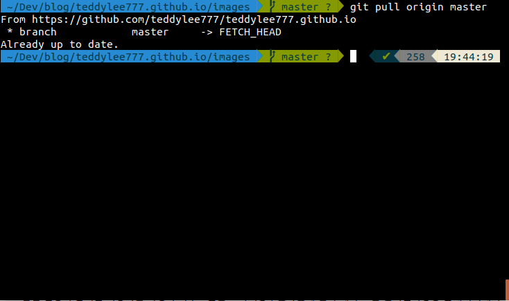
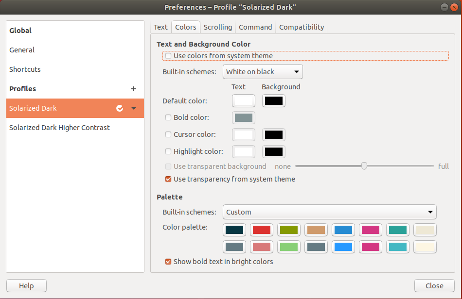

Bash Shell보다 **Z Shell**을 설치하여 보다 <u>fancy한 터미널</u>을 구축할 수 있습니다.

Fancy 하다는 말은 단순 테마를 적용하여 스타일만 적용하는 것을 뛰어 넘어 각 종 플러그인을 지원합니다.

그 중에서도 **리눅스**와 **MacOS 기본 터미널 **을 대체하는 매우 유명한 shell인 **Z Shell**을 설치하는 방법과 손쉽게 터미널에 <u>테마를 적용하는 방법</u>까지 알아보겠습니다.


> Z Shell 을 적용하면 이렇게 바뀝니다


특히 가장 매력적인 부분은 **git의 command line interface (cli)를 깔끔**하게 보여준다는 점 입니다.

브랜치를 깔끔하게 보여주기도 하고, 특히 현재 working directory를 좀 더 명확하게 보여줍니다.

저는 개인적으로 username이 보이는게 싫어서 제거하니 더욱 깔끔해 졌습니다.





### Z shell 


> apt-get 업데이트 후 zsh 패키지 인스톨

```bash
$ which zsh       # shell 경로 확인
/usr/bin/zsh

$ chsh -s /usr/bin/zsh # 기본 쉘적용
```


<u>log-out 후 log-in 해야 변경된 쉘이 적용 됩니다!!!</u>


### 테마 적용을 위한 Oh My Zsh 설치


> Curl을 이용한 설치

```bash
sh -c "$(curl -fsSL https://raw.githubusercontent.com/robbyrussell/oh-my-zsh/master/tools/install.sh)"
```


> wget을 이용한 설치

```bash
sh -c "$(wget https://raw.githubusercontent.com/robbyrussell/oh-my-zsh/master/tools/install.sh -O -)"
```


### 테마 변경하기


테마는 그 종류가 매우 다양합니다.

그 중에서도  **'agnoster'** 테마를 많이 사용합니다.

사용할 수 있는 테마는 [여기](https://github.com/robbyrussell/oh-my-zsh/wiki/Themes)에서 확인하실 수 있습니다.


>  테마 변경을 위한 .zshrc 파일 수정

```bash
vi ~/.zshrc
```


> line 11: ZSH_THEME을 agnoster로 변경합니다.

``` bash
ZSH_THEME='agnoster'
```


> 변경사항 저장 후 터미널에서 .zshrc 파일 업데이트

```bash
source ~/.zshrc
```


### 폰트 깨짐 해결을 위한 폰트 설치

agnoster 테마를 설치 하셨다면, 폰트 깨짐현상이 발생합니다.

power-line 폰트 설치를 통해 이 문제를 해결할 수 있습니다.


> power-line 폰트 설치

```bash
sudo apt install fonts-powerline
```


### 터미널 창에 추가 테마 적용하기 (Solarized Dark Theme)

```ls``` 명령어 입려시 보이는 디렉토리에 대한 추가 color 를 적용할 수 있습니다.

유명한 color theme인 solarized d

ark theme을 적용해 보도록 하겠습니다.


>dconf 커멘드 install

```bash
sudo apt-get install dconf-cli
```


> solarized theme 설치

```bash
$ git clone https://github.com/Anthony25/gnome-terminal-colors-solarized.git
$ cd gnome-terminal-colors-solarized
$ ./install.sh
```


> 컬리 테마 선택

1. light
2. dark alternative
3. dark

저는 3번 "dark"로 선택하였습니다.


> 적용할 터미널 프로파일 선택

1번 default를 선택합니다.

덮어 쓰겠다는 문구가 나오면 "YES"를 입력하여 덮어씁니다.


### Solarized Dark Theme이 제대로 적용이 안 될 경우!

저도 처음에 Solarized Dark Theme이 제대로 설치 되지 않아 애를 먹었습니다.

그리고, 힘들게 찾아낸 쉬운 해결법이 있습니다!

심지어 템플릿도 굉장히 다양하게 지원하고 실시간으로 변경해 볼 수 있습니다.


참고는 [Gogh github repo](https://github.com/Mayccoll/Gogh) 에서 하였습니다.


> linux 유저

```bash
 $  bash -c  "$(wget -qO- https://git.io/vQgMr)"
```


> Mac 유저

```bash
 $  bash -c  "$(curl -sLo- https://git.io/vQgMr)"
```


그럼 설치가 완료되고 다양한 템플릿을 적용해 볼 수 있습니다.


>  터미널 창을 우클릭 -> preferences를 클릭하면 다음과 같은 창이 뜹니다.




여기서 Built-in schemes를 변경하면서 터미널 창의 테마를 적용해 볼 수 있습니다.


##### #linux #zsh #zshell #solarized_dark #agnoster #ubuntu