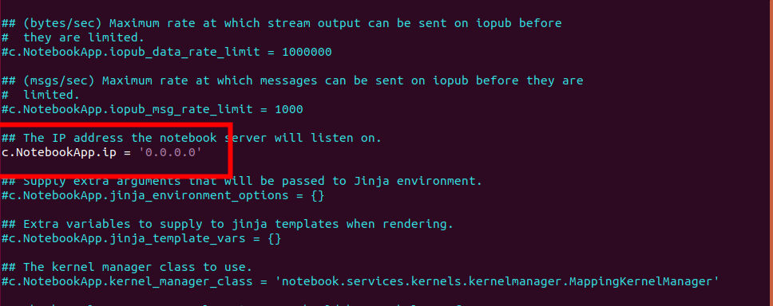
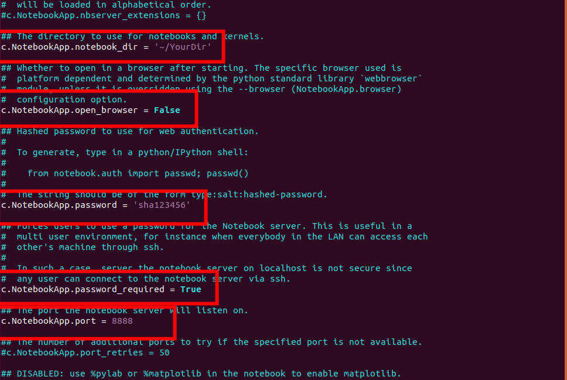

Jupyter Notebook을 원격에서 접속하려고 할 때 셋팅하는 방법에 대해 알아보겠습니다.


## Jupyter Notebook 설치


> pip 설치

```bash
pip install jupyter
```


Anaconda를 설치하면 Jupyter Notebook 이 **이미 설치** 되어 있습니다.

> anaconda 설치

```bash
conda install -c anaconda notebook
```


## 방화벽 개방 (8888포트 기준)

```bash
sudo ufw allow 8888
```


## Config 생성

```bash
jupyter notebook --generate-config
```


## 접속시 비밀번호 생성

> 접속시 입력할 비밀번호 생성

```bash
ipython
from notebook.auth import passwd
passwd()
Enter password: 
Verify password: 
```

**생성한 SHA1 값을 복사**해 둡니다.


## Config 파일 업데이트

```bash
cd ~/.jupyter
vi jupyter_notebook_config.py
```


```bash
# 모든 ip 허용
c.NotebookApp.ip = '0.0.0.0'
# Notebook의 root dir
c.NotebookApp.notebook_dir = '~/YourDir'

c.NotebookApp.open_browser = False
c.NotebookApp.password = '이곳에 복사해 둔 SHA1 입력'
c.NotebookApp.password_required = True
c.NotebookApp.port = 8888
```


아래와 같이 # 주석을 풀고 수정하거나, 위의 내용을 복사해서 맨 아래에 붙여넣으면 됩니다.






## Port 개방

iptime 을 사용하는 경우에는 192.168.0.1 로 접속해서 port forwarding 메뉴 중 8888번 포트를 연결해 주면 된다.


##### #jupyter #notebook #remote_access