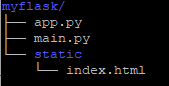

AWS의 EC2 인스턴스를 열고, ubuntu 18.04에서 Python으로 Flask 앱을 만든 후 nginx 설정하여 내가 호스팅하고 싶은 도메인과 연결하여 80포트에서 접속가능하도록 설정하는 방법에 대해서 알아보도록 하겠습니다. 

Amazon AWS Route 53을 이용한 ec2 instance의 도메인 연결을 미리 해두면 좋습니다. 이 방법은 [여기](<https://teddylee777.github.io/aws/%EC%95%84%EB%A7%88%EC%A1%B4AWS-%EC%9D%B8%EC%8A%A4%ED%84%B4%EC%8A%A4-%EB%8F%84%EB%A9%94%EC%9D%B8-%EC%97%B0%EA%B2%B0%ED%95%98%EA%B8%B0>)를 참고하시면 됩니다.

ubuntu의 버전, python 버전에 따라서 간혹 설정이 잘 안되는 경우도 있습니다.

오랜 시간 삽질을 거듭하면서, 드디어 ubuntu 18.04 환경에서 flask 앱을 nginx로 설정 완료하였고, 가상환경에 대한 부분도 같이 설명하도록 하겠습니다.


**설정 환경 (2019년 4월 12일 기준):**

- Amazon AWS EC2 instance (micro)
- ubuntu 18.04 LTS
- nginx 1.14.2
- python 3.6.7
- flask 앱 이름: myflask


## Flask앱의 디렉토리 설명

> 저는 편의상 제가 만든 임시의 Flask 앱을 'myflask'라고 명명하겠습니다.

터미널에서 tree로 찍어보면 다음과 같은 구조입니다.



> app.py

```python
from flask import Flask
app = Flask(__name__)

@app.route("/")
def hello():
    return "<h1>Hello!</h1>"
```


> main.py

```python
from app import app

if __name__ == "__main__":
    app.run(host='0.0.0.0')
```


## nginx 설치

ubuntu 18.04 환경에서는 다음과 같은 커멘드로 nginx를 설치합니다.

```bash
sudo apt-get update
sudo apt-get install nginx
```

nginx를 설치 하셨다면, 인스턴스의 url로 접속해보면 NGINX의 기본 페이지가 띄워져 있는 것을 확인하실 수 있습니다.


그 다음 웹 서빙을 하기 위한 환경설정을 해줍니다.

```bash
cd /etc/nginx/sites-available
# config 파일을 만들어 줍니다.
sudo touch myflask
```


myflask의 설정 파일은 다음과 같이 입력합니다.

```bash
server {
    listen 80;
    server_name myflask.com;

    location / {
        include uwsgi_params;
        uwsgi_pass unix:/tmp/myflask.sock;
    }
}
```

여기서 `myflask.com`은 자신이 Amazon Route 53을 통해 이미 ec2 instance로 연결해놓은 도메인을 입력해 주시면 됩니다. 현재 등록이 되어 있지 않고, localhost 에서 테스트 하고 싶다면 `localhost`를 입력해 줍니다.

`uwsgi_pass`의 의미는 `/tmp/myflask.sock`으로 포워딩해준다는 의미로 이해하시면 됩니다.


symbolic link를 설정하여 사이트를 활성화하도록 합니다.

```bash
sudo ln -s /etc/nginx/sites-available/myflask /etc/nginx/sites-enabled
```


그리고 기본 구성인 ``default``는 삭제해 줍니다.

```bash
sudo rm /etc/nginx/sites-enabled/default
```


그리고 nginx 를 한 번 restart해 줍니다.

```bash
sudo service nginx restart
```


여기까지 잘 따라오셨다면, instance의 url에 접속했을 때, 기존에 NGINX 기본 페이지가 잘 떴었는데, 현재는 **502 Bad Gateway**라고 띄워져 있을 것이며, 이것은 *아직 socket을 연결을 해주지 않았기 때문*에 잘 설정된 것이라고 보시면 됩니다.


## 가상환경 설정을 위한 Virtualenv 설치

먼저, 가상환경 설정을 위한 virtualenv를 설치해 줍니다.

```bash
sudo apt-get install python-virtualenv
```

인스톨이 성공적으로 되었다면, 가상환경 만들어 줍니다.

가상환경의 이름을 `myenv`로 만들어 보도록 하겠습니다.

```bash
virtualenv -p python3 myenv
# 가상환경 활성화
# ~/myflask
source myenv/bin/activate
```

가상환경을 만드는 directory는 myflask앱 내부에 app.py와 같은 위치에 만들도록 하겠습니다.


```bash
# requirements.txt 존재한다면
pip install -r requirements.txt

# flask가 설치되어 있지 않다면
pip install flask
```

혹시 flask앱에 requirements.txt가 있어서 필요한 파이썬 패키지들을 설치해야한다면, 가상환경이 활성화된 상태에서 설치해 주면 됩니다. requirements.txt가 따로 없고, 하나하나 설치한다면 pip 를 통해 인스톨해주면 됩니다.

## uWSGI 설치

사실 uWSGI 설치 부분에서 많이 애를 먹었습니다..

가장 중요한 점은 anaconda3가 설치되어 있다면, ``pip`` 가 충돌이 나면서 인스톨이 잘 안되는 문제가 있어서, 만약 amazon aws에서 인스턴스를 새로 만드셨고, 아직 anaconda3를 설치한 상태가 아니라면 다음과 같은 방식으로 uWSGI를 설치하시면, 정상적으로 install 됩니다.

```bash
sudo apt update
sudo apt install python3-pip python3-dev build-essential libssl-dev libffi-dev python3-setuptools
```

먼저, uWSGI설치에 필요한 패키지들을 설치해 줍니다.


```bash
# 가상환경 진입하지 않은 상태라면 가상환경 진입
source myenv/bin/activate
# uWSGI install
pip install uwsgi
```


uWSGI를 사용하여 flask 앱을 5000번 포트로 띄워보고 정상 작동하는지 봅니다.

```bash
uwsgi --socket 0.0.0.0:5000 --protocol=http -w main:app
```

위에서 `-w main:app` 파라미터는 `main.py` 파일의 `app`을 구동하겠다는 의미입니다.

여기까지 정상적으로 설정이 되었다면, ip:5000번 포트로 접근시 정상적으로 띄워지는 것을 볼 수 있습니다.


하지만, 매번 위와 같은 복잡한 명령어를 실행하기가 워낙 귀찮기 때문에 .ini 설정파일을 만들어서 쉽게 구동할 수 있도록 해보겠습니다.

우선, `myflask.ini`를 만들고 config 값들을 입력해 줍니다.

```bash
[uwsgi]
module = main:app

master = true
processes = 5

vitualenv = /home/ubuntu/myflask/myenv
chdir = /home/ubuntu/myflask

socket = /tmp/myflask.sock
chmod-socket = 666

vacuum = true

daemonize = /tmp/uwsgi.log

die-on-term = true
```

module은 시작점이며, `main.py`파일의 `app`을 실행해주겠다는 의미입니다.


이렇게 해준뒤 myflask 앱의 경로에서 다음의 명령어를 입력해 주면 드디어 완료됩니다.

```bash
uwsgi --ini myflask.ini
```


혹시라도 실행이 제대로 되지 않거나 error log를 확인해 보고 싶다면,

`/tmp/uwsgi.log`를 확인해 보면 됩니다.


##### #flask #aws #nginx #uwsgi