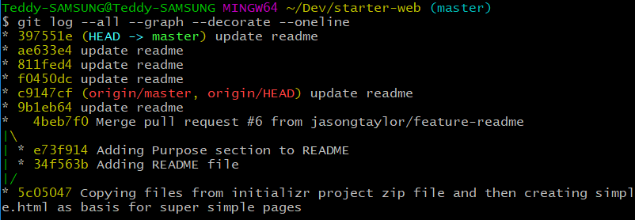
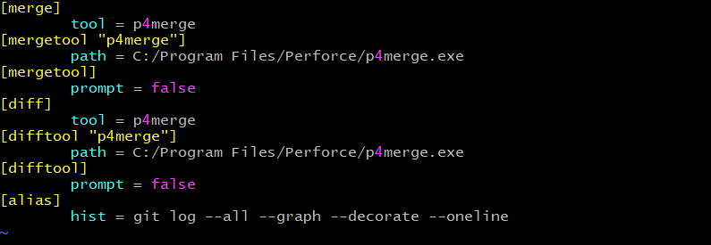
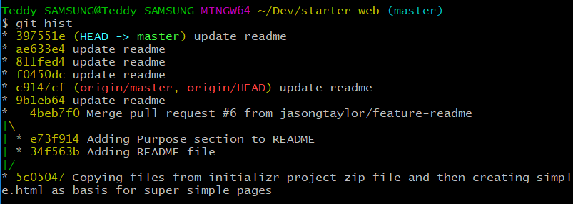

git log에 대해서는 다양한 option들이 존재한다.

하지만, git log는 log를 출력해 보기 위한 목적이고, 다양한 옵션값들을 미리 preset 해놓은 후에 config에 해당 option값을 설정한 후 alias로 한 번 설정해 놓으면, 앞으로 머리 아픈 option 값들을 더 이상 걱정할 필요 없다.

git log 에 대한 option값들은 [여기](<https://git-scm.com/docs/git-log>)서 확인 해 볼 수 있다


> 내가 자주쓰는 git log 옵션

```bash
git log --all --graph --decorate --oneline
```

## 


## git alias 설정하기


원래 ```git hist ``` 라는 명령어는 존재 하지 않는다. 

하지만, 내가 ```git hist```라는 명령어를 만들어 사용할 수 있다.

길고 긴 ```git log --all --graph --decorate --oneline```를 간단하게 ```git hist```로 등록하여 사용할 수 있다.

> hist 라는 alias에 log --all --graph --decorate --oneline 등록

```bash
git config --global alias.hist "log --all --graph --decorate --oneline"
```


git config 파일을 보면 alias가 저장되어 있는 것을 알수 있고, 언제든 수정할 수 있다.

```bash
vim ~/.gitconfig
```




```bash
git hist
```




