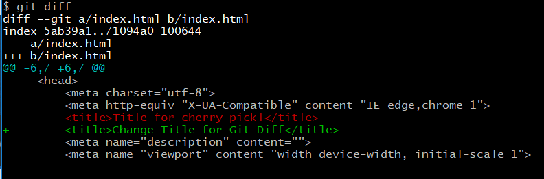
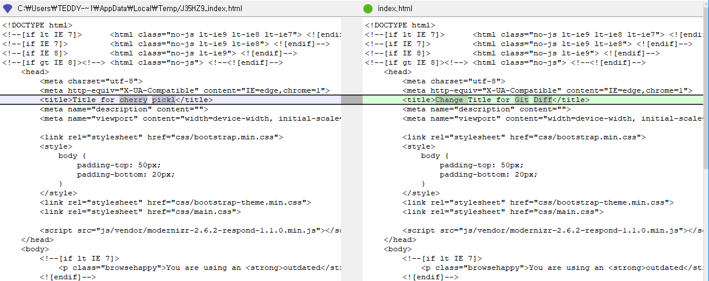
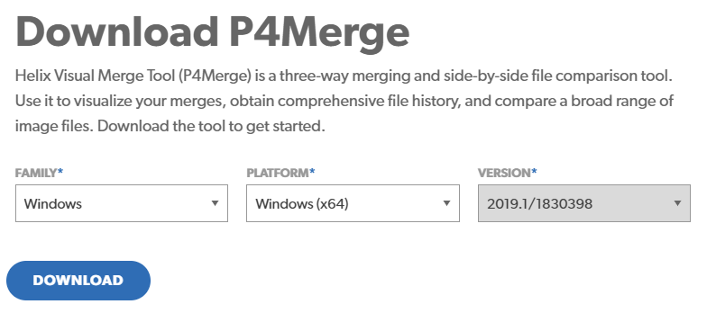
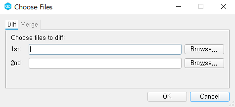
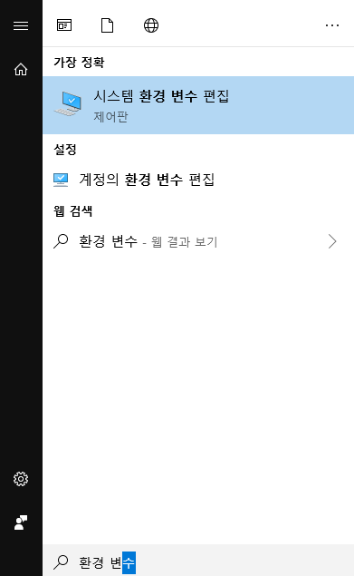
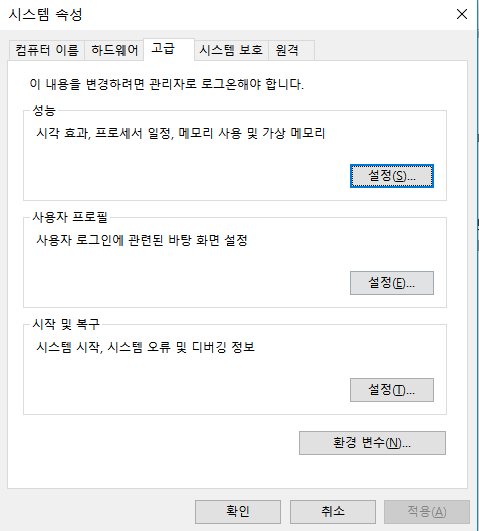
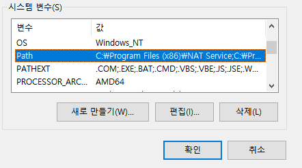
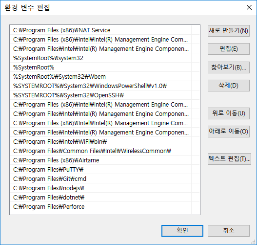
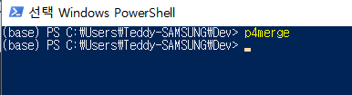
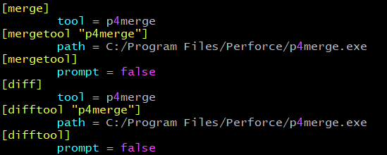

visual Diff Tool인 P4Merge를 설치하고, 이를 활용하여 git diff를 터미널이나 vim이 아닌 GUI Tool에서 diff를 보거나, merge를 할 수 있도록 global config를 설정하는 방법에 대해 알아보겠습니다.


## Default 설정은 이렇습니다..

sample 파일에 대하여 change를 적용해 놓았다고 가정해 보겠습니다.

저는 ```index.html``` 파일의 title 태그를 변경해 보았습니다.

> git diff (by default)

```bash
git diff
```


그럼 다음과 같은 형식을 terminal 에 출력해 줍니다.




뭐 터미널이 익숙한 뼛속부터 개발자들은 이렇게 diff를 확인하고 ```vim```을 사용하여 code merge를 해버리기 때문에 어려운 점이 없지만, P4Merge를 사용하면, GUI Tool이기 때문에 훨씬 사용성이 좋아집니다.


> P4Merge Tool을 사용하여 git diff 를 한 모습




그럼 더 나은 삶을 위해 P4Merge Tool을 설치해 보도록 하겠습니다.


## P4Merge Tool 설치

P4Merge Tool은 다음의 링크에서 다운로드 하실 수 있으며, Mac OS, Linux, Windows를 모두 지원합니다.


[다운로드 링크](https://www.perforce.com/products/helix-core-apps/merge-diff-tool-p4merge)


>  사이트의 하단 왼쪽에 DOWNLOAD 클릭합니다.


> 자신의 OS & platform을 선택합니다.




다운로드가 다 되었다면, 설치를 진행하면 되는데, **P4Merge만 체크**하여 설치를 진행하면 됩니다.


## P4Merge


P4Merge가 정상적으로 설치가 완료 되었다면, 한 번 실행해 봅니다.

Windows 기준으로는 ```C:\Program Files\Perforce``` 에 ```p4merge.exe```가  설치되었음을 확인하실 수 있습니다.

클릭하여 실행하시면 다음과 같은 화면을 보실 수 있습니다.




## 환경변수 등록


P4Merge가 설치가 되어있어도 환경변수가 등록되어 있지 않으므로, 등록을 해줘야 어느 터미널에서든 ```p4merge ``` 커멘드로 사용하실 수 있겠죠?


*Linux와 MacOS에서도 환경 변수를 등록하는 방법에 대한 포스팅은 손쉽게 구글링으로 찾으실 수 있으니, Windows 기준으로 설명을 드리도록 하겠습니다.*


### [Windows] 환경 변수 등록


window키를 누르고 "환경 변수"를 검색하면 "시스템 환경 변수 편집"이 나옵니다.




다음과 같은 창이 열리면, 하단의 **환경 변수**를 클릭합니다.




그러면, **시스템 변수** 그룹에서 **Path**변수를 클릭 후 **편집**을 눌러줍니다.




우측에 **새로 만들기**를 클릭하여 Path에는 p4Merge가 설치된 폴더. 즉, windows 기준으로 




> p4merge.exe가 설치된 폴더 경로

```
C:\Program Files\Perforce
```

을 입력하여 줍니다. 

위 스크린샷의 맨 하단에 추가가 되었음을 볼 수 있습니다.

확인을 눌러 저장해 주시면 이제 터미널에서 p4merge를 불러오실 수 있습니다!




## git config에 P4Merge 등록하기


자, 이제 p4merge를 git config에 등록하며, P4Merge Tool을 이용하여, diff를 보거나, merge를 진행하실 수 있도록 하겠습니다.


git bash를 열고 다음의 command line을 입력하여 git global config를 업데이트 해줍니다.


> Diff를 위한 Tool 등록

```bash
git config --global diff.tool p4merge
git config --global difftool.p4merge.path "C:/Program Files/Perforce/p4merge.exe"
git config --global difftool.prompt false
```


> Merge를 위한 Tool 등록

```bash
git config --global merge.tool p4merge
git config --global mergetool.p4merge.path "C:/Program Files/Perforce/p4merge.exe"
git config --global mergetool.prompt false
```


잘 되었는지 보려면

```bash
vim ~/.gitconfig
```

로 config 파일을 조회해 볼 수 있습니다. 물론, 바로 에디터를 사용하여 업데이트를 해줄 수도 있습니다.


> ~/.gitconfig 




## git difftool / git mergetool 명령어로 실행!


이제 모든 설정이 끝났습니다. 기존의 ```git diff```로 변경사항을 terminal에서 확인 했다면, 이제 ```git difftool```로 GUI Tool에서 확인하실 수 있습니다.

> git diff -> git difftool

```bash
git difftool
```


conflict가 생겨 merge가 필요한 상황일때는 ```git mergetool```로 3-way merge를 진행하시면 됩니다.


> git merge -> git mergetool

```bash
git mergetool
```


읽어 주셔서 감사합니다.


## 끝!


##### #git #github #p4merge #sourcetree

