**Kaggle** 에서 제공하는 Notebook을 활용하면, 매우 손쉽게 submission할 수 있으며, GPU 자원까지 활용할 수 있습니다. Kaggle Notebook을 활용하는 방법과 제출하고 score확인까지 얼마나 쉬워졌는지 확인해 보도록 하겠습니다.


## Kaggle 을 모른다면?

캐글(Kaggle)은 global 데이터 사이언스 경진대회 플랫폼입니다. 각 종 데이터 사이언스 contest가 열리고, 데이터셋을 제공합니다. 데이터 사이언스에 입문하시는 분들이라면, 아마 한 번쯤은 titanic 튜토리얼 경진대회 혹은 bike sharing demand와 같은 대회는 아마 이미 경험하셨을 것이라 생각합니다.

캐글에서 제공하는 Notebook을 알기 전만하더라도, 캐글에서 정답 제출을 위해서는 local jupyter notebook에서 .csv 파일로 export한 다음에 제출해서 점수를 확인하고는 했었는데요. 캐글에서 자체 Notebook을 활용하는 법을 알게 된 뒤로 삶이 한결 나아졌습니다.

Kaggle 노트북은 몇 가지 **파워풀한 장점**을 가지고 있습니다.

1. 수정된 알고리즘을 바로 commit하여 점수를 확인할 수 있습니다.
2. 생성된 Notebook을 서버에 저장해 줍니다.
3. 따로 package 설치가 필요하지 않아도 기본 패키지들이 설치되어 있습니다. 물론, 추가 패키지 설치도 가능합니다.
4. GPU 자원을 <u>'무료'</u> 사용할 수 있습니다. 게다가 성능이 좋은 GPU를 사용할 수 있습니다.


local보다 살짝 delay가 없지는 않지만, 그래도 준수합니다. (체감상 google colab보다는 빠른 것 같아요)

또한, 다른 사용자와 공유해서 작업할 수 있고, 공유도 가능합니다. 그리고 download & upload Notebook 기능도 갖추고 있어, 답답할 때는 local에서 작업 후 upload해서 GPU가 필요할 때만 돌려볼 수 도 있습니다.

간혹 짜잘한(?) 버그가 있기는 한데요..제가 겪고 있는 버그 중 하나는 가끔 ESC가 먹질 않아서 command mode로 가지 않아 애먹는 경우가 있었습니다.


>  kaggle 에서도 사람들이 issue를 제기하고 있습니다.


어쩌면, 제 컴퓨터의 chrome browser에서 발생하는 이슈일 수도 있어서, 좀 더 살펴봐야할 것 같습니다.

어쨋든, 캐글러들에게는 Kaggle Notebook이 **매우 유용한 옵션**입니다.


## Kaggle Notebook 생성


[Bike Sharing Demand](https://www.kaggle.com/c/bike-sharing-demand) 대회를 푼다고 가정하고 Kaggle Notebook을 생성해보겠습니다.

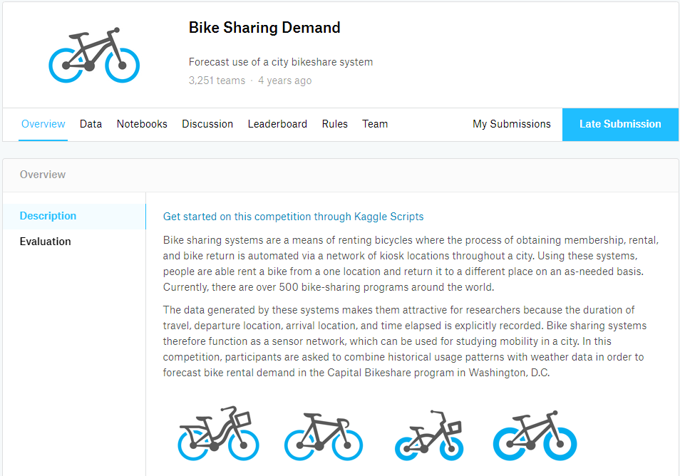


보시는 바와 같이 3번째 탭에 Notebooks를 클릭합니다.


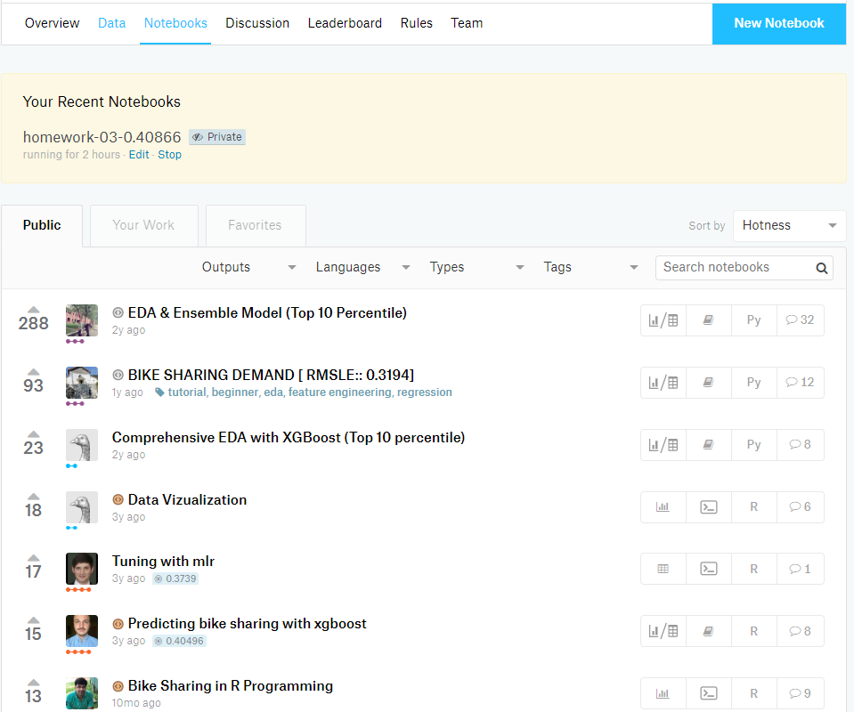


그럼 public으로 공개된 Notebook들이 보이고,

두번째 탭을 클릭하면, 내가 생성한 Notebook이 보이게 됩니다.

아직, 생성한 적이 없고 새로 Notebook을 만들어서 작업하고 싶다면

우측 상단에 **New Notebook** 을 클릭합니다.

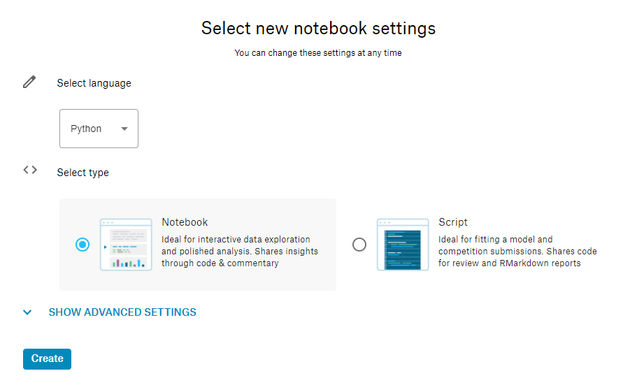


그럼 몇 가지 옵션들과 함께 Notebook을 생성할 수 있습니다.

**SHOW ADVANCED SETTINGS**를 클릭하면, GPU 옵션, Big Query, 그리고 Interactive Sessions 옵션을 설정할 수 있습니다.


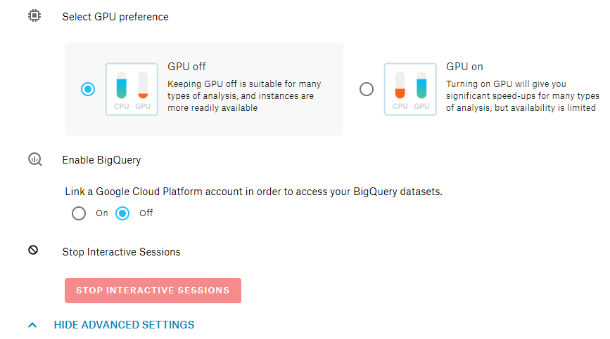


## Dataset은 이미 불러와 있다!!


첫 번째 Cell에서는 Kaggle이 매우 친절하게 dataset을 불러와 줍니다.

첫 번째 Cell을 실행하면, output에 .csv 파일의 경로를 출력해 주게 됩니다.


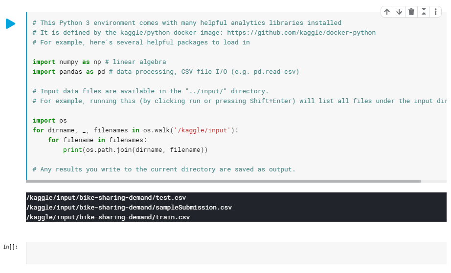


```bash
/kaggle/input/bike-sharing-demand/test.csv
/kaggle/input/bike-sharing-demand/sampleSubmission.csv
/kaggle/input/bike-sharing-demand/train.csv
```


이렇게 출력된 output을 그대로 ctrl+c, v하여 pandas로 로딩해주면 됩니다.


```python
train = pd.read_csv('/kaggle/input/bike-sharing-demand/train.csv')
test = pd.read_csv('/kaggle/input/bike-sharing-demand/test.csv')
submission = pd.read_csv('/kaggle/input/bike-sharing-demand/sampleSubmission.csv')
```


그럼 train, test, submission에 대한 DataFrame이 만들어 졌고, 이제 데이터분석을 통해 풀어주면 됩니다.

**작업들은 자동 저장**되기 때문에 중간에 browser를 종료하더라도 걱정 없습니다.


## submission을 .csv로 반드시 저장해 주세요


정답 제출을 위해서는 .csv에 저장해야 합니다. 그래야만, 정상적으로 정답이 제출될 수 있습니다.

.csv 파일명은 반드시 **sampleSubmission.csv** 에 저장해 주어야 하며, **index=False** 옵션도 필히 입력하셔야, index가 빠진채로 정상적으로 저장할 수 있게 됩니다.


```python
submission.to_csv('sampleSubmission.csv', index=False)
```


## Commit 버튼으로 매우 쉽게 제출


우측 상단에 Commit을 눌러서 정답을 제출할 수 있습니다.


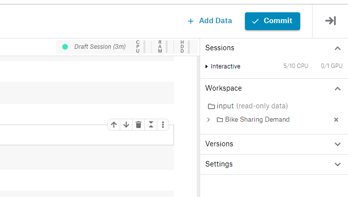


여기서 알아야 할 **꿀팁**!!

내가 만약에 로직 수정을 했다면, local에서 작업을 할 때는 처음부터 다시 돌려야 했습니다.

**하지만, Kaggle Notebook에서는 다시 안 돌려도 됩니다!!!**

왜냐하면, Commit하는 순간 Kaggle은 처음부터 모든 Cell을 다시 Run하게 됩니다.

이 점 미리 인지하시면 매우 유용합니다.


## 제출한 Version History

Commit을 하면, 내가 이전에 Commit한 Notebook을 Version으로 보관하여줍니다.

<이전 Version과 현재 Version의 diff를 볼 수 있습니다>


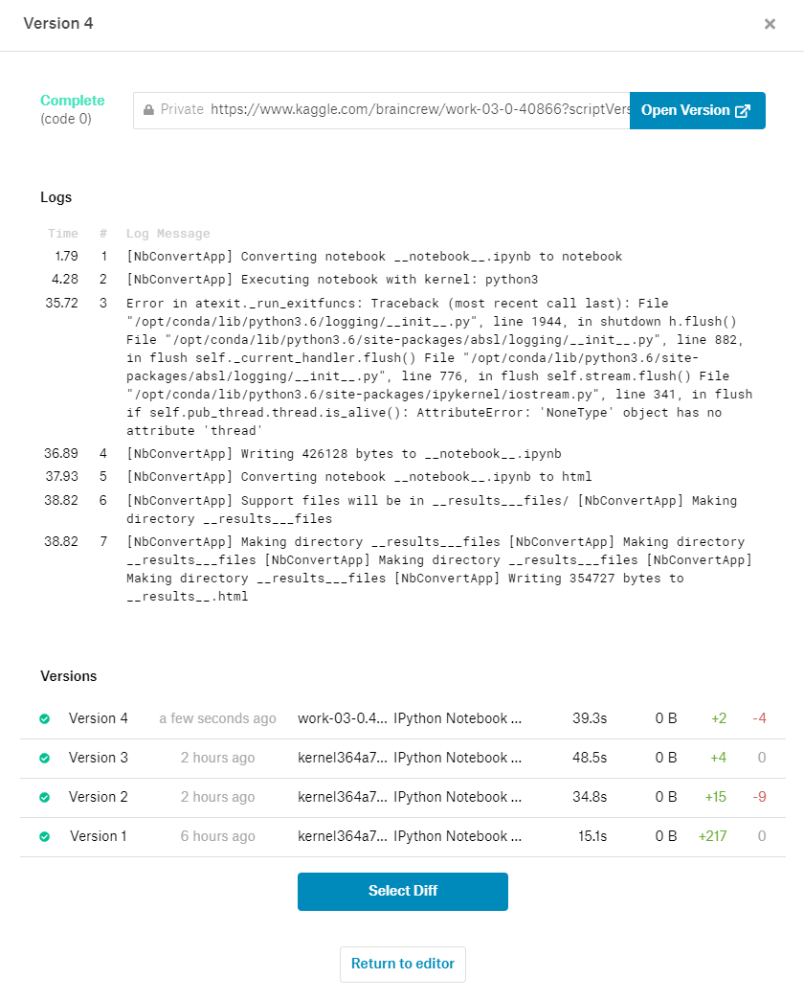


Open Version을 클릭하시면, 현재 Commit한 Version의 Notebook을 Preview 형식으로 보여줍니다.

기본 Private으로 되어 있는 Notebook을 ```Access - Public``` 으로 변경한다면, 전체 공개를 할 수 있으며, 다른 사람들과 공유할 수 있습니다.

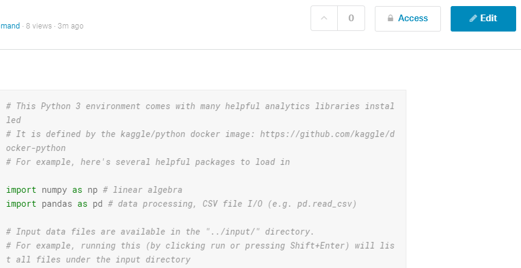


다시 Notebook으로 돌아가려면 **Edit** 버튼을 누르면, 돌아갈 수 있습니다.


## 손쉽게 제출하고 결과 확인하기


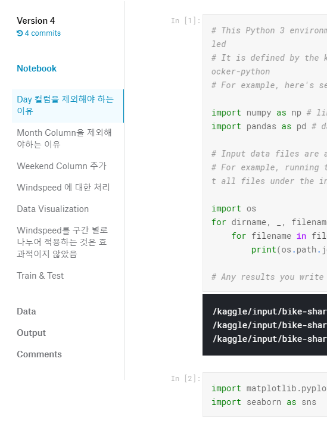


왼쪽 Sidebar에 **Output** 을 클릭하면 내가 현재 Version에서 생성한 sampleSubmission.csv 파일을 볼 수 있습니다.


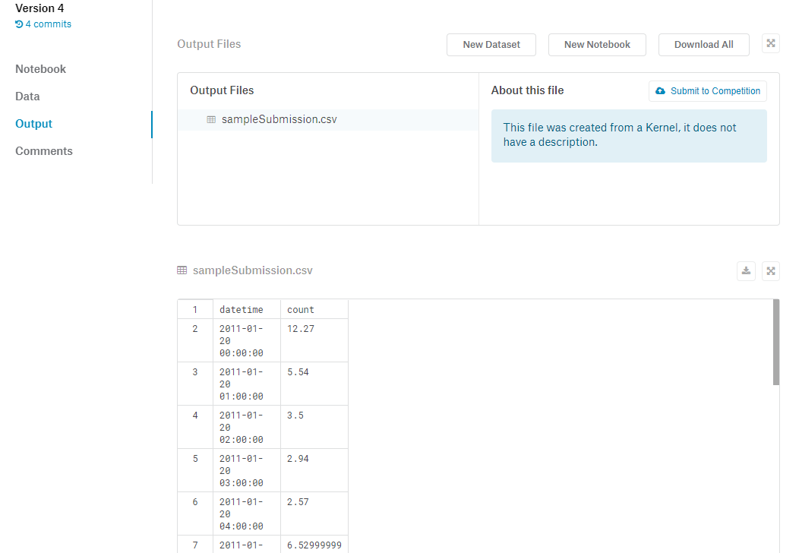


그리고, **About this file** 에서 **Submit to Competition** 버튼을 클릭하면, 제출하게 됩니다.


> local에서 작업했다면 .csv 파일을 업로드 후 제출해야하는 과정을 겪어야만 했었는데, 
>
> 이러한 과정들을 생략하게 해주며, 매우 손쉽게 수정 후 제출할 수 있습니다.


제출하게 되면, 바로 Leaderboard 탭이 나오면서 **제출한 score를 바로 확인**할 수 있습니다.


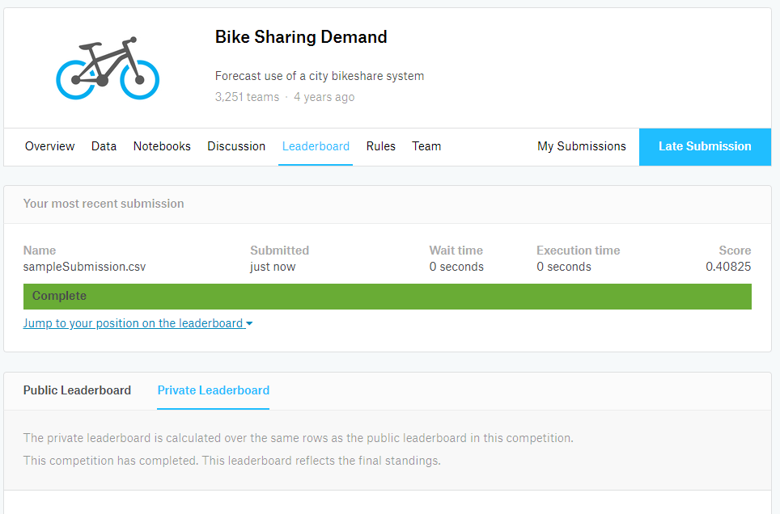


<hr>

## 끝!


읽어 주셔서 감사합니다.


##### #kaggle #notebook #jupyternotebook #bikesharingdemand


