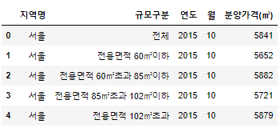
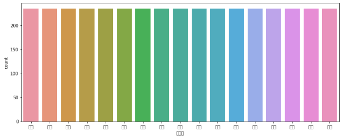
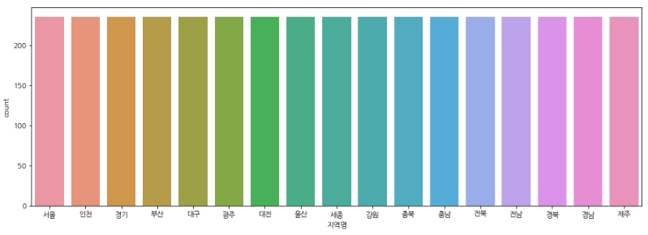
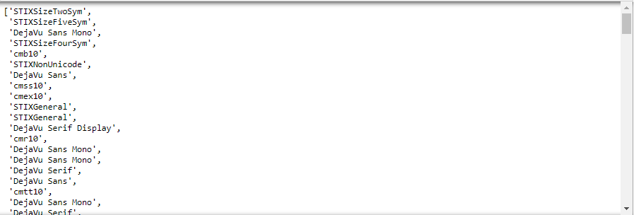
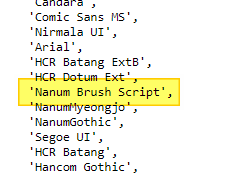
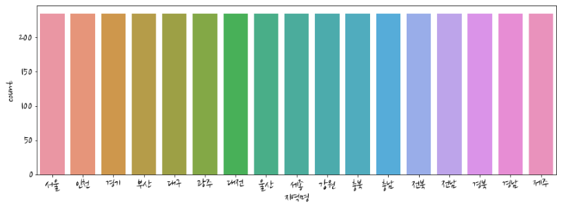

matplotlib/seaborn 을 활용하여 시각화를 할 때, 한 번씩 필연적으로 겪는 당황스러운 모먼트는 바로 **한글 폰트 깨짐** 입니다. 데이터를 다룰 때 한글 데이터는 흔히 존재하며, 이를 jupyter notebook 에서 inline으로 시각화하려 한다면, 분명히 깨짐 현상을 맞닿드릴 것입니다.

이를 해결하는 몇 가지 방법을 알려드리고자 합니다.


> 시각화할 때 아래와 같이 한글 폰트가 깨져버립니다


## 준비


일단 예제를 통해 설명을 하고자 하는데, 필요한 모듈을 임포트 해주고, 한글 데이터셋은 ```http://bit.ly/teddy-houseprice``` 를 바로 read_csv 하도록 하겠습니다.


> 데이터 불러오기

```python
import pandas as pd

# 전국 주택가격 공공데이터 데이터셋 로딩
house = pd.read_csv('http://bit.ly/teddy-houseprice')
house.head()
```





> 시각화 모듈 로딩

```python
# 시각화 모듈 임포트
import matplotlib.pyplot as plt
import seaborn as sns

# jupyter notebook 내 그래프를 바로 그리기 위한 설정
%matplotlib inline

# unicode minus를 사용하지 않기 위한 설정 (minus 깨짐현상 방지)
matplotlib.rcParams['axes.unicode_minus'] = False
```


> seaborn을 활용하여 시각화를 하면 아래와 같이 한글폰트가 깨집니다..

```python
plt.figure(figsize=(13, 5))
sns.countplot(data=house, x='지역명')
```





## 설치된 한글 폰트 지정


우선, 경험상 *80~90%는 이 방법으로 해결* 할 수 있습니다. 하지만, 몇 몇 해결이 되지 않으시는 분들은 컴퓨터 폰트 설정이 꼬여 있을 수 있습니다.

한글 폰트를 표현해 줄 수 있는 **나눔고딕** 폰트나 **맑은 고딕** 폰트가 설치되어 있어야 아래와 같은 방법이 동작할 수 있으며, **해당 폰트가 깔려 있지 않으신 분들은 설치하고 진행**하시는 것을 추천 드립니다.

[나눔고딕 설치링크](https://hangeul.naver.com/font)

### Windows OS


> 나눔고딕 폰트가 설치되어 있다면,

```python
plt.rcParams['font.family'] = 'NanumGothic'
```


> 맑은고딕 폰트가 설치되어 있다면,

```python
plt.rcParams['font.family'] = 'Malgun Gothic'
```


### Mac OS

> Apple Gothic 이 설치되어 있다면,

```python
plt.rcParams['font.family'] = 'AppleGothic'
```


위의 코드를 실행 후 시각화를 다시 실행해 보시면, 한글 폰트가 깨지지 않고 나오는 것을 보실 수 있습니다.





## 다른 한글폰트를 사용하고 싶다면?

보고서에 시각화 자료를 첨부한다고 가정했을 때, 다른 폰트를 사용하고 싶은 경우도 있습니다.

다른 fancy한 한글 폰트가 깔려 있고 이를 활용하고 싶다면 아래와 같이 하면 됩니다.


> 설치된 한글 폰트 출력

```python
import matplotlib.font_manager as fm

# 설치된 폰트 출력
font_list = [font.name for font in fm.fontManager.ttflist]
font_list
```





내 컴퓨터의 시스템상에 등록된 한글 폰트들이 출력됩니다.

이 중 마음에 드는 **한글을 지원하는** 폰트를 선택합니다.


저는 이번에는 ```Nanum Brush Script```로 폰트를 바꿔보겠습니다.





```python
# 폰트 적용
plt.rcParams['font.family'] = 'Nanum Brush Script'
```




이번에는 나눔 손글씨로 바뀌었습니다.


## 한글 폰트 사이즈 조절


한글 출력시, 글씨 크기가 좀 작게 느껴지시는 분들은 **폰트 사이즈 조절**도 할 수 있습니다.


```python
# font 크기 조절
plt.rcParams['font.size'] = 23
```


## 꿀 팁 하나 더, 전역으로 시각화 figsize 조절

한글 폰트 깨짐현상과는 무관하지만, rcParams 설정하는 김에, figsize를 키우는 방법도 매우 간단합니다.

전역으로 한 번 설정해두면, 매번 cell마다 fig_size를 설정해주지 않아도 됩니다.


```python
# figsize 를 전역으로 설정
plt.rcParams['figure.figsize'] = (13, 8)
```


출력해 보시면, 그래프 크기가 달라진 것을 확인해 보실 수 있습니다.


## 설정 파일을 수정을 통해 default font 변경


```python
import matplotlib as mpl

#font 설정 파일 위치 출력
mpl.matplotlib_fname()

# 출력
'C:\\Users\\Teddy\\Anaconda3\\envs\\ds\\lib\\site-packages\\matplotlib\\mpl-data\\matplotlibrc'
```


그럼 위와 같이 설정파일의 위치를 출력해 줍니다.

맨 마지막 **matplotlibrc** 는 우리가 수정해야할 파일 이름입니다. 경로는 바로 앞인 mpl-data 까지 입니다.

<참고로 Windows OS는 ```\``` 가 2개씩 들어가니 이를 하나씩 지워주고 복사해서 탐색기에 붙혀 넣어 줍니다>


터미널에 익숙하신 분들은 저 path를 터미널에서 vi 에디터로 바로 열어줍니다.

터미널이나 vi 에디터에 익숙하지 않다면, 윈도우 탐색기에서 저 경로로 찾아가서 ```matplotlibrc``` 파일을 메모장이나 에디터로 열어주면 됩니다.


> 적용 전

```bash
#font.family         : sans-serif
#font.style          : normal
#font.variant        : normal
#font.weight         : normal
#font.stretch        : normal
## note that font.size controls default text sizes.  To configure
## special text sizes tick labels, axes, labels, title, etc, see the rc
## settings for axes and ticks. Special text sizes can be defined
## relative to font.size, using the following values: xx-small, x-small,
## small, medium, large, x-large, xx-large, larger, or smaller
#font.size           : 10.0
```


위와 같이 **font.family**를 검색해서 찾아주면, **sans-serif**로 설정되어 있음을 확인할 수 있습니다.

주석을 풀고 한글폰트명을 적어줍니다.


> 적용 후

```bash
font.family         : NanumGothic
#font.style          : normal
#font.variant        : normal
#font.weight         : normal
#font.stretch        : normal
```


설정을 완료한 후 jupyter notebook의 kernel을 리셋하고 다시 시각화 그래프를 그려도,

한글폰트가 깨지지 않고 잘 출력되는 것을 확인하실 수 있습니다.


<br>

<br>


<hr>

## 끝!


읽어 주셔서 감사합니다.


##### #seaborn #matplotlib #jupyternotebook #한글폰트깨짐


