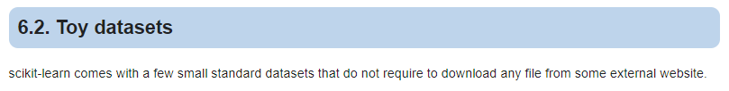
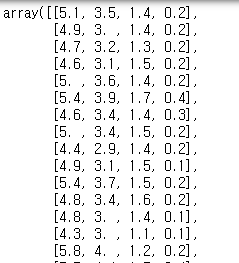
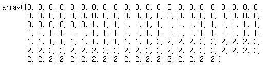
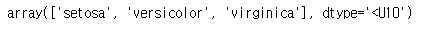

[sklearn.datasets]( https://scikit-learn.org/stable/datasets/index.html ) 모듈에는 대표적인 sample dataset들을 제공하고 손쉽게 다운로드 및 로딩할 수 있습니다.

하지만, 이렇게 샘플로 제공해주는 dataset의 경우 그 샘플 데이터의 크기가 **머신러닝을 학습하기에 충분하지 않습니다** 

다시 말하면, 샘플데이터 셋은 sklearn을 활용함에 있어서 샘플로써 활용하기(튜토리얼 성)에 용이하도록 제공하고 있으며, 실제 데이터셋은 보통 사이즈가 이보다 훨씬 큽니다.

sklearn의 공식 document에서도 datasets를 **Toy datasets** 라고 칭하고 있습니다.





하지만, 분명한 것은 sklearn 모듈을 처음 접하시는 분들에게는 참 편리하게 활용하실 수 있는 dataset입니다. 


## sklearn.datasets 에 제공되는 dataset 종류

document에서 긁어온 dataset의 종류입니다.

우측에는 regression/classification 에 적합한 dataset인지 친절하게 표기해 주고 있습니다.

| dataset 이름 (리턴값)                                        | Load and return the boston house-prices dataset (regression). |
| :----------------------------------------------------------- | :----------------------------------------------------------- |
| [`load_boston`](https://scikit-learn.org/stable/modules/generated/sklearn.datasets.load_boston.html#sklearn.datasets.load_boston)([return_X_y]) | Load and return the boston house-prices dataset (regression). |
| [`load_iris`](https://scikit-learn.org/stable/modules/generated/sklearn.datasets.load_iris.html#sklearn.datasets.load_iris)([return_X_y]) | Load and return the iris dataset (classification).           |
| [`load_diabetes`](https://scikit-learn.org/stable/modules/generated/sklearn.datasets.load_diabetes.html#sklearn.datasets.load_diabetes)([return_X_y]) | Load and return the diabetes dataset (regression).           |
| [`load_digits`](https://scikit-learn.org/stable/modules/generated/sklearn.datasets.load_digits.html#sklearn.datasets.load_digits)([n_class, return_X_y]) | Load and return the digits dataset (classification).         |
| [`load_linnerud`](https://scikit-learn.org/stable/modules/generated/sklearn.datasets.load_linnerud.html#sklearn.datasets.load_linnerud)([return_X_y]) | Load and return the linnerud dataset (multivariate regression). |
| [`load_wine`](https://scikit-learn.org/stable/modules/generated/sklearn.datasets.load_wine.html#sklearn.datasets.load_wine)([return_X_y]) | Load and return the wine dataset (classification).           |
| [`load_breast_cancer`](https://scikit-learn.org/stable/modules/generated/sklearn.datasets.load_breast_cancer.html#sklearn.datasets.load_breast_cancer)([return_X_y]) | Load and return the breast cancer wisconsin dataset (classification). |


## sklearn.datasets 활용법


제가 sklearn을 스터디 하면서 가장 좋았던 부분은 api interface가 굉장히 깔끔했다는 점입니다. 

공통으로 사용되는 api method가 **매우 명확하고 통일성**을 갖추고 있습니다.

가령, 모든 machine-learning 알고리즘의 fit/predict/score는 공통으로 사용되기 때문에 다른 알고리즘을 사용한다고 해서 다른 method를 호출해야하는 번거로움이 없고 매우 직관적입니다.

datasets도 마찬가지입니다. 공통적으로 사용되는 몇 가지 api만 숙지하고 계시다면, 매우 손쉽게 여러 종류의 datasets을 아무 어려움 없이 불러오실 수 있습니다.


> 데이터 셋 로딩하기

```python
# load_iris 데이터셋을 로딩해 보도록 하겠습니다.
# 다른 데이터 셋을 불러오고 싶다면, 바로 위 section에서 명시된 dataset의 이름을 적으면 됩니다.
from sklearn.datasets import load_iris

dataset = load_iris()
```


dataset을 불러오게 되면 ```keys()``` 를 호출하여 불러올 수 있는 key 값을 확인할 수 있습니다.

```python
dataset.keys()
```

**[출력] dict_keys(['data', 'target', 'target_names', 'DESCR', 'feature_names', 'filename'])**


그럼 dataset에서 key 값으로 꺼내오면 됩니다.


**data** 는 학습해야 할 feed용 데이터를 의미합니다.

```python
dataset['data']
```




**target**은 label 데이터 이며, 예측해야 할 (class) 데이터 입니다.

```python
dataset['target']
```




**target_names** 는 0, 1, 2와 같이 숫자로 된 데이터들의 원 이름입니다.

0 = setosa, 1=versicolor, 2=virginica 가 되겠습니다.

```python
dataset['target_names']
```




**DESCR**은 description입니다. 데이터 셋에 대한 설명을 제공합니다.

```python
dataset['DESCR']
```

```
'.. _iris_dataset:\n\nIris plants dataset\n--------------------\n\n**Data Set Characteristics:**\n\n    :Number of Instances: 150 (50 in each of three classes)\n    :Number of Attributes: 4 numeric, predictive attributes and the class\n    :Attribute Information:\n        - sepal length in cm\n        - sepal width in cm\n        - petal length in cm\n        - petal width in cm\n        - class:\n                - Iris-Setosa\n                - Iris-Versicolour\n                - Iris-Virginica\n                \n    :Summary Statistics:\n\n    ============== ==== ==== ======= ===== ====================\n                    Min  Max   Mean    SD   Class Correlation\n    ============== ==== ==== ======= ===== ====================\n    sepal length:   4.3  7.9   5.84   0.83    0.7826\n    sepal width:    2.0  4.4   3.05   0.43   -0.4194\n    petal length:   1.0  6.9   3.76   1.76    0.9490  (high!)\n    petal width:    0.1  2.5   1.20   0.76    0.9565  (high!)\n    ============== ==== ==== ======= ===== ====================\n\n    :Missing Attribute Values: None\n    :Class Distribution: 33.3% for each of 3 classes.\n    :Creator: R.A. Fisher\n    :Donor: Michael Marshall (MARSHALL%PLU@io.arc.nasa.gov)\n    :Date: July, 1988\n\nThe famous Iris database, first used by Sir R.A. Fisher. The dataset is taken\nfrom Fisher\'s paper. Note that it\'s the same as in R, but not as in the UCI\nMachine Learning Repository, which has two wrong data points.\n\nThis is perhaps the best known database to be found in the\npattern recognition literature.  Fisher\'s paper is a classic in the field and\nis referenced frequently to this day.  (See Duda & Hart, for example.)  The\ndata set contains 3 classes of 50 instances each, where each class refers to a\ntype of iris plant.  One class is linearly separable from the other 2; the\nlatter are NOT linearly separable from each other.\n\n.. topic:: References\n\n   - Fisher, R.A. "The use of multiple measurements in taxonomic problems"\n     Annual Eugenics, 7, Part II, 179-188 (1936); also in "Contributions to\n     Mathematical Statistics" (John Wiley, NY, 1950).\n   - Duda, R.O., & Hart, P.E. (1973) Pattern Classification and Scene Analysis.\n     (Q327.D83) John Wiley & Sons.  ISBN 0-471-22361-1.  See page 218.\n   - Dasarathy, B.V. (1980) "Nosing Around the Neighborhood: A New System\n     Structure and Classification Rule for Recognition in Partially Exposed\n     Environments".  IEEE Transactions on Pattern Analysis and Machine\n     Intelligence, Vol. PAMI-2, No. 1, 67-71.\n   - Gates, G.W. (1972) "The Reduced Nearest Neighbor Rule".  IEEE Transactions\n     on Information Theory, May 1972, 431-433.\n   - See also: 1988 MLC Proceedings, 54-64.  Cheeseman et al"s AUTOCLASS II\n     conceptual clustering system finds 3 classes in the data.\n   - Many, many more ...'
```


**feature_names**는 제공되는 (feed되는) 데이터 셋의 column 명으로 이해하시면 됩니다.

```python
dataset['feature_names']
```


**filename**은 datasets을 다운로드 받은 경로를 return 합니다.

```python
dataset['filename']
```


## train_test_split으로 반드시 shuffle 해주세요

dataset['data']를 feature에 / dataset['target']을 label에 넣고 학습시키면 절대절대 안됩니다.

왜냐하면, dataset 자체가 친절하게도 order가 깔끔히 정렬된 상태이기 때문에 반드시 dataset을 shuffle 해주어야합니다.

numpy로 shuffle을 해주어도 좋지만, sklearn에서 제공해주는 train_test_split을 활용하면 매우 쉽게 shuffle과 split을 할 수 있습니다.


```python
from sklearn.model_selection import train_test_split

x_train, x_test, y_train, y_test = train_test_split(dataset['data'], dataset['target'])
```


> shape 확인

```python
x_train.shape
# (112, 4)
x_test.shape
# (38, 4)
y_train.shape
# (112,)
y_test.shape
# (38,)
```


이제, 원하는 머신러닝 알고리즘 (classification)으로 학습해보면 되겠네요!!


<br>

<br>


<hr>

## 끝!


읽어 주셔서 감사합니다.


##### #sklearn #train_test_split #dataset #머신러닝


