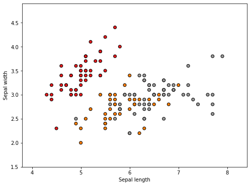
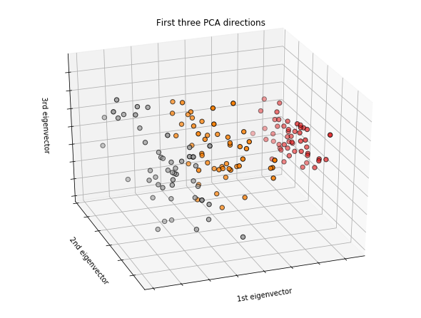
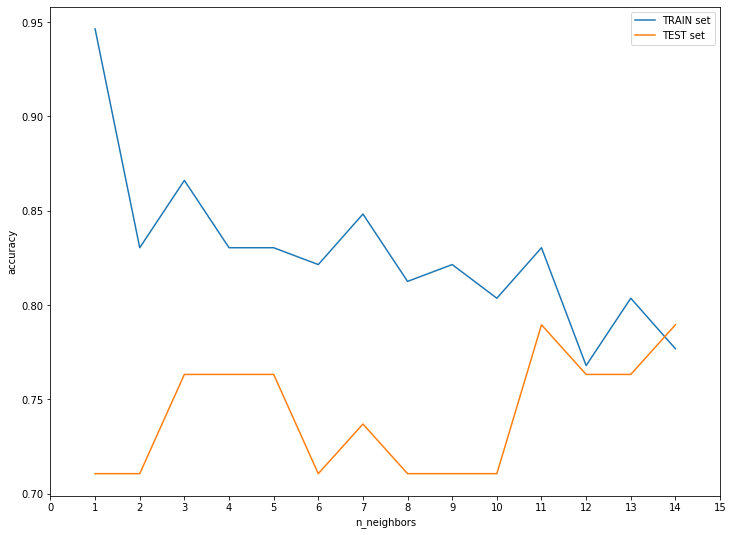

K-최근접 이웃 (K-Nearest Neighbors) 알고리즘은 분류(Classifier)와 회귀(Regression)에 모두 쓰입니다. 처음 접하는 사람들도 이해하기 쉬운 알고리즘이며, **단순한 데이터**를 대상으로 분류나 회귀를 할 때 사용합니다. 

미리 중요한 사항을 언급하자면, 복잡한 데이터셋에는 K-Nearest Neighbors 알고리즘은 제대로 된 성능발휘를 하기 힘들다는 점은 미리 인지하시는 것이 좋습니다. (좀 더 정확히 말하자면, 훨씬 좋은 성능을 발휘하는 대체제들이 많습니다^^)

앞으로 편의상 K-Nearest Neighbors 알고리즘을 줄여서 KNN이라고 하겠습니다.

KNN의 원리에 대해 자세히 알고 싶다면, [블로그]( https://www.datacamp.com/community/tutorials/k-nearest-neighbor-classification-scikit-learn )를 참고하시면 좋을 것 같습니다.

## Iris 꽃 종류 분류를 위한 시각화

```python
import matplotlib.pyplot as plt
from mpl_toolkits.mplot3d import Axes3D
from sklearn import datasets
from sklearn.decomposition import PCA
import numpy as np

%matplotlib inline

# load Iris datasets 
iris = datasets.load_iris()

# here we only select sepal length and width (select first 2 columns)
X = iris.data[:, :2]  
y = iris.target

# visualization을 위하여 lim 설정
x_min, x_max = X[:, 0].min() - .5, X[:, 0].max() + .5
y_min, y_max = X[:, 1].min() - .5, X[:, 1].max() + .5

plt.figure(figsize=(8, 6))

# Plot the training points
plt.scatter(X[:, 0], X[:, 1], c=y, cmap=plt.cm.Set1, edgecolor='k')
plt.xlabel('Sepal length')
plt.ylabel('Sepal width')
plt.xlim(x_min, x_max)
plt.ylim(y_min, y_max)

plt.show()
```

 


위에서 시각화를 해보면 sepal length 와 width에 따라서 target 이 달라지는 것을 볼 수 있습니다.

이를 좀 더 3D 공간에서 보고 싶다면, 다음과 같이 해볼 수 있습니다.

```python
fig = plt.figure(figsize=(8, 6))
ax = Axes3D(fig, elev=-150, azim=110)
X_reduced = PCA(n_components=3).fit_transform(iris.data)
ax.scatter(X_reduced[:, 0], X_reduced[:, 1], X_reduced[:, 2], c=y,
           cmap=plt.cm.Set1, edgecolor='k', s=40)
ax.set_title("First three PCA directions")
ax.set_xlabel("1st eigenvector")
ax.w_xaxis.set_ticklabels([])
ax.set_ylabel("2nd eigenvector")
ax.w_yaxis.set_ticklabels([])
ax.set_zlabel("3rd eigenvector")
ax.w_zaxis.set_ticklabels([])

plt.show()
```



좀 더 그럴싸하게 3D 공간에서 어떻게 구분되는지 명확이 볼 수 있습니다.


자, 그럼 KNN을 활용해서 꽃 종류를 예측해보겠습니다. sklearn 라이브러리를 사용하면 너무 코드가 심플합니다.

```python
# 필요한 library import
from sklearn.neighbors import KNeighborsClassifier
from sklearn.model_selection import train_test_split, cross_val_score
```


> 성능 측정을 위한 train_test_split

```python
x_train, x_test, y_train, y_test = train_test_split(X, y, random_state=30)
```


> KNeighborsClassifier 에 특별한 hyperparameter 셋팅은 하지 않겠습니다.

```python
clf = KNeighborsClassifier()
clf.fit(x_train, y_train)
prediction = clf.predict(x_test)
print("clf.score             : {0:.3f}".format(clf.score(x_train, y_train)))
print("(pred == y_test) score: {0:.3f}".format((prediction==y_test).mean()))
print("cross_val_score       : {0:.3f}".format(cross_val_score(clf, x_train, y_train, cv=10).mean()))
```

> 기본 hyperparameter로 낸 결과

```
clf.score             : 0.830
(pred == y_test) score: 0.763
cross_val_score       : 0.774
```


training set의 accuracy는 83%이지만, cross_val_score는 77.4%로 기대 이하의 점수가 나왔습니다. 지금 model 자체가  *overfitting* 되었다고 볼 수 있습니다.

그럼, 이것을 해결하려면 가장 중요한 hyperparameter인 n_neighbors를 조절해 주는 것입니다. (**기본 n_neighbors=5로 설정**되어 있습니다.)

KNN 알고리즘은 n_neighbors의 갯수가 적을때는 결정 경계가 매우 복잡해지면, 반대로 n_neighbors의 갯수가 많아지면 결정 경계가 단순해집니다. 

* n_neighbors 적어지면 -> model의 결정경계가 복잡 -> overfitting
* n_neighbors 많아지면 -> model의 결정경계가 단순 -> underfitting


즉, 줄타기를 잘해서 적절한 n_neighbors를 찾는 것이 이 modeling의 가장 중요한 task중 하나입니다.

## 적절한 n_neighbors 찾기

간단한 시각화를 통해서 training set의 정확도와 testing set의 정확도를 그래프로 그려보겠습니다.

> n_neighbors를 1~14까지 적용

```python
train_acc = []
test_acc = []

for n in range(1,15):
    clf = KNeighborsClassifier(n_jobs=-1, n_neighbors=n)
    clf.fit(x_train, y_train)
    prediction = clf.predict(x_test)
    train_acc.append(clf.score(x_train, y_train))
    test_acc.append((prediction==y_test).mean())
```


> n_neighbors의 변화에 따른 성능 시각화

```python
plt.figure(figsize=(12, 9))
plt.plot(range(1, 15), train_acc, label='TRAIN set')
plt.plot(range(1, 15), test_acc, label='TEST set')
plt.xlabel("n_neighbors")
plt.ylabel("accuracy")
plt.xticks(np.arange(0, 16, step=1))
plt.legend()
```




testing set의 성능이 가장 좋았던 **n_neighbors=11**이 가장 좋은 성능을 낸 것을 확인해 볼 수 있습니다. 물론 다른 hyperparameter과 simultanious 하게 튜닝을 하다보면 n_neighbors는 언제든 바뀔 수 있겠지만, 다른 hyperparameter를 고정했다는 전제하에는 n_neighbors=11 이 최적의 값이라고 볼 수 있습니다.


## 결론

KNN의 장단점 그리고 언제 활용을 해야하는지 다음과 같이 심플하게 정리해 보았습니다.


**장점**

* 쉬운 모델, 쉬운 알고리즘과 이해 (입문자가 샘플데이터를 활용할 때 좋음)
* 튜닝할 hyperparameter 스트레스가 없음
* 초기 시도해보기 좋은 시작점이 되는 모델

**단점**

* 샘플 데이터가 늘어나면 예측시간도 늘어나기 때문에 매우 느려짐
* pre-processing을 잘하지 않으면 좋은 성능을 기대하기 어려움
* feature가 많은(수 백개 이상) 데이터셋에서는 좋은 성능을 기대하기 어려움
* feature의 값이 대부분 0인 데이터셋과는 매우 안좋은 성능을 냄


결론, kaggle과 현업에서는 더 좋은 대안들이 많기 때문에 자주 쓰이는 알고리즘은 아닙니다. 하지만, 초기에 학습을 목표로 해볼 필요는 있습니다!


