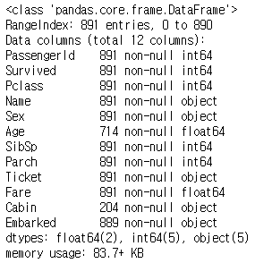
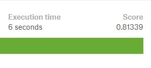
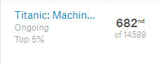

캐글(Kaggle)의 대표적인 입문용 데이터 분석 경진대회인 [타이타닉 생존자 예측 (Titanic: Machine Learning from Disaster)]( https://www.kaggle.com/c/titanic ) 에서 81% 이상의 정확도를 기록하여 상위 5% 안에 들 수 있는 Solution을 공유하고자 합니다.

사실, 개인적으로 느끼는 부분이지만, 데이터의 갯수도 매우 적은 편이기 때문에 Machine Learning을 돌리기에 **매우 좋은 데이터셋은 아니다**라고 느꼈습니다.

하지만, 다양한 pre-processing을 경험해보고 Machine Learning 알고리즘을 돌려보고 제출하는데에 의의를 두고 진행하였습니다.


## Dataset

Data 탭에서 train, test, submission에 관련된 데이터셋을 받으실 수 있습니다.

[데이터 셋 다운로드 링크]( https://www.kaggle.com/c/titanic/data )

캐글에서 친절하게 간략한 데이터 셋에 대한 정보를 제공해 줍니다.


## Pre-Processing


```python
import pandas as pd
import warnings

%matplotlib inline
warnings.filterwarnings('ignore')

# data import
train = pd.read_csv('data/train.csv')
test = pd.read_csv('data/test.csv')
gender_submission = pd.read_csv('data/gender_submission.csv')

train.info()
```




### 성별

성별은 male & female로 되어 있던 data를 numeric하게 바꾸어 주었습니다.

```python
train['Sex_clean'] = train['Sex'].astype('category').cat.codes
test['Sex_clean'] = test['Sex'].astype('category').cat.codes
```


### Embarked

Embarked 컬럼은 승객이 어느 항구에서 탔는지를 나타내 줍니다.

여기서 눈여겨 봐야할 부분은 train 데이터에는 NaN값이 2개 존재합니다.

이를 처리 안해준다면, 나중에 머신러닝 알고리즘을 돌릴 때 오류가 날 수 있기 때문에 NaN 값에 대한 처리를 해주어야 하는데, **가장 많은 데이터가 존재하는 'S'로 일괄 채워주었습니다.**

그런 다음에 Embarked 컬럼 역시 numeric 한 데이터로 변경하여 'Embarked_clean' 컬럼에 채워 주었습니다.

```python
train['Embarked'].isnull().sum()
# 2

test['Embarked'].isnull().sum()
# 0

train['Embarked'].value_counts()
# output
# S    644
# C    168
# Q     77

train['Embarked'].fillna('S', inplace=True)

train['Embarked_clean'] = train['Embarked'].astype('category').cat.codes
test['Embarked_clean'] = test['Embarked'].astype('category').cat.codes
```


## Family

Family의 총 숫자를 계산하여 채워주는 새로운 컬럼입니다. 'SibSp' 컬럼과 'Parch' 컬럼을 합친다음에 자신을 더한 값이 자신이 속한 Family의 총 숫자가 됩니다. 

```python
train['Family'] = 1 + train['SibSp'] + train['Parch']
test['Family'] = 1 + test['SibSp'] + test['Parch']
```


## Solo

내가 혼자 탔는지 다른 가족과 같이 탔는지 여부를 구분해 주기 위하여 'Solo'라는 컬럼을 추가해 주었습니다.

```python
train['Solo'] = (train['Family'] == 1)
test['Solo'] = (test['Family'] == 1)
```


## Fare

요금 컬럼은 Numeric한 값보다는 단순화하기 위하여 Binning 기법을 활용하였습니다.

`pd.qcut`을 활용하여 5구간으로 나누어 주어 binning하였습니다.

```python
train['FareBin'] = pd.qcut(train['Fare'], 5)
test['FareBin'] = pd.qcut(test['Fare'], 5)

train['FareBin'].value_counts()
# (7.854, 10.5]        184
# (21.679, 39.688]     180
# (-0.001, 7.854]      179
# (39.688, 512.329]    176
# (10.5, 21.679]       172
# Name: FareBin, dtype: int64
```


Binning을 한 후에 Numeric한 값으로 변경하여 주었습니다.

```python
train['Fare_clean'] = train['FareBin'].astype('category').cat.codes
test['Fare_clean'] = test['FareBin'].astype('category').cat.codes

train['Fare_clean'].value_counts()
# 1    184
# 3    180
# 0    179
# 4    176
# 2    172
# Name: Fare_clean, dtype: int64
```


## Title

Title은 'Name' 칼럼에서 ~씨와 같은 title을 추출하여 새롭게 생성해주는 컬럼입니다. 단, 주의해야할 점은 Title을 추출하여 카테고리와 해주면, **데이터의 총 량에 비하여 너무 복잡도가 올라가는 경향**이 있기 때문에 모수가 적은 title은 단일화 해주었습니다.

```python
train['Title'] = train['Name'].str.extract(' ([A-Za-z]+)\.', expand=False)
test['Title'] = test['Name'].str.extract(' ([A-Za-z]+)\.', expand=False)

train['Title'] = train['Title'].replace(['Lady', 'Countess','Capt', 'Col','Don', 'Dr', 'Major', 'Rev', 'Sir', 'Jonkheer', 'Dona'], 'Other')

train['Title'].value_counts()
# Mr        517
# Miss      182
# Mrs       125
# Master     40
# Other      23
# Mlle        2
# Ms          1
# Mme         1
# Name: Title, dtype: int64
```


Mlle과 Ms, Mme는 1~2개 밖에 없으므로, 이 역시 단일화 해주는 작업을 진행하였습니다.

```python
train['Title'] = train['Title'].replace('Mlle', 'Miss')
train['Title'] = train['Title'].replace('Ms', 'Miss')
train['Title'] = train['Title'].replace('Mme', 'Mrs')

train['Title'].value_counts()
# Mr        517
# Miss      185
# Mrs       126
# Master     40
# Other      23
# Name: Title, dtype: int64
```


Test 데이터셋에 대해서도 동일하게 진행하였습니다.

```python
test['Title'] = test['Title'].replace(['Lady', 'Countess','Capt', 'Col','Don', 'Dr', 'Major', 'Rev', 'Sir', 'Jonkheer', 'Dona'], 'Other')

test['Title'] = test['Title'].replace('Mlle', 'Miss')
test['Title'] = test['Title'].replace('Ms', 'Miss')
test['Title'] = test['Title'].replace('Mme', 'Mrs')

test['Title'].value_counts()
# Mr        240
# Miss       79
# Mrs        72
# Master     21
# Other       6
# Name: Title, dtype: int64
```


Title 역시 Numeric한 값들로 변경해 주었습니다.

```python
train['Title_clean'] = train['Title'].astype('category').cat.codes
test['Title_clean'] = test['Title'].astype('category').cat.codes
```


### Age

나이는 빈 값이 상당히 많은 컬럼이지만, 나중에 Machine Learning 알고리즘을 fit한 후 feature_importances에서 **'Age'컬럼의 importance가 상당히 높게 나옴을 확인할 수 있습니다.** 그렇기 때문에 Age에 대한 pre-processing 전략이 상당히 중요하다는 것을 알 수 있습니다.

우선, 저의 경우에는 사실 다양한 시도를 해보고, 다른 Kaggle Kernel도 참조를 많이 해본 결과 NaN값에 대한 처리는 앞서 pre-processing때 진행한** Title로 Group화 한 Age의 Median 값으로 채워주는 전략이 가장 높은 점수**를 얻을 수 있었습니다.

```python
train['Age'].isnull().sum()
# 177

test['Age'].isnull().sum()
# 86

train["Age"].fillna(train.groupby("Title")["Age"].transform("median"), inplace=True)
test["Age"].fillna(test.groupby("Title")["Age"].transform("median"), inplace=True)
```


그런 다음, Age를 구간화 (Binning) 해주었는데, 5세 단위로 자르고 50대는 10세단위 그리고 60세이상은 모두 묶어서 Binning을 해주었습니다.

```python
# Train
train.loc[ train['Age'] <= 10, 'Age_clean'] = 0
train.loc[(train['Age'] > 10) & (train['Age'] <= 16), 'Age_clean'] = 1
train.loc[(train['Age'] > 16) & (train['Age'] <= 20), 'Age_clean'] = 2
train.loc[(train['Age'] > 20) & (train['Age'] <= 26), 'Age_clean'] = 3
train.loc[(train['Age'] > 26) & (train['Age'] <= 30), 'Age_clean'] = 4
train.loc[(train['Age'] > 30) & (train['Age'] <= 36), 'Age_clean'] = 5
train.loc[(train['Age'] > 36) & (train['Age'] <= 40), 'Age_clean'] = 6
train.loc[(train['Age'] > 40) & (train['Age'] <= 46), 'Age_clean'] = 7
train.loc[(train['Age'] > 46) & (train['Age'] <= 50), 'Age_clean'] = 8
train.loc[(train['Age'] > 50) & (train['Age'] <= 60), 'Age_clean'] = 9
train.loc[ train['Age'] > 60, 'Age_clean'] = 10

# Test
test.loc[ test['Age'] <= 10, 'Age_clean'] = 0
test.loc[(test['Age'] > 10) & (test['Age'] <= 16), 'Age_clean'] = 1
test.loc[(test['Age'] > 16) & (test['Age'] <= 20), 'Age_clean'] = 2
test.loc[(test['Age'] > 20) & (test['Age'] <= 26), 'Age_clean'] = 3
test.loc[(test['Age'] > 26) & (test['Age'] <= 30), 'Age_clean'] = 4
test.loc[(test['Age'] > 30) & (test['Age'] <= 36), 'Age_clean'] = 5
test.loc[(test['Age'] > 36) & (test['Age'] <= 40), 'Age_clean'] = 6
test.loc[(test['Age'] > 40) & (test['Age'] <= 46), 'Age_clean'] = 7
test.loc[(test['Age'] > 46) & (test['Age'] <= 50), 'Age_clean'] = 8
test.loc[(test['Age'] > 50) & (test['Age'] <= 60), 'Age_clean'] = 9
test.loc[ test['Age'] > 60, 'Age_clean'] = 10
```


### Cabin

Cabin 컬럼에서는 알파벳 뒤에 붙는 Numeric한 값은 무시하고 Alphabet만 가져오는 전략을 취했습니다. Cabin 컬럼 역시 NaN 값이 매우 많은 컬럼입니다. 우선, Cabin 값은 Alphabet을 가져와서 Numeric한 값으로 변경한 후에 **Pclass로 Group한 median값을 일괄 적용해 주는 방식**을 취해주었습니다.

```python
train['Cabin'].str[:1].value_counts()

# C    59
# B    47
# D    33
# E    32
# A    15
# F    13
# G     4
# T     1
# Name: Cabin, dtype: int64

mapping = {
    'A': 0,
    'B': 1,
    'C': 2,
    'D': 3,
    'E': 4,
    'F': 5,
    'G': 6,
    'T': 7
}

train['Cabin_clean'] = train['Cabin'].str[:1]
train['Cabin_clean'] = train['Cabin_clean'].map(mapping)
train['Cabin_clean'] = train.groupby('Pclass')['Cabin_clean'].transform('median')

test['Cabin_clean'] = test['Cabin'].str[:1]
test['Cabin_clean'] = test['Cabin_clean'].map(mapping)
test['Cabin_clean'] = test.groupby('Pclass')['Cabin_clean'].transform('median')

train['Cabin_clean'].value_counts()
# 5.0    491
# 2.0    216
# 4.5    184
# Name: Cabin_clean, dtype: int64

test['Cabin_clean'].value_counts()
# 5.0    311
# 2.0    107
# Name: Cabin_clean, dtype: int64
```


## Feature와 Label 정의


```python
feature = [
    'Pclass',
    'SibSp',
    'Parch',
    'Sex_clean',
    'Embarked_clean',
    'Family',
    'Solo',
    'Title_clean',
    'Age_clean',
    'Cabin_clean',
    'Fare_clean',
]

label = [
    'Survived',
]
```


## HyperParameter

사실 Hyper Parameter도 매우 중요한 요소입니다. 사실 Hyper Parameter를 설정해 주기 이전에 Model 선택부터 당연히 선행되어야 겠습니다. 적절한 Model 선택과 Hyper Parameter에 대한 과정은 다른 포스팅에서 깊게 다루도록 하겠습니다. 

여러 가지 모델링을 해본 결과, 제가 진행한 pre-processing 데이터셋에는 RandomForestClassifier가 가장 좋은 결과를 가져다 주었습니다.

우선, 이번 Titanic 생존자 예측 대회에서는 dataset의 복잡도가 크지 않고, 사이즈도 매우 적기 때문에 n_estimator 값은 최대한 줄이는 전략을 취했습니다. 또한 max_depth도 제한을 두어 너무 깊어지지 않도록 했으며, 다른 parameter는 별도로 건들이지 않았습니다.

Hyper Parameter 튜닝에 대한 부분은 별도로 다루도록 하겠습니다.


## Cross Validation Score

```python
from sklearn.model_selection import KFold, cross_val_score
from sklearn.ensemble import RandomForestClassifier

data = train[feature]
target = train[label]

k_fold = KFold(n_splits=10, shuffle=True, random_state=0)

clf = RandomForestClassifier(n_estimators=50, max_depth=6, random_state=0)
cross_val_score(clf, data, target, cv=k_fold, scoring='accuracy', ).mean()
# Accuracy
# 0.8271660424469414
```


## Make Prediction

```python
x_train = train[feature]
x_test = test[feature]
y_train = train[label]

clf = RandomForestClassifier(n_estimators=50, max_depth=6, random_state=0)
clf.fit(x_train, y_train)
gender_submission['Survived'] = clf.predict(x_test)
gender_submission.to_csv('titanic-submission.csv',index=False)
```


.csv 파일을 Kaggle에서 제출해 보면 0.81339를 획득하실 수 있습니다.




이는 상위 5%에 해당하는 Score입니다.




