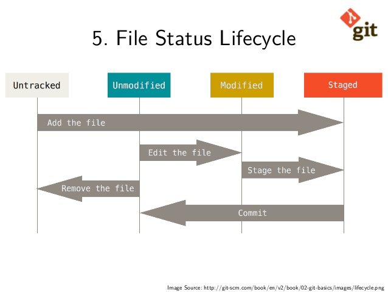
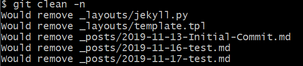
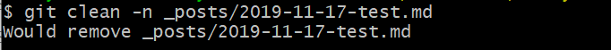
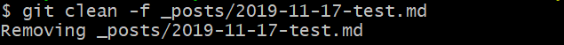

git의 untracked files에 단 2개의 명령어로 clean하기 전에 확인하는 방법과 실제 clean하는 방법을 공유드리고자 합니다.


## Untracked Files?

git의 파일 관리 시스템은 다음과 같은 Cycle을 따릅니다.




위 표에서 보시는 바와 같이 내가 새로운 파일을 만들게 된다면, `untracked files`로 잡히게 됩니다.

`untracked files`에서 내가 `git add <filename>` 이라는 명령어로 file을 추가하게 된다면, git system이 해당 파일을 tracking하게 됩니다.

하지만, 내가 임시로 만든 temp file이나 test용 file도 신규로 생성이 되었다면 `untracked files`에 잡히게 되는데요. 이를 `git clean`이라는 명령어를 통해 손쉽게 제거할 수 있습니다.


## untracked files를 제거하기 전에 제거될 파일 확인하기!

한 번 삭제를 하면 되돌릴 수 없습니다. 그렇기 때문에 실제 명령어를 실행하기 전에 어떤 파일들이 제거될 것인가는 확인하는 것은 좋은 습관입니다.

> git clean 으로 제거될 파일 미리보기 (전체)

```bash
git clean -n
```



**Would remove 파일명**으로 제거될 파일을 미리 보여 줍니다.

> 한 개의 파일만 clean하고 싶은 경우

```bash
git clean -n <filename>
```




## Untracked Files 깔끔히 제거하기

제거될 files를 모두 확인하였다면, 아래의 명령어를 통해 제거할 수 있습니다.

**실제로 file이 삭제 되니, 주의하시기 바랍니다**


> 전체 untracked files 제거

```bash
git clean -f
```


모든 untracked files가 제거됨을 확인할 수 있습니다.


만약, 1개의 file만 clean하고 싶은 경우 다음과 같이 실행하시면 됩니다.


> 한 개의 untracked files 제거

```python
git clean -f <filename>
```




