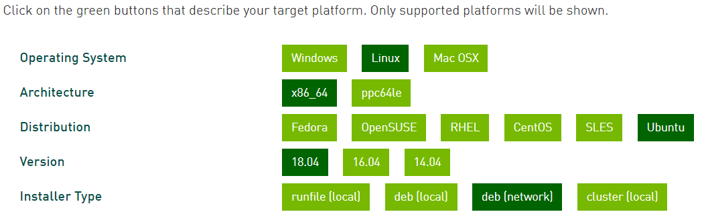

Amazon AWS에서 좋은 GPU 자원으로 딥러닝을 돌리다보니 요금폭탄을 맞았습니다.. 그래서 이참에 딥러닝 PC를 구매를 하게 되었고 딥러닝 서버를 위한 CUDA 및 cuDNN까지 설치하는 방법에 대하여 알려드리고자 합니다.

## 설치 환경 및 GPU 스펙

가장 중요한 하드웨어 스펙을 미리 고지하고자 합니다. 

설치시 하드웨어의 종류별로 설치 방법에 차이가 있을 수 있습니다.

* **Ubuntu 18.04.3 (Bionic Beaver)**
* **GPU: RTX 2080 ti (1 piece)**


## Library 지원 버젼 (2019. 12. 04 기준)

이 글이 작성되는 기준으로 제가 주로 사용할 library의 GPU 지원 기준은 다음과 같습니다.

반드시 설치 하기 전에 **지원하는 python, CUDA, 그리고 cuDNN** 이렇게 3가지의 버젼은 **반드시 체크하시고 진행**하시기 바랍니다.


**Tensorflow**

The following NVIDIA® software must be installed on your system:

- [NVIDIA® GPU drivers](https://www.nvidia.com/drivers) —CUDA 10.0 requires 410.x or higher.
- [CUDA® Toolkit](https://developer.nvidia.com/cuda-toolkit-archive) —TensorFlow supports **CUDA 10.0** (TensorFlow >= 1.13.0)
- [CUPTI](http://docs.nvidia.com/cuda/cupti/) ships with the CUDA Toolkit.
- [cuDNN SDK](https://developer.nvidia.com/cudnn) (>= 7.4.1)
- *(Optional)* [TensorRT 5.0](https://docs.nvidia.com/deeplearning/sdk/tensorrt-install-guide/index.html) to improve latency and throughput for inference on some models.


**Pytorch**

* python 3.5, **3.6**, 3.7
* CUDA 9.2, **10.1**


**Keras**

* Python 2.7-**3.6**


## 설치 항목 FIX

위에서 지원되는 모든 항목의 공통 분모는 다음과 같습니다.

* python 3.6
* CUDA 10 or CUDA 10.1
* cuDNN (>=7.4.1)


## STEP 1. CUDA Dependency 설치

CUDA 설치시 다음과 같은 dependency를 항상 pull 해온다고 보장할 수 없기 때문에 미리 설치해두는 것이 좋습니다.

```bash
sudo apt-get update
sudo apt-get install build-essential dkms
sudo apt-get install freeglut3 freeglut3-dev libxi-dev libxmu-dev
```


## STEP 2. CUDA 10.1 설치

Cuda Toolkit 설치를 해주려면 먼저 nvidia 사이트에서 가이드라인 대로 command line을 입력해 준다면 쉽게 설치를 하실 수 있습니다. Cuda Toolkit을 다운로드 받을 수 있는 링크를 아래에 기입해 놓겠습니다.


**CUDA Toolkit Archive**

Previous releases of the CUDA Toolkit, GPU Computing SDK, documentation and developer drivers can be found using the links below. Please select the release you want from the list below, and be sure to check [www.nvidia.com/drivers](http://www.nvidia.com/drivers) for more recent production drivers appropriate for your hardware configuration.

 

[Download CUDA Toolkit 10.1](https://developer.nvidia.com/cuda-downloads)

 

**Release**

* [CUDA Toolkit 10.2 ](https://developer.nvidia.com/cuda-downloads)(Nov 2019), [Versioned Online Documentation](https://docs.nvidia.com/cuda/archive/10.2/)
* [CUDA Toolkit 10.1 update2](https://developer.nvidia.com/cuda-10.1-download-archive-update2) (Aug 2019), [Versioned Online Documentation](https://docs.nvidia.com/cuda/archive/10.1/)
* [CUDA Toolkit 10.1 update1](https://developer.nvidia.com/cuda-10.1-download-archive-update1) (May 2019), [Versioned Online Documentation](https://docs.nvidia.com/cuda/archive/10.1/)
* [CUDA Toolkit 10.1 ](https://developer.nvidia.com/cuda-10.1-download-archive-base)(Feb 2019), [Online Documentation](https://docs.nvidia.com/cuda/archive/10.1/)
* [CUDA Toolkit 10.0](https://developer.nvidia.com/cuda-10.0-download-archive) (Sept 2018), [Online Documentation](https://docs.nvidia.com/cuda/archive/10.0/)
* [CUDA Toolkit 9.2](https://developer.nvidia.com/cuda-92-download-archive) (May 2018),[Online Documentation](https://docs.nvidia.com/cuda/archive/9.2/)
* [CUDA Toolkit 9.1](https://developer.nvidia.com/cuda-91-download-archive-new) (Dec 2017), [Online Documentation](https://docs.nvidia.com/cuda/archive/9.1/)
* [CUDA Toolkit 9.0](https://developer.nvidia.com/cuda-90-download-archive) (Sept 2017), [Online Documentation](https://docs.nvidia.com/cuda/archive/9.0/)




```bash
wget https://developer.download.nvidia.com/compute/cuda/repos/ubuntu1804/x86_64/cuda-ubuntu1804.pin
sudo mv cuda-ubuntu1804.pin /etc/apt/preferences.d/cuda-repository-pin-600
sudo apt-key adv --fetch-keys https://developer.download.nvidia.com/compute/cuda/repos/ubuntu1804/x86_64/7fa2af80.pub
sudo add-apt-repository "deb http://developer.download.nvidia.com/compute/cuda/repos/ubuntu1804/x86_64/ /"
sudo apt-get update
sudo apt-get -y install cuda
```

그럼 다음과 같이 command line 명령어를 친절하게 알려줍니다. 그대로 진행하시면 됩니다.


## STEP 3. Environment Variable 등록

각자 본인이 **설치한 CUDA 버젼은  아래 경로에서 치환**하여 넣으시면 됩니다. 아래 예제는 Cuda 10.2 기준입니다.

```bash
export PATH=$PATH:/usr/local/cuda-10.2/bin
export CUDADIR=/usr/local/cuda-10.2
export LD_LIBRARY_PATH=$LD_LIBRARY_PATH:/usr/local/cuda-10.2/lib64
```


## STEP 4. cuDNN 설치

cuDNN은 **Deep Neural Network 를 위한 GPU-accelerated library**입니다. 딥러닝을 돌리실 분들은 필수로 설치해 주셔야합니다. cuDNN 설치파일을 다운로드 받기 위해서는 계정 로그인을 하셔야합니다.

아래 링크로 가셔서 로그인 하시면 버젼별로 지원하는 cuDNN을 받으실 수 있습니다.

**cuDNN Versions**

[Download cuDNN v7.6.5 (November 18th, 2019), for CUDA 10.2](https://developer.nvidia.com/rdp/cudnn-download#a-collapse765-102)

[Download cuDNN v7.6.5 (November 5th, 2019), for CUDA 10.1](https://developer.nvidia.com/rdp/cudnn-download#a-collapse765-101)

[Download cuDNN v7.6.5 (November 5th, 2019), for CUDA 10.0](https://developer.nvidia.com/rdp/cudnn-download#a-collapse765-10)

[Download cuDNN v7.6.5 (November 5th, 2019), for CUDA 9.2](https://developer.nvidia.com/rdp/cudnn-download#a-collapse765-92)

[Download cuDNN v7.6.5 (November 5th, 2019), for CUDA 9.0](https://developer.nvidia.com/rdp/cudnn-download#a-collapse765-90)


다운로드를 받으실 때 runtime library와 developer library가 있습니다. 단순히, 딥러닝 library를 실행하기 위해서라면 runtime library를 받으시면 됩니다. 하지만, 샘플 예제를 돌려서 정상적으로 확인까지 하고 싶으신 분들은 developer library를 받으셔야 합니다.


>  cuDNN을 다운로드 받은 폴더로 이동 후 다음 command를 실행합니다.

```bash
sudo dpkg -i libcudnn7_7.7.6.32-1+cuda10.2_amd64.deb
```


## STEP 5. python 3.6 설치  (anaconda)

저는 주로 가상환경 설정 및 python 버젼별 설치는 anaconda를 통하여 합니다.

[anaconda download](https://www.anaconda.com/distribution/#download-section)

위의 링크에서 자신의 PC 환경에 맞는 anaconda를 다운로드 합니다.

> .sh 로 받아졌다면 command line에서 bash 명령어와 함께 실행해 줍니다.

```bash
bash Anaconda3-2019.10-Linux-x86_64.sh
```


## STEP 6. 가상환경 설치

대부분의 library가 python 3.6을 지원하고 있기 때문에, 저는 가상환경의 python version을 3.6으로 설정하여 셋업하도록 하겠습니다.

(py36부분에 원하는 가상환경 이름을 설정하시면 됩니다)

```bash
conda create -n py36 python=3.6
```


## STEP 7. 필요한 Libray 설치 (GPU 지원 library)

위와 같은 이 모든 힘든 과정은 기계학습시 GPU 자원을 활용하여 더 빠르게 학습시키기 위함입니다. 하지만, 잘못된 라이브러리를 설치한다면 GPU 자원을 활용할 수 없게 됩니다. tensorflow를 cpu용 library로 설치해 버린다면 GPU 자원을 전혀 활용할 수 없게 됩니다.


**tensorflow gpu**

```bash
pip install tensorflow-gpu
```


gpu가 정상적으로 동작하는지 test하기 위한 코드는 다음과 같습니다.

```python
import tensorflow as tf

tf.test.is_gpu_available(
    cuda_only=False,
    min_cuda_compute_capability=None
)
```


**pytorch**

```bash
conda install pytorch torchvision cudatoolkit=10.1 -c pytorch
```

gpu가 정상적으로 동작하는지 test하기 위한 코드는 다음과 같습니다.

```python
import torch

torch.cuda.current_device()
# 0

torch.cuda.device(0)
# torch.cuda.device at 0x7efce0b03be0>

torch.cuda.device_count()
# 1

torch.cuda.get_device_name(0)
# 'GeForce RTX 2080 Ti'

torch.cuda.is_available()
# True
```


<br>

<br>


<hr>


## 끝!


읽어 주셔서 감사합니다.


##### #ubuntu #cuda #cuDNN #tensorflow #pytorch #sklearn #data_science