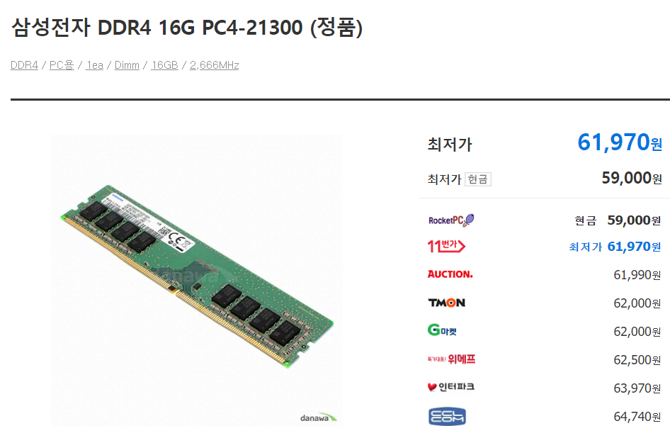
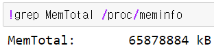
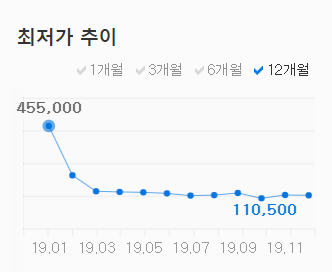
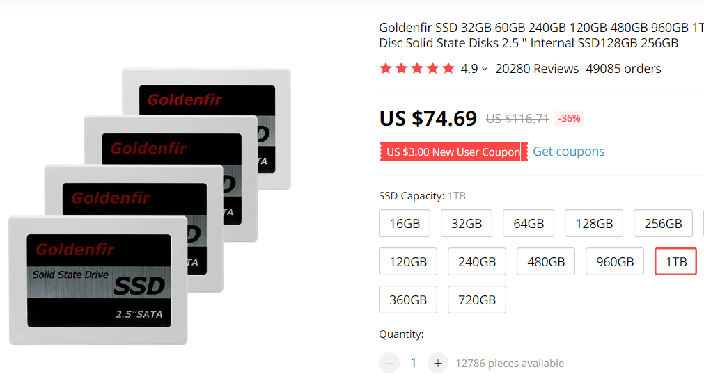
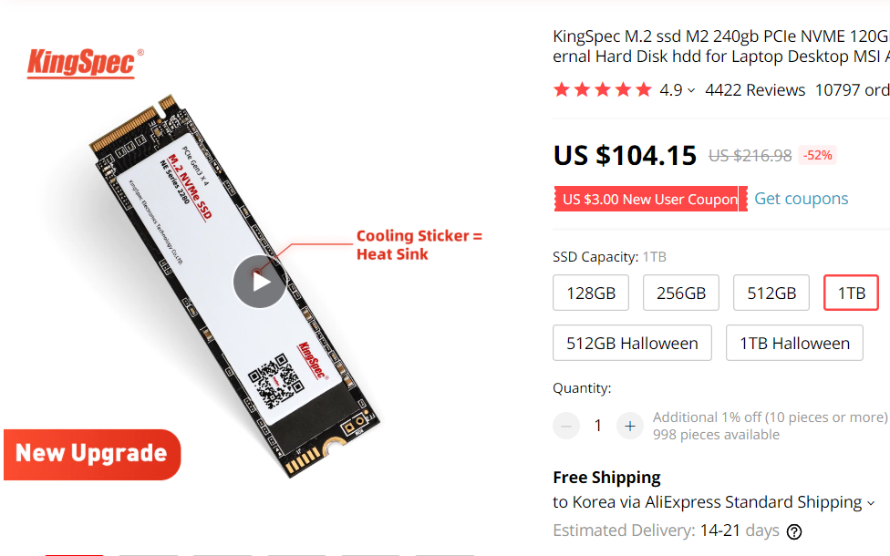

얼마 전,  개인용 딥러닝 서버에 문제가 생겨서 용산을 방문했습니다.

motherboard에 문제가 생겨서 교체하면서 이런 저런 얘기를 사장님과 나누었습니다.

그러다가 사장님께서,

**"그런데 메모리는 더 늘리실 계획이라면, 지금 바로 구매하세요!** 라고 하셨습니다.

뭐 또 영업이겠거니 했습니다만, 문득 학습을 돌릴때 종종 데이터 셋 사이즈가 클 때 가끔 kernel이 다운되는 경우가 있었는데, 메모리 부족이었나? 싶기도 했던 기억이 떠올랐습니다.

개인용 서버이지만, 그래도 CPU나 GPU 성능에 비해서는 조금 부족하다는 생각을 하긴 했었죠.

그래서, **"사장님, 요즘 메모리 가격이 얼만데요?"**라고 물었습니다.

그랬더니, 사장님께서 요즘 메모리 가격이 엄청 떨어져서 많이 싸다고 하셨는데, 발주 넣고 받아서 끼워주려면 시간이 걸리니 그냥 다나와에서 최저가에 구매해서 끼우라고 하시더군요. 그때서야 영업은 아니었구나 생각이 들었습니다.

## 진짜 메모리 가격이 똥값이 되었구나..

집에 오자마자 다나와부터 들어갔습니다.

[삼성전자 16G RAM 다나와]([http://prod.danawa.com/info/?pcode=5941995&keyword=%EB%A9%94%EB%AA%A8%EB%A6%AC%2016G&cate=112752](http://prod.danawa.com/info/?pcode=5941995&keyword=메모리 16G&cate=112752))

삼성전자 **16G RAM** 가격이 무려 **60,000원 초반**선이더군요. 올해 초 (2019년 1월)에는 평균 가격이 약 118,000원이었는데 말이죠.

> 삼성전자 DDR4 16G 메모리 가격

> 삼성전자 DDR4 16G 가격 추이 (지난 12개월)

2개를 구입해서 32G를 늘려주는 비용이, 12만원선이면 가능하다는 얘기입니다.

뭐, RAM추가를 안할 이유가 없는 가격입니다. RAM은 역시 다다익램이죠.

## 12만원 투자? 할만하다!!

배송을 하고 motherboard에 꽂아 주니 바로 잡힙니다.

32G -> 64G로 늘려주었는데,

제가 사용하는 motherboard (ASUS X399)는 RAM을 무려 8개까지 꽂을 수 있습니다.

16G로 다 꽂아준다면 128G까지 늘어나겠네요.

솔직히 왠만한 데이터셋 로딩은 무리 없이 한 방에 로딩할 수 있습니다.

사실 GPU에 올려서 학습을 시키기 위해서는 GPU를 병렬로 확장하는 것도 중요하지만, 돈이 없기에 일단 패쓰...

## 메모리 Market 썰

지금 전세게 DRAM 가격이 아주 곤두박질 쳤습니다. 그래서 올 해 삼성전자 영업익이 줄어든건가 싶네요. 반도체 호황일 때는 엄청 팔아제끼더니 말이죠. 물론 판매량은 잘 모르겠으나, 줄어든 마진으로 인해 영업익이 많이 타격을 받았을 것이라고 생각합니다. 

(제가 삼성전자 주주여서 그런건 아니지만) 삼성전자는 이렇게 DRAM가격이 떨어질 때 타격을 많이 받지만, DRAM 치킨게임에서 진정한 승자는 이런 메모리 가격이 떨어지는 불황에서 나온다는 말을 들은 것 같습니다. 탄탄한 자본력과 기술력이 뒷받침 되지 않은 기업들은 이러한 불황때 나가떨어진다는 거겠죠?

2019년도 3Q기준 **삼성전자가 약 45.7%, SK하이닉스가 28.7%, 그뒤를 micron이 20.5%**를 차지하고 있습니다. 대한민국 기업이 전세계 시장의 무려 3/4 가까이 점유율을 차지하고 있다는 것이 한 편으로는 자랑스럽네요.

## 지금 사세요, Memory

글을 작성하다보니, 메모리 영업맨의 광고글 같이 되어버렸지만, 어쨌든 모두가 아는 진리는 역시 **다다익램**입니다. 데스크톱 PC를 사용하시는 분들은 지금 같이 메모리가 똥값이 되었을 때 RAM을 늘려 놓는다면, 후회할 일은 없을 것 같습니다. 내년에는 DRAM 가격이 왠지 오를 것 같기도 하고요. (더 떨어지면 더 사서 늘려야겠죠?^^)

RAM 뿐만아니라, 전체적인 Memory가격이 떨어진 것이기 때문에 SSD 가격도 엄청 떨어졌습니다.

**놀라지 마세요. SSD 가격은 무려 1/4토막 났습니다**

> 삼성전자 970 evo plus M.2 SSD 가격 추이 (지난 12개월)

아! 물론 신제품 출시 가격이 후 시간이 지남에 따라 가격이 감소한 탓도 있습니다.

근데 SSD 가격이 (그것도 무려 evo plus 모델이) 12만원선이면 지를만 한 가격 아닌가요?

얼마 전 AliExpress에서 Goldenfir사의 **SSD 1TB가격이 $75**..(역시 대륙, 미친 가성비죠)

[구매링크](https://www.aliexpress.com/item/32657147484.html?spm=a2g0o.productlist.0.0.474b21a36QtMIx&algo_pvid=d277467b-4035-4d42-a087-3d2d8d348945&algo_expid=d277467b-4035-4d42-a087-3d2d8d348945-0&btsid=3169f0e7-81e7-460f-827a-51ae62253c0a&ws_ab_test=searchweb0_0,searchweb201602_4,searchweb201603_55)

*(참고로, 품질에 대한 보장이란건 없어요. 이런 제품을 무조건 구매할 때 가성비보고 하는거죠. 중요한 서버에 SSD를 달아야할 때는 신중하게 고민해보시고 구매하셔야 합니다. 저는 안정성이 매우 중요하기 때문에, 삼성전자 SSD 제품을 추천합니다.)*

심지어 order의 수량도 엄청 많고 review도 좋습니다. 저거 사서 SSD를 외장하드처럼 사용하게 해주는 소켓 끼워주면 SSD 외장하드 1TB 짜리가 되는 겁니다. 

SSD M.2 형으로 찾고 계신다면,  KingSpec사의 SSD를 보시면 좋을 것 같습니다. 물론 2.5 SATA보다는 가격이 조금 높지만, 그래도 1TB가 $104.15이면 미친 가성비라고 볼 수 있죠. (여기에 쿠폰 먹이면, $100 아래로 노려볼 수 있습니다)

[구매링크](https://www.aliexpress.com/item/32847169083.html?spm=a2g0o.productlist.0.0.474b21a36QtMIx&algo_pvid=d277467b-4035-4d42-a087-3d2d8d348945&algo_expid=d277467b-4035-4d42-a087-3d2d8d348945-4&btsid=3169f0e7-81e7-460f-827a-51ae62253c0a&ws_ab_test=searchweb0_0,searchweb201602_4,searchweb201603_55)

## 마치며..

서버에 RAM을 늘리게 되면서, 요즘 참 Memory 싸다라는 생각이 먼저 들었습니다. 뭐 좀 기다렸다가 더 떨어지면 살래 라고 하시는 분들도 괜찮은 선택이구요~ 조만간 SSD도 구매각을 좀 봐야겠습니다.

