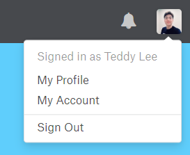
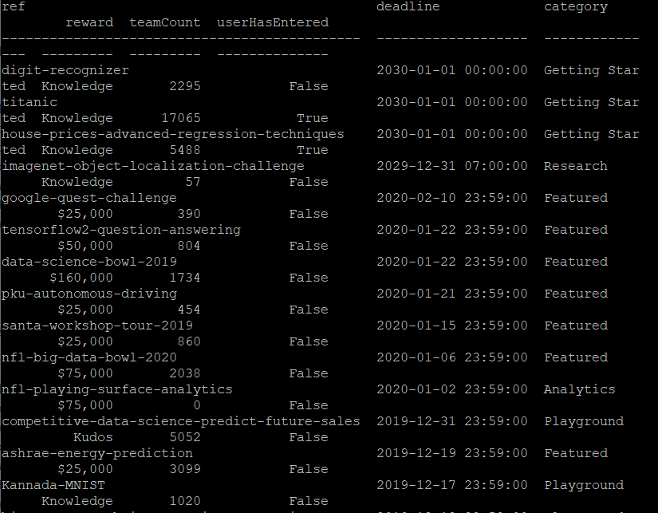
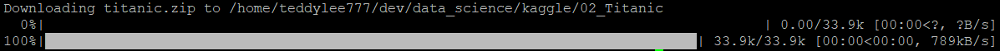
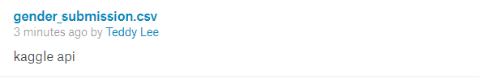

local 환경의 jupyter notebook 에서 작업을 한 뒤 Kaggle에 제출할 때면, 다음과 같은 상황마다 번거로운 순간들이 있습니다.

* Dataset을 다운로드 한 뒤 특정 폴더에 저장
* submission 파일을 csv로 내보내기 한 뒤 Kaggle에 업로드


오늘은 Kaggle API를 활용하여 이러한 과정들을 생략할 수 있는 방법과 submission 파일을 바로 제출까지 할 수 있는 방법에 대하여 알려드리고자 합니다.

설정에 앞서 자세한 내용은 [Kaggle Official Github](https://github.com/Kaggle/kaggle-api)에서도 확인하실 수 있습니다.


## Kaggle API 설치

Kaggle API 설치는 pip 패키지로 인스톨해주시면 됩니다. (현재 최신 버전 kaggle 1.5.6)

자세한 description은 [링크](https://pypi.org/project/kaggle/)에서 확인하실 수 있습니다.

```python
pip install kaggle --upgrade
```


## Kaggle API Token 다운로드 (.json 파일)

먼저 Kaggle에 로그인 한 뒤 Account로 접속합니다. 

바로 접속할 수 있는 주소는 다음과 같으며, `username`만 치환해 주신 뒤 접속하시면 됩니다. (혹은, 우측 상단에 프로필 사진을 클릭한 뒤 My Account를 틀릭하시면 됩니다.)


> My Account 접속 주소

`https://www.kaggle.com/<username>/account`




Kaggle 에서 Account에 들어가신 다음에 조금 아래로 내려보면, **Create New API Token**이 있습니다.

> Token을 생성합니다. kaggle.json 파일이 다운로드 됩니다.


## 다운로드 받은 kaggle.json 파일을 이동

다운로드 받은 kaggle.json 파일을 각 os별로 해당 위치로 이동시켜 줍니다.

**Windows**

`C:\Users\<Windows-username>\.kaggle\kaggle.json`

**Mac OS / Linux (Unix-based)** 

`~/.kaggle/kaggle.json`


> [필수 X] 보안을 위하여 다음과 같이 권한을 변경해 줄 수 있습니다.

```bash
chmod 600 ~/.kaggle/kaggle.json
```


## Command 살펴보기

Kaggle API는 다음과 같은 command를 지원합니다.

```bash
kaggle competitions {list, files, download, submit, submissions, leaderboard}
kaggle datasets {list, files, download, create, version, init}
kaggle kernels {list, init, push, pull, output, status}
kaggle config {view, set, unset}
```


## 진행중인 Competition List 살펴보기

다음의 command line 명령어로 진행중인 kaggle competition의 리스트를 확인하실 수 있습니다.

```bash
kaggle competitions list
```




## 데이터셋 다운로드 하기

Titatic 생존자 예측 경진대회의 데이터셋을 Kaggle API를 통해 다운로드 받아보도록 하겠습니다.

우선, Titanic 경진대회 - Data 탭으로 접속합니다.

[바로가기](https://www.kaggle.com/c/titanic/data)


중간쯤에 친절하게 Kaggle API로 데이터를 받을 수 있는 Command Line 명령어를 알려줍니다. 바로 복사해준 뒤 터미널에서 입력해줍니다.


그런 다음 먼저 내가 **데이터셋을 받고자 하는 디렉토리로 이동한 뒤** 위에서 copy한 명령어를 입력해 줍니다.


> Titanic 데이터셋 다운로드

```bash
kaggle competitions download -c titanic
```



금방 다운로드가 받아졌습니다. 다운로드 받은 titanic.zip 파일의 압축을 풀어줍니다.

압축을 풀어주니 train.csv, test.csv, submission.csv 파일이 생겼습니다.


## 제출하기 (Submission API)

제출하는 방법도 어렵지 않습니다.

우선, competition의 submit 주소로 이동합니다. Titanic의 경우 https://www.kaggle.com/c/titanic/submissions 주소가 됩니다. (My Submissions 를 클릭하여 이동하여도 좋습니다)


위 사진처럼 Command Line 명령어를 친절하게 안내하고 있습니다. 이를 복사해줍니다.


내가 제출할 .csv 파일이 있는 디렉토리로 이동한 뒤, 위에서 복사한 명령어를 입력해주면 제출하게 됩니다. 하지만, 여기서 주의해야할 점은,

1. -f 옵션 뒤에는 **내가 제출할 .csv file 이름**을 적어야 합니다.
2. -m옵션 뒤에는 제출할 때 간단한 message를 남길 수 있습니다. 


`Successfully submitted to Titanic: Machine Learning from Disaster(kaggle)` 메세지와 함께 성공적으로 제출되었음을 확인할 수 있습니다.




그리고, My Submissions를 refresh 해보시면 내가 기록한 message와 함께 정상적으로 제출되었음을 확인하실 수 있습니다.

<br>

<br>

이제 더 이상 파일을 드래그 앤 드롭으로 제출하는 번거로움은 더 이상 없습니다.

