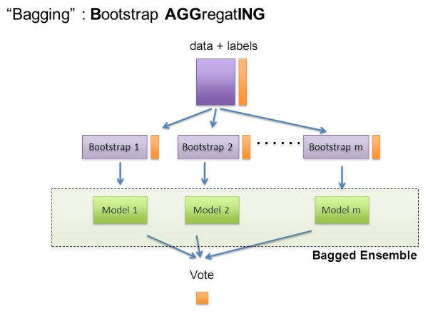

Bagging 기반의 앙상블(ensemble) 기법은 이미 널리 사용되고 있는 랜덤포레스트(RandomForest) 알고리즘이 바로 그 대표적인 예 입니다.

**왜 일까요?** 

이유는,

1. sklearn 라이브러리에 이미 구현이 잘 되어 있어서 사용하기 쉽다.
2. 비교적 빠른 수행 속도가 나온다.
3. **성능**이 생각보다 잘 나온다.

라고 요약해 볼 수 있겠습니다.

이전, [앙상블 학습(ensemble learning)으로 알고리즘 성능 개선하기(1) - Voting](https://teddylee777.github.io/machine-learning/ensemble기법에-대한-이해와-종류-1) 글에서도 이미 말씀드렸지만, 앙상블 기법 자체가 성능을 기본적으로 끌어올리는 효과가 있는데다가 사용하기가 쉬우니 매우 널리 쓰이게 되었습니다. Kaggle에서 상위 솔루션에서도 심심치 않게 확인할 수 있습니다.

## Bagging 이란

Bagging은 **Bootstrap Aggregating**의 줄임말입니다.

Bootstrap = Sample(샘플)

Aggregating = 합산

이라고 풀이할 수 있겠습니다.

**Bootstrap**은 여러 개의 **dataset을 중첩을 허용하게 하여 샘플링하여 분할하는 방식**을 말합니다.

대표적인 Bagging 방식의 알고리즘인 RandomForest를 예를 들어 설명해 보겠습니다.

Decision Tree가 여러개 생성되게 되고, 각기 다른 dataset을 샘플링하게 되는데 중첩되는 dataset을 허용합니다.

데이터 셋의 구성이 [1, 2, 3, 4, 5 ]로 되어 있다면,

* group 1 = [1, 2, 3]

* group 2 = [1, 3, 4]

* group 3 = [2, 3, 5]

로 구성된다고 말할 수 있겠습니다.

이러한 방식을 Bootstrap 방식이라고 부르며, 각기 다른 샘플링을 통해 학습한 각각의 Tree들이 최종 예측 결과를 Classification (분류) 의 문제에서는 투표를 통해 결정하게 됩니다. 

Regression (회귀) 에서는 각각 도출해낸 값의 평균을 산출해내는 방식을 취하고 있습니다.

출처: https://medium.com/@rrfd/boosting-bagging-and-stacking-ensemble-methods-with-sklearn-and-mlens-a455c0c982de

## Bagging과 Voting이 다른 점은?

Bagging 기법과 Voting 기법의 가장 큰 **차이점**은 바로 **하나의 단일 알고리즘을 여러 개를 사용하는 방식**인지, 아니면 **다양한 알고리즘을 동일한 샘플 dataset에 적용하는 방식**인지에 그 차이가 있습니다.

Bagging 기법은 보통 단일 알고리즘에 서로 다른 샘플링된 dataset을 학습한 뒤, 이에 대한 투표로 결정하는 방식입니다. 비교적 Voting기법보다 사용성이 좋다는 말은 바로 단일 알고리즘을 사용하기 때문에, 단일 알고리즘에 대한 hyperparameter만 잘 해주면 됩니다. 

다시 RandomForest 알고리즘을 예로 든다면, 얼마나 많은 Tree를 사용할 것인지 (n_estimators), max_depth (최대 깊이), min_samples_leaf (최소 분할할 샘플 갯수) 등등 몇 가지 hyperparameter만 설정해주면 되기 때문에 주로 Baseline 점수를 잡기에 적절합니다.

## Bagging 앙상블의 장점?

Bagging 기법을 활용하며 단일 model을 활용하여 prediction (예측)을 했을 때보다 variance를 줄이는 효과를 볼 수 있습니다. model의 학습 오류는 대부분 3가지 주요 원인으로 볼 수 있는데, 바로 분산, 노이즈, 그리고 bias 입니다. (물론 overfitting/underfitting 그리고 다양한 전처리 이슈들이 더욱 중요하게 다뤄지지만 그 부분들은 setting이 되었다고 가정하겠습니다)

앙상블을 통해 분산을 줄여 최종 결과물의 성능을 올릴 수 있습니다.

## sklearn.ensemble.BaggingClassifier / BaggingRegressor

sklearn 라이브러리 패키지에서 BaggingClassifier/BaggingRegressor라는 wrapper 클래스를 제공해 줍니다.

bese_estimator 파라미터에 base가 되는 알고리즘을 지정해 주면 BaggingClassifier/BaggingRegressor를 통해 Bagging 앙상블을 수행할 수 있습니다.

자세한 내용은 공식문서에서 확인할 수 있습니다.

* [BaggingClassifier](https://scikit-learn.org/stable/modules/generated/sklearn.ensemble.BaggingClassifier.html)

* [BaggingRegressor](https://scikit-learn.org/stable/modules/generated/sklearn.ensemble.BaggingRegressor.html#sklearn.ensemble.BaggingRegressor)

