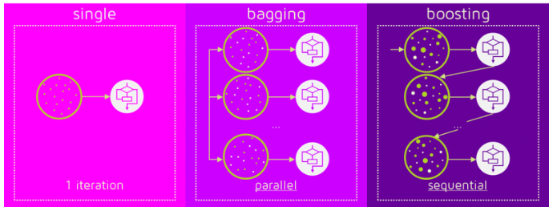
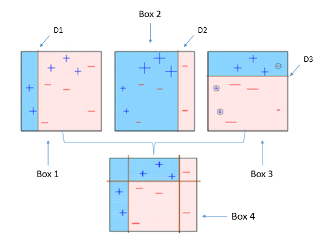

Boosting 알고리즘 역시 앙상블 학습 (ensemble learning)이며, 약한 학습기를 순차적으로 학습을 하되, 이전 학습에 대하여 **잘못 예측된 데이터에 가중치를 부여해 오차를 보완**해 나가는 방식입니다.

다른 앙상블 기법과 가장 다른 점중 하나는 바로 순차적인 학습을 하며 weight를 부여해서 오차를 보완해 나간다는 점인데요. 순차적이기 때문에 병렬 처리에 어려움이 있고, 그렇기 때문에 다른 앙상블 대비 **학습 시간이 오래걸린다는 단점**이 있습니다.

> Single estimator, Bagging, Boosting

이미지 출처: [QuantDare](https://quantdare.com/what-is-the-difference-between-bagging-and-boosting/)

## AdaBoost (Adaptive Boosting)

대략적인 개요는 위에서 언급하였다시피 약한 학습기를 순차적으로 학습하면서 잘못 예측된 데이터에 가중치를 부여해 나가며 오차를 보완한다고 하였습니다. 

대표적인 Boosting 알고리즘 중 하나인 AdaBoost (Adaptive Boosting) 은 타이틀에서도 알 수 있듯이, adaptive (적응) 한 부스팅 기법입니다.

> AdaBoost 원리

1. Box 1은 먼저 약한 학습기가 D1이라는 섹터로 분류한 결과 입니다. 하지만, 아직 빨간 영역에 +라고 표기된 데이터 셋이 분포되어 있어 오차율이 꽤 높은 편입니다.
2. Box 2는 D2 라인이 이전 Box 1에서 오차율을 보완하기 위하여 우측으로 이동한 모습입니다. 이번에는 -라고 표기된 데이터 셋이 Blue 영역에 분포되어 있어 이전보다는 성능이 좋아졌지만, 아직 만족할만한 수준은 아닙니다.
3. Box 3는 D3 라인이 윗 상단에 horizontal하게 그려졌습니다. 하지만 -로 표기된 데이터셋이 잘 못 분류되어 있는 것을 확인할 수 있습니다.
4. Box 4는 이전 Box 1, Box 2, Box 3의 학습을 수행하면서 가장 이상적인 조합을 찾습니다. 이전 3개의 개별 학습기보다는 훨씬 성능이 올라갔음을 확인할 수 있습니다.

그럼 결합할 때 가중치를 부여한다는 말은 도대체 어떻게 부여한다는 의미일까요?

예를 들면, 

* Box 1의 성능에는 weight = 0.2
* Box 2의 성능에는 weight = 0.5
* Box 3의 성능에는 weight = 0.6

을 부여하겠다고 가정을 한다면,

**0.2 * Box 1 + 0.5 + Box 2 + 0.6 * Box 3 = Box4**

의 수식으로 표현해 볼 수 있습니다.

## Gradient Descent (경사 하강법)

Boosting 기법의 **핵심은 이전 학습에서 오차를 보완**해나가는 방식이라고 하였습니다.

AdaBoosting 기법과 Gradient Descent 기법이 조금 다른 점은 바로 오차를 보완해 나가는 방식입니다.

내가 예측한 값과 실제 데이터와의 차이를 미분을 통해 최소화 해 나가는 방식입니다.

* weight = 가중치
* input_data = feature data (인풋 데이터)
* bias = 편향
* Y_actual = 실제 데이터의 값
* Y_predict = 내가 예측한 값
* Loss = 오차율

라고 정의해 보겠습니다.

**Y_predict = weight * input_data + bias**

위 공식으로 예측 값들을 구할 수 있겠고, 실제 데이터 와의 차이를 구해보면 전체 오차율이 나올 수 있게됩니다.

**Loss = Y_predict - Y_actual**

(Root Mean Square Error, Mean Absolute Error 등등 오차율을 정의하는 함수식은 다양하지만 쉬운 설명 편의상 위와 같이 정의해보겠습니다)

바로 이 **Loss를 0에 가깝게 만드는 weight를 찾는 것이 Gradient Descent의 핵심**입니다.

weight를 찾는 방법은 편미분을 통해 찾을 수 있게 되는데, 더욱 자세한 설명은 [경사감소법(경사하강법)이란?](https://bskyvision.com/411) 블로그를 참조하시면 좋습니다.

## GBM (Gradient Boosting Machine)

앞서 말씀드린 Gradient Descent를 통하여 Boosting하는 알고리즘이 Gradient Boosting Machine이며, 줄여서 GBM이라고 합니다. sklearn 패키지에서도 친절하게 구현이 되어 있고, classification / regression에 모두 적용가능합니다.

* [GradientBoostingClassifier](https://scikit-learn.org/stable/modules/generated/sklearn.ensemble.GradientBoostingClassifier.html)
* [GradientBoostingRegressor](https://scikit-learn.org/stable/modules/generated/sklearn.ensemble.GradientBoostingRegressor.html)

실제 적용하는 것은 매우 간단합니다.

하지만, GBM의 꽃은 바로 캐글에서 가장 사랑받는 2가지  ML 패키지인 [XGBoost](https://xgboost.readthedocs.io/en/latest/)와 [LightGBM](https://lightgbm.readthedocs.io/en/latest/)입니다.

XGBoost와 LightGBM은 기존 sklean에서 제공되는 패키지는 아닙니다. 하지만, 나중에 sklearn wrapper 클래스를 만듦으로써 기존 sklearn 패키지의 ML 클래스처럼 fit & predict로 손쉽게 활용할 수 있게 되었습니다.

(XGBoost와 LightGBM은 이번 주제에 모두 설명하기에는 내용이 많으므로 추후 포스팅에서 다루도록 하겠습니다)

