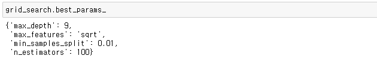

Hyperparameter 튜닝을 위해서는 다양한 방법론이 존재합니다. 가장 쉬운 방법으로는 일명 **손튜닝**이 있을 수 있겠구요. **RandomSearch, GridSearch, HyperOpt**등 다양한 방법으로 Hyperparameter를 튜닝할 수 있습니다.

그럼, Hyperparameter 튜닝을 할 때 위에 언급한 방법론들을 적용하는 이유는 뭘까요?

답은 매우 간단합니다.

사람이 직접 손튜닝을 하다보면, 실수를 할 수도 있고, 시간과 정신적 소모가 매우 큽니다.

우리는 우리가 가진 훌륭한 컴퓨터 자원을 활용하여 Hyperparameter를 찾아가는 과정을 자동화하고, 우리가 잠이 든 사이 컴퓨터는 **Best Parameter**를 우리에게 제시해 줍니다.

그 중 이번 포스팅에서는 가장 많이 활용되고 있는 GridSearch에 대하여 알아보고 이를 통해 Hyperparameter의 Best Parameter를 찾는 과정을 알려드리도록 하겠습니다.


## GridSearch?

GridSearch 는 우리가 지정해준 몇 가지 **잠재적 Parameter들의 후보군들의 조합 중에서 가장 Best 조합을 찾아줍니다**. 어떻게 보면 우리가 하나하나 대입해 가면서 loss를 확인하는 작업을 GridSearch는 대신 해준다고 보면 됩니다. 또한, sklearn 패키지에서 제공해주고 있기때문에 매우 손쉽게 사용할 수 있습니다. 

하지만, 가장 큰 단점은 우리가 지정해 준 hyperparameter 후보군의 갯수만큼 비례하여 시간이 늘어기 때문에 **최적의 조합을 찾을 때까지 시간이 매우 오래 걸린다는 단점**이 있습니다.


## GridSearch 활용 예제

GridSearch는 sklearn 패키지의 `model_selection`에 있습니다.

```python
from sklearn.model_selection import GridSearchCV
```


찾고자 하는 **parameter를 먼저 정의**해줍니다. dict로 정의해줄 때 반드시 parameter명은 `string`값으로 지정해 줍니다. 또한, parameter에 적용할 값들은 list형태로 정의합니다.

> GridSearch가 찾을 parameter를 정의

```python
param_grid = {
    'n_estimators': [100, 150, 200, 250],
    'max_depth': [None, 6, 9, 12],
    'min_samples_split': [0.01, 0.05, 0.1],
    'max_features': ['auto', 'sqrt'],
}
```


그 다음, 우리가 적용할 **estimator (모델)를 정의**합니다.

```python
estimator = RandomForestRegressor()
```


다음으로는 평가지표인 `cross validation`을 지정해 주어야하는데, **int값으로 넘겨줄 수 도 있고**, 내가 정의한 **Fold를 넘겨줄 수 도 있습니다**.

```python
from sklearn.model_selection import KFold

kf = KFold(random_state=30,
           n_splits=10,
           shuffle=True,
          )
```


이제 GridSearch를 실행해 주면 됩니다. n_jobs=-1로 지정해주면 모든 코어를 다 사용하기때문에 컴퓨터는 뜨거워지겠지만, 속도는 많이 빨라집니다. verbose로 log 출력의 level을 조정 (숫자가 클 수록 많은 log 출력) 해 줄 수 있습니다.

```python
# define grid_search
grid_search = GridSearchCV(estimator=estimator, 
                           param_grid=param_grid, 
                           cv=kf, 
                           n_jobs=-1, 
                           verbose=2
                          )

# fit with (x_train, y_train)
grid_search.fit(x_train, y_train)
```


> Best Parameter의 결과값 확인

```python
grid_search.best_params_
```




