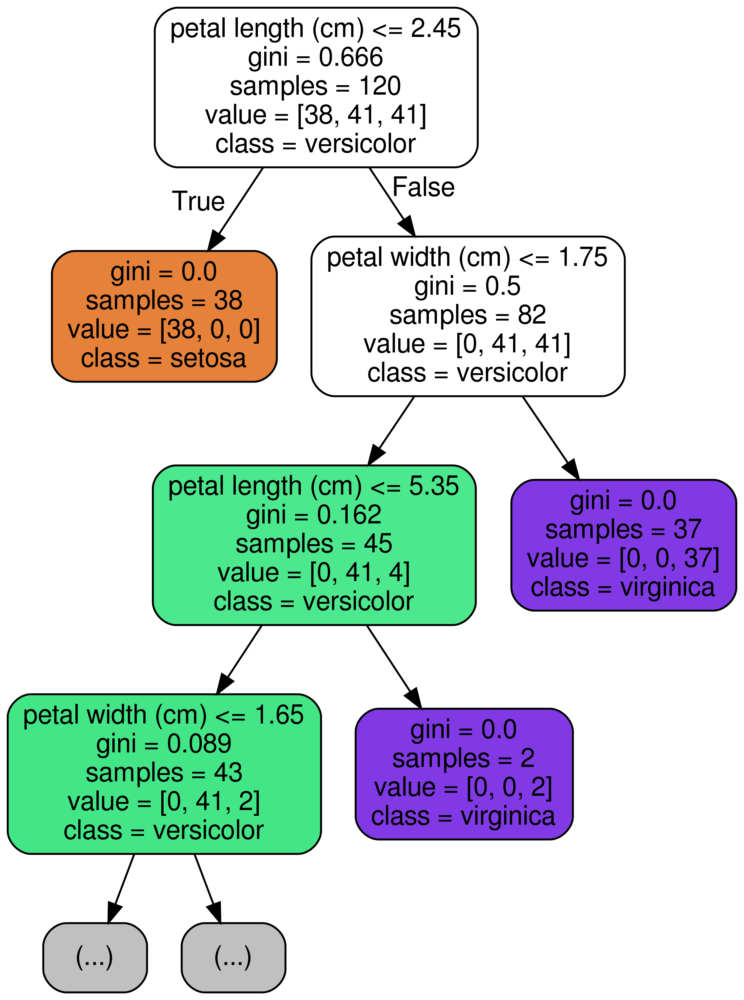
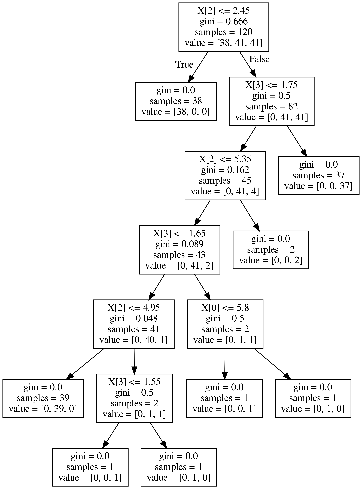

Tree 기반 모델은 RandomForest 모델때문에 참 인기있게 활용되는 알고리즘 입니다. RandomForest 모델은 데이터 분석 대회인 캐글에서도 활발히 활용되고 있으며, 성능이 좋을 뿐만아니라 쉽고 간편하게 사용할 수 있기 때문에 저 또한 데이터 분석 대회에서 baseline 점수를 잡을 때 많이 활용하고 있습니다.

또한, 분류나 회귀 모델에 모두 적용해 볼 수 있다는 것도 Tree모델의 큰 장점중에 하나입니다.

Tree 모델은 **참/거짓** 으로 가지치기를 하는 한마디로 스무고개식 분류라고 볼 수 있습니다.



위 의 그림에서 보시다시피, node (가지) 마다 sample을 특정 기준에 따라 왼쪽 가지 / 오른쪽 가지로 분할합니다. 예를 들면, 첫 번째 가장 뿌리가 되는 node (root node) 에서는 **petal length (cm) <= 2.45**  를 기준으로 먼저, 분할한 것을 볼 수 있습니다. 이렇듯 우리가 단순히 Tree 모델을 돌려보고 끝내는 것이 아니라, 세부 parameter 조정을 위해서나 혹은 어떤 feature 를 기준으로 분할 하였는지 확인 해 보고 싶을 때 시각화를 할 수 있습니다. 그래서 오늘은 Tree Model이 분할을 할 때 어떤 기준으로 트리가 분할을 하였는지 **시각화** 해볼 수 있는 방법에 대하여 알려드리고자 하며, `graph_viz`라는 모듈을 통해 구현해보고, 세부 parameter에 대해서도 알려드리고자 합니다.

import를 하기 위해서는 sklearn의 tree 패키지 안에 있는 `export_graphviz` 를 불러와주면 됩니다.

```python
from sklearn.tree import export_graphviz
```


## DecisionTree

먼저, 시각화 해 보고자 하는 Tree 모델은 DecisionTreeClassifier입니다.

실습을 위해 간단한 샘플 코딩을 해보겠습니다. `iris` 붓꽃 데이터를 classification하는 간단한 코드입니다.

```python
# iris 데이터 로딩
from sklearn.datasets import load_iris
iris = load_iris()

# DecisionTreeClassifier
from sklearn.tree import DecisionTreeClassifier
model = DecisionTreeClassifier()

# Define x and y
x_train, x_test, y_train, y_test = train_test_split(iris.data, iris.target, test_size=0.2, random_state=30)

# Train
model.fit(x_train, y_train)

# Predict
pred = model.predict(x_test)

# Accuracy
(pred == y_test).mean()

# 0.9666666666667
```


자 이제, 시각화를 위한 샘플 코드 작성은 끝났습니다. 정확도도 꽤 좋습니다. 96.67%정도 나왔네요.


## export_graphviz

위에 샘플코드에서 `model`에 대한 학습은 끝이 난 것을 볼 수 있습니다. 그럼 model이 어떠한 기준으로 iris 데이터를 나누었는지 드디어 시각화를 해볼 차례입니다.

```python
from sklearn.tree import export_graphviz

# .dot 파일로 export 해줍니다
export_graphviz(model, out_file='tree.dot')

# 생성된 .dot 파일을 .png로 변환
from subprocess import call
call(['dot', '-Tpng', 'tree.dot', '-o', 'decistion-tree.png', '-Gdpi=600'])

# jupyter notebook에서 .png 직접 출력
from IPython.display import Image
Image(filename = 'decistion-tree.png')
```





그려보시면, 위와 같이 시각화가 되어서 보여집니다. `gini`계수, `samples`의 숫자 그리고 `value`가 보이네요.

우선 꼭 짚고 넘어갈 계수는 `gini`계수 입니다. 지니 불순도라고 불리우는 계수이며, 얼마나 다양한 class의 샘플들이 섞여 있는지를 나타내주는 계수입니다. 쉽게 말해서 온갖 잡 것들이 한 곳에 뭉쳐 있다면 **gini 계수의 크기가 큽니다** .반대로,  1개의 class만이 존재 한다면 **gini=0.0**이 됩니다. 그래서 tree node의 맨 밑 노드를 보시면 gini=0.0이라고 나와있는데, 이것이 바로 그 의미 입니다.

`sample`은 말 그대로 해당 node의 **sample 갯수**를 의미합니다.


다음과 같이 feature_names 와 class_names를 지정해 주면 더욱 깔끔하고 보기 쉽게 출력됩니다.

분류되는 class를 value 대신 class로 표기되는 것을 보실 수 있습니다.

```python
# .dot 파일로 export 해줍니다
export_graphviz(model, 
                out_file='tree.dot',
                feature_names = iris.feature_names,
                class_names = iris.target_names,
               )
```


```python
from sklearn.tree import export_graphviz
# Export as dot file
export_graphviz(model, out_file='tree.dot', 
                feature_names = iris.feature_names,
                class_names = iris.target_names,
                max_depth = 3, # 표현하고 싶은 최대 depth
                precision = 3, # 소수점 표기 자릿수
                filled = True, # class별 color 채우기
                rounded=True, # 박스의 모양을 둥글게
               )
```


## RandomForest에서는?

RandomForestClassifier는 ensemble tree 모델이기 때문에 여러 트리 중의 1개를 골라서 출력하면 됩니다.

```python
from sklearn.ensemble import RandomForestClassifier

model = RandomForestClassifier()
model.fit(x_train, y_train)


estimator = model.estimators_[3]

export_graphviz(estimator, out_file='tree.dot', 
                feature_names = iris.feature_names,
                class_names = iris.target_names,
                max_depth = 3, # 표현하고 싶은 최대 depth
                precision = 3, # 소수점 표기 자릿수
                filled = True, # class별 color 채우기
                rounded=True, # 박스의 모양을 둥글게
               )
```


위와 같이 시각화보시면 아시겠지만, 이전에 `DecisionTreeClassifier`가 분류했던 기준과는 형태가 좀 다릅니다. 이렇게 시각화를 해보면 각각의 Tree가 어떤 기준으로 분류를 하였는지 직접 눈으로 확인해 볼 수 있습니다.


