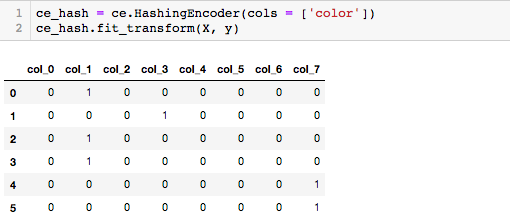
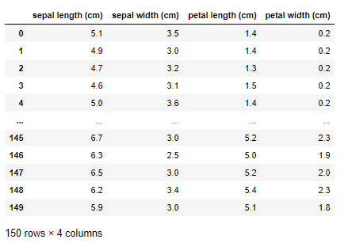
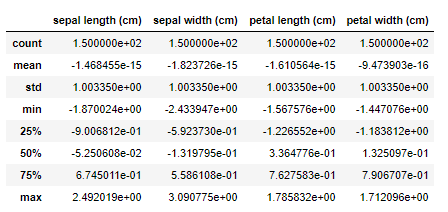
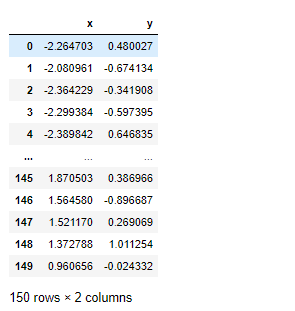
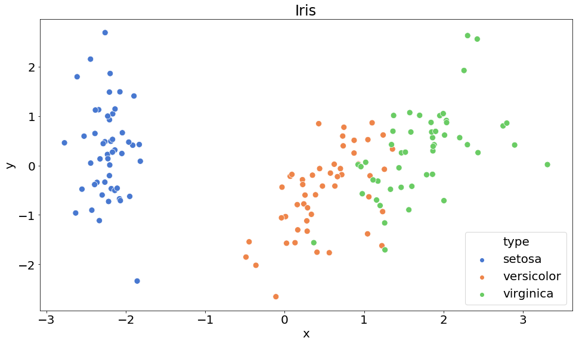
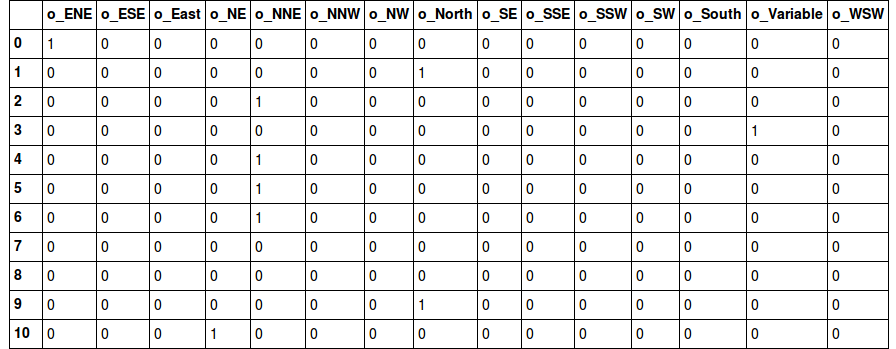

Principal Component Analysis는 대표적인 Linear 차원 축소 기법입니다. 

먼저, 차원 축소를 하는 경우는 **Data Sparsity** 때문에 많이 합니다. Data Sparsity라는 말은 데이터가 희소하다는  말인데, 데이터가 **1. 희소하다는 의미**는 무엇이고, **2. 차원 축소와 데이터의 희소성**과는 어떤 연관성이 있는지 먼저 살펴볼 필요가 있습니다.


## Data Sparsity (데이터 희소성)과 그에 따른 문제

**데이터가 희소하게 분포되어있다라는 의미**는,

매우 고차원 공간(100차원, 1000차원등)에 데이터가 흩뿌려져 있고, 데이터와 데이터 사이의 공간이 너무 넓은데다가, 공간 복잡도가 너무 크다보니, 머신러닝 알고리즘에 이런 **고차원의 데이터를 넣어봤자 예측 성능이 현저히 떨어지게** 됩니다.

예를 들자면, 

> 스마트폰을 분류하려고 합니다. 

그래서 스마트폰의 특성 (특성은 곧, feature 혹은 pandas 기준으로는 column으로 표현할 수 있겠습니다)을 정하기로 했습니다.

세상에 있는 모든 스마트폰을 분류하기 위해서는 우리는 약 100개의 특성을 정의 했습니다. (모양, os, 카메라스펙, 밝기, 가격 등등). 그리고 지구상의 모든 스마트폰은 정한 기준(특성)대로 분류를 했습니다. 정리된 데이터는 100개의 특성으로 정의를 했기 때문에 100차원 공간에 우리는 각각의 스마트폰을 표현할 수 있습니다.

그런데 충분히 많은 데이터가 100차원 공간안에 표현되었다면 그나마 다행이겠지만,

데이터가 1,000개 밖에 없는데 100차원 공간안에 표현되어 있다면 문제가 생깁니다.

접을 수 있는 스마트폰은  현재 지구상에 몇개 안되지만, 이 스마트폰의 특성을 표현하기 위해서 **접을 수 있는 특성**이 1차원 더 추가되어 있다면, 다른 수  만 가지의 스마트폰은 해당 특성에 대하면 0이 표기되어 있을 겁니다.

이렇게 **대부분이 0으로 채워진 column은 머신러닝 알고리즘의 성능 저하**를 일으킵니다. 그래서 우리는 대부분이 0으로 채워진 column이 몇 개 없다면, 해당 column을 단순히 제거해 주면 되는데, 대부분의 column이 0으로 채워져 있다면, **우리는 차원을 5~ 10차원으로 줄이는 작업을 통해 Data Sparsity 문제를 해결**할 수 있습니다.




[source: towardsdatascience](https://towardsdatascience.com/smarter-ways-to-encode-categorical-data-for-machine-learning-part-1-of-3-6dca2f71b159)

## PCA (Principal Component Analysis)

PCA 차원축소 방식은 수학적인 개념을 이해해야 합니다.

기존의 데이터셋에 공분산 행렬을 생성하고, 고유의 Vector와 값을 계산합니다.

그런 다음에 고유 값이 큰 순서대로 정렬 후 변환해야할 차원의 수 만큼 고유 값을 정한 뒤,

고유 Vector에 투영하여 차원을 축소하게 됩니다. 이 부분에 대해서는 **선형대수학 - 주성분분석(PCA)** 관련 글을 좀 더 자세히 읽어보실 것을 추천드립니다.


## scikit-learn의 PCA 활용

우리의 만능 친구 scikit-learn에서 역시 PCA를 제공해 줍니다. PCA 뿐만아니라, 다양한 차원 축소도 구현되어 있습니다. PCA의 활용을 보여드리기 위해서 `iris`데이터를 활용해 보도록 하겠습니다.


```python
import pandas as pd
from sklearn.datasets import load_iris

iris = load_iris()
print(iris.data.shape)
# (150, 4)

data = pd.DataFrame(iris.data, columns=iris.feature_names)
data
```




Data를 PCA에 바로 적용해보기 전에, `StandardScaler`로 데이터 Normalization을 해주도록 하겠습니다.


```python
from sklearn.preprocessing import StandardScaler

scaler = StandardScaler()
result = scaler.fit_transform(data)
data_scaled = pd.DataFrame(result, columns=iris.feature_names)
data_scaled.describe()
```



평균을 0, 표준편차를 1로 변환해주는 것이 `StandardScaler`입니다. 

이렇게 변경을 해주었다면, 이제 차원 축소를 위한 준비는 끝났습니다.


```python
from sklearn.decomposition import PCA

pca = PCA(n_components=2)
result = pca.fit_transform(data_scaled)

result = pd.DataFrame(result, columns=["x", "y"])
result
```



x, y의 2개 column으로 축소된 것을 볼 수 있습니다.


여기서, 차원 축소를 2차원으로 줄였기 때문에 기존 4 column일 때는 2D 공간위에 시각화가 불가능 했었는데,  2차원으로 **차원축소를 했기 때문에 이제 2D공간 위에 시각화**를 해볼 수 있습니다.

> 시각화를 위해서 class column을 추가해 주도록 하겠습니다

```python
target = pd.DataFrame(iris.target, columns=['type'])
target['type'] = target['type'].apply(lambda x: iris.target_names[x])
merged = pd.concat([result, target], axis=1)
```


```python
import matplotlib.pyplot as plt
import matplotlib as mlp
import seaborn as sns

%matplotlib inline

# font 정의
mlp.rcParams['font.size'] = 20
mlp.rcParams['font.family'] = 'Nanum Gothic'

# 시각화
plt.figure(figsize=(16, 9))
sns.set_palette(sns.color_palette("muted"))

sns.scatterplot(merged['x'], 
                     merged['y'], 
                     hue=merged['type'], 
                     s=100,
                     palette=sns.color_palette('muted', n_colors=3),
                    )
plt.title('Iris')
plt.show()
```




위와 같이 2D 공간위로 차원 축소를 해도 데이터가 잘 군집화되어 보여지는 것을 확인할 수 있습니다.

간혹 데이터 분석 대회에서 column이 엄청 많은 데이터인데 대부분이 0으로 채워졌다던가,

특히 one-hot-encoding을 한 뒤 대부분의 column이 0으로 채워진 상태라면 차원 축소를 고려해 볼 수 있습니다. 




[source: hackernoon](https://hackernoon.com/what-is-one-hot-encoding-why-and-when-do-you-have-to-use-it-e3c6186d008f)