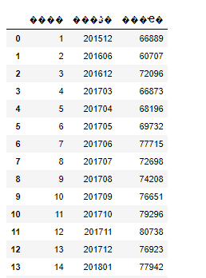
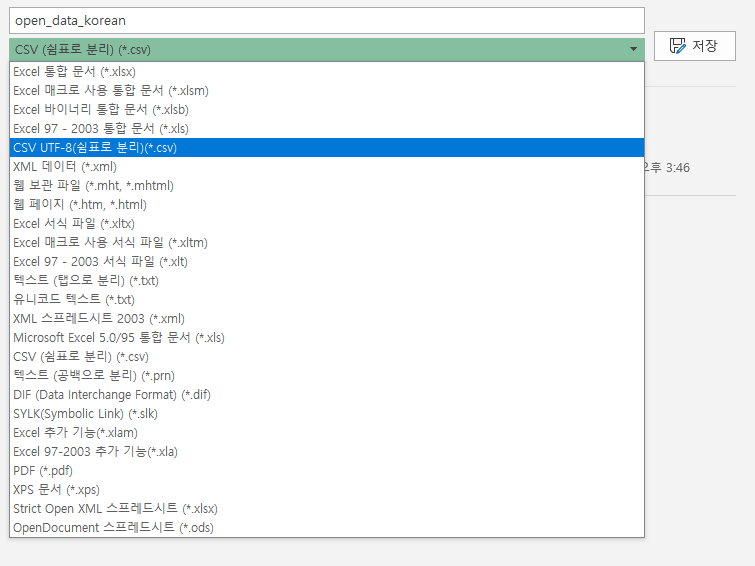
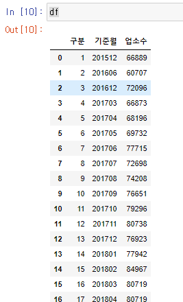
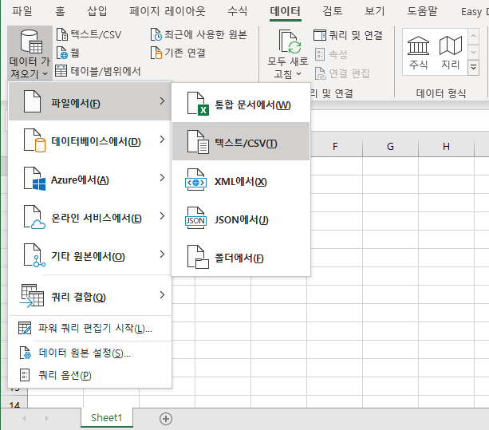
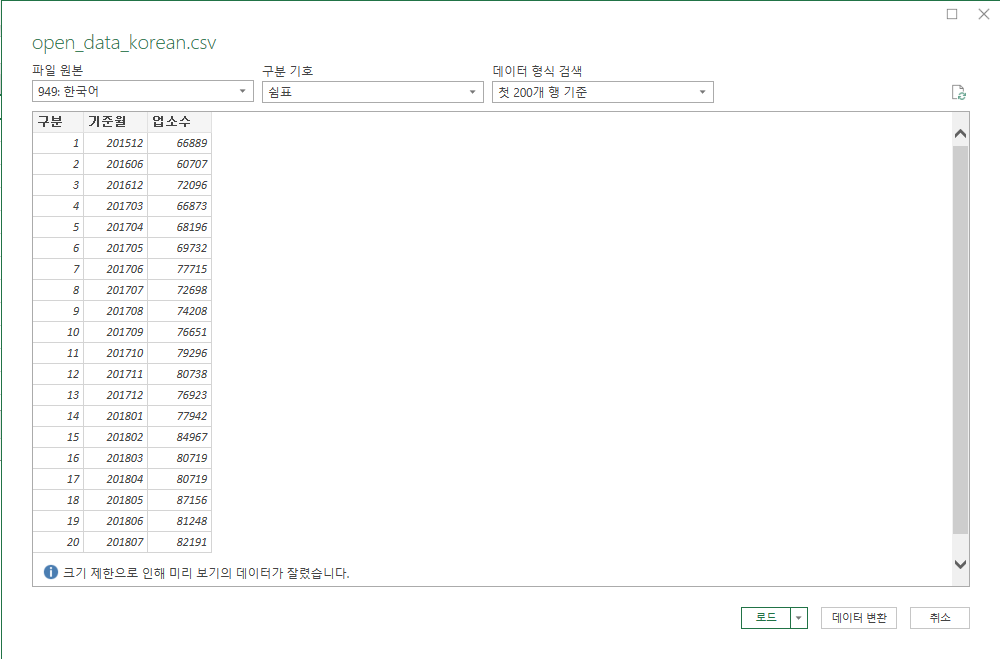
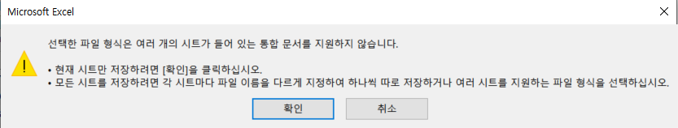
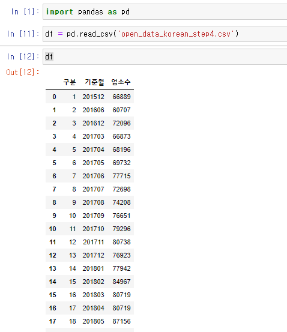

이번 포스팅에서는 공공데이터 포털에서 다운로드 받은 csv파일을 pandas에서 로딩할 때 **한글깨짐 현상**을 해결하는 방법에 대하여 알아보겠습니다.

한글 깨짐 현상을 해결하기 전에 영어는 아무 문제가 없지만, 한글 파일을 읽어올 때 왜 깨지게 되는지 알아야합니다.


## Encoding. 기본적인 이해

문자형 데이터는 컴퓨터가 인식을 하지 못하기 때문에 우리는 이것을 컴퓨터가 이해할 수 있도록 Bit 형태로 변형해야합니다. 

> 1Byte = 8Bit

Ascii 계열의 문자열은 0~127까지 표현되기 때문에 1Byte 안에 충분히 표현될 수 있습니다. 하지만, 한글은 Ascii 안에 표현이 불가하기 때문에 표현하기 위해서는 Byte가 충분히 더 필요합니다. 

인코딩은 한글과 같은 Ascii 범위를 벗어난 문자를 표현하기 위한 변형 작업이라고 이해하시면 쉽습니다. 하지만, 문제는 이러한 인코딩 방식이 여러가지 입니다.

모두가 하나의 인코딩을 사용하면 괜찮겠지만, 한글만 하더라도 대표적으로 Microsoft사에서 만든 `cp949`/`ms949` 인코딩, `euc-kr`인코딩, `utf-8` 인코딩등등 수많은 인코딩이 존재합니다.

즉, 인코딩이 동일하지 않기 때문에 파일이 만약 `cp949`로 인코딩이 되어 있다고 가정했을 때 이 파일을 `utf-8`인코딩 방식으로 읽어오려고 한다면, 잘못된 Byte 변환을 하기 때문에 깨짐 현상이 일어납니다. (인코딩에 대한 더욱 자세한 설명은 나중에 따로 포스팅 해보도록 하겠습니다)

어쨌든, 개발을 하든 데이터 분석을 하든 encoding 은 피할 수 없이 직면하게 되는 문제중 하나인데, 이러한 **최소한의 배경지식을 알고 있어야 나중에 문제 해결을 하기 훨씬 쉽습니다**.


## 공공데이터 파일의 Encoding

공공데이터 파일의 Encoding은 제발 `utf-8`방식으로 통일해 주었으면 좋겠지만, 거의 대부분 `cp949`나 `euc-kr`방식으로 인코딩 되어 있습니다.

이렇게 인코딩이 되어 있기 때문에 pandas 에서 `read_csv`를 하게 되면, 다음과 같은 에러를 뿜어냅니다.

```python
UnicodeDecodeError: 'utf-8' codec can't decode byte 0xb1 in position 0: invalid start byte
```


## 해결책 (1) - engine='python'

pandas에서 `read_csv` 옵션으로 engine을 python으로 지정해 주는 것입니다. 

```python
df = pd.read_csv('open_data_korean.csv', engine='python')
```

이렇게 해주면, 일단 에러는 사라집니다. 하지만, 읽어들인 파일을 출력해보면 한글이 아직 깨져보일 수 있습니다.




## 해결책 (2) - encoding='utf-8'

두번째 해결책은 **encoding의 옵션을 utf-8**로 지정해주는 것입니다.

```python
df = pd.read_csv('open_data_korean.csv', encoding='utf-8')
```

보통의 공공데이터는 (적어도 제 경험에 따르면) 아쉽게도 해결책 (2) 또한 아무런 도움이 되지 않습니다.

그 이유는, 파일 자체가 `cp949`로 되어 있기 때문에, encoding 옵션을 `utf-8`로 지정해주어 봤자 별다른 도움이 되지 않습니다.


## [거의 해결] 해결책 (3) - Excel에서 인코딩 옵션 변경

1. 파일을 우선 Excel에서 열어줍니다. 
2. 파일 - 다른 이름으로 저장에서 - CSV UTF-8 (쉼표로 분리) 로 변경하여 저장합니다.




그리고, pandas에서 읽어들이면 한글 깨짐이 해결되는 것을 볼 수 있습니다.




## [99.99% 해결] 해결책 (4) - Excel에서 인코딩 옵션 변경

정말 지독한 케이스에서는 Step 3까지 해도 한글 깨짐이 해결 안되는 경우가 있습니다.

그런 경우는 이 방법을 적용해 보시면 거의 해결됩니다.

1. 먼저, 빈 Excel 을 엽니다.

2. 데이터 - 데이터 가져오기 - 파일에서 - 텍스트/CSV 를 선택합니다




3. 한글 깨짐 현상이 있는 파일데이터를 선택합니다. (왼쪽 상단에 949: 한국어 라고 표기되어 있는 것을 확인하실 수 있습니다. cp949로 인코딩 된 파일을 확인하실 수 있습니다)




4. 왼쪽 위 인코딩 방식을 UTF-8로 변경합니다.


5. 그리고 오른쪽 아래에 있는 **로드**를 눌러 줍니다.

6. 로드를 해주었으면 해당 파일을 저장합니다. 저장할 때는 Step3에서 설명한 것처럼 **파일-다른 이름으로 저장 -** **CSV UTF-8 (쉼표로 분리) 로 변경**하여 저장합니다.
7. 아래와 같이 경고문이 뜨는 것은 데이터를 불러오면서 Sheet가 2개 이상 생성되면서 생기는 문제이기 때문에 그냥 무시하셔도 좋습니다.




이렇게 파일의 인코딩을 utf-8로 변경해주었다면, 한글이 깨지지 않고 잘 불러오는 것을 확인할 수 있습니다.

