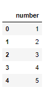
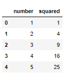

lambda, map, filter 그리고 reduce는 **python 코딩에서 자주 활용되는 대표적인 built-in function**입니다. (reduce는 python3에서 built-in에서는 제거되었습니다)

lambda, map, filter 는 특히 데이터 분석에서 pre-processing하는 과정에서 정말 많이 활용되는 **매우 실용적인 기능**입니다. 이러한 기능들이 바로 python의 매력을 한 층 끌어올려주는 것 같습니다. 하지만, 기존 java에서 넘어오신 분들이나 코딩을 막 입문하신 분들이라면, 다소 생소할 수 있기 때문에 잘 활용하지 못하는 경향이 있고, 자주 활용하지 않다보니 점점 사용법도 잊혀져 갑니다.

그래서 이번 포스팅에서는 간단한 예제들과 함께 **lambda, map, filter, 그리고 reduce** 4종세트에 대해 전반적인 이해와 사용법 그리고 조심해야할 점들을 공유하고자 합니다.


## lambda

`lambda`는 개인적으로 매우 자주 활용하는 function입니다. 

1. 일단 편합니다
2. 간단합니다
3. 직관적입니다

저는 간단한 함수는 왠만하면 lambda로 처리하려고 합니다.

lambda는 한 줄로 작성가능한 함수이며, **반드시 1줄 이상 넘어가면 안됩니다**.

아마 앞으로 나오는 예제들을 보시면 바로 이해가 가실겁니다.


> lambda 예제

```python
f = lambda x: x*2
print(f)
# <function __main__.<lambda>(x)>
# lambda에 함수콜을 안해주면 객체가 print 됩니다

f(2)
# 4

# lambda w/ multi parameters
f = lambda x, y: x+y
f(1, 2)
# 3

# lambda w/ multi parameters
f = lambda x, y, z: x+y+z
f(1, 2, 3)
# 6

# lambda 식 안에 조건문
f = lambda x: x if x==1 else 999
f(1)
# 1

f(2)
# 999

# int와 string을 혼용해서 사용가능
f = lambda x: x if x==1 else 'WRONG'
f(1)
# 1

f(2)
#'WRONG'
```


pandas의 **DataFrame에도 활용**할 수 있습니다.

```python
import pandas as pd

df = pd.DataFrame([1, 2, 3, 4, 5], columns=['number'])
df
```




```python
df['squared'] = df['number'].apply(lambda x: x**2)
df
```




## Map

map 은 기본적으로 **map(함수, 리스트)** 구조로 되어 있습니다. 

즉, 리스트가 함수에 자동으로 iterate하면서 대입되고, 결과를 return 받을 수 있습니다.


> map 예제

```python
sample_data = [1, 2, 3, 4, 5, 6, 7, 8, 9, 10]
map(lambda x: x*2, sample_data)
# <map at 0x7f736c12acf8>
```

map을 **단순히 출력하면 객체가 출력**되게 됩니다 (python3 기준이며, python2에서는 list가 return 됩니다)


```python
sample_data = [1, 2, 3, 4, 5, 6, 7, 8, 9, 10]

list(map(lambda x: x*2, sample_data))
# [2, 4, 6, 8, 10, 12, 14, 16, 18, 20]

# map에 multi parameter를 넘겨줄 수 있습니다
sample_data = [1, 2, 3, 4, 5, 6, 7, 8, 9, 10]
sample_data_2 = [0, 1, 2, 3, 5, 8, 13, 21, 34, 55]
list(map(lambda x, y: x+y, sample_data, sample_data_2))
# [1, 3, 5, 7, 10, 14, 20, 29, 43, 65]

# 아름다운 python문법은 넘겨주는 list의 size가 달라도 되며, 작은 알아서 size에 맞춰줍니다
sample_data = [1, 2, 3, 4, 5, 6, 7, 8, 9, 10]
sample_data_2 = [1, 1, 1, 10, 100]
list(map(lambda x, y: x+y, sample_data, sample_data_2))
# [2, 3, 4, 14, 105]
```


## Filter

filter 는 언뜻보기에는 map과 형식이 비슷해 보입니다. 

사용하기 위해서는 map과 마찬가지로 **filter(함수, 리스트)** 로 사용할 수 있습니다.

다만, map과 다른 점은 filter는 return 값이 true이면 해당 객체는 유지하고, false이면 버립니다. 말 그대로 걸러내는 용도입니다.

```python
sample_data = [1, 2, 3, 4, 5, 6, 7, 8, 9, 10]
result = filter(lambda x: True if (x % 2 == 0) else False, sample_data)
# result도 filter객체를 return 받기 때문에 list로 묶어서 출력해줍니다.
print(list(result))
# [2, 4, 6, 8, 10]

result = list(filter(lambda x: (x % 2 == 0), sample_data))  
print(result)
# [2, 4, 6, 8, 10]
```


## Reduce

reduce 역시 함수와 리스트를 입력 받아 함수의 조건에 따른 연산을 합니다. **reduce(함수, 리스트)** 형태로 동일한 interface로 사용하되, 앞선 map이나 filter와는 달리 리스트에서 **순차적 멤버들을 뽑아서 연산을 한 뒤, 그 결과값을 다음 멤버와 연산을 진행**합니다. 그리고, 결국 결과값은 단일로 출력이 됩니다. 설명하자니 어렵네요. 아래 그림을 보시면, 훨씬 이해가 쉽습니다.

그리고, reduce는 python2에서는 빌트인으로 제공되었으나, python3부터는 funtools 패키지 안에 있는 reduce를 모듈을 import 해와야합니다.

> reduce 연산 과정

```python
from functools import reduce

sample_data = [47, 11, 42, 13]
reduce(lambda x,y: x+y, sample_data)
# 113
```


즉, 최종 값은 113이 출력될 수 있도록 리스트를 reduce 했습니다.

또한, 아래와 같이 연산이 아닌 조건문을 통해 reduce 할 수도 있습니다.

```python
reduce(lambda x, y: x if x>y else y, [1, 2, 3, 4])
# 4
```


## [보너스] Sort에 Lambda 활용

일반적으로 list에 있는 `sort` 함수를 호출해주면 리스트 안에 있는 객체들을 정렬해줍니다.

```python
sample_data = [5, 3, 1, 2, 8, 6, 4, 10, 9, 7]
sample_data.sort()
print(sample_data)
# [1, 2, 3, 4, 5, 6, 7, 8, 9, 10]
```


하지만, **list 안에 있는 객체들이 숫자형이 아닌 class형**이라면 어떻게 될까요?

```python
class Student:
    def __init__(self, name, age):
        self.name = name
        self.age = age
        
john = Student('John', 10)
peter = Student('Peter', 20)
teddy = Student('Teddy', 30)

students = [peter, teddy, john]
students.sort()
# TypeError: '<' not supported between instances of 'Student' and 'Student'
```

students를 정렬하고자 한다면, TypeError를 띄워주게 됩니다.

즉, **어떤 기준으로 정렬해야할지 모호**하기 때문에 생기는 문제입니다. 우리는 이러한 문제는 `lambda`를 통해 해결할 수 있습니다.


```python
students.sort(key=lambda x: x.age)
for student in students:
    print(student.name)

# John
# Peter
# Teddy
```


python은 정말 유연한 언어라는 생각이 듭니다. 

혹자는 처음 코딩에 입문하는 사람에게 python만큼 쉬운 언어가 없다고는 하지만, 저는 주변에 python 언어를 정말 fancy하게 잘 활용하는 사람은 보기 힘든 것 같다라는 생각이 듭니다. python만이 가지고 있는 유려한 기능을 제대로  활용하지 못 한다면 진정한 python 언어의 장점을 100% 활용하고 있다고 보기 어렵겠죠.

오늘 소개해드린 lambda, map, filter 그리고 reduce 뿐만아니라, 앞으로 decorator, generator등등 꼭 알면 유용한 기능들을 더욱 쉽게 공유해드릴 수 있도록 하겠습니다.