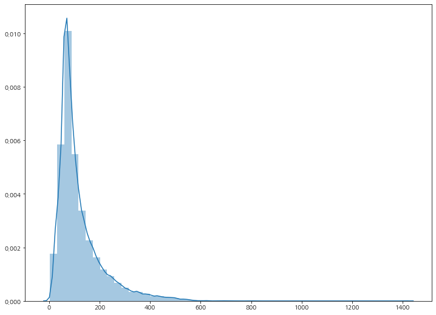

이번 포스팅에서는 keras api를 활용하여 텍스트에 대한 전처리(Tokenization)와 Word Embdding, 그리고 구글이 공개한 **word2vec** (Google News 300) 모델을 다운로드 받아, pre-trained 모델을 통해 **IMDB 데이터의 감정을 분류하는 문제**를 풀어보도록 하겠습니다.


## Step 1. 전처리 - Stopwords

```python
import pandas as pd
from bs4 import BeautifulSoup
import re
import nltk

train = pd.read_csv('data/labeledTrainData.tsv', delimiter='\t')

# html에 정의된 tag와 필요없는 문자를 제거합니다
def clean_review(sentence):
    sentence = BeautifulSoup(sentence, 'lxml').get_text() 
    sentence = re.sub("[^a-zA-Z]"," ", sentence).lower().strip()
    
    # remove whitespaces
    while "  " in sentence:  
        sentence = sentence.replace("  ", " ")
        
    sentence_split = sentence.split()
    stop_words = nltk.corpus.stopwords.words('english')
    
    # stopword에 정의된 단어는 filter 합니다
    review_cleaned = filter(lambda w: True if w not in stop_words else False, sentence_split)    
    return " ".join(list(review_cleaned))
```


그리고, review 컬럼에 대하여 적용(apply)합니다.

```python
train['review_clean'] = train['review'].apply(clean_review)
train['review_clean'].head(30)
# 0    stuff going moment mj started listening music ...
# 1    classic war worlds timothy hines entertaining ...
# 2    film starts manager nicholas bell giving welco...
# 3    must assumed praised film greatest filmed oper...
# 4    superbly trashy wondrously unpretentious explo...
```


## Step 2. 전처리 - Tokenization

먼저, 문장을 토큰화해주는 작업이 필요합니다.

토큰화를 해준다는 의미는 문장을 우리가 마치 오이를 썰듯이 문장에 포함한 단어들을 하나하나 분리해주는 작업입니다.

> Word Tokenization

```python
sentence = "안녕하세요? 반갑습니다. 나는 Teddy입니다."
tokenized = ['안녕하세요', '?', '반갑습니다', '.', '나는', 'Teddy', '입니다', '.']
```

이러한 작업을 우리는 패키지를 통해 손쉽게 적용할 수 있습니다.


> Tokenizer Initialize

```python
from keras.preprocessing.text import Tokenizer

tokenizer = Tokenizer()

# 최대로 활용할 단어의 숫자를 지정해줄 수 도 있습니다 (빈도수 높은순)
# tokenizer = Tokenizer(num_words=3000)
```


> Tokenizer fit한 뒤 sequence로 변환

```python
# tokenizer에게 단어의 dictionary를 만들도록 fit합니다
tokenizer.fit_on_texts(train['review_clean'])

print(len(tokenizer.word_index))
# 74065

# 만들어진 dictionary를 기준으로 텍스트를 숫자형으로 변환합니다
text_sequence = tokenizer.texts_to_sequences(train['review_clean'])
```


> 단어의 분포도 확인

```python
l = pd.Series(text_sequence).apply(len)

# Visualization
plt.figure(figsize=(12, 9))
sns.distplot(l)
```




변환된 `text_sequence`를 직접 눈으로 출력해보시면 list 각각의 길이가 다 다릅니다. 너무나도 당연하게도, 각각의 문장이 포함하고 있는 단어의 갯수가 다르기 때문에 현재 `text_sequence`안에 있는 list들의 개별 길이가 다 다른겁니다. 

우리는 model에 데이터를 정형화하여 넣어줘야하기 때문에 최대 길이를 정하고, 이에 못미치는 굉장히 짧은 문장에 대해서는 `0`이라는 값으로 채워주며, 최대 길이를 넘어가는 문장에 대해서는 잘라내버리는 작업을 해줘야 합니다. 우리는 이러한 작업을 **padding**이라고 합니다.

```python
from keras.preprocessing.sequence import pad_sequences

# row의 최대 list 길이를 500으로 제한
max_length = 500

pad_text = pad_sequences(text_sequence, maxlen=max_length)
pad_text[:5]

# array([[    0,     0,     0, ..., 18689,   316,  1356],
#        [    0,     0,     0, ...,  1251,  8974,  5471],
#        [    0,     0,     0, ...,   700,  1175,  5310],
#        [    0,     0,     0, ...,    46,  1561,     2],
#        [    0,     0,     0, ...,   239,     1,   462]],
```


기본적으로 pad_sequences는  max_length에 못미칠 때에 앞쪽에 `0`을 채워줍니다. 이것은 `pre` 옵션이 기본 적용되어 있기 때문입니다. 다음과 같은 옵션을 주게 된다면, `0`을 뒷쪽에 채워주면서 뒷 부분을 잘라내주는 옵션입니다.

```python
pad_text = pad_sequences(text_sequence, 
                         maxlen=input_length, 
                         truncating='post', 
                         padding='post')
```


## X, y 정의

sklearn의 `train_test_split`을 활용하여 모델에 넣어줄 train 과 valid 셋을 만들어줍니다. 여기서 저는 **stratify** 옵션을 주어서 데이터셋이 최대한 동일한 class 비율을 유지할 수 있도록 적용해 주었습니다.

```python
from sklearn.model_selection import train_test_split

x_train, x_valid, y_train, y_valid = train_test_split(pad_text, 
                                                      train['sentiment'], 
                                                      test_size=0.2, 
                                                      stratify=train['sentiment'], 
                                                      random_state=30,
                                                     )
```


## Word Embedding

먼저, 기계는 단어, 문장과 같은 텍스트 형식의 데이터를 바로 이해하지 못하기 때문에 우리는 이것을 **숫자형으로 변환해 주는 작업**이 필요합니다. 대표적인 방식이 one-hot-encoding이 되겠습니다. 

하지만, 우리가 **70,000~ 100,000개의 고유 단어**를 one-hot-encoding을 해주게 되면 이를 머신러닝이나 딥러닝 모델에 돌려본다고 했을 때 **굉장히 퍼포먼스가 떨어지게** 됩니다. 이러한 문제는 Data Sparsity와도 관련성이 높으며, 자세한 이유는 [PCA를 활용한 차원축소](https://teddylee777.github.io/machine-learning/PCA를-활용한-차원축소)를 보시면 더욱 이해하기 수월하실 껍니다.

그렇기 때문에 우리는 단어에 대하여 적절한 차원으로 축소해주는 작업이 바로 Word Embedding입니다.

물론 위대한 Keras는 이를 손쉽게 api로 제공하고 있습니다.

```python
VOCAB_SIZE = len(tokenizer.word_index)+1 # 1을 더해주는 것은 padding으로 채운 0 때문입니다
EMBEDDING_DIM = 300
INPUT_LENGTH = max_length # 현재 500

model = Sequential()
# 바로 이곳에 들어가는 Embedding Layer가 단어에 대하여 설정한 차원으로 변환해줍니다.
model.add(Embedding(VOCAB_SIZE, EMBEDDING_DIM, input_length=INPUT_LENGTH))
model.add(Bidirectional(LSTM(128, recurrent_dropout=0.1)))
model.add(Dropout(0.25))
model.add(Dense(64))
model.add(Dropout(0.3))
model.add(Dense(1, activation='sigmoid'))
```

Embedding Layer에 대한 API 활용법은 다음과 같습니다.

**Embedding(전체 Vocab size, 출력하고자 하는 Embedding Dimension, input의 길이)**


> Train Model

```python
model.compile(optimizer='adam', loss='binary_crossentropy', metrics=['accuracy'])

# best model 체크포인트
filename = 'fit-model-tmp-chkpoint.h5'
checkpoint = ModelCheckpoint(filename, verbose=1, monitor='val_loss', save_best_only=True, mode='auto')

# fit
model.fit(x_train, y_train, 
          validation_data=(x_valid, y_valid),
          epochs=10, 
          batch_size=BATCH_SIZE,
          callbacks=[checkpoint]
         )
```


이 정도만 해주어도 validation set 기준 약 90% 정도의 accuracy가 나왔습니다.

하지만, 여기서 우리는 pre-trained 된 word2vec 의 모델을 로드해서 더 성능을 끌어올려볼 수 있습니다.


## Word2Vec

우선 구글이 제공하는 Word2Vec 모델은 **구글이 뉴스를 기반으로 학습시켜 만든 Word Embedding 모델의 weight**라고 이해하시면 됩니다. 즉, 원래는 우리가 만든 모델이 주어진 데이터 셋으로 충분히 학습 시켜서 Embedding Layer에서 weight optimization을 하게 되는데, **Word2Vec은 엄청난 양의 데이터로 충분히 학습시킨 weight를 제공**해 줍니다. (갓구글)

자세한 설명은 아래 링크에 들어가 보시면 확인하실 수 있습니다.

[Google Word2Vec Document](https://code.google.com/archive/p/word2vec/)


Word2Vec을 기반으로 pre-trained 학습 weight는 다양한 source로 학습된 데이터를 제공해주며, 출력 embedding도 종류가 다양합니다. 저는 그중 Google News로 학습한 300 출력 임베딩의 weight를 다운로드 받아서 활용하였습니다.

링크: [GoogleNews Vectors Negative 300](https://drive.google.com/file/d/0B7XkCwpI5KDYNlNUTTlSS21pQmM/edit)


Word2Vec을 활용하기 위해서는 gensim 패키지를 로드해야하며, 설치가 되지 않으신 분은 

`pip install gensim`으로 설치 후 진행하시면 됩니다.


> word2vec loading

```python
from gensim.models import KeyedVectors

word2vec = KeyedVectors.load_word2vec_format("word2vec/GoogleNews-vectors-negative300.bin", binary=True)
```


> most similar와 같은 다양한 기능도 있습니다

```python
word2vec.most_similar('samsung')
# [('htc', 0.7326200008392334),
#  ('sony_ericsson', 0.7223767042160034),
#  ('droid_x', 0.7148987650871277),
#  ('nokia', 0.7076617479324341),
#  ('iphone4', 0.6898455619812012),
#  ('sony', 0.6818498969078064),
#  ('dvd_burner', 0.6713829040527344),
#  ('motorola', 0.6689045429229736),
#  ('symbian', 0.66512131690979),
#  ('xoom', 0.6628588438034058)]
```


우리가 로드한 word2vec의 용량도 크고, 우리가 실제 활용하지 않는 단어들도 많습니다.

그렇기 때문에 우리가 필요한 단어만 추출해주는 작업이 필요합니다.

> word2vec에서 필요 단어만 추출

```python
import numpy as np

VOCAB_SIZE = len(tokenizer.index_word) + 1
EMBEDDING_DIM = 300

embedding_matrix = np.zeros((VOCAB_SIZE, EMBEDDING_DIM))

# tokenizer에 있는 단어 사전을 순회하면서 word2vec의 300차원 vector를 가져옵니다
for word, idx in tokenizer.word_index.items():
    embedding_vector = word2vec[word] if word in word2vec else None
    if embedding_vector is not None:
        embedding_matrix[idx] = embedding_vector
        
embedding_matrix.shape
# (74066, 300)
```


> Embedding Layer에 word2vec weight를 적용합니다

```python
model = Sequential()
model.add(Embedding(VOCAB_SIZE, 
                    EMBEDDING_DIM, 
                    input_length=INPUT_LENGTH, 
                    weights=[embedding_matrix], # weight는 바로 위의 embedding_matrix 대입
                    trainable=False # embedding layer에 대한 train은 꼭 false로 지정
                   )
         )
model.add(Bidirectional(LSTM(128, recurrent_dropout=0.1)))
model.add(Dropout(0.25))
model.add(Dense(64))
model.add(Dropout(0.3))
model.add(Dense(1, activation='sigmoid'))
```


이렇게 학습을 진행하면 저는 validation set 기준 최소 2~3% 이상 accuracy가 개선됨을 확인하였습니다. Word2Vec 뿐만 아니라 [GloVe](https://nlp.stanford.edu/projects/glove/)도 성능이 매우 좋습니다. 해당 링크를 걸어 두었으니, GloVe 모델도 다운로드 받아서 적용해보면서 직접 눈으로 성능을 비교해 보시면 좋을 것 같습니다.

