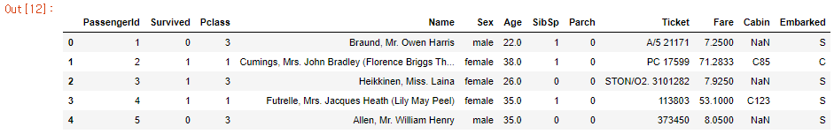
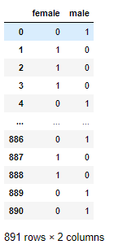
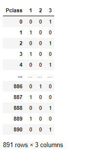

카테고리형 데이터(Categorical Data)를 수치형 데이터(Numerical Data)로 **변환**해주는 작업은 머신러닝 모델을 돌려보기 위해서 **필수로 해줘야하는 전처리** 작업입니다.

이렇게 수치형으로 변환해주는 방법에는 한 가지 방법만 정해져 있는 것이 아니라 다양한 방법으로 변환해 줄 수 있고, 보통 개인의 취향(?)에 따라 주로 사용하는 방법으로 변환을 하곤 합니다.

이번 포스팅에서는 **Categorical 데이터를 Numerical 로 변환하는 3가지 방법**를 공유드리고자 합니다.

아래 내용을 보시고, 본인의 성향에 가장 잘 맞는 방법을 택해서 전처리를 해주면 되고, 각각의 방법마다 미세하게 장단점이 존재할 수 있습니다.

샘플데이터는 Kaggle의 대표적인 입문형 Contest인 [Titanic: Machine Learning from Disaster](https://www.kaggle.com/c/titanic/data) 의 데이터셋으로 진행하며, 링크에서 바로 데이터셋을 다운로드 받을 수 있습니다.


## Sample Data

```python
import pandas as pd

train = pd.read_csv('train.csv')
train.head()
```




## #1 astype('category').cat.codes

1. numerical 데이터로 변경하고 싶은 categorical 컬럼을 정한 뒤, 

2. categorical 형 column으로 강제 **형변환**을 시키고 
3. **cat.codes**를 호출해 주면 자동으로 숫자형 리턴을 해주게 됩니다.

```python
train['Sex'].astype('category').cat.codes
# 0      1
# 1      0
# 2      0
# 3      0
# 4      1
#       ..
# 886    1
# 887    0
# 888    0
# 889    1
# 890    1
```

보통 1줄로 끝나버리기 때문에, 개인적으로 많이 사용하는 방법 입니다.

단점은, **어떤 클래스가 숫자로 맵핑되어 있는지 확인하기 어렵**습니다.


## #2 LabelEncoder

`sklearn.preprocessing` 안에 있는 모듈인 `LabelEncoder`를 활용하면 #1 방법의 단점도 해결할 수 있습니다.

사용방법도 무척 간단합니다.

```python
from sklearn.preprocessing import LabelEncoder

le = LabelEncoder()
result = le.fit_transform(train['Sex'])
print(result)
# array([1, 0, 0, 0, 1, 1, 1, 1, 0, 0, 0, 0, 1, 1, 0, 0, 1, 1, 0, 0, 1, 1,
#        0, 1, 0, 0, 1, 1, 0, 1, 1, 0, 0, 1, 1, 1, 1, 1, 0, 0, 0, 0, 1, 0,
#        0, 1, 1, 0, 1, 0, 1, 1, 0, 0, 1, 1, 0, 1, 0, 1, 1, 0, 1, 1, 1, 1,
#        0, 1, 0, 1, 1, 0, 1, 1, 1, 1, 1, 1, 1, 0, 1, 1, 0, 1, 0, 0, 1, 1,
#        0, 1, 1, 1, 1.... 1, 1])

# 변환된 label classes 확인
le.classes_
# array(['female', 'male'], dtype=object)
```


변환한 뒤 `inverse_trainsform`으로 다시 역변환 할 수도 있습니다.

```python
le.inverse_transform(result)
# array(['male', 'female', 'female', 'female', 'male', 'male', 'male',
#        'male', 'female', 'female', 'female', 'female', 'male', 'male',
#        'female', 'female', 'male', 'male', 'female', 'female', 'male',
#        'male', 'female', 'male', 'female', 'female', 'male
```


## #3 get_dummies

마지막은, 사실 숫자형으로 변경한다기 보다는 원핫인코딩(one-hot-encoding)을 해준다고 봐야 맞습니다. 

get_dummies는 원핫인코딩을 매우 쉽게 해주며, DataFrame에서 **category형 데이터 컬럼**을 선택하여 자동으로 원핫인코딩을 해줍니다. 만약 겉보기에는 수치형 데이터 컬럼이지만, 실제로는 categorical 컬럼이라면 이 역시 원핫인코딩을 해줍니다.

> get_dummies

```python
pd.get_dummies(train['Sex'])
```



> Numerical -> Categorical로 변환

```python
train['Pclass'] = train['Pclass'].astype('category')
pd.get_dummies(train['Pclass'])
```




