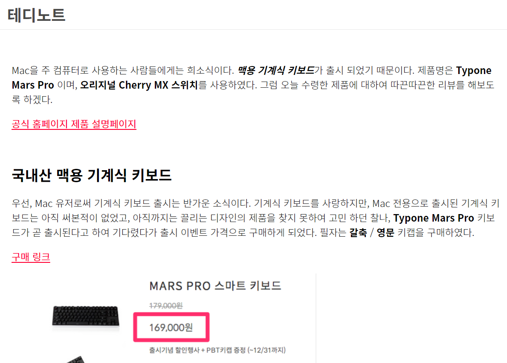
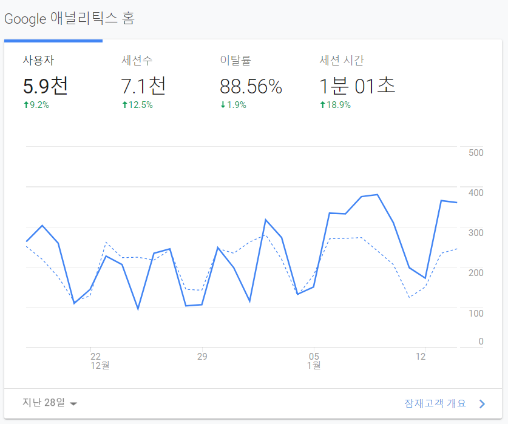
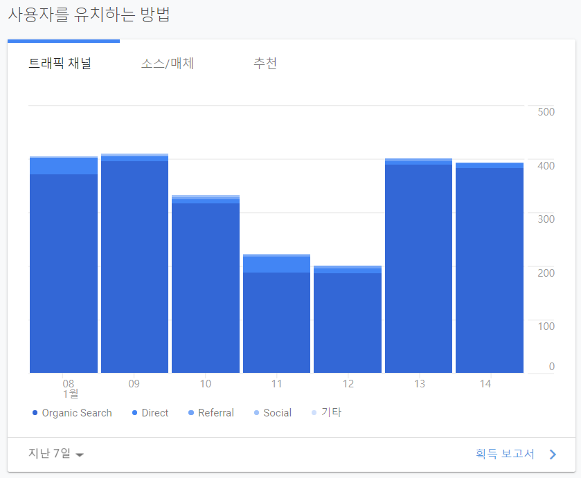
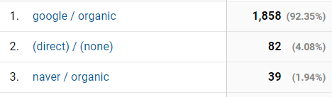
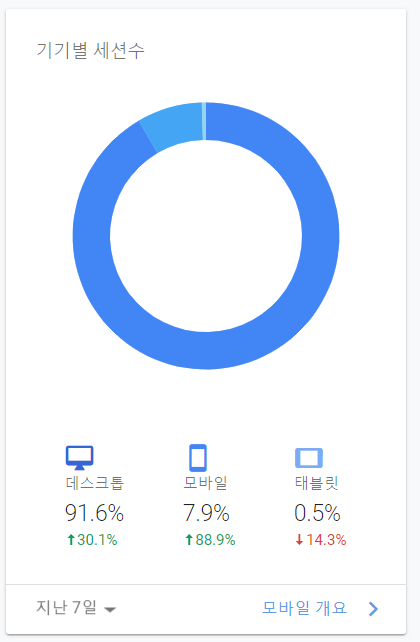
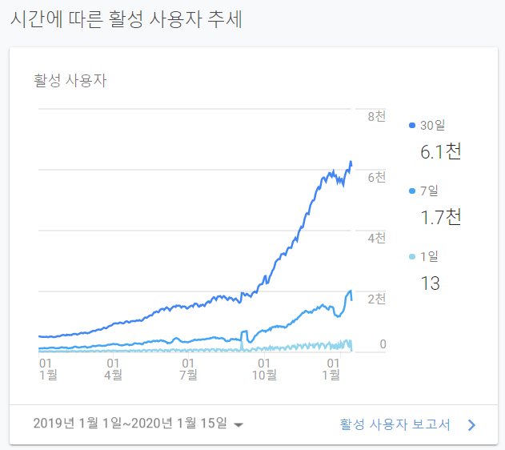
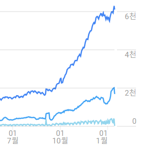

현재 운영하고 있는 블로그의 **일일 방문객 수 400명 돌파를 자축**하며, 방문객 수와 구글 애드센스(Google Adsense) 그리고 검색 유입량의 관계에 대하여 공유 드리고자 합니다.

## 지난 2017년 12월 첫 포스팅

지금 현재의 제 블로그 주요 방문자는 **개발 관련 검색량을 통한 유입**이 대부분입니다.

그런데, 처음 시작은 [기계식 키보드에 대한 리뷰 포스팅]([https://teddylee777.github.io/review/Typone-Mars-Pro-%EB%A6%AC%EB%B7%B0](https://teddylee777.github.io/review/Typone-Mars-Pro-리뷰))이였습니다.

이젠 추억의 포스팅이 되어 버렸습니다만, 제일 처음 포스팅하였기 때문에 개인적으로 기억에 진하게 남아 있습니다.

> 책도 많이 읽지 않고, 글 솜씨도 없습니다

그게 바로 저였습니다. 지금도 책을 엄청 많이 읽지는 않지만, 많이 읽어보려고 노력은 하고 있습니다^^

글 솜씨는 더더욱 없었기 때문에 처음에는 정말 큰 욕심없이 포스팅을 올렸는데, 너무 재밌었던 기억이 있습니다.

그런데, 운이 좋아서인지 **블로그 유입이 좀 되었습니다(?)**

이유인 즉슨, 제가 올린 기계식키보드가 맥 호환 기계식 키보드 였고, 당시에는 흔한 제품은 아니였습니다. 제가 좀 미리 구입해보고 리뷰를 미리 올려서 그랬는지 많은 분들이 제 글을 보러 와주셔서 구글 1 페이지에 노출이 되기 시작하였습니다.

이 당시 **구글 SEO 셋팅만 한 상태였고, 네이버 웹마스터 도구에서 등록은 하지 않은 상태**였습니다. 이 당시 검색을 통한 유입이 들어오는 것을 보고, 재빨리 네이버에도 등록했던 기억이 납니다.

> 초기 트래픽 유도에는 신제품 리뷰가 최고구나..

아무래도 그런 것 같습니다.

그 당시 반짝 유입이 들어오고 그 다음부터는 차차 줄어들기 시작하였습니다.

## 블로그 작성 후 반드시 Google SEO, 네이버 웹 등록하기

블로그를 오픈 했다면, 누군가에게 노출이 되어야 내 블로그에 들어올 것 입니다.

아무리 개인의 생각정리를 위한 블로그라고 해도, 제 개인적인 경험으로 비추어 볼 때 **아무도 읽어주지 않는 다면 정말 성취감이 떨어지고 지속되기 쉽지 않습니다**.

누군가에게 내가 이런 글을 썼다고 알릴 수 있는 **가장 1번 방법이 바로 검색 엔진에 노출**시키는 것입니다.

만약, 구글과 네이버 검색엔진에 성공적으로 SEO 등록을 마쳤다면, 그 다음 블로그는 **최적화 작업**입니다.

> 최적화는 또 뭐지...

흔히들, 마케팅 영업하시는 분들이 블로그 최적화 작업이라는 말을 많이 사용합니다.

제가 쉽게 이해할 수 있도록 말씀드리면, 

**"내가 쓴 블로그가 누군가의 키워드로 검색했을 때 상단에 노출시킨다"**

의 말과 같은 말입니다.

그러면, 어떻게 상단에 노출시킬 수 있을까요?

뻔한 말이긴 하지만,

> 정답은 없습니다...(ㅠㅠ)

그런데, 시도해 볼 수 있는 방법은

1. 하나의 블로그에는 **통일된 하나의 토픽**으로 작성한다
2. 검색을 통해 내 블로그로 **유입되고 싶은 키워드를 블로그에 자주 노출** 시킨다

사실, 제가 전문 마케터가 아니라서 정확한 노하우는 모르겠지만, 

일단 너무나도 당연한 것은 1번 하나의 토픽으로 작성한다 입니다.

만약, 1개의 블로그 포스팅에 **여행, 맛집, 개발, 정치, 문화를 모두 담는다고 해서 상단에 노출될 수 있을까요?**

전 아닐 것 같습니다. 차라리 맛집 중에서도 어떤 특정 식당의 상호명을 계속 언급하면서 리뷰를 해나가는 식으로 작성하면 더욱 확률이 올라갑니다 (어찌보면 너무나도 당연한 얘기입니다..)

두번째로는, **유입되고 싶은 키워드를 자주 노출**시킨다입니다.

요새는 광고성 블로그 글이 너무 많아서 지나치게 많이 노출시키는 것은 오히려 해가 될 수 있겠지만, 적어도 타이틀에는 노출시켜줌으로써 사용자가 검색 후 타이틀부터 클릭하고 싶을 수 있도록 1줄로 명쾌하게 요약한 것을 타이틀로 잡는 것을 추천드립니다.

그리고, 블로그 **글 내에서도 자주 언급해줌으로써 상위 노출**을 노려볼 수 있습니다.

하지만, 주의해야할 점은 맛집, 여행과 같은 너무 평범한 단어는 아무리 많이 언급한다고 해도 경쟁자가 많기 때문에 상단에 노출되기 어렵습니다. 따라서, **보다 세밀한 검색어**를 염두해 두세요!

## Google Analytics (구글 애널리틱스) 적극 활용

사실, google analytics와 애드센스에 대하여 주로 공유드리려 했는데 서두가 길었습니다.

**Google Analytics를 활용하는 이유**는 

1. 내 블로그의 유입자 통계 확인
2. 어떤 검색어를 통해 주로 유입되었는지
3. 주로 사용하는 기기파악 (PC/Mobile)
4. 검색 유입 경로 파악(Google/네이버)

등의 이유가 있습니다.

이 모든 통계량을 구글이 무료로 확인할 수 있도록 제공하니, 정말 갓 구글입니다.

제 블로그의 요즘 유입자 통계량입니다.

> 전체 유입자 통계 확인

> 일별 방문자 수 확인

제 블로그는 개발 관련 글이 많아서 토요일, 일요일에는 확실히 방문자가 급감합니다.

여타 여행, 맛집 블로그와는 추세가 상반된 모습입니다.

> 유입 경로

거의 대부분 Google 검색에서 유입되는 것을 확인하실 수 있습니다.

> 검색어 통계

> 기기별 세션수

확실히 개발 관련 글이 많아서 그런지, 데스크톱 사용자가 월등히 많습니다.

> 2019년 사용자 추세

2019년 9월 기점으로 더욱 더 가파르게 성장하였습니다. 이유는 조금만 내리시면 확인하실 수 있습니다.

마치 주가가 오르듯이 점점 성장하는 블로그를 보고 있으니, 정말 뿌듯합니다.

방문해 주신 **모든 분들께 진심으로 감사**드립니다.

이 밖에도 다양하고 흥미로운 지표들을 구글 애널리틱스에서 제공해줍니다. 정말 사용법도 간단하고 보는 재미도 쏠쏠합니다.

## 구글 애드센스 (Google Adsense)로 방문자가 늘었다?

정말 희한하게 위의 그래프에서도 보실 수 있겠지만, **9월 1일 기준으로 방문객 숫자가 급격히 늘었**습니다.

원래는 광고를 달 생각이 전혀 없었기 때문에 구글 애드센스는 고려하지 않았습니다.

그런데, 구글 애드센스를 달고 수익이 얼마나 날까? 라는 궁금증과 관련 글을 작성해서 공유하면 좋을 것 같다라는 생각에 애드센스를 달고나자마자 방문자 숫자가 덩달가 급상승하였습니다.

제 개인적인 생각입니다만, 

> 구글 애드센스를 포함한 블로그가 상위 노출될 가능성이 높다

구글의 입장에서는 광고주로 받은 광고를 적절한 고객에게 전달해서 수익으로 연결시키고자 합니다. 그리고, 수익 쉐어 정책의 일환으로 구글 애드센스라는 솔루션을 만들어 **블로거들에게 자유롭게 활용/ 부가 수익 창출**을 할 수 있도록 유도하고 있습니다.

앞서 말씀드린 내용처럼, 블로그는 하나의 아이덴티티가 점차 생기기 마련입니다. (맛집, 여행, 개발 등 1개의 주 토픽을 가지게 됩니다) 그리고 해당 글을 보는 사람 또한 비슷한 관심사를 가지고 있을 가능성이 높습니다. 이렇게 해당 사용자에게 **타겟 광고가 더욱 쉽기 때문에 저는 구글 애드센스를 달고 방문자 숫자가 늘었다**고 보고 있습니다. (구글 검색엔진에서 상위 노출량을 더 높인 것 같습니다)

물론, 검증된 FACT는 아닙니다. 하지만, 통계량이 간접적으로 증명하고 있고, 광고를 잠깐 꺼두었던 적이 있었는데 가파르게 상승하던 방문자 숫자가 조금 덜 증가세가 나타난 경향을 보였습니다. (물론 연말이라 줄었을 수도 있습니다)

구글 Adsense를 설치하기 위해서는 우선 **구글 Adsense를 승인받기 위한 조건을 충족**하여야 합니다.

1. 본인이 직접 작성한 포스팅이 블로그에 게재되어야 합니다.
2. 콘텐츠가 구글 Adsense 정책을 위반해서는 안됩니다.
3. 구글 Adsense 코드를 삽입할 수 있어야합니다. (카카오의 tistory는 가능합니다)

이 외에 10,000자 이상의 글이 적어도 블로그에 게재 되어있어야 한다..이미지는 2~3장 이상 있어야 한다등 조건이 있다고는 하지만, **공식적으로 게재된 기준은 없습니다** (적당히 글 몇개 있고, 정성적으로 작성된 글이라면 충분히 승인받을 수 있습니다)

구글 Adsense 고객센터에서 다음과 같은 과정을 통해 Adsense 가입 요청을 할 수 있습니다. 그리고, 수익은 $100이 넘어가야 계좌로 입금받을 수 있습니다.

## 애드센스에 가입하고 광고 게재하기

1. [Blogger에 로그인합니다.](https://www.blogger.com/)
2. 상단에서 아래쪽 화살표 를 클릭합니다.
3. 광고를 게재할 블로그를 클릭합니다.
4. 왼쪽 메뉴에서 - 수익 - 애드센스 가입하기를 클릭합니다.
   - 버튼이 표시되지 않으면 [애드센스 자격요건](https://support.google.com/adsense/answer/9724)에서 애드센스를 이용할 수 없는 이유를 알아보세요.
5. Blogger 계정과 연결된 Google 이메일을 선택합니다.
6. 애드센스 양식을 작성하고  **계정을 만듭니다**.
7. 애드센스 결제 세부정보를 입력합니다.
8. 전화번호를 인증하고  **제출**을 클릭합니다.
9. 자동으로 Blogger로 이동하여 과정을 완료할 수 있게 됩니다.
10. Blogger로 이동하지 않는 경우 **리디렉션**을 클릭합니다.
11. 리디렉션을 클릭하기 전에 중단되거나 며칠이 지나도록 애드센스 홈페이지에 '설정 작업 진행 중'이라는 메시지가 표시되는 경우 다음 단계를 따르세요.
    1. 1~5단계를 다시 실행합니다. 
    2. **연결 수락**을 클릭합니다.

제 나름 정리한 팁과 노하우를 통해 블로그 운영에 도움이 되셨길 바라며, 긴 글 읽어주셔서 감사합니다.