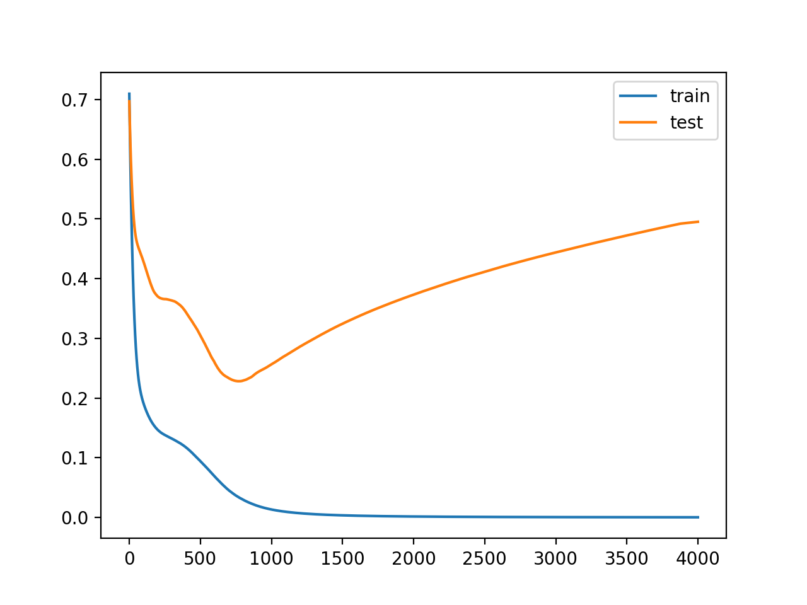

사이킷런(scikit-learn)의 model_selection 패키지 안에 `train_test_split` 모듈을 활용하여 손쉽게 train set(학습 데이터 셋)과 test set(테스트 셋)을 분리할 수 있습니다. 이번 포스팅에서는 `train_test_split` 에 대해 자세히 소개해 드리고자 합니다.


## train / test 분리하는 이유?

먼저, **train / test 를 분리하는 목적**을 정확히 알아야합니다.

정확히 말하면, train / test 가 아닌 **train / validation** 으로 볼 수 있습니다. (어차피 용어의 차이긴 하지만요)

머신러닝 모델에 train 데이터를 **100% 학습시킨 후 test 데이터에 모델을 적용했을 때 성능이 생각보다 않 나오는** 경우가 많습니다 (거의 99.999% 는요)

이러한 현상을 보통 **Overfitting** 되었다라고 합니다.

즉, 모델이 내가 가진 학습 데이터에 너무 과적합되도록 학습한 나머지, 이를 조금이라도 벗어난 케이스에 대해서는 예측율이 현저히 떨어지기 때문이라고 이해하시면 됩니다. 그렇기 때문에 **Overfitting을 방지하는 것은 전체적인 모델 성능을 따져보았을 때 매우 중요한 프로세스** 중 하나입니다.

> Validation Set으로 검증 단계를 추가하여 Overfitting 방지


위의 그림과 같이 기존 train / test로 구분 되어 있었던 데이터 셋을 train에서 train / validation으로 일정 비율 쪼갠 다음에 학습 시에는 train 셋으로 학습 후 중간중간 **validation 셋으로 내가 학습한 모델 평가**를 해주는 것입니다.

만약, 모델이 과적합되었다면, validation 셋으로 검증시 **예측율이나 오차율이 떨어지는 현상**을 확인할 수 있으며, 이런 현상이 나타나면 **학습을 종료**합니다.

아래 그림을 참고하시면, iteration이 750을 넘어가는 순간부터 train 셋의 오차율을 계속 하강하고 있으나 **validation 셋의 오차율을 점차 증가**하는 것을 확인할 수 있습니다.



출처: [machinelearningmastery.com](machinelearningmastery.com)


그래서 머신러닝 모델의 하이퍼파라미터 튜닝 시 특히 `n_estimators`의 값은 validation 셋의 오차율을 점검해 나가면서 튜닝을 진행해야 하며, 딥러닝 모델도 마찬가지로 `validation_data`를 지정해 줌으로써 매 epoch 마다 validation의 오차율을 확인하면서 과적합을 방지해야 좋은 성능의 모델을 만들 수 있습니다.

추가로, 검증 방법은 **K-Fold 교차 검증 방식**이 많이 이용되고 있으며, 이와 관련 내용은 다른 포스팅에서 다루도록 하겠습니다.


## 간편하게 train / test 분리

사용 방법은 너무나도 **간단**합니다.

`train_test_split` 함수를 통해 단 **1줄**로 깔끔하게 분리할 수 있습니다.

패키지는 `sklearn.model_selection`에 있습니다.

```python
from sklearn.datasets import load_iris # 샘플 데이터 로딩
from sklearn.model_selection import train_test_split

# load sample
dataset = load_iris()

data = dataset['data']
target = dataset['target']

# train_test_split
x_train, x_valid, y_train, y_valid = train_test_split(data, target, test_size=0.2, shuffle=True, stratify=target, random_state=34)
```

저렇게 1줄의 코드로 train / validation 셋을 나누어 주었습니다.


### 옵션 값 설명

- `test_size`: 테스트 셋 구성의 비율을 나타냅니다. train_size의 옵션과 반대 관계에 있는 옵션 값이며, 주로 test_size를 지정해 줍니다. 0.2는 전체 데이터 셋의 20%를 test (validation) 셋으로 지정하겠다는 의미입니다. **default 값은 0.25** 입니다.
- `shuffle`: **default=True** 입니다. split을 해주기 이전에 섞을건지 여부입니다. 보통은 default 값으로 놔둡니다.
- `stratify`: **default=None** 입니다. classification을 다룰 때 매우 중요한 옵션값입니다. stratify 값을 target으로 지정해주면 각각의 **class 비율(ratio)을 train / validation에 유지**해 줍니다. (한 쪽에 **쏠려서 분배되는 것을 방지**합니다) 만약 이 옵션을 지정해 주지 않고 classification 문제를 다룬다면, 성능의 차이가 많이 날 수 있습니다.
- `random_state`: 세트를 섞을 때 해당 int 값을 보고 섞으며, 하이퍼 파라미터를 튜닝시 이 값을 고정해두고 튜닝해야 매번 데이터셋이 변경되는 것을 방지할 수 있습니다.


