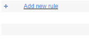
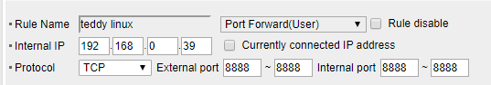

도커(Docker)를 활용하면 CUDA, CuDNN과 같은 **복잡한 설치환경의 충돌 걱정 없이** 미리 설치된 dependency 셋팅으로 매우 편리하게 딥러닝/머신러닝을 위한 환경을 구성할 수 있습니다. Docker를 활용하여 Kaggle에서 발행한 **Kaggle Docker를 Pull** 하여 검증된 딥러닝/머신러닝 프레임워크 환경을 구성해보고 **jupyter notebook을 원격으로 접속**할 수 있도록 설정해보도록 하겠습니다.


**주요 정보**

* 준비물: Docker, Docker Image (Kaggle의 gpu/cpu 추천)
* 소요시간: Docker Pull Image 시간 제외 **약 10분** (*단, Image 크기가 커서 다운로드 시간이 오래걸립니다*)
* 환경: Ubuntu 18.04 


## STEP 1: 도커(Docker) 설치

> Install Docker on Ubuntu Using Default Repositories

```bash
# step 1: apt-get 업데이트
sudo apt-get update

# step 2: 이전 버젼 제거
sudo apt-get remove docker docker-engine docker.io

# step 3: 도커(Docker) 설치 
sudo apt install docker.io

# step 4: 도커 서비스 시작
sudo systemctl start docker
sudo systemctl enable docker

# step 5: 잘 설치 되어있는지 버젼 체크
docker --version
```

* Official Repositories에 대한 설치 방법은 [여기](https://phoenixnap.com/kb/how-to-install-docker-on-ubuntu-18-04)를 참조


## STEP 2: Kaggle 도커 이미지 설치

여러가지 딥러닝/머신러닝 관련 도커 Image들을 테스트 해보았습니다. 아무래도 Docker를 통한 설치가 너무 편하다 보니 손쉽게 다양한 도커 Image 들을 실행해보고 그 위에서 기본으로 어떤 버젼의 라이브러리를 사용하는지, gpu는 지원하는지 여부를 확인해 볼수 있었습니다.

결론부터 얘기하자면, 저는 GPU를 사용하는 딥러닝/머신러닝 환경 세팅이 필요한 상황이었지만 **여러 유명한 도커 Image들은 GPU 지원이 좀 부족하다**라는 느낌을 받았습니다.

그러던 중 Kaggle에서도 도커 이미지를 제공하고 있다는 것을 알게 되었고, **CPU와 GPU 버젼 이렇게 나누어서 지원**하고 있습니다.

제가 Kaggle 도커 이미지를 고른 이유는

1. **Xgboost, Catboost, Lightgbm**등 Boosting 계열의 패키지를 지원합니다.
2. XGboost의 경우는 **GPU도 지원**합니다. (요놈이 워낙 느려서 GPU 없이는 좀 힘듭니다ㅠ)

사실 많은 딥러닝 image는 Xgboost가 없는 경우도 많고 GPU 지원은 더더욱 찾기 힘들었습니다..


지금 시점으로는 **Kaggle 도커가 좋은 선택지** 같다라는 판단하에 Kaggle 도커로 설치를 진행하지만, 다른 더 좋은 도커 Image를 찾으셨다면 그 이미지로 설치를 진행하셔도 무방합니다.

[캐글 도커 이미지 다운로드[깃헙]](https://github.com/Kaggle/docker-python)


```bash
# step 1: git pull (캐글 도커 이미지)
https://github.com/Kaggle/docker-python.git

# step 2: 
cd docker-python

# step 3:
# CPU 버젼
./build --use-cache
# GPU 버젼
./build --gpu --use-cache

# step 4:
# CPU 버젼 실행 테스트
docker run --rm -it kaggle/python-build /bin/bash
# GPU 버젼 실행 테스트
docker run --runtime nvidia --rm -it kaggle/python-gpu-build /bin/bash

# step 5 (GPU 버전 설치자만)
(container) $ nvidia-smi
```


## STEP 3: 도커 이미지에서 Jupyter Notebook 실행

일단 도커에서 Jupyter Notebook 을 실행시키기 위해서는 `docker run`에서 Jupyter Notebook 실행 명령어를 같이 지정해 주면 됩니다.

**명령어 부연 설명**

* 맵핑할 directory를 지정해 주면 됩니다. (Docker의 /home 디렉토리에 맵핑됩니다)
* `-p` 에 jupyter notebook 포트번호를 맵핑합니다. 만약 외부 접속시 **9999로 맵핑**하고 싶다면 **9999:8888**로 입력해주면 됩니다
* `-v` 옵션은 PC와 도커 간의 volumn 마운트 연결에 관한 옵션입니다
* `-it` 옵션은 interactive한 환경을 제공합니다 (terminal bash 실행 등)
* 저도 실수한 부분인데 **위에 언급한 옵션을 만드시 Image명 앞 쪽에 지정**해 주어야 에러가 안납니다

> CPU

```bash
docker run -v ~/마운트할공간:/home -p 8888:8888 --rm -it kaggle/python-build bash -c "export LD_LIBRARY_PATH=/usr/local/cuda/lib64; pip install jupyter_contrib_nbextensions; pip install jupyter_nbextensions_configurator; jupyter contrib nbextension install --user; jupyter notebook --notebook-dir=/home --ip='*' --port=8888 --no-browser --allow-root --NotebookApp.token= "
```


> GPU

```bash
docker run --runtime=nvidia -v ~/마운트할공간:/home -p 8888:8888 --rm -it kaggle/python-gpu-build bash -c "export LD_LIBRARY_PATH=/usr/local/cuda/lib64; pip install jupyter_contrib_nbextensions; pip install jupyter_nbextensions_configurator; jupyter contrib nbextension install --user; jupyter notebook --notebook-dir=/home --ip='*' --port=8888 --no-browser --allow-root --NotebookApp.token= "
```


## STEP 4: 긴 명령어를 매번 입력하지 않도록 설정

다음과 같이 `bashrc` 파일 수정을 통해 긴 명령어를 별칭으로 지정해 놓으면, 매번 긴 명령어를 입력하지 않아도 됩니다.

```bash
# bashrc 파일
vi ~/.bashrc
##############
kjupyter {
     이곳에 실행할 명령어 입력
}
##############
# 예시, GPU
kjupyter {
    docker run --runtime=nvidia -v ~/마운트할공간:/home -p 8888:8888 --rm -it kaggle/python-gpu-build bash -c "export LD_LIBRARY_PATH=/usr/local/cuda/lib64; pip install jupyter_contrib_nbextensions; pip install jupyter_nbextensions_configurator; jupyter contrib nbextension install --user; jupyter notebook --notebook-dir=/home --ip='*' --port=8888 --no-browser --allow-root --NotebookApp.token= "
}
```


> bashrc 업데이트 후 kjupyter 입력시 바로 실행됩니다

```bash
# .bashrc 업데이트
source ~/.bashrc

# kjupyter 실행
kjupyter
```


## STEP 5: Jupyter Notebook 외부 접속 허용 및 password 지정

로컬에서만 운용하시는 분들은 신경 안써도 되는 step 입니다.

하지만, 서버에서 도커로 Jupyter Notebook 서버를 실행하고, password 를  지정하여, 아무나 접근하지 못하게 막고 싶다면, 다음과 같이 진행하시면 됩니다.


먼저, python 명령어를 통해 python Interactive terminal을 엽니다.

```python
from notebook.auth import passwd

passwd()
# Enter password:
# Verify password:

# [out] 'sha1:DAEF843780F7011A4920982E5E53348DD6B07D2A'
```


output에 출력된 sha1 해시를 복사해 줍니다.

끝에 `NotebookApp.token`을 지워주고, `NotebookApp.password`로 변경합니다. 그리고 복사한 hash를 이어서 적어주면 됩니다.


> GPU (예시)

```python
docker run --runtime=nvidia -v ~/마운트할공간:/home -p 8888:8888 --rm -it kaggle/python-gpu-build bash -c "export LD_LIBRARY_PATH=/usr/local/cuda/lib64; pip install jupyter_contrib_nbextensions; pip install jupyter_nbextensions_configurator; jupyter contrib nbextension install --user; jupyter notebook --notebook-dir=/home --ip='*' --port=8888 --no-browser --allow-root --NotebookApp.password='sha1:DAEF843780F7011A4920982E5E53348DD6B07D2A'"
```


그러면, 이제 jupyter notebook을 실행시 **암호를 입력**하라는 창이 뜨는 것을 볼 수 있습니다.


## STEP 6: Docker를 Background로 실행

도커 (Docker)를 Background로 실행하고자 함은, terminal을 종료해도 계속 서버가 유지되도록 하고 싶기 때문입니다. 가령 Amazon Aws 에서 instance를 만든 후 terminal을 종료시키면 자동으로 서버도 내려가 버리기 때문에 서버를 어렵게 만든 이유가 없겠죠?

```bash
# tmux 설치
sudo apt-get update
sudo apt-get install tmux

# tmux 실행 (kaggle 이라는 이름의 백그라운드 프로세스 실행)
tmux new -s kaggle

# backgound process로 docker 실행 (step 4의 bashrc 설정 참조)
kjupyter
```

해당 터미널에서 바로 전 step의 명령어를 실행합니다.


`Ctrl + B, D`를 입력하시면 터미널에서 빠져나올 수 있고, background로 서버가 계속 돌고 있는 것을 확인할 수 있습니다.

`tmux`는 [**tmux로 terminal을 닫아도 서비스 백그라운드 실행**]([https://teddylee777.github.io/aws/tmux%EB%A1%9C-aws%EC%97%90%EC%84%9C-terminal-%EB%8B%AB%EC%95%84%EB%8F%84-background%EC%8B%A4%ED%96%89](https://teddylee777.github.io/aws/tmux로-aws에서-terminal-닫아도-background실행)) 에서 더 자세한 사용법을 확인할 수 있습니다.


## STEP 7: 방화벽(firewall) 설정

```bash
# 설치
sudo apt install ufw

# 방화벽 상태 확인
sudo ufw status

# ssh 접속 허용 (skip 해도 됨)
sudo ufw allow ssh

# 8888번 포트 허용 (jupyter notebook)
sudo ufw allow 8888/tcp

# 범위로 포트 허용을 하고 싶다면 (8888~9999 허용)
sudo ufw allow 8888:9999/tcp

# 방화벽 적용
sudo ufw enable
```


## STEP 8: Iptime을 사용하고 있다면, Port Forwarding으로 외부접속 허용하기

`192.168.0.1` 접속하여 Iptime 설정 페이지로 로그인 합니다.


> Port Forwaring Routing을 클릭합니다


**Add New Rule** (새로운 규칙 추가)를 클릭 합니다.



다음과 같이 외부 port 8888을 내부 8888로 포워딩 해주면 됩니다.

설정의 의미는 **내 집주소 ip로 들어오는 포트 8888번은 내 서버 PC의 8888번으로 포워딩 시켜주겠다**는 의미입니다.




그럼, 이제 포워딩까지 세팅이 모두 완료되었고, 이제 집 밖에서도 노트북의 사양에 관계 없이 내 집에 있는 서버의 GPU 성능으로 머신러닝/딥러닝을 즐길 수 있게 되었습니다~!


## 참고 (References)

* [Setup docker for Kaggle](https://medium.com/@zhang_yang/setup-docker-for-kaggle-b34d04705756)

* [Kaggle/docker-python](https://github.com/Kaggle/docker-python)

* [Docker Hub (Kaggle)](https://hub.docker.com/r/kaggle/python/)

* [How To Install Docker On Ubuntu 18.04 Bionic Beaver](https://phoenixnap.com/kb/how-to-install-docker-on-ubuntu-18-04)

  

  


