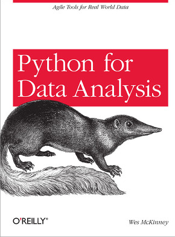
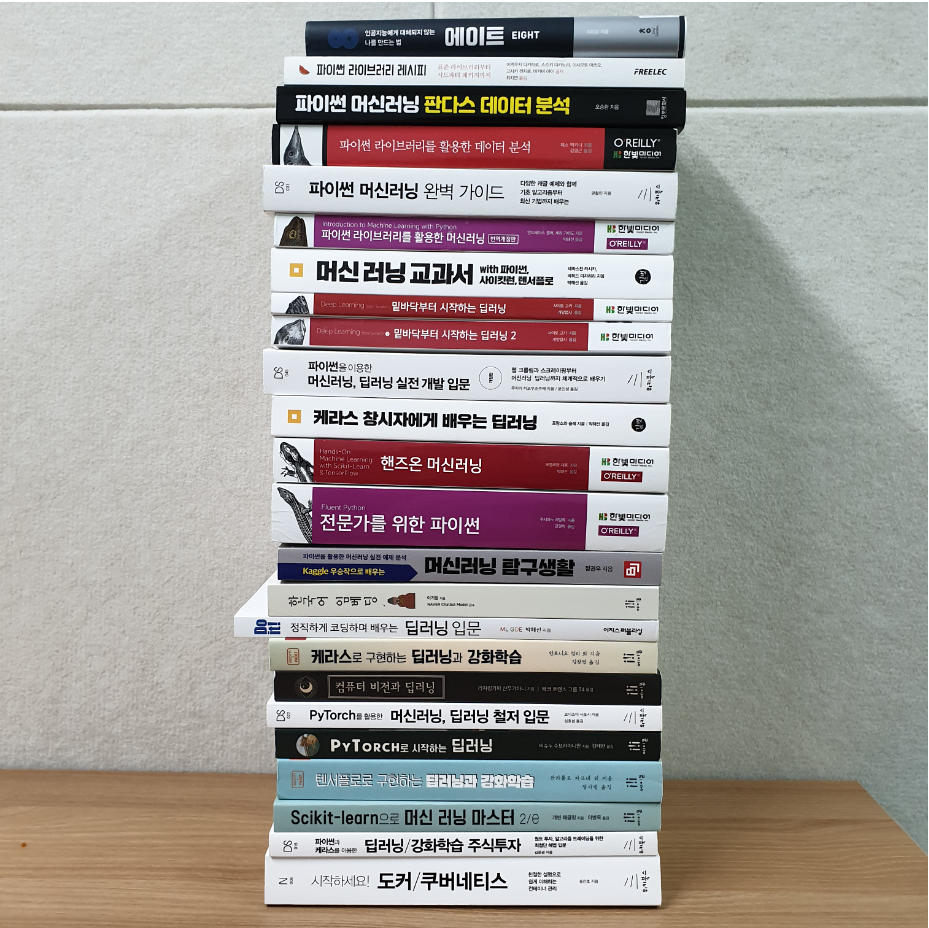
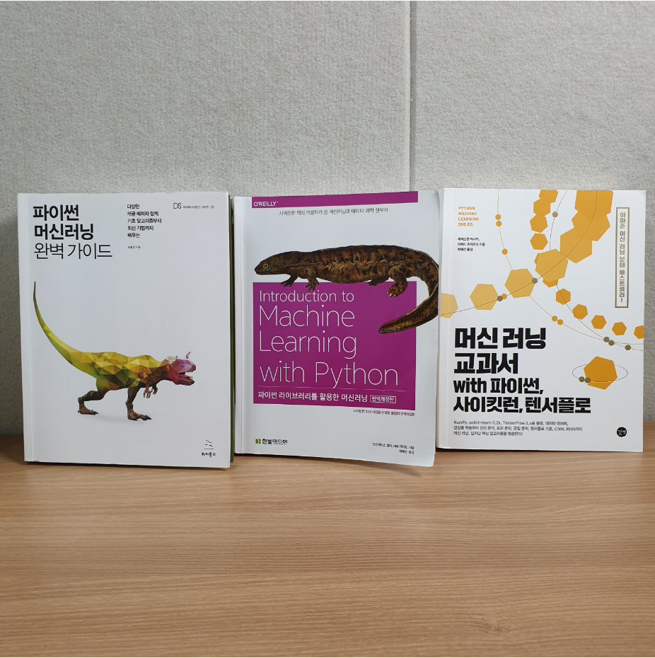

**데이터 분석과 인공지능을 공부**하려는 분들께 국내 서적을 기준으로 **목적에 맞는 책**과 공부를 해왔던 경험담에 대하여 공유드리고자 합니다. 데이터 분석 및 인공지능에 관심있는 분들께 도움이 되셨으면 좋겠습니다.

추천에 앞서, 이 글은 **어떠한 광고비나 광고의 목적으로 작성된 글이 아니며**, 어디까지나 **제 경험을 토대로 작성한 개인의견**임을 명시합니다. 그리고, 제가 **직접 경험한 강의, 스터디, 그리고 읽은 책을 기준**으로 공유드립니다.

## 서론 - 나의 시행 착오

> 저는 인공지능학, 데이터 분석학, 수학 전공자가 아닙니다.

그렇기 때문에 처음에 인공지능/데이터 분석을 공부해보고 싶은데 어디서부터 **어떻게 시작해야할지 정말 막연**했던 기억이 납니다.  저는 **"Python for Data Analysis"**라는 책 1권을 사서 보긴 봤는데요, 도무지 이해가 가지 않았습니다. 그렇기 때문에 처음부터 이 책을 사서 보시는 것은 <u>비추천</u>합니다.

### 주로 온라인, 유튜브 강의와 스터디를 위주로 학습했습니다

Youtube에 공개된 유명한 강의, **Udacity, Udemy, Coursera** 등등의 강의를 주로 학습했었고, 인프런에서도 유료 강좌를 결제해서 수강하였습니다. 그리고, **온/오프라인 스터디와 커널 스터디** 그리고 온라인 과외까지 진행하면서 지속적으로 학습을 했던 것 같습니다. 정말 지난 2년 동안은 거의 새벽까지 독학하면서 삽질도 많이 해보고 캐글과 같은 데이터 분석 대회에 참여하면서 조금씩 조금씩 지식과 경험을 쌓으려고 노력했던 시간이었습니다.

## 지난 2년 동안의 경험을 토대로 처음 시작하려는 분들께 지름길을 추천 드리고자 합니다

>  지난 2년 동안 제가 학습한 강의와 책입니다

* **4개**의 오프라인 강의 (DsSchool, FastCampus)
* **2회**의 원데이 클래스
* **1개**의 Udacity Nanodegree
* **13개**의 Udemy 강의
* **2개**의 Coursera 강의
* **9개**의 Inflearn 데이터분석, 인공지능 강의
* **1년** 이용권 코드잇 강의
* **4개 X 50강**으로 이뤄진 Youtube 플레이리스트 강의
* **100개**가 넘는 유튜브 단일 강의
* **3개**의 오프라인 데이터 분석 스터디
* **2개**의 온라인 스터디
* **1개**의 온라인 과외
* **26권**의 책
* 캐글 커널 스터디, 블로그 등등...

일단, 잘 몰랐기 때문에 유명한 강의는 닥치는 대로 들어보려고 했습니다. 사실 데이터 분석과 인공지능이라는 매력에 빠져있었고, 지금도 너무 좋아하기 때문에 이렇게 할 수 있었던 것 같습니다.

그런데 저는 항상 스스로 독학만 하다보니 <u>너무나도 많은 시행착오와 금전적, 시간적 낭비를 경험</u>했기에 저처럼 데이터 분석/인공지능 을 공부해보고 싶으신 분들께 **저의 직접 경험을 토대로 정리한 학습 순서와 공부법을 추천**해 드리고 싶었습니다. 

다시 한 번 말씀드리지만, 제 개인적인 경험을 토대로 작성하였으며, 개인마다 느끼시는 차이가 있을 수 있습니다.

## Part 1. 기초중의 기초, 기초다지기!! (10시간)

### STEP 1: 파이썬 (Python) - 3시간, 무료 (유튜브)

흔히 제일 많이 착각하시는 점 중 하나가 **데이터 분석을 잘하려면 = 파이썬을 잘해야지** 입니다. 

파이썬을 잘 못다루시더라도 데이터 분석을 하시는데에 지장이 없습니다. 처음 접하시는 분들이 파이썬 배우시다가 지쳐서 포기하시는 분들도 있습니다. **전문적인 전통 파이썬 과정 말고 데이터 분석을 위한 파이썬**만 콕 찝어 들으시면 됩니다. (절대 끝까지 다 들으실 필요 없어요 ㅠㅠ..<u>시간 되시는 분들은 들으시면 당연히 좋습니다</u>)

> 아래 리스트 중에서 본인의 취향에 맞는 강좌 1개를 완강해보세요

* [김왼손의 왼손코딩](https://www.youtube.com/watch?v=c2mpe9Xcp0I&list=PLGPF8gvWLYyrkF85itdBHaOLSVbtdzBww) (유튜브, 무료)
* [혼자 공부하는 파이썬](https://www.youtube.com/watch?v=IUXMgyiFBIU&list=PLBXuLgInP-5kr0PclHz1ubNZgESmliuB7) (유튜브, 무료)

유튜브에 아직 데**이터 분석을 위한 압축 파이썬 과정**은 찾기가 어려워 제가 개인적으로 강의 촬영을 하여 무료로 공개해볼 까 합니다. 공개한다면 추후 알려드릴 수 있도록 하겠습니다.

### STEP 2: 판다스 (Pandas), 시각화 (Matplotlib, Seaborn) - 6~7시간, 무료/유료

판다스라는 라이브러리는 데이터분석을 위해서라면 필수이고, 잘 다루면 다룰수록 무조건 좋습니다. Pandas가 조금 부족하다고 느끼시는 분들은 시간 투자를 하셔서 제대로 배워 두시는 것을 추천 드리며, 엑셀 편집이나 크롤링 등 유용한 기능들을 많이 탑재하고 있으니 매우 유용하게 활용하실 수 있습니다.

판다스는 **책으로 학습하시길 추천** 드립니다.

[파이썬 라이브러리 레시피](http://www.yes24.com/Product/Goods/25962731?scode=032&OzSrank=1) 는 판다스 관련 책은 아니지만 유용한 파이썬 라이브러리 활용법에 대하여 소개합니다. 데이터 분석과 직접적인 관련은 크게 없을 수 있습니다만, application으로 확장하고 싶으신 분들은 한 번 읽어보시면 좋습니다.

[파이썬 머신러닝 판다스 데이터 분석](http://www.yes24.com/Product/Goods/74258258?Acode=101)은 굉장히 친절하게 판다스 관련하여 설명하고 있습니다. 위의 유튜브 강의를 보지 않았더라도 이 책의 실습 예제들만 잘 따라해도 판다스는 어느정도 마스터 할 수 있다고 생각합니다.

[Python for Data Analysis](http://www.yes24.com/Product/Goods/73268296?Acode=101) 는 좀 책이 어렵습니다. 데이터 분석/ 인공지능 관련 도서는 국내 저자분들의 책들이 좀 더 친절하고 이해도 쉽습니다. 이 책은 굉장히 디테일한 내용을 다루고 있기는 합니다만, 입문자에게는 비추입니다. 하지만, 실력을 업그레이드 하고 싶다면 나중에 한 번 보시는 것도 괜찮습니다.

유튜브 [오늘코드](https://www.youtube.com/channel/UCLR3sD0KB_dWpvcsrLP0aUg) 채널에서 판다스와 시각화에 대하여 많이 다루고 있습니다. 흥미로운 내용이 있다면, 참고해 보세요. 강사님이 친절하게 가르쳐 주시는 편입니다.

### Numpy, Scipy 와 같은 라이브러리는 따로 배우지 마세요!

처음에는 Numpy, Scipy 강의를 따로 찾아서 공부했었는데, 굳이 그럴 필요 없습니다. 추후 머신러닝, 딥러닝을 공부하려는 분들은 자연스럽게 터득하게 되니, 굳이 초반에 따로 공부하실 필요 없습니다.

## Part 2. 머신러닝 입문하기 (20시간)

머신러닝 강의 부터는 책으로만 공부하기 어려운 측면이 있습니다. 그렇기 때문에 책과 동영상 강의를 섞어서 듣거나 오프라인 과정을 들으시는 것을 추천 드립니다.

[파이썬 머신러닝 완벽 가이드](http://www.yes24.com/Product/Goods/87044746?Acode=101)는 정말 **추천**하는 책입니다. 굉장히 친절한 책이고 예제도 풍부합니다. 게다가 저자분께서 얼마 전에 인터넷 강의도 제작하셨습니다 (유료). 인프런에서 유료 강의 결제 후 책과 함께 들으시는 것을 추천 드립니다.

[인프런강의 - 파이썬 머신러닝 완벽 가이드](https://www.inflearn.com/course/파이썬-머신러닝-완벽가이드) 에서 유료로 동영상 강의도 함께 제공하고 있습니다. 사실 딥러닝 강의는 잘되어 있는 강의들이 많은데, 머신러닝 강의는 유튜브에 잘 되어 있는 공개된 강의는 아직 못 찾았습니다.

아! 물론 있습니다. 전 세계적으로 **제일 유명한 강의 중 하나**인 Andrew Ng 교수님의 강의입니다.

[Machine Learning - Andrew Ng (Stanford University)](https://www.youtube.com/watch?v=PPLop4L2eGk&list=PLLssT5z_DsK-h9vYZkQkYNWcItqhlRJLN) 

단점은 영어, 영어, 영어입니다...

[Introduction to Machine Learning with Python](http://www.yes24.com/Product/Goods/70969329?scode=032&OzSrank=4) 책도 추천 합니다. 우선, 파이썬 머신러닝 완벽 가이드를 마스터 하신 후 보셔도 좋고, 같이 병렬적으로 보셔도 좋습니다. [머신 러닝 교과서 with 파이썬 사이킷런, 텐서플로](http://www.yes24.com/Product/Goods/73270768?Acode=101) 책도 꽤 좋은 실습서입니다. Introduction to Machine Learning with Python 책이 좀 어렵게 느끼실 수도 있는데 머신 러닝 교과서 with 파이썬 사이킷런 책은 좀 더 읽기 편하게 쓰여진 책입니다. 완벽 가이드와 같이 보셔도 좋습니다.

> 추천 순위

1. 파이썬 머신러닝 완벽 가이드
2. Introduction to Machine Learning with Python
3. 머신러닝 교과서 with 파이썬 사이킷런, 텐서플로

