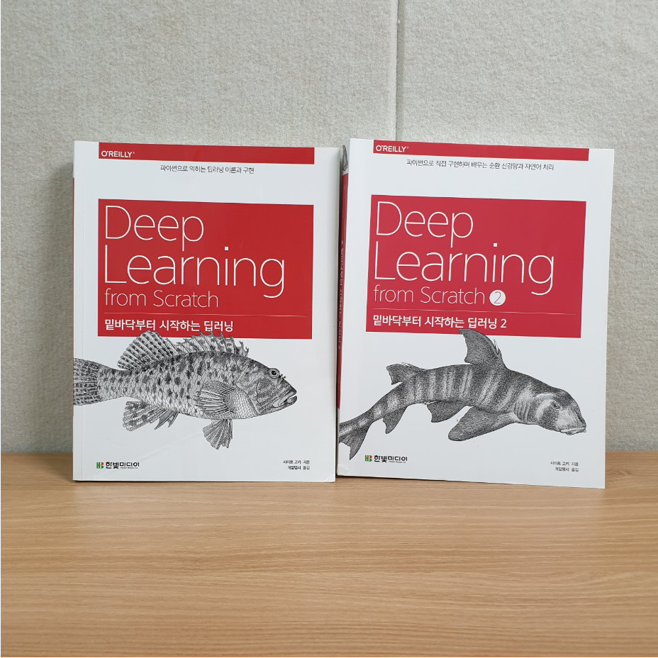
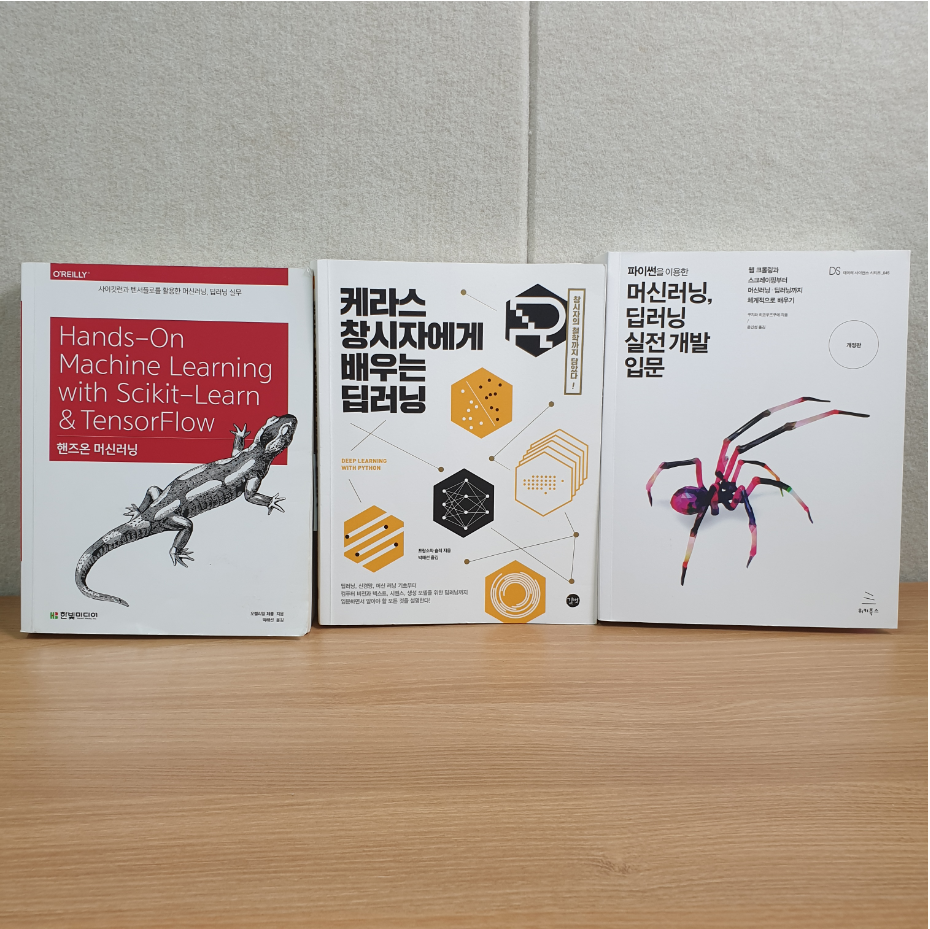
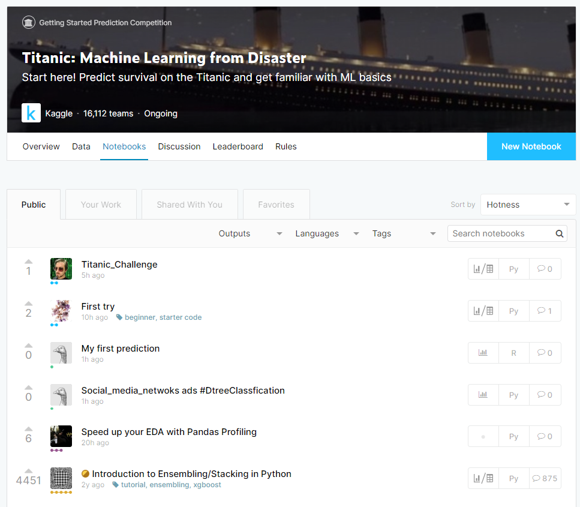
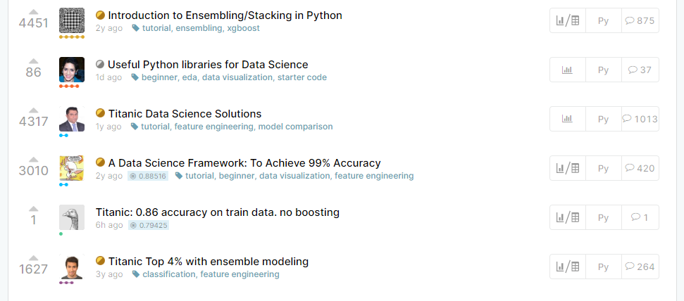
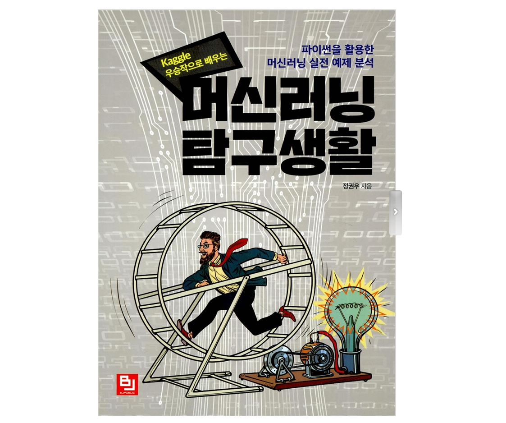
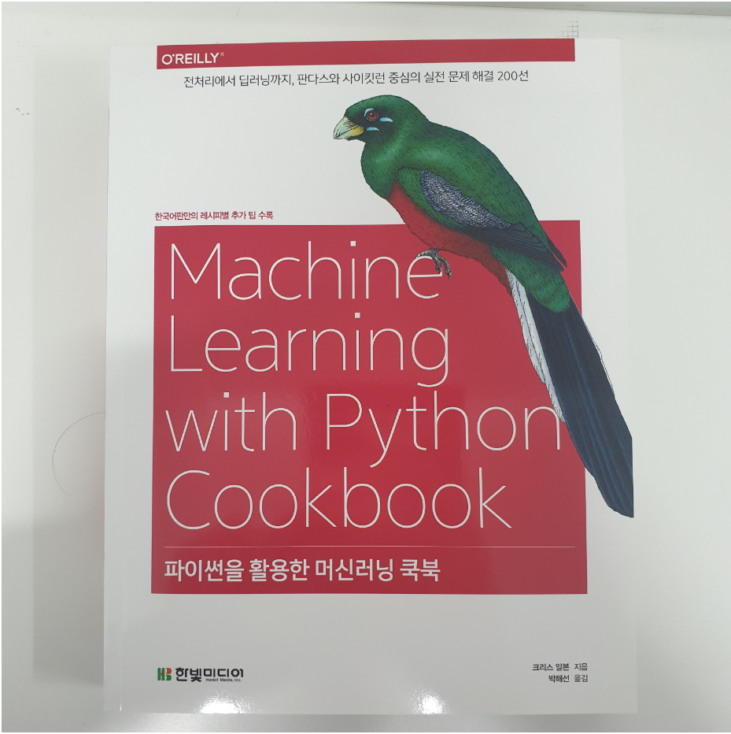

**데이터 분석과 인공지능을 공부**하려는 분들께 국내 서적을 기준으로 **목적에 맞는 책**과 공부를 해왔던 경험담에 대하여 공유드리고자 합니다. 데이터 분석 및 인공지능에 관심있는 분들께 도움이 되셨으면 좋겠습니다.

추천에 앞서, 이 글은 **어떠한 광고비나 광고의 목적으로 작성된 글이 아니며**, 어디까지나 **제 경험을 토대로 작성한 개인의견**임을 명시합니다. 그리고, 제가 **직접 경험한 강의, 스터디, 그리고 읽은 책을 기준**으로 공유드립니다.

이번 글은 [데이터 분석/인공지능을 공부하려는 분들께 경험을 토대로 학습 방법과 책 추천 (1)](https://teddylee777.github.io/thoughts/데이터분석-인공지능-서적-추천) 에 이어지는 글입니다. 

## 테디노트 책 출간 소식 전해 드립니다~^^

지난 6개월간 3명의 동료들과 열심히 집필한 책이 드디어 온라인/오프라인 출간 되었습니다!

[책 출간 소식 보러가기](https://teddylee777.github.io/thoughts/tf-book)

> 참고

혼자 데이터분석/머신러닝/딥러닝에 입문하시는 분들은 [Machine Learning Study 혼자 해보기 깃헙](https://github.com/teddylee777/machine-learning)을 참고해 보세요.

## 딥러닝 공부 (총 30~40시간 이상)

머신러닝을 마스터 하셨다면, 딥러닝 공부를 해볼 차례입니다.

대부분의 분들이 딥러닝과 머신러닝의 차이에 대하여 잘 모르시는 분들이 많습니다.

머신러닝은 딥러닝을 포괄하고 있는 상위 개념으로 이해하시면 됩니다. 딥러닝과 머신러닝의 구체적인 차이에 대해 이해하시려면 관련 강의를 듣다 보면 보통 제일 먼저 다루기 때문에 시작하기 전부터 꼭 알고 들어갈 필요는 없습니다. 다만, 머신러닝은 주로 정형 데이터 (숫자나 숫자로 표현할 수 있는 깔끔한 데이터)에 주로 사용되고, 딥러닝은 비정형 데이터 (음성, 센서, 사진 등)에 주로 활용됩니다.

요즘엔 캐글 (데이터 분석 대회)에서 딥러닝을 활용한 다양한 대회가 많이 나오고 있는 추세이기 때문에 이러한 대회에 도전해보거나, **자연어 처리, 텍스트 분류, 챗봇, 자율 주행**등등의 분야에 관심이 있다면, **딥러닝 학습은 필수** 입니다.

하지만, 대부분의 캐글 대회에서는 머신러닝으로도 충분히 고득점을 할 수 있기 때문에, **머신러닝 학습 -> 캐글 도전 -> 딥러닝 학습**으로 진행하시는 것도 괜찮습니다. 왜냐하면, 너무 학습하는 시간이 길다보면 지쳐버릴 수 가 있습니다.

### 김성훈 교수님 "모두를 위한 딥러닝 시즌 1" - 무료, 난이도 중

그 다음으로는 유튜브 강의와 온라인 강의를 찾아 공부하기 시작했습니다. 이미 너무나도 유명한 김성훈 교수님의 "모두를 위한 딥러닝 시즌1" 강의를 처음부터 차근차근 공부했습니다. 정말 쉽게 설명해 주시고, 따라하기도 어렵지 않습니다. 처음 배우시는 분들은 꼭 Playlist를 완강해보시길 추천 드립니다.

[김성훈 교수님 "모두를 위한 딥러닝 시즌 1"](https://www.youtube.com/watch?v=BS6O0zOGX4E&list=PLlMkM4tgfjnLSOjrEJN31gZATbcj_MpUm)

### 스탠포드 CS231n - 무료, 영어, 난이도 있음

실제 스탠포드 학생들을 대상으로 강의 영상을 유튜브에 공개하였습니다. 커리큘럼이 굉장히 탄탄하며, 이미 유명한 강좌이기도 합니다. 다만, 모든 수업이 영어로 진행되기 때문에 영어에 친숙한 분들에게 추천합니다. 김성훈 교수님의 강의를 충분히 이해하고 난 뒤 수강하시는 것을 추천 드립니다.

[유튜브 - Stanford CS231n](https://www.youtube.com/watch?v=vT1JzLTH4G4&list=PLC1qU-LWwrF64f4QKQT-Vg5Wr4qEE1Zxk)

한 강의가 1시간씩 되기 때문에 다소 지루하고 어려운 부분이 있을 수 있습니다. 그래도 인내하고 완강하면, 어느정도 기초가 다져 지는 것을 느낄 수 있습니다.

> 코멘트

딥러닝 학습 부터는 관련 도서도 많이 봐야하고, 논문, 블로그, 아티클 등을 많이 참고 하셔야 합니다. 왜냐하면, 어떠한 정해진 공식이 없고 지금 현재도 활발히 연구되고 있어 매년 새로운 성능 좋은 알고리즘이 나오고는 합니다. 또한, 내가 적용하고자 하는 분야에 대한 논문이나 적용 사례들을 봐야하는 경우도 많기 때문에 사실 딥러닝 분야는 **독학하기에는 어느 정도 한계성**은 있습니다 (하지만, 불가능은 없습니다!)

## 추천 하고 싶은 관련 국내 서적 (딥러닝)

1. [밑바닥부터 시작하는 딥러닝](http://www.yes24.com/Product/Goods/34970929?scode=032&OzSrank=1)

밑바닥부터 시작하는 딥러닝 입니다. 딥러닝 알고리즘을 파이썬으로 직접 구현해 보면서 **차근차근 기본기를 다져나가는 책**입니다. 처음부터 이 책을 보면 약간 어렵다고 생각하실 수도 있습니다. 

그런 분들을 위해 좀 더 실용서에 가까운 책을 추천하자면,

[핸즈온 머신러닝](http://www.yes24.com/Product/Goods/59878826?scode=032&OzSrank=1): `sklearn`의 머신러닝 패키지를 자세히 다루고 텐서플로우 까지 다루는 실습 위주의 실용서입니다. 처음부터 차근 차근 잘 따라하다보면 재밌는 예제들도 많고 내용도 알차기 때문에 추천 드립니다.

[케라스 창시자에게 배우는 딥러닝](http://www.yes24.com/Product/Goods/65050162?Acode=101): 케라스는 텐서플로우를 더 쉽게 사용할 수 있도록 만든 wrapper 라이브러리 입니다. 이 라이브러리를 만든 창시자가 직접 케라스 활용법에 대하여 작성한 책입니다. 다양한 예제가 준비되어 있고, 케라스를 처음 배우시는 분이라면 어렵지 않게 배울 수 있는 책입니다.

[머신러닝, 딥러닝 실전개발 입문](http://www.yes24.com/Product/Goods/84802550?Acode=101): 앞서 소개해 드린 책들이 알고리즘의 활용법에 중점을 둔 책이었다면, 이 책은 실제 데이터 수집, 실전 개발에 활용할 때 도움이 될 만한 책입니다. (캐글만 하실 분들은 추천하지 않습니다) 국내 저자가 쓴 책이기 때문에 실습도 많고 흥미로운 예제들도 많습니다.

**3가지 책을 순서대로 보시는 것을 추천** 드립니다.

## 캐글을 더 잘하고 싶을 때

캐글을 더 잘하고 싶다면, 제일 추천하는 방식은 **캐글 커널 파헤치기** 입니다.

캐글 대회에서 Notebook을 클릭해 보면 고수들이 **자신의 솔루션을 공개**하거나, 성**능을 개선하기 위해서는 어떻게 했다**랄지 좋은 강의형 Notebook도 공유를 하고 있습니다. 

왼쪽에 Upvote라고 추천을 많이 받은 Notebook을 천천히 읽어보시고, 그대로 내가 따라해보면서 점수를 올려보다 보면 실력이 금방금방 늘 수 있습니다 (책으로 학습하시는 것보다 캐글 커널 스터디를 추천드립니다)

다만, 단점은 **캐글 커널 스터디는 실무에서 머신러닝, 딥러닝 개발과 조금 다를 수 있습니다**. 한마디로, 캐글에서는 점수를 극단적으로 올리기 위해서 적용하는 몇 가지 스킬(?) 들이 있는데, 실무에서는 이러한 스킬이 적절하지 못하거나 점수로 확답받을 수 있는 일종의 평가 시스템이 없기 때문에 잘 판단하시고 적용해야 합니다.

[머신러닝 탐구생활](http://www.yes24.com/Product/Goods/63830327?scode=029): 캐글 입상자나 상위 랭커의 솔루션을 분석한 책입니다. 5개의 캐글 프로젝트로 구성되어 있으며, 어떤 방식으로 수상할 수 있었는지 솔루션을 분석하는 책이니, 어느 정도 수준의 캐글 실력을 갖췄다면 추천해드리는 책입니다.

[파이썬을 활용한 머신러닝 쿡북](http://www.yes24.com/Product/Goods/78222401?scode=032&OzSrank=1): 좋은 feature engineering 방법, 머신러닝 알고리즘을 활용시 상황별 Tip들을 모아놓은 유용한 책입니다. 캐글을 할 때도 마찬가지지만, 어떻게 하면 좋은 feature을 추출할지, 이상치는 어떻게 감별해 낼 것인지 등 실제 캐글시 **유용한 팁들을 모아놓은 책**입니다.

