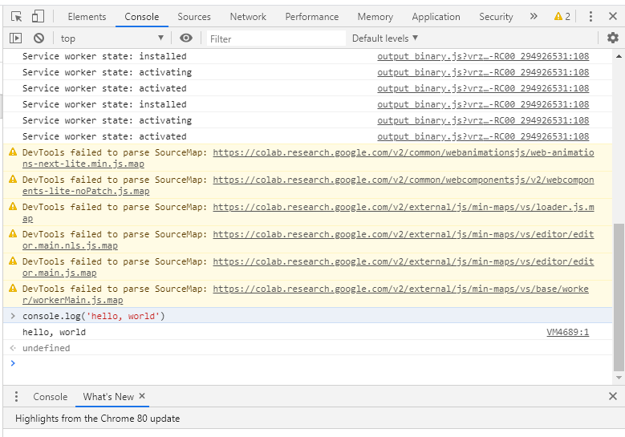
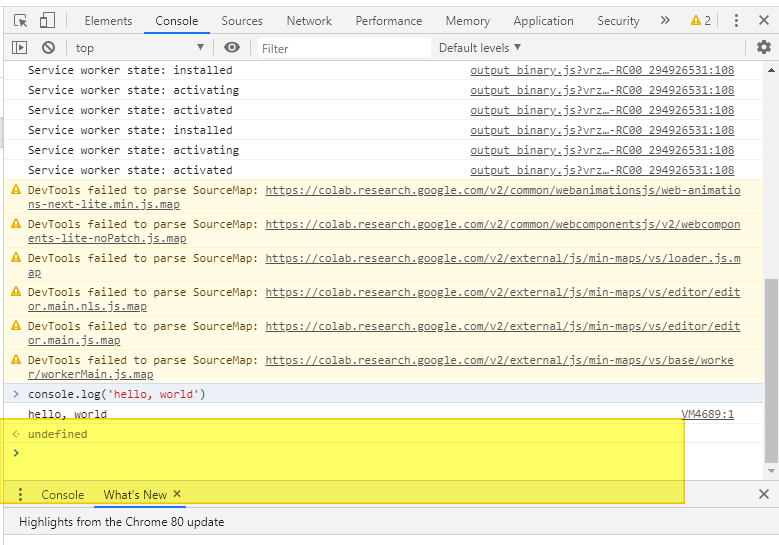

구글 코랩 (Google colab) 은 **90분** 동안 아무런 interaction이 없거나, 총 **12시간**의 세션 timeout이 존재합니다. 

더 쉽게 설명하자면, colab에서 학습을 돌려놓고 90분동안 브라우져에 아무런 interaction을 주지 않는다면, 긴 학습을 다 수행하지 못하고 끊겨버릴 수 있습니다.

이번 포스팅에서는 이를 방지하는 javascript 코드를 소개해 드리고, 이 코드를 console 창에 실행시킴으로써 90분의 idle timeout을 방지하는 방법을 알려드리겠습니다.


## chrome의 F12 개발자 콘솔 열기

colab을 연뒤 F12를 눌러주면, 개발자 콘솔이 나타나게 됩니다.




개발자 콘솔에서 가장 밑에 코드를 입력할 수 있는 창이 있습니다.




이곳에 자바스크립트 코드를 입력하시면 됩니다.

**60초**마다 **ClickConnect()** 의 함수를 실행시키게 됩니다. 그리고 console 창에서도 실행이 될 때마다 확인하실 수 있습니다.


> 아래 코드를 console 창에 붙혀넣기 후 실행

```javascript
function ClickConnect(){
    console.log("코랩 연결 끊김 방지"); 
    document.querySelector("colab-toolbar-button#connect").click() 
}
setInterval(ClickConnect, 60 * 1000)
```


그러면, 매 1분마다 콘솔창에 "코랩 연결 끊기 방지" 문구와 함께 **colab idle timeout이 되는 것을 방지**해 줍니다.