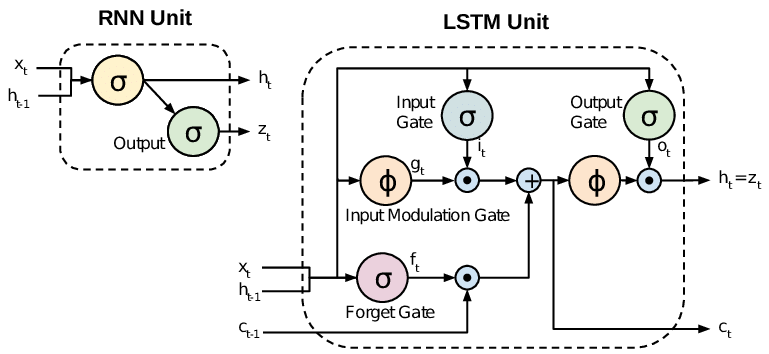
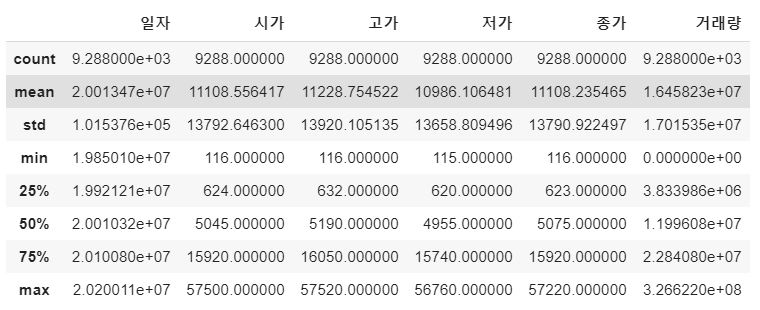
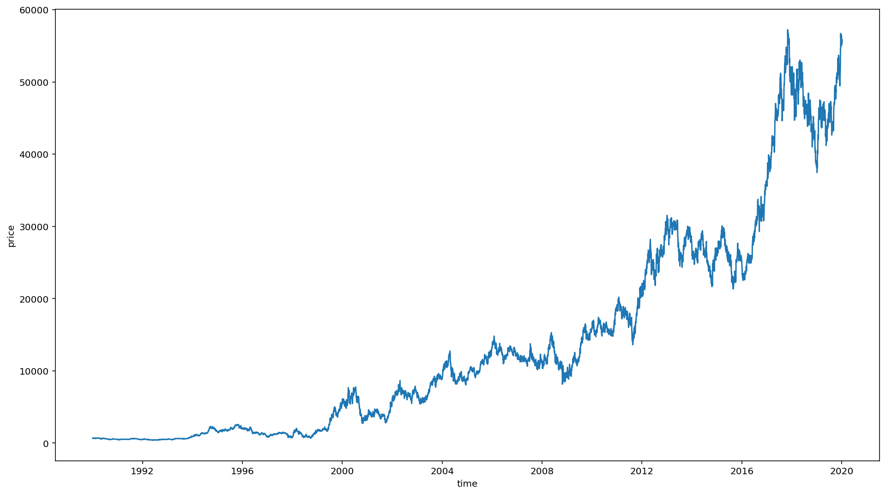
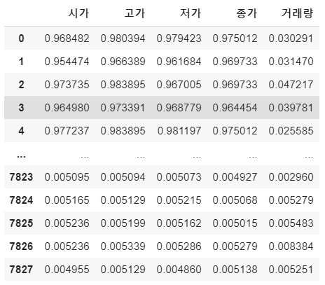
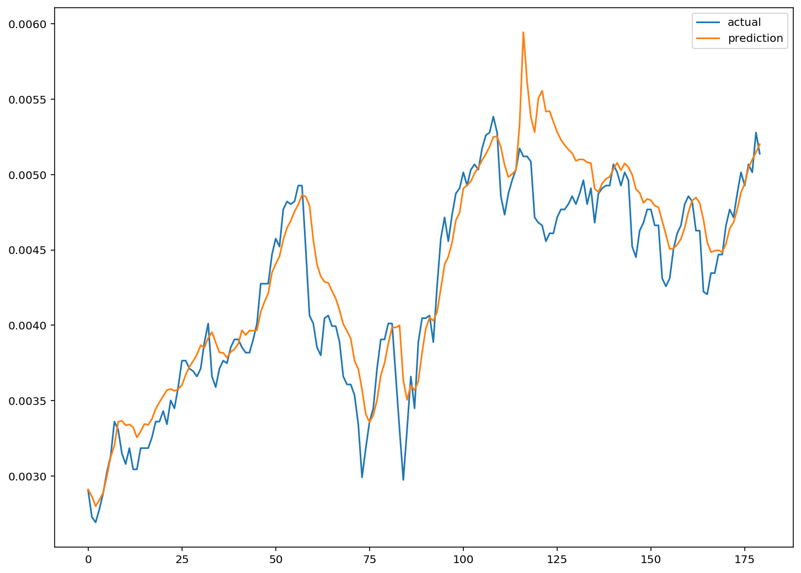

딥러닝으로 과연 주가 예측이 가능할까요? **정답은 YES! 그러나 수익 장담은 NO!** 입니다. 

물론, 월가에 있는 퀀트 투자자들이 인공지능을 활용하여 주가 예측 및 AI를 활용하여 퀀트시스템을 구축하여 시장대비 높은 수익률을 올리기도 하지만, 수많은 **feature engineering**과 도메인 지식이 결합되어야 시장 대비 목표 수익률에 도달할 수 있을 것입니다.

이번 포스팅에서는 **LSTM 알고리즘을 활용**하여 **삼성전자 주가를 재미로 분석해보고 예측**해보도록 하겠습니다.


## LSTM 이란

`LSTM`은 **Recurrent Neural Networks**의 한 종류로써, **순서가 중요**한 feature의 요소일 때 흔히 적용하는 RNN의 한 종류로써, 쉬운 예를 들어 설명하자면, 문장과 같은 단어가 문장 안에서의 순서가 중요한 경우나, 주가와 같은 시계열 데이터셋에서 효과적인 모델입니다. 특히, 최근에는 자연어 처리 분야에서 활발히 사용되어지는 알고리즘입니다.





LSTM의 가장 중요한 특징은 앞서 말한바와 같이, `squence`를 저장하고 이를 학습에 활용한다는 점입니다. 사실, 여러 강의나 구글링을 해보시면 LSTM의 구조도를 볼 수 있는데, 이번 포스팅에서는 LSTM이 중점이 아닌 이를 활용한 시계열 데이터셋의 예측 예제를 설명하기 위함이 주 목적이기 때문에, 자세한 설명은 이미 잘 설명되어 있는 [ratsgo님의 블로그](https://ratsgo.github.io/natural language processing/2017/03/09/rnnlstm/)를 참고해 보시기 바랍니다.


## 데이터 셋 생성 및 전략

우선, 삼성전자 주가 데이터를 받아 옵니다. 가장 최신 파일을 받고 싶으신 분들은 **yahoo finance에서 csv 파일**로 다운로드 받으실 수 있습니다. 혹시 샘플 csv 데이터가 필요하신 분들은 제가 활용한 데이터의 [다운로드 링크](http://bit.ly/2SJUtyY)를 걸어드립니다.


```python
df_price = pd.read_csv(os.path.join(data_path, '01-삼성전자-주가.csv'), encoding='utf8')
df_price.describe()
```





컬럼은 **[일자, 시가, 고가, 저가, 종가, 거래량]**으로 구성된 매우 단순한 데이터 셋입니다. 총 9,288개의 row로 구성되어 있네요. 우리는 **일자, 시가, 고가, 저가, 거래량을 토대로 미래의 주가인 "종가"를 예측**해 보도록 하겠습니다.


### 날짜 datetime 포맷으로 변환

```python
pd.to_datetime(df_price['일자'], format='%Y%m%d')
# 0      2020-01-07
# 1      2020-01-06
# 2      2020-01-03
# 3      2020-01-02
# 4      2019-12-30

df_price['일자'] = pd.to_datetime(df_price['일자'], format='%Y%m%d')
df_price['연도'] =df_price['일자'].dt.year
df_price['월'] =df_price['일자'].dt.month
df_price['일'] =df_price['일자'].dt.day
```


### 1990년도 이후의 주가 시각화

```python
)
sns.lineplot(y=df['종가'], x=df['일자'])
plt.xlabel('time')
plt.ylabel('price')
```




### Normalization

딥러닝 모델이 학습을 잘하기 위해서는 정규화 해주는 작업이 필요합니다. sklearn 패키지에 있는 `MinMaxScaler`를 활용하여 전체 학습 데이터를 Normalize 해 주도록 하겠습니다.

```python
from sklearn.preprocessing import MinMaxScaler

scaler = MinMaxScaler()
scale_cols = ['시가', '고가', '저가', '종가', '거래량']
df_scaled = scaler.fit_transform(df[scale_cols])

df_scaled = pd.DataFrame(df_scaled)
df_scaled.columns = scale_cols

print(df_scaled)
```




`MinMaxScaler`를 해주면 전체 데이터는 0, 1사이의 값을 갖도록 해줍니다.


### 학습을 시킬 데이터 셋 생성

여기서 `window_size`를 정의하여 학습 데이터를 생성할 예정입니다. `window_size`는 내가 얼마동안(기간)의 주가 데이터에 기반하여 다음날 종가를 예측할 것인가를 정하는 parameter 입니다. 즉 내가 과거 20일을 기반으로 내일 데이터를 예측한다라고 가정했을 때는 `window_size=20`이 됩니다.

저는 과거 20일을 기준으로 그 다음날의 데이터를 예측해 보도록 하겠습니다.

`TEST_SIZE = 200`은 학습은 과거부터 200일 이전의 데이터를 학습하게 되고, TEST를 위해서 이후 200일의 데이터로 모델이 주가를 예측하도록 한 다음, 실제 데이터와 오차가 얼마나 있는지 확인해 보도록 하겠습니다.


```python
train = df_scaled[:-TEST_SIZE]
test = df_scaled[-TEST_SIZE:]
```


> dataset을 만들어 주는 함수

```python
def make_dataset(data, label, window_size=20):
    feature_list = []
    label_list = []
    for i in range(len(data) - window_size):
        feature_list.append(np.array(data.iloc[i:i+window_size]))
        label_list.append(np.array(label.iloc[i+window_size]))
    return np.array(feature_list), np.array(label_list)
```


위의 함수는 정해진 `window_size`에 기반하여 20일 기간의 데이터 셋을 묶어 주는 역할을 합니다.

즉, 순차적으로 20일 동안의 데이터 셋을 묶고, 이에 맞는 label (예측 데이터)와 함께 return해 줍니다.


### feature 와 label 정의

```python
feature_cols = ['시가', '고가', '저가', '거래량']
label_cols = ['종가']

train_feature = train[feature_cols]
train_label = train[label_cols]

# train dataset
train_feature, train_label = make_dataset(train_feature, train_label, 20)

# train, validation set 생성
from sklearn.model_selection import train_test_split
x_train, x_valid, y_train, y_valid = train_test_split(train_feature, train_label, test_size=0.2)

x_train.shape, x_valid.shape
# ((6086, 20, 4), (1522, 20, 4))

# test dataset (실제 예측 해볼 데이터)
test_feature, test_label = make_dataset(test_feature, test_label, 20)
test_feature.shape, test_label.shape
# ((180, 20, 4), (180, 1))
```

자, 이제 학습해야할 데이터 셋은 모두 준비가 되었습니다. 이젠 모델에 학습을 시켜보고 evaluation을 해볼 차례입니다.


## Keras를 활용한 LSTM 모델 생성

```python
from keras.models import Sequential
from keras.layers import Dense
from keras.callbacks import EarlyStopping, ModelCheckpoint
from keras.layers import LSTM

model = Sequential()
model.add(LSTM(16, 
               input_shape=(train_feature.shape[1], train_feature.shape[2]), 
               activation='relu', 
               return_sequences=False)
          )
model.add(Dense(1))
```


모델은 매우 간단한 모델을 적용하였습니다. 이미 우리의 feature 데이터의 복잡도가 그렇게 크지 않고 학습해야할 데이터도 10,000개 이하 수준이기 때문에 아주 단순한 모델로도 충분히 좋은 성능을 기대해 볼 수 있습니다. 오히려 **너무 복잡한 모델이 과적합을 유발하고, 학습도 잘 되지 못하는 결과**를 낳을 수 있습니다.


> 모델의 학습

```python
model.compile(loss='mean_squared_error', optimizer='adam')
early_stop = EarlyStopping(monitor='val_loss', patience=5)
filename = os.path.join(model_path, 'tmp_checkpoint.h5')
checkpoint = ModelCheckpoint(filename, monitor='val_loss', verbose=1, save_best_only=True, mode='auto')

history = model.fit(x_train, y_train, 
                    epochs=200, 
                    batch_size=16,
                    validation_data=(x_valid, y_valid), 
                    callbacks=[early_stop, checkpoint])

# ...
# ...

# Epoch 00015: val_loss did not improve from 0.00002
# Epoch 16/200
# 6086/6086 [==============================] - 12s 2ms/step - loss: 3.1661e-05 - val_loss: 4.1063e-05

# Epoch 00016: val_loss did not improve from 0.00002
# Epoch 17/200
# 6086/6086 [==============================] - 13s 2ms/step - loss: 2.4644e-05 - val_loss: 4.0085e-05

# Epoch 00017: val_loss did not improve from 0.00002
# Epoch 18/200
# 6086/6086 [==============================] - 13s 2ms/step - loss: 2.2936e-05 - val_loss: 2.4692e-05

# Epoch 00018: val_loss did not improve from 0.00002
```


Epoch 18번 기준으로 0.00002 의 평균 오차를 확인할 수 있습니다. 그럼, 학습한 모델로 미래 주가 예측을 해보도록 하겠습니다.


```python
# weight 로딩
model.load_weights(filename)

# 예측
pred = model.predict(test_feature)
```


## 실제데이터와 예측한 데이터 시각화

```python
plt.figure(figsize=(12, 9))
plt.plot(test_label, label='actual')
plt.plot(pred, label='prediction')
plt.legend()
plt.show()
```




실제 데이터와 어느 정도 비슷한 트렌드를 따라가는 모습입니다.

더 많은 데이터, window 사이즈 변경, feature 추가, 모델 수정으로 더 좋은 성능의 모델을 기대해 볼수 있습니다.

최근에는 자연어 처리를 통하여 뉴스 키워드와 주가의 상관관계 분석을 통해 이를 수치화하여 모델에 반영한다면, 훨씬 더 좋은 성능의 예측 모델을 완성할 수 있습니다.