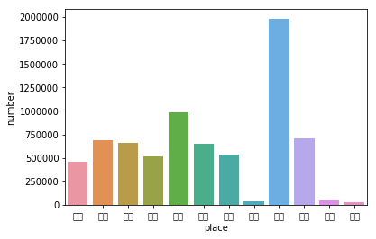
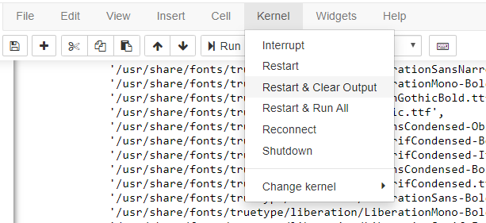

Ubuntu 의 Docker 환경으로 Jupyter Notebook 서버를 돌리고 있을 때 **matplotlib 한글 깨짐 현상**이 종종일어납니다. 이럴 땐 한 번 한글폰트 설치 후 Image를 백업시키는 것도 방법이 될 수 있습니다. 

일단, Ubuntu + Docker 조합으로 Jupyter Notebook서버를 돌리시는 분들을 위하여 **한글 깨짐 현상을 해결**해 보도록 하겠습니다.

설치는 bash shell에서 진행할 수도 있고, jupyter notebook에 **!를 맨 앞에 붙혀주면, bash command를 실행**하게 됩니다.





## 나눔 폰트 설치 및 cache 제거

> 나눔 폰트 설치

```bash
!apt-get install -y fonts-nanum
```


> 나눔 폰트가 설치되었는지 확인

```bash
!ls -l /usr/share/fonts/truetype/
```


> matplotlib에 남아있는 폰트 캐시 삭제

```bash
!rm -rf ~/.cache/matplotlib/*
```


> 폰트 캐시 생성

```bash
!fc-cache -fv
```


모두 설치가 다 되었다면, **Kernel을 한 번 restart** 해줍니다.




## 폰트 설치 확인 및 적용

```python
import matplotlib    
import matplotlib.font_manager

[f.name for f in matplotlib.font_manager.fontManager.ttflist if 'Nanum' in f.name]
 # ['NanumBarunGothic',
 # 'NanumMyeongjo',
 # 'NanumMyeongjo',
 # 'NanumGothic',
 # 'NanumBarunGothic',
 # 'NanumGothic']
```


## 매번 한글 폰트 시각화가 필요할 때 아래 코드를 로드합니다

> NanumGothic 폰트 적용

```python
import matplotlib as mpl

# 유니코드 깨짐현상 해결
mpl.rcParams['axes.unicode_minus'] = False

# 나눔고딕 폰트 적용
plt.rcParams["font.family"] = 'NanumGothic'
```


폰트 설정 후 한글이 이제 **정상적으로 출력** 되는 것을 확인할 수 있습니다.

