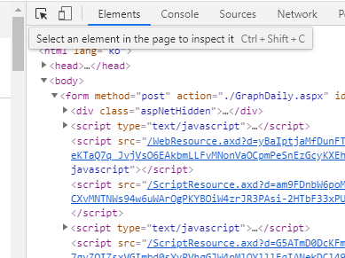
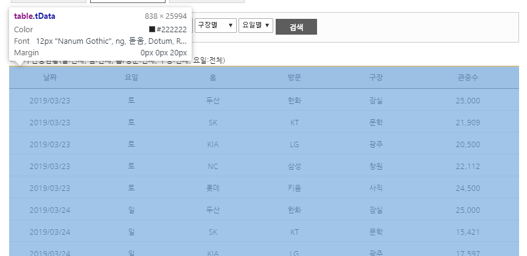
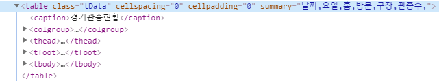
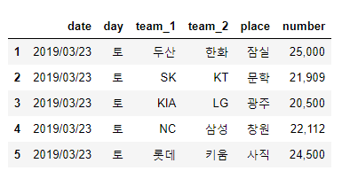
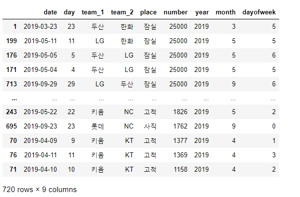
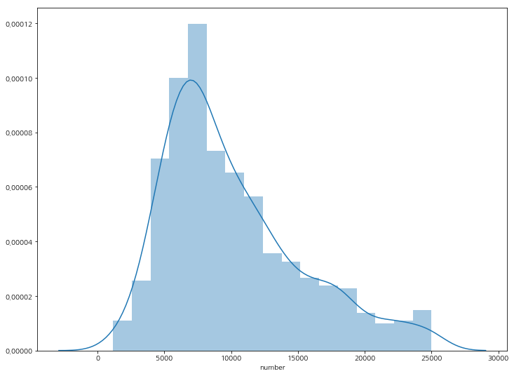
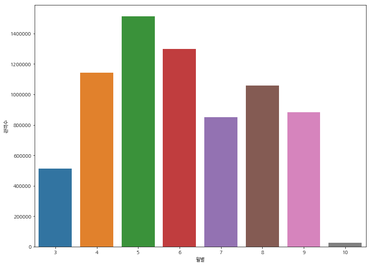
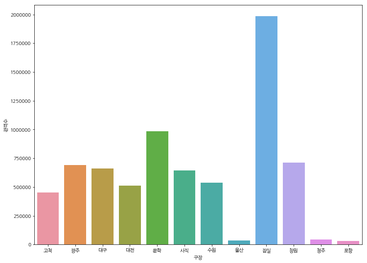
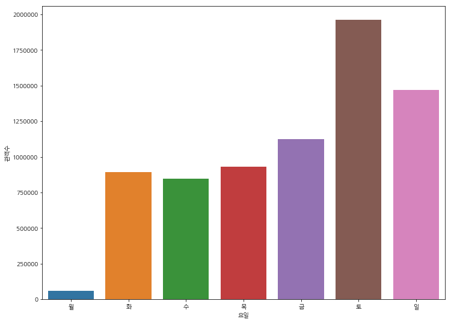
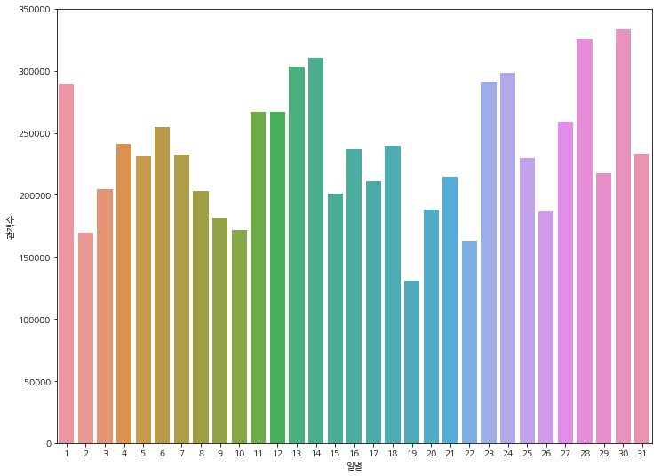

이번 포스팅에서는 **2019년 KBO 관객수를 크롤링**해보고, `matplotlib` 라이브러리를 활용하여 **시각화** 해보도록 하겠습니다. 

실습을 위하여 **필요한 라이브러리**는 다음과 같습니다.

* BeautifulSoup4
* Requests
* Pandas
* Matplotlib
* Seaborn


## BeautifulSoup을 활용하여 크롤링해오기

KBO 관객수 사이트 : https://www.koreabaseball.com/History/Crowd/GraphDaily.aspx

위의 URL로 이동해 보시면 **KBO의 2019년 한 해 관객수별 지표**가 나타납니다.


Default로 아무런 설정을 해주지 않는다면 위와같이 나타나 있는 사이트를 확인해 볼 수 있습니다.

그럼 request 모듈로 일단 html을 긁어 옵니다.

```python
import pandas as pd
import matplotlib.pyplot as plt
import matplotlib as mlp
import seaborn as sns
import requests
from bs4 import BeautifulSoup

%matplotlib inline
# 한글 폰트 설정
plt.rcParams['font.family'] = 'NanumGothic'

req = requests.get('https://www.koreabaseball.com/History/Crowd/GraphDaily.aspx')
soup = BeautifulSoup(req.text, 'html.parser')
```


자, 그럼 soup이라는 객체는 해당 URL의 `html` 소스를 긁어오게 됩니다.

이중에서 우리는 `class`가 `tData`라는 녀석의 table 전체를 가져와야 합니다. 


**F12를 눌러 개발자모드**를 열고




상단에 있는 객체 선택 아이콘을 클릭합니다. (**Ctrl+Shift+C 단축키**를 활용하셔도 됩니다)

그리고, 긁어 오고 싶은 테이블을 선택하면 **파란색으로 쉐이딩** 되면서 해당 객체의 **html 소스 위치**를 보여줍니다.


> 사이트에서 요소를 클릭하면 이렇게 나타납니다




> table의 class = tData를 전체를 가져오면 되겠네요




`BeautifulSoup`으로 특정 class 이름으로 객체를 가져오기 위해서는 다음과 같이 코드를 작성해 줍니다.

```python
# class 이름이 tData인 table을 가져옵니다
tdata = soup.find('table', {'class':'tData'})

# table에서 tbody를 찾습니다
series = tdata.find('tbody')

# 객체가 아닌 string 형태로 담아줍니다
kbdata_spec = series.text
```


그럼 `kbdata_spec`을 출력한다면 다음과 같이 나타납니다.

```
'\n\n2019/03/23\n토\n두산\n한화\n잠실\n25,000\n\n\n2019/03/23\n토\nSK\nKT\n문학\n21,909\n\n\n2019/03/23\n토\nKIA\nLG\n광주\n20,500\n\n\n2019/03/23\n토\nNC\n삼성\n창원\n22,112\n\n\n2019/03/23\n토\n롯데\n키움\n사직\n24,500\n\n\n2019/03/24\n일\n두산\n한화\n잠실\n25,000\n\n\n2019/03/24\n일\nSK\nKT\n문학
...
...
...
\n16,156\n\n\n2019/03/29\n금\nLG\n롯데\n잠실\n19,370\n\n\n2019/03/29\n금\n한화\nNC\n대전\n12,152\n\n\n2019/03/29\n금\n삼성\n두산\n대구\n12,361\n\n\n2019/03/29\n금\n키움\nSK\n고척\n5,435\n\n\n2019/03/30\n토\nKT\nKIA\n수원\n11,475\n\n\n2019/03/30\n토\nLG\n롯데\n잠실\n20,601\n\n\n2019/03/30\n토\n한화\nNC\n대전\n11,239\n\n\n20
...
...
```

이렇게 보기 불편하게 **string으로 출력**될 뿐만 아니라 우리가 시각화를 하기 위해서는  `pandas` 라이브러리를 활용하여 **DataFrame으로 변경**해 보도록 하겠습니다.


> DataFrame으로 변경하는 코드

```python
# tr 태그를 찾습니다.
table_rows = tdata.find_all('tr')

# res라는 list에 row 별로 담아줍니다
res = []
for tr in table_rows:
    td = tr.find_all('td')
    row = [tr.text.strip() for tr in td if tr.text.strip()]
    if row:
        res.append(row)
        
# DataFrame으로 만들어 줍니다
df = pd.DataFrame(res, columns=["date", "day", "team_1", "team_2", 'place', 'number'])

# 첫 줄은 드롭합니다.
df = df.drop(0)
```




## 전처리

몇 가지 전처리를 해주도록 하겠습니다.

1. 숫자에 들어가 있는 , (콤마)를 제거합니다.
2. date를 datetime type으로 변환합니다.
3. 월, 일, 년으로 분리 합니다.


```python
# 콤마 제거
df['number'] = df['number'].str.replace(',', '')

# datetime type으로 변환
df['date'] = pd.to_datetime(df['date'])

# 날짜 column을 분리
df['year'] = df['date'].dt.year
df['month'] = df['date'].dt.month
df['day'] = df['date'].dt.day
df['dayofweek'] = df['date'].dt.dayofweek
```


number 컬럼은 콤마를 제거하기는 했지만, 아직 숫자형 컬럼으로 분리되어 있지 않습니다.

```python
df['number'] = df['number'].astype(int)
```


데이터를 관객숫자에 대하여 정렬해 보도록 하겠습니다.

```python
df.sort_values('number', ascending=False)
```




## 데이터 시각화

> 관객 숫자 분포도 확인

```python
sns.distplot(df['number'])
```




> 월별 관객수 확인

```python
plt.figure(figsize=(12, 9))
x = df.groupby('month')['number'].sum().keys()
y = df.groupby('month')['number'].sum()
sns.barplot(x, y)
```




> 구장별 관객수

```python
)
x = df.groupby('place')['number'].sum().keys()
y = df.groupby('place')['number'].sum()
sns.barplot(x, y)
plt.xlabel('구장')
plt.ylabel('관객수')
plt.show()
```




> 요일별 관객수

```python
xlabel = ['월', '화', '수', '목', '금', '토', '일']
plt.figure(figsize=(12, 9))
x = df.groupby('dayofweek')['number'].sum().keys()
y = df.groupby('dayofweek')['number'].sum()
ax = sns.barplot(x, y)
ax.set(xticklabels=xlabel)
plt.xlabel('요일')
plt.ylabel('관객수')
plt.show()
```




> 일별 관객수

```python
plt.figure(figsize=(12, 9))
x = df.groupby('day')['number'].sum().keys()
y = df.groupby('day')['number'].sum()
ax = sns.barplot(x, y)
plt.xlabel('일별')
plt.ylabel('관객수')
plt.show()
```

