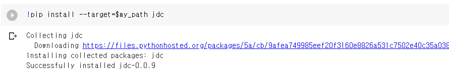
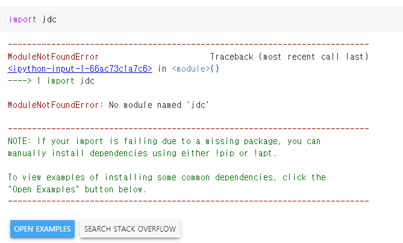
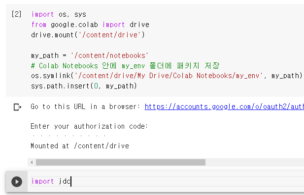

Colab에서 **영구적(permanently)으로 파이썬 패키지를 업그레이드 하는 방법**에 대하여 공유드리고자 합니다. 

Google Colab은 정말 좋은 무료 환경입니다. 꽤 좋은 성능을 내는 하드웨어 자원을 무료로 사용할 수 있습니다. 때문에, 머신러닝/딥러닝 을 학습하시는 분들께는 정말 좋은 환경이라 최근 사용하시는 분들이 급격히 늘어나고 있습니다.

pre-built되는 library가 있지만, 항상 최신 버전으로 지원하고 있지 않기 때문에,

때론 `!pip  install 패키지` 명령어를 매번 실행해주면서 패키지를 업그레이드 해줘야할 필요가 있습니다.


## Google Colab에 Permanent하게 패키지를 설치하기

이제부터 제가 알려드리는 방식대로 진행하시면, colab을 새로 열어도 **자동으로 제가 설치한 패키지를 가져올 수 있습니다**.

아래의 방식은 **다른 파이썬 패키지도 동일하게 적용**할 수 있습니다.


설치된 패키지를 구글 드라이브에 저장을 하게 되는데요. 저장할 폴더를 먼저 만들어 줍니다.

저는 **Colab Notebooks에 my_env라는 폴더**를 만들어 주고 패키지를 그곳에 저장하도록 하겠습니다.


> 아래 코드로 package 환경을 저장할 경로를 google drive에 저장

```python
import os, sys
from google.colab import drive
drive.mount('/content/drive')

my_path = '/content/notebooks'
# Colab Notebooks 안에 my_env 폴더에 패키지 저장
os.symlink('/content/drive/My Drive/Colab Notebooks/my_env', my_path)
sys.path.insert(0, my_path)
```


위의 코드를 실행하면 **구글 드라이브에 마운트**가 되셨을 껍니다.

그런 다음 패키지를 해당 타겟 경로에 인스톨해줍니다.

저는 `jdc` 라는 파이썬 패키지를 인스톨해보겠지만, **다른 파이썬 패키지를 설치하셔도 무방**합니다.

```python
!pip install --target=$my_path jdc
```


> 인스톨이 성공적으로 된 output을 확인 합니다.




그리고, Google Drive의 Colab Notebook 경로의 `my_env` 폴더를 보시면 제가 방금 설치한 파이썬 패키지가 drive에 저장되어 있는 것을 확인하실 수 있습니다.


## 반드시 새로운 Colab 세션을 열거나, 재시작할 때 아래코드를 실행해주세요

이 다음에 colab을 새로 여실 때 **아래 코드를 실행**해주셔야, 내가 추가로 설치한 파이썬 패키지를 로드 합니다.

```python
import os, sys
from google.colab import drive
drive.mount('/content/drive')

my_path = '/content/notebooks'
# Colab Notebooks 안에 my_env 폴더에 패키지 저장
os.symlink('/content/drive/My Drive/Colab Notebooks/my_env', my_path)
sys.path.insert(0, my_path)
```

그 다음에는 따로 설치할 필요없이 정상적으로 로드 된 것을 확인하실 수 있습니다.


**위의 코드 실행 없이는 `jdc` 패키지가 import 되지 않습니다**




위에 알려드린 코드 셀을 실행 후에는 정상적으로 import가 됩니다.




**내가 자주 사용하는 파이썬 패키지인데, colab에서 pre-install 되지 않은 경우에는 이렇게 추가 설치해주면, 여러 번 반복해서 설치하실 필요가 없습니다**


