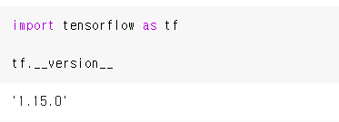
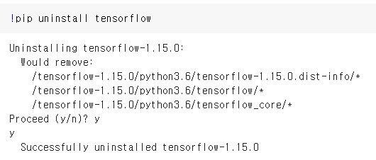
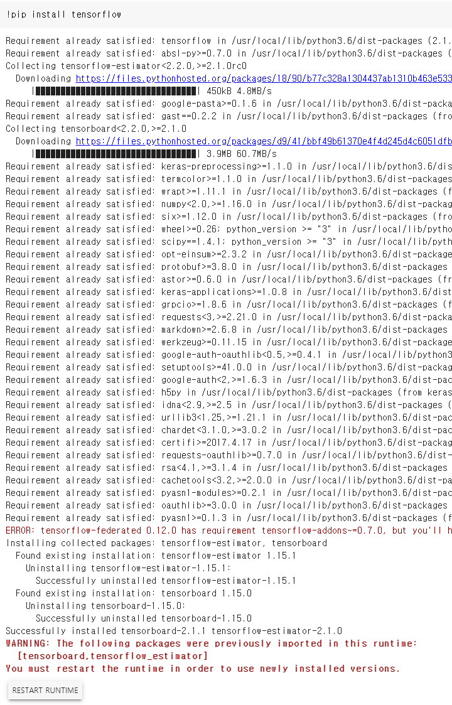
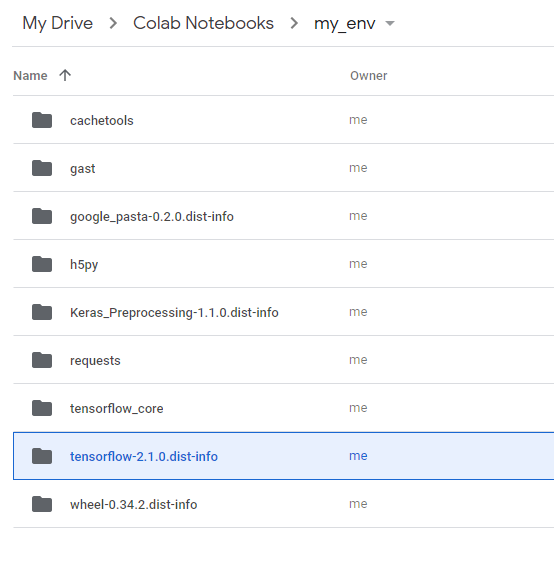

Colab에서 **영구적(permanently)으로 파이썬 패키지를 업그레이드 하는 방법**에 대하여 공유드리고자 합니다. 

Google Colab은 정말 좋은 무료 환경입니다. 꽤 좋은 성능을 내는 하드웨어 자원을 무료로 사용할 수 있습니다. 때문에, 머신러닝/딥러닝 을 학습하시는 분들께는 정말 좋은 환경이라 최근 사용하시는 분들이 급격히 늘어나고 있습니다.

pre-built되는 library가 있지만, 항상 최신 버전으로 지원하고 있지 않기 때문에,

때론 `!pip  install 패키지` 명령어를 매번 실행해주면서 패키지를 업그레이드 해줘야할 필요가 있습니다.

그 중 가장 대표적인 예는 바로 `tensorflow` 패키지 입니다.

지금 이 블로그를 작성하는 날짜 기준으로 colab에서 제공하고 있는 최신 `tensorflow` 버젼은 `1.15.0`버젼입니다.




## Colab에서 Tensorflow 2.0으로 업그레이드 방법

먼저, colab에서 **tensorflow 2.0으로 업그레이드 하는 방법**에 대하여 알려드리겠습니다.


우선, 현재 colab이 제공하는 tensorflow 를 **uninstall** 해줍니다.

`!pip uninstall tensorflow`





그런, 다음 다시 인스톨해주는 명령어를 실행하면 가장 최신 버젼을 자동으로 인스톨해 줍니다.

`!pip install tensorflow`




그 다름 **RESTART RUNTIME 버튼을 클릭**해 주시면, 잠시 커널이 재시작됩니다.


그리고, 다시 아래 코드를 실행해 보시면 가장 **최신 버전의 tensorflow 2.0 버전이 설치됨**을 확인하실 수 있습니다.

```python
import tensorflow as tf

tf.__version__
# 2.1.0
```


## Colab을 껐다 켜도 인스톨한 패키지를 계속 유지하고 싶다면?

위의 방식대로 진행하셨다면 인스턴스가 유지될 때는 상관이 없지만, 연결이 끊기게 되면 다시 설치해줘야하는 번거로움이 있습니다.

이제부터 제가 알려드리는 방식대로 진행하시면, colab을 새로 열어도 **자동으로 제가 설치한 패키지를 가져올 수 있습니다**.

아래의 방식은 **다른 파이썬 패키지도 동일하게 적용**할 수 있습니다.


설치된 패키지를 구글 드라이브에 저장을 하게 되는데요. 저장할 폴더를 먼저 만들어 줍니다.

저는 **Colab Notebooks에 my_env라는 폴더**를 만들어 주고 패키지를 그곳에 저장하도록 하겠습니다.


> 아래 코드로 package 환경을 저장할 경로를 google drive에 저장

```python
import os, sys
from google.colab import drive
drive.mount('/content/drive')

my_path = '/content/notebooks'
# Colab Notebooks 안에 my_env 폴더에 패키지 저장
os.symlink('/content/drive/My Drive/Colab Notebooks/my_env', my_path)
sys.path.insert(0, my_path)
```


위의 코드를 실행하면 **구글 드라이브에 마운트**가 되셨을 껍니다.


그런 다음 패키지를 해당 타겟 경로에 인스톨해줍니다.

저는 `tensofrlow==2.1.0`을 했지만, **다른 파이썬 패키지를 설치하셔도 무방**합니다.

```python
!pip install --target=$my_path tensorflow==2.1.0
```




이 다음에 colab을 새로 여실 때 아래 코드만 실행하시면, 추가 설치한 패키지를 로드 합니다.

```python
import os, sys
from google.colab import drive
drive.mount('/content/drive')

my_path = '/content/notebooks'
# Colab Notebooks 안에 my_env 폴더에 패키지 저장
os.symlink('/content/drive/My Drive/Colab Notebooks/my_env', my_path)
sys.path.insert(0, my_path)
```


