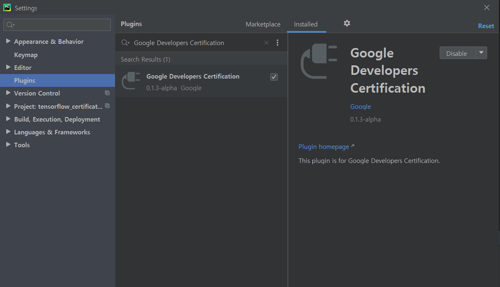
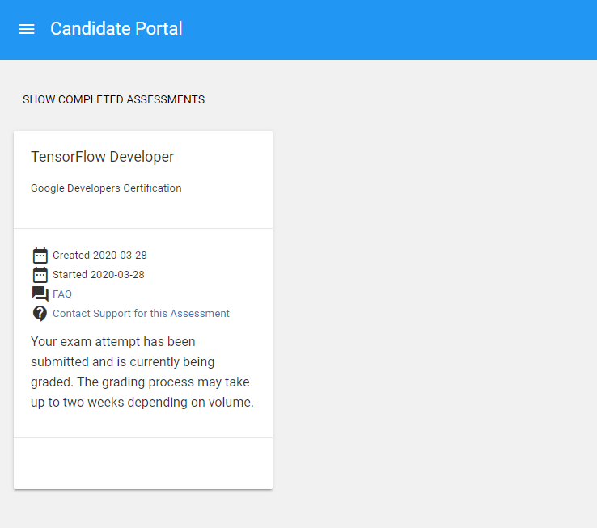

Google 에서 공식 인증하는 **Tensorflow Developer Certification**(텐서플로우 2.0 개발자 자격증) 시험에 대한 응시 방법, 취득, 그리고 **노하우를 공유**드리고자 합니다.

본 인증시험은 **구글 텐서플로우 개발자 인증 시험**이라고도 불리우는 **구글에서 공인하는 텐서플로우 자격 시험**입니다. 정확히 말씀드리자면, 구글이 아닌 **Google Brain에서 제작**한 인증 시험입니다. **2020년 3월 12일에 런칭**한 따끈따끈한 TF 자격 인증 시험입니다. 모두 **온라인으로 진행**되는 것이 특징입니다. 

> Google 이 얼마전 TensorFlow Developer Certificate을 런칭하였습니다.

시험이 공식적으로 발표된 지 얼마 지나지 않았기 때문에,  **자격증에 대한 희소성**도 있으면서, 동시에 시험에 대한 정보도 부족한 상황입니다. 그래서 **제가 직접 시험을 치른 후** 관련 정보를 공식 핸드북에 기반하여 공유 드리고, 직접 진행하면서 시험에 대한 간략한 후기도 공유드립니다.

## 0. 단기 취득을 위한 도움 제공

단기 취득을 위한 분들을 위하여 **시험 합격**을 위한 **온라인으로 진행하는 강의**를 준비하였습니다.

원하시는 분들은 [TensorFlow Certification 단기취득과정 신청](bit.ly/tf-cert-survey)에서 신청해 주시기 바랍니다.

## 1. 자격증 혜택

1. 머신러닝/ 딥러닝 **실력을 검증**할 수 있습니다.
2. 글로벌 **텐서플로우 커뮤니티에서 인정**받을 수 있습니다.
3. **이력서**, **Github**, **LinkedIn (링크드인)**에 공식적으로 기입할 수 있습니다.
4. [Certificate Network(텐서플로우 자격 인증 네트워크)](https://developers.google.com/certification/directory/tensorflow) 에서 당신의 이름이 **공식적으로 게재**됩니다.

## 2. 준비사항

* **응시료**: 미화 $100 (카드결제)
* **시험 시간**: 총 5시간
* **시험 방법**: 온라인
* **유효기간**: 36개월
* **사전 준비물**: 여권 or 영어로 된 운전면허증, 셀카 찍어야함 (노트북 웹캠)
* **시험 환경**: 인터넷 환경, 개인 노트북, PyCharm IDE 등
* **라이브러리**: TensorFlow 2.0, Numpy 등
* **첫번째 불합격시 재응시까지 14일이 지나야 함**
* **두번째 불합격시, 2개월이 지난 후 응시 가능**
* **세번째 불합격시, 1년이 지난 후 응시 가능**

### 2-1. PyCharm 셋팅

시험은 PyCharm IDE 로 진행이 되기 때문에, 아래 링크에서 미리 다운로드 후 설치하셔야 합니다.

* [PyCharm 다운로드 바로가기](https://www.jetbrains.com/ko-kr/pycharm/download/)

* PyCharm을 원래 사용하셨던 분들도 계시지만, 대부분 Jupyter Notebook, Google Colab 그리고 Visual Studio Code를 활용하시는 분들도 많기 때문에, **설치 후 적응하시는 기간**을 가지시기를 바랍니다.

* 설치는 **Community 에디션으로 설치하셔도 상관 없습니다**

PyCharm을 설치하신 후 **Google Certification 이라는 플러그인을 미리 설치**해 주셔야 합니다.

일단 설치만 해두시고, 나중에 시험을 치루기 시작하기 전에 플러그인에 구글 계정으로 로그인 하시면 됩니다.

아직 결제가 되지 않은 상태이면 시험이 뜨지 않고, 플러그인도 정상적으로 활성화 되지 않습니다.

### 2-2. 준비시 유의할 점

* 반드시 **인터넷이 원활한 환경**에서 진행하셔야 합니다. 온라인으로 모든 절차가 진행되기 떄문입니다.
* **여권 스캔 파일을 미리 준비**해 주세요
* 시험 시작전 여권 사진과 시험치는 사람이 본인이 맞는지 검증을 위한 Selfie를 찍습니다. 웹캠이 필요합니다. 노트북 유저들은 웹캠이 있으시겠지만, **데스크톱 유저는 미리 대비**해 주세요.
* 당연히 **Tensorflow 2.0과 numpy 등 주요 라이브러리는 미리 설치**해주세요.

## 3. 시험의 진행

**단계별 진행**

1. [시험 응시 URL 접속](https://app.trueability.com/google-certificates/tensorflow-developer)
2. PyCharm 플러인 및 필요 python 라이브러리 설치
3. Test Portal 로그인
4. $100 결제
5. Test Portal에 "Begin Exam 활성화"
6. PyCharm 플러그인에 구글 계정 로그인
7. Begin Exam 버튼을 눌러 시험 시작
8. 총 5문제, 5시간이 주어지며, 그 전에 submit 가능. 단, 5시간을 넘어가면 자동으로 제출 됩니다.

## 4. 시험 문제

**핸드북 발췌 내용**

### 4-1. 문제 유형

* Category 1: Basic / Simple model
* Category 2: Model from learning dataset
* Category 3: Convolutional Neural Network with real-world image dataset
* Category 4: NLP Text Classification with real-world text dataset
* Category 5: Sequence Model with real-world numeric dataset

문제 유형은 구글 공식 사이트에서 발췌해온 내용입니다. 기본 모델과 더불어 CNN을 활용한 이미지 분류, RNN을 활용한 자연어 처리 (텍스트), 시계열 데이터를 활용한 Sequence 모델을 다루는 문제들이 출제 됩니다.

### 4-2. 합격 점수 / 규칙

> Exam details Criteria The exam tests students in their ability to solve problems by building models using TensorFlow 2.x. During the exam, students will complete 5 models - 1 in each of the following categories. The maximum overall score is 100 points, and students must score 90 or greater to pass. 

* 총 100점 만점에 **90점 이상 점수를 획득해야 합격**을 받을 수 있습니다.
* 난이도는 **Category 1이 가장 낮고, Category 5가 가장 높습니다.**
* 난이도가 낮은 문제는 배점이 낮고, **난이도가 높은 문제는 배점이 높습니다**.
* 시험 중에는 인터넷 브라우징은 **오직 Tensorflow Documentation 만 허용**됩니다.
* 결과는 **이메일로 통보되거나 Portal에서 확인할 수 있으며, 채점 완료까지 최대 2주가 소요**됩니다.

## 5. 시험 후기

1. 전체적으로 시험의 난이도는 그리 높지 않습니다. **텐서플로우를 평소에 많이 활용하시는 분들은 쉽게 취득**하실 수 있다고 생각합니다. 

2.  PyCharm에 익숙하지 않은 분들이라면, **툴에 익숙해질 것을 권장**해 드립니다.

3. 비전공자나 Tensorflow를 메인으로 활용하지 않으신 분들은 **짧게는 일주일, 길게는 2주동안 학습하신다면 충분히 취득**하실 수 있는 시험이라 생각합니다. 

4. 또한, **python은 기본적으로 편하게 다루실 수 있어야** 하며, Deep Learning 자체가 처음이신 분들은 개념까지 이해하실 수 있어야하기 떄문에 조금 더 오래 걸릴 수 있습니다. 그렇다 하더라도,  **최대 1개월이면 취득**하실 수 있을 것이라 생각합니다.
5. 잘하시는 분들은 모델 설계 및 학습까지 **최대 3~4시간안**에 충분히 마무리할 수 있습니다.
6. GPU를 활용하면 학습이 훨씬 빨리 진행되기 때문에, **GPU 활용이 가능한 PC 환경에서 시험보시는 것을 추천**드립니다.
7. 하지만, GPU 환경이 안되시는 분들도 **CPU 환경에서도 충분히 가능**합니다.
8. 도메인 지식이 부족하신 분들도 **단기 학습으로 취득가능**하며, 이력서에 남길 수 있기 때문에 **가성비 좋은 인증시험**이라고 생각합니다.

## 6. 발표

발표는 시험을 Submit 한 후 **최대 2주이내 최종 합격 여부를 통지**해 준다고 합니다.

보통은 1주일 이내에 모두 발표가 나는 것으로 보입니다.

아래 Candidate Portal 링크를 남겨두었습니다. 시험을 치루신 후 방문해 보시면, Grade Status를 확인하실 수 있습니다.

[Candidate Portal 바로가기](https://app.trueability.com/candidate/portal)

### 주요 URL

* [텐서플로우 Certification 사이트](https://www.tensorflow.org/certificate)
* [핸드북](https://www.tensorflow.org/site-assets/downloads/marketing/cert/TF_Certificate_Candidate_Handbook.pdf)
* [시험 응시 바로가기](https://app.trueability.com/google-certificates/tensorflow-developer)

#텐서플로우 #TensorFlow #텐서플로우 자격증 #tensorflow 자격증 #텐서플로우 강의 #텐서플로우 강좌 

