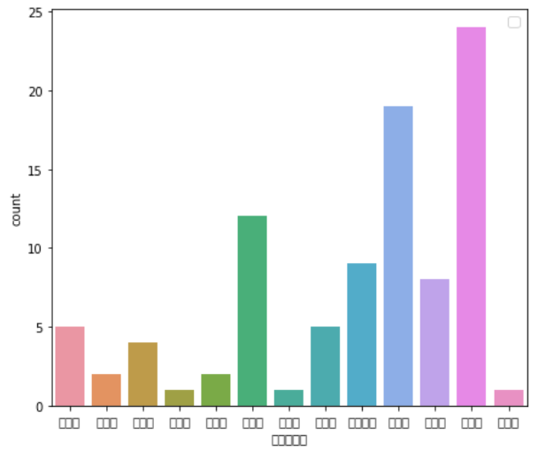
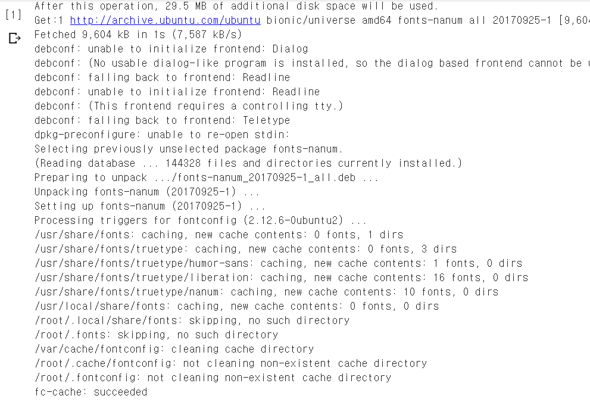
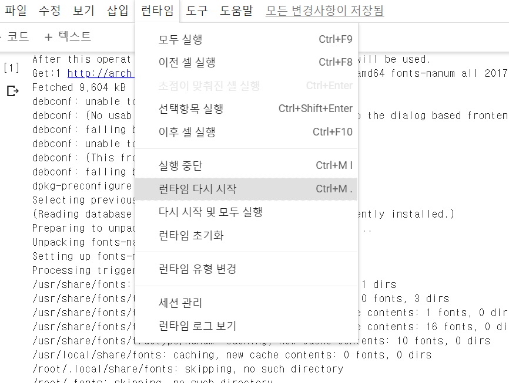
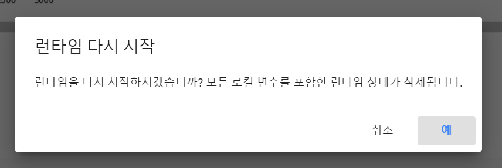
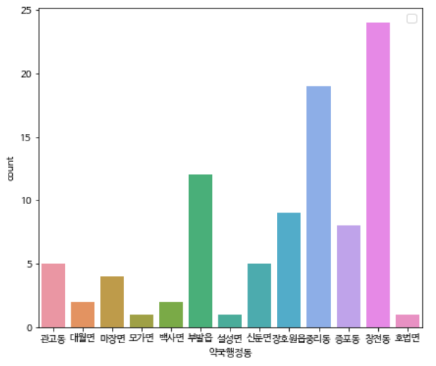

구글 colab에서 시각화 라이브러리(matplotlib, seaborn)을 사용하게 되면 **한글 깨짐 현상**이 나타나게 됩니다. 한글 폰트 깨짐 현상에 대한 해결 방법에 대하여 알려드리겠습니다.


> 아래와 같이 한글 폰트가 깨지는 것을 확인할 수 있습니다




## STEP 1. 나눔 폰트 설치 (Nanum)

colab 파일을 연 뒤 첫번 째 cell에 아래 코드를 붙혀 넣고 실행합니다.

```bash
!sudo apt-get install -y fonts-nanum
!sudo fc-cache -fv
!rm ~/.cache/matplotlib -rf
```

그럼 아래와 같이 설치를 진행하게 됩니다.




## STEP 2. 코랩(Colab)의 런타임을 재시작 합니다.

**런타임 - 런타임재시작** 을 클릭하여 **런타임을 재시작**합니다.




> 예를 클릭하여 재시작합니다




## STEP 3. matplotlib의 폰트를 Nanum 폰트로 지정합니다.

```python
import matplotlib.pyplot as plt

plt.rc('font', family='NanumBarunGothic') 
```


> 한글이 정상 출력됨을 확인합니다



