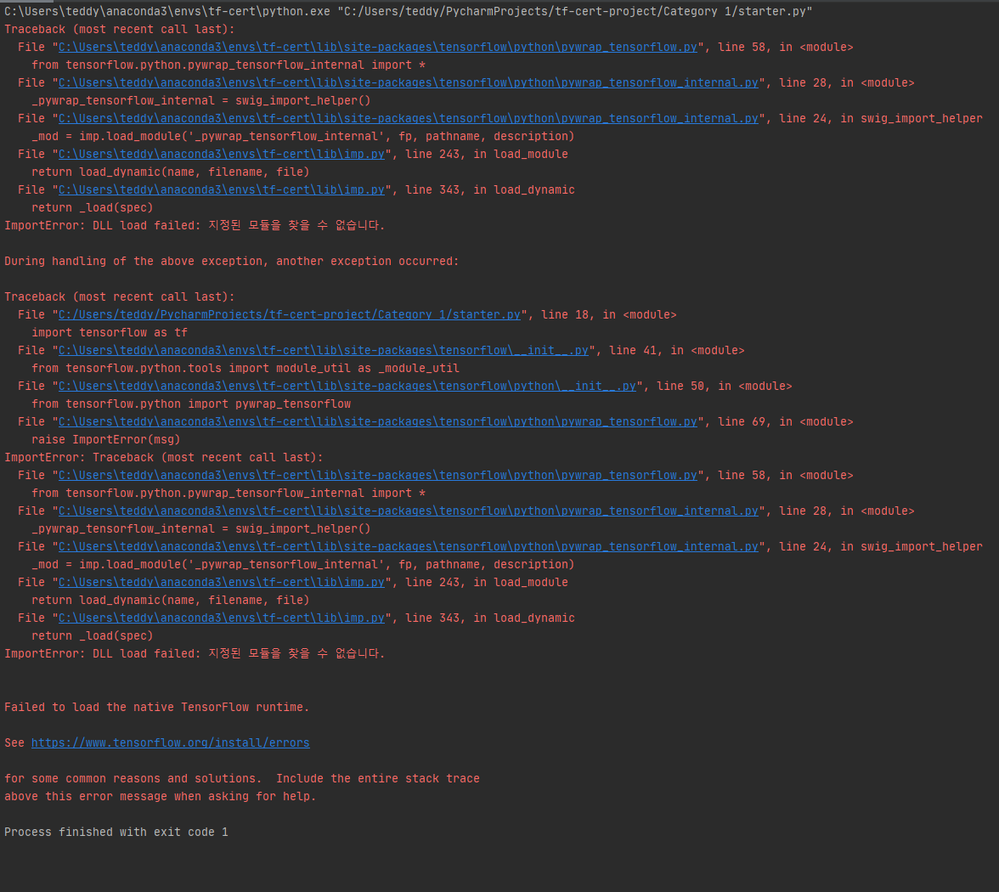
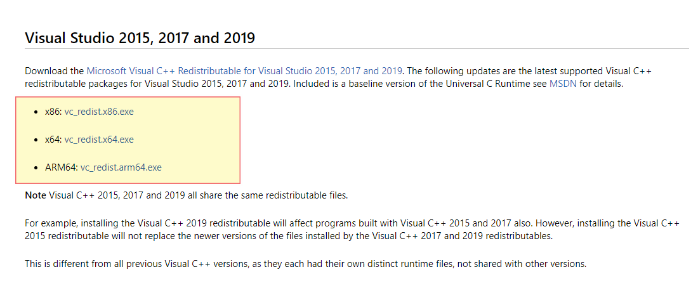
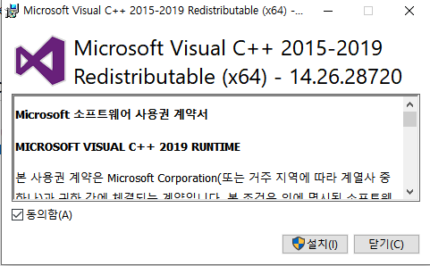

TensorFlow 2.0을 Pycharm에서 실행시 **dll load failed: 지정된 모듈을 찾을 수 없습니다.**가 나는 경우가 있습니다. 

이에 대한 **간단한 해결 방법**을 알려드리고자 합니다.

> dll 에러 로그 출력

## STEP 1:Microsoft Visual C++ Redistributable for Visual Studio 2015, 2017 and 2019 다운로드

밑에 링크를 클릭하신 다음에 개인이 보유하신 PC의 스펙에 맞추어 다운로드를 진행합니다.

[다운로드 링크](https://support.microsoft.com/en-us/help/2977003/the-latest-supported-visual-c-downloads)

32비트 운영체제인 경우: x86

64비트 운영체제인 경우: x64

ARM64 계열은 ARM64를 선택하여 다운로드 합니다.

## STEP 2: 다운로드한 파일 설치

> 다운로드 파일 설치 진행

## STEP 3: 재부팅 후 PyCharm 실행

설치가 완료 되면, PC를 재부팅 하신 후 PyCharm을 실행합니다.

그럼 정상적으로 실행되는 것을 확인하실 수 있습니다.

