텐서플로우(TensorFlow) 2.0 를 윈도우(Windows) 10에서 GPU를 활용하여 학습할 수 있도록 설치하는 방법에 대하여 공유드리고자 합니다.


그래픽카드는 반드시 **NVIDIA 계열의 그래픽 카드**가 탑재되어 있어야 합니다.


**작성일 기준 버전**

- 설치: TensorFlow 2.2.0
- 그래픽카드: NVidia RTX 2070, NVidia MX250
- OS: Windows 10


참고: [텐서플로우 공식 GPU 설치 가이드](https://www.tensorflow.org/install/gpu)


## STEP 1. 텐서플로우(TensorFlow) 설치

pip 명령어를 통해 텐서플로우를 설치합니다.

2.0 이상의 텐서플로우는 별도의 GPU 버전을 따로 설치할 필요 없습니다.

> TensorFlow 2.0 이상의 버전 설치

```python
pip install tensorflow  # stable
```


## STEP 2. NVIDIA GPU 드라이버 설치

[NVIDIA GPU 드라이버 설치 링크](https://www.nvidia.com/download/index.aspx?lang=kr)

1. **제품 유형, 시리즈, 계열**: 자신의 그래픽 카드 정보를 선택합니다.
2. **운영체제**: Windows 10을 선택하며, bit는 32/64 중 자신의 os와 일치된 bit 운영체제를 선택합니다.
3. **다운로드 타입**: Game Ready 드라이버 혹은 Studio 드라이버를 선택합니다. (큰 상관 없습니다)

선택이 완료 되었다면, 검색을 클릭합니다.


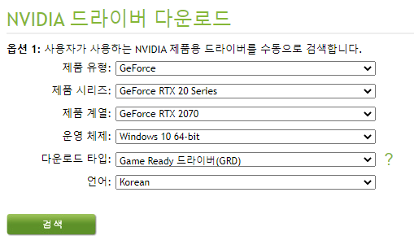

TensorFlow GPU 설치를 위해서는 **418.x 버전 이상**이 요구됩니다.

>  다운로드 받은 exe 파일을 실행하여 설치 합니다.


> GeForce Experience는 딱히 필요 없습니다

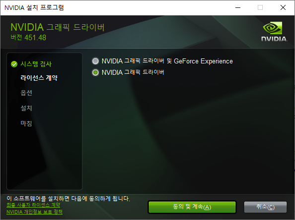

> 사용자 정의 설치

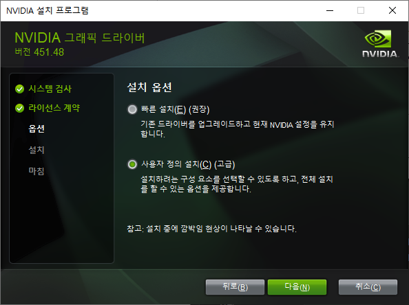

> 설치 내용 확인

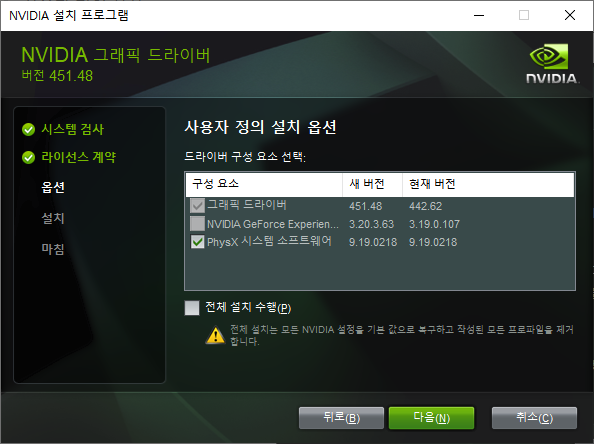


>  다음을 눌러 진행하면, 설치 및 완료


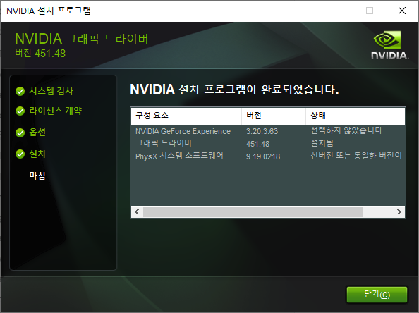


Window + R을 누르고 "cmd" 타입 후 터미널로 진입합니다.

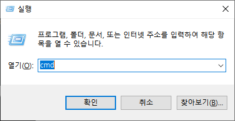

> 터미널에 명령어 입력

```bash
nvidia-smi
```

명령어를 입력하여, 정상적으로 NVidia 그래픽 드라이버가 설치 되었는지 확인합니다.

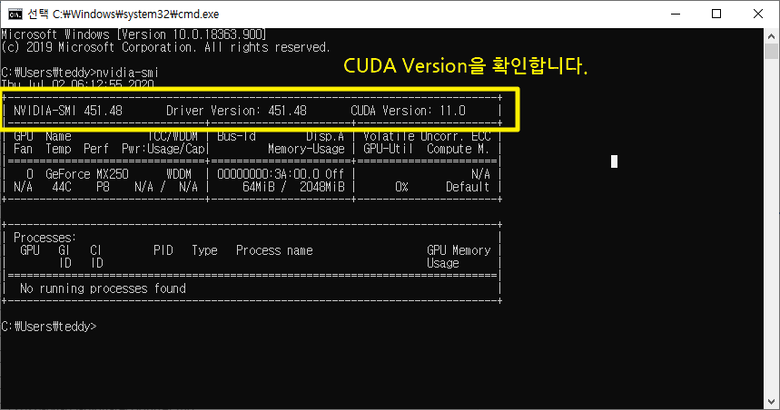


## STEP 3. CUDA Toolkit 다운로드 및 설치

[CUDA Toolkit 다운로드 링크](https://developer.nvidia.com/cuda-toolkit-archive)

위 링크에서 자신이 맞는 버전의 CUDA Toolkit을 다운로드 합니다.

TensorFlow 는 오늘 (2020년 7월 2일) 기준, **CUDA 10.1**을 지원합니다. 따라서, CUDA 10. 1이상의 CUDA Toolkit 을 다운로드 받아 줍니다.

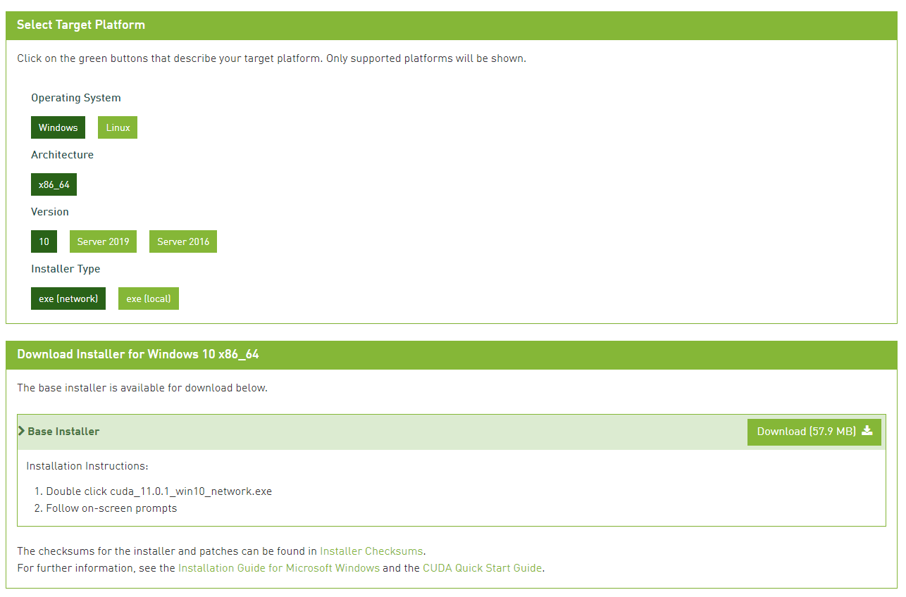

다운로드 받은 exe를 실행하고 설치를 진행합니다.

> 설치 시작

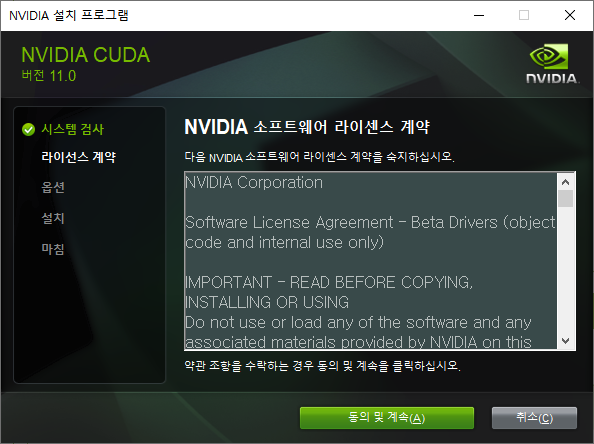

> 사용자 정의 설치

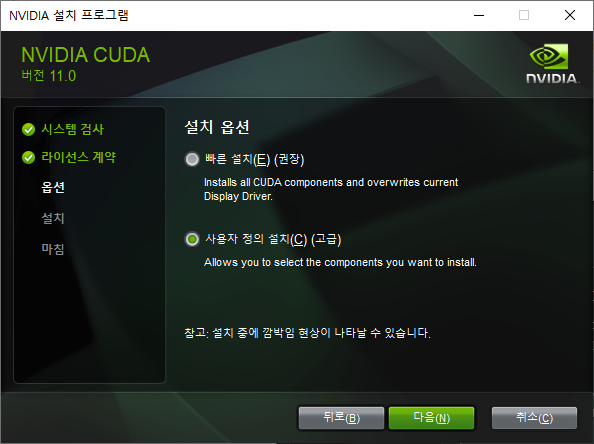

> NVidia GeForce Experience 체크 해제

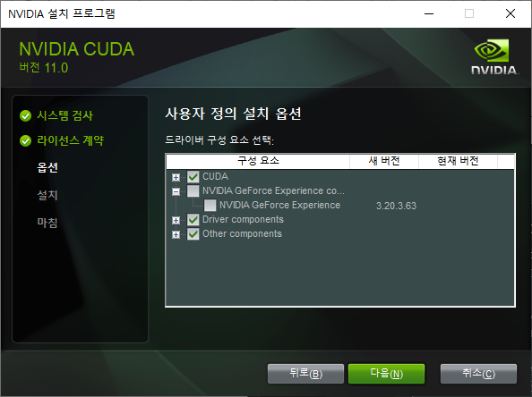

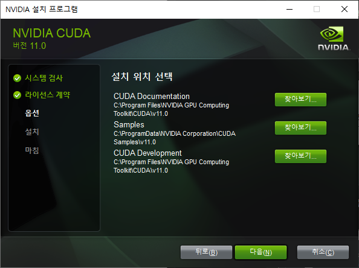

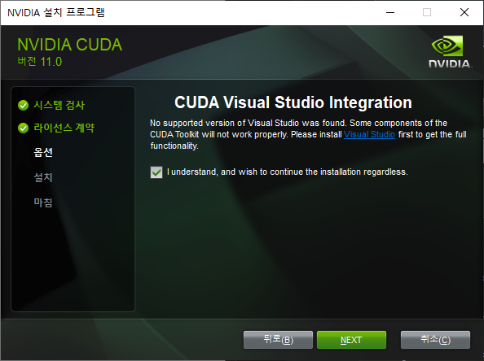

NEXT를 눌러 끝까지 **설치를 완료**합니다.


## STEP 4. cuDNN SDK 설치

[cuDNN SDK 다운로드 링크](https://developer.nvidia.com/cudnn)

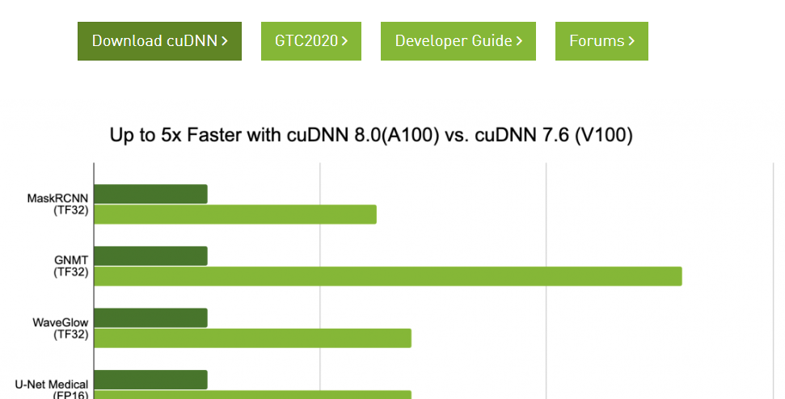


Download **cuDNN을 눌러 Download** 받습니다.


멤버십이 요구 되므로, 회원가입을 안하신 분들은 회원가입 후 **로그인을 진행**합니다.


> 자신이 설치한 CUDA 버전에 맞는 cuDNN을 선택하여 다운로드 합니다.

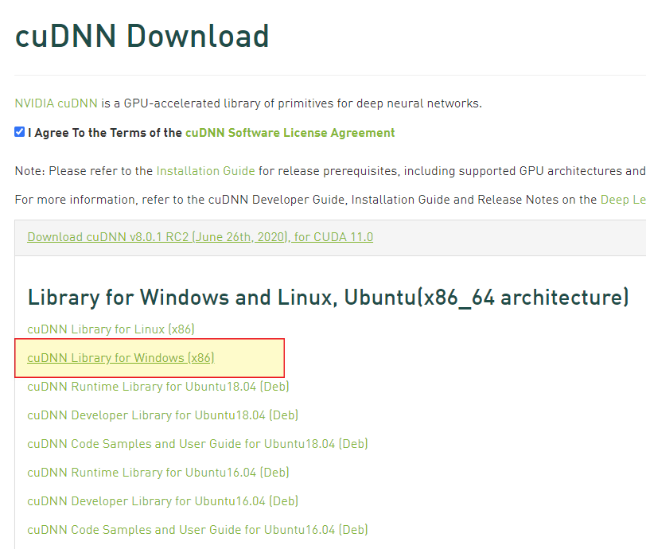

> 다운로드 받은 zip 파일의 압축을 해제 합니다.

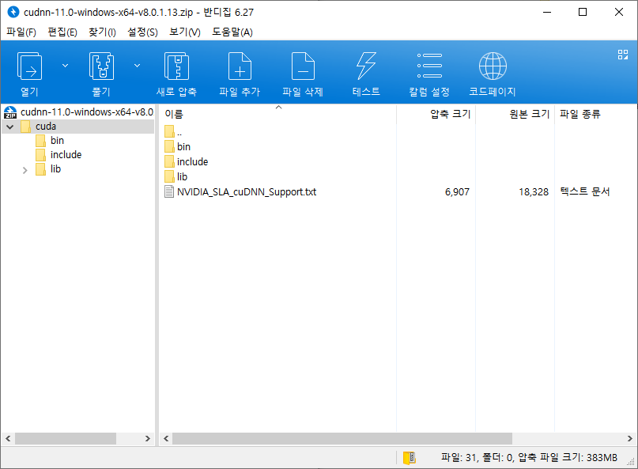

> cuda 폴더로 해제 된 것을 볼 수 있습니다.

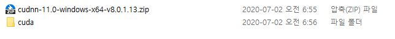

아래 그림과 같이 3개의 폴더가 있습니다. 안에 있는 파일을 CUDA Computing Toolkit 에 복사합니다.

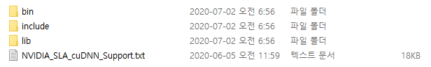

`cuda\bin` 폴더 안의 모든 파일은 => `C:\Program Files\NVIDIA GPU Computing Toolkit\CUDA\v11.0\bin`

`cuda\include` 폴더 안의 모든 파일은 => `C:\Program Files\NVIDIA GPU Computing Toolkit\CUDA\v11.0\include`

`cuda\lib` 폴더 안의 모든 파일은 => `C:\Program Files\NVIDIA GPU Computing Toolkit\CUDA\v11.0\lib` 

으로 복사 해 줍니다.


`Window + R` 키를 누른 후 "control sysdm.cpl"을 실행합니다.


**고급 탭 - 환경변수를 클릭**합니다.

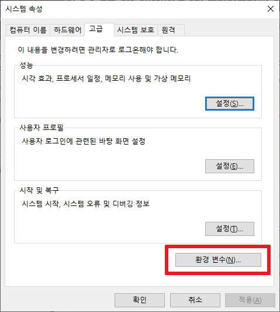


`CUDA_PATH` 가 다음과 같이 잘 등록되어 있는지 확인합니다.

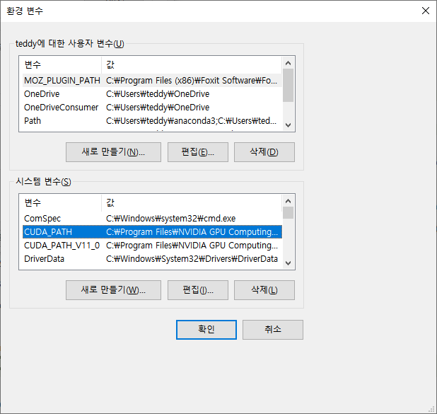

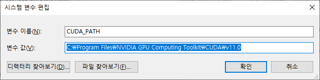

