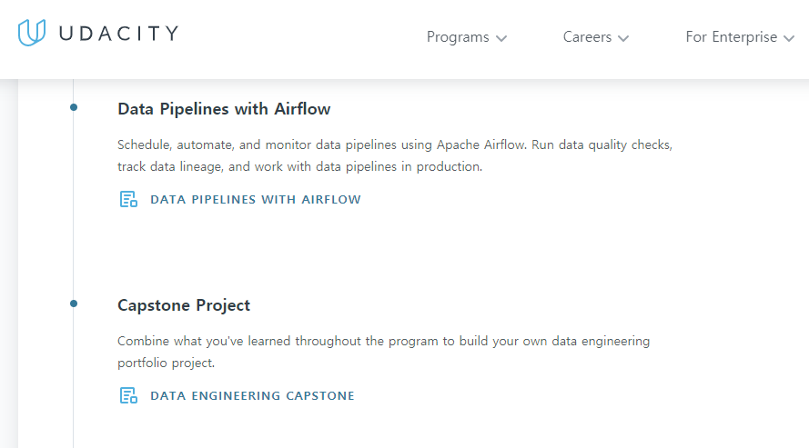
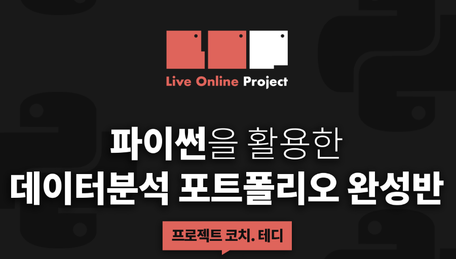
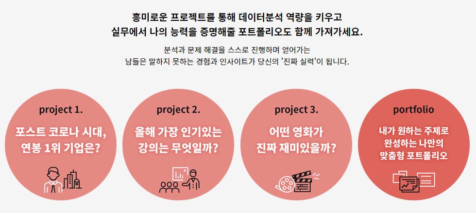
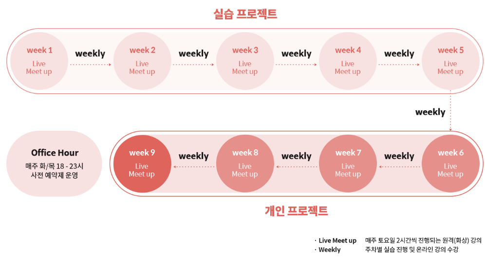
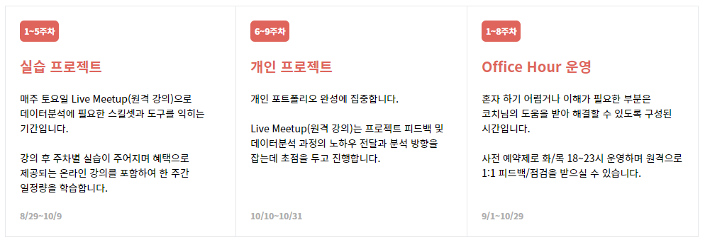

이번 글은 국내 최고 성인 실무교육 기관인 패스트캠퍼스와 협력하여 지난 3개월간의 고민 끝에 드디어 런칭을 앞두고 있는 **데이터분석 캡스톤 프로젝트**에 대하여 시작하게 된 **배경과 최종 목표**에 대하여 공유하고자 합니다.

## 멘토의 부재..

데이터 분석에 관심이 많아지면서, 다양한 채널로 멘토링을 의뢰받아 시간이 허락하는 대로 최대한 조언을 드리고 있습니다.

대다수는 데이터 분석에 대한 매력을 느끼고 진로를 정하였지만, 어떻게 데이터 분석가로 커리어를 시작할 수 있는지에 대한 그 시작점을 잘 잡지 못하는 것 같았습니다.

좋은 인터넷 강의와 무료 동영상 강의도 유튜브와 같은 플랫폼을 통해서 쉽게 얻을 수 있음에도 불구하고, 대다수의 입문자들이 어려움을 느끼는 분야는 바로 **책임감있는 커리어 멘토의 부재**라고 생각이 들었습니다.

비전공자, 입문자들은 그들의 배경이 데이터 분석학과, 통계학 혹은 수학과와는 거리가 먼 분들이 많습니다. 따라서, 주변에 관련 업계에 종사하는 분을 만나기 쉽지 않아 보였습니다.

따라서, 그들이 인터넷 강의나 동영상 강의, 책이나 블로그를 통해 지식 습득은 얼마든지 할 수 있었지만, 그들이 학습하고 있는 방식이 올바른 방식인지 더 개선할 수 있는 방안은 없는지, **실무와 학습은 어떻게 다른지** 등등의 질문에 답해줄 수 있는 사람은 부재하다는 점이 큰 장벽이 되곤 합니다.

저도 마찬가지였거든요.

## 똑같은 과제, 똑같은 결과물

더 큰 문제는 그들이 입사지원을 하거나, 커리어 전환을 준비할 때 가장 많이 보게될 그들의 포트폴리오 (GitHub) 혹은 프로젝트 결과물입니다.

입문자들이 어쩌면 한 번씩은 거치고 갈 타이타닉 생존자 분석 예제나, bike sharing demand 분석은 **이제는 특별함**이 없습니다.

대다수의 유튜브에서 다루고 있기도 하고, 그것만 가지고는 본인의 강점을 어필하기란 쉽지 않습니다.

뿐만아니라, GitHub의 사용법에 대해서도 익숙치 않다면, 앞으로 **수많은 팀원, 동료들과 협업**을 진행해야하는데 문턱에서 필터링 되기 가장 쉬운 핑계거리가 될 수 있습니다.

GitHub은 사원증을 태깅하는 것 만큼 매우 쉽게 사용할 줄 알아야 하는 기본 소양임에도 불구하고 많은 분들이 놓치고 있습니다.

GitHub 계정을 만들었고, commit, push 그리고 pull 만 한다고 거기서 멈출 것이 아니라 **자신만의 색이 묻어나는 repo**를 꾸밀 줄 알아야 합니다.

EDA를 잘하는지, 시각화를 잘하는지, 전처리를 잘하는지 코드와 repo에 모두 담겨 있는 GitHub 그 자체가 자신의 강점을 어필할 수 있어야 합니다.

하지만, 대다수는 학원이나 실무기관에서 내주는 너무 획일화된 과제가 심지어 잘 정리되지 않은 채로 방치되어 있는 것을 어렵지 않게 발견할 수 있습니다.

인사담당자 혹은 실무자는 아마도 이력서보다도 GitHub에 훨씬 더 관심이 클텐데 말이죠.

## 3개월간의 고민, 그리고 새로운 방식의 스터디

패스트캠퍼스는 국내 최고의 성인 실무교육 기관입니다. 그렇기 때문에, 위에서 언급한 어려움을 느끼는 분들을 위하여 새로운 방식의 교육 서비스를 고민하고 있었습니다. 수 많은 수강생들이 패스트캠퍼스의 교육을 거쳐가면서 토로해내는 많은 고민을 이미 인지하고 있었습니다.

그리고, 저에게 제안을 하여 오랜 논의 끝에 **멘토링이 주**가 되고, **강의는 부**가 되는 어쩌면 다소 모험적인 과정을 새롭게 개설하게 되었습니다.

그렇다고, 멘토링만 진행하는 방식은 아닙니다. 개인에게 맞춤화된 데이터 분석 포트폴리오를 완성해 나가며, 취업/이직을 위한 준비, 커리어 전환을 위한 대비가 포함된 **캡스톤 프로젝트**방식으로 약 10주간 온라인 실시간 스터디를 진행합니다.

## 캡스톤 프로젝트

캡 스톤 프로젝트 (capstone project)는 일반적으로 마지막 학년 또는 학업 프로그램의 끝을 장식하는 **최종 프로젝트**입니다.

대학원 레벨에서는 논문과 비슷하지만 일반적인 보고서 뿐만아니라, MVP 모델, 프리젠테이션 능력, 그리고 **포트폴리오 완성을 통칭하여 의미**하기도 합니다.

> 이미 해외에서는 Capstone Project가 주가 되는 고급 과정이 인기가 많습니다

글로벌 교육기관인 Udacity에서는 이미 많은 인기 과정에 대하여 Capstone Project 를 진행하고 있습니다.

즉, **정형화된 프로젝트는 더 이상 너무 뻔하다**는 겁니다. 

개인의 성향에 맞는 포트폴리오를 진행하고 **개인에게 맞춤형 피드백을 실시간으로 소통하며 진행**하면서 그들이 소유한 포트폴리오가 전세계에서 가장 유일하고 특별한 포트폴리오가 될 수 있도록 도와 줍니다.

## 진행방식

* 주 1회, **라이브 스터디** (강의 및 결과물 공유, 개인 피드백/ 팀원 피드백), **총 10주** 진행

* 패스트캠퍼스 온라인 강의 무료 제공

* 수학, 데이터 분석가 맞춤형 강의 제공

* 기본 **포트폴리오 3개** 완성, **최종 캡스톤프로젝트** (개인 주제 선정) 완성

* 주 **1~2회 멘토링 세션**진행

* 개인별 맞춤 피드백

* **소수 정예** 원격 (줌 라이브 강의) 스터디 방식 (코로나 19 바이러스 걱정 X)

* 모든 프로젝트 **GitHub 업로드 및 GitHub 포트폴리오** 점검 및 완성

  

## 끝으로

어쩌면 최초로 시도되는 교육 방식인 만큼 꽤나 **실험적인 도전**입니다. 그만큼 열정과 성심 성의껏 스터디에 참가하시는 모든 분들이 성공적인 결과물을 얻어가실 수 있도록 최선을 다해, 그리고 재밌게 진행해보려 합니다.

많은 관심 부탁 드립니다 :)

[더 많은 내용 보기](https://bit.ly/2DgW0bK)

