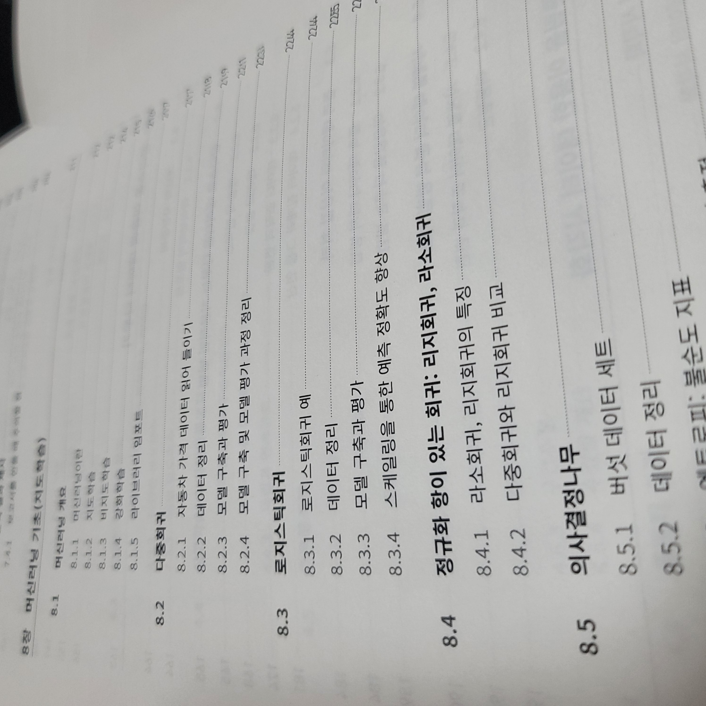
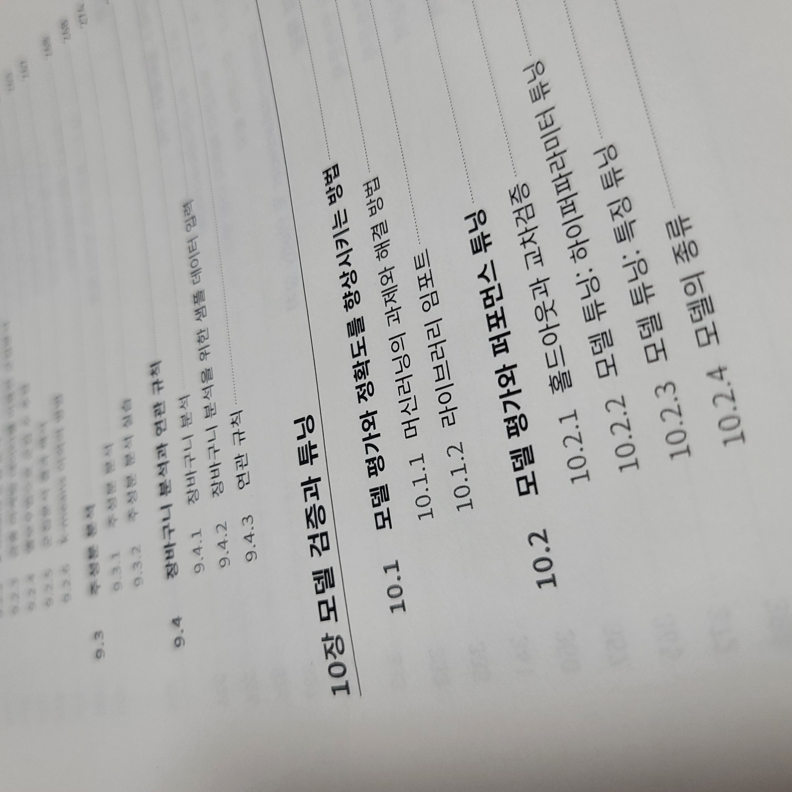
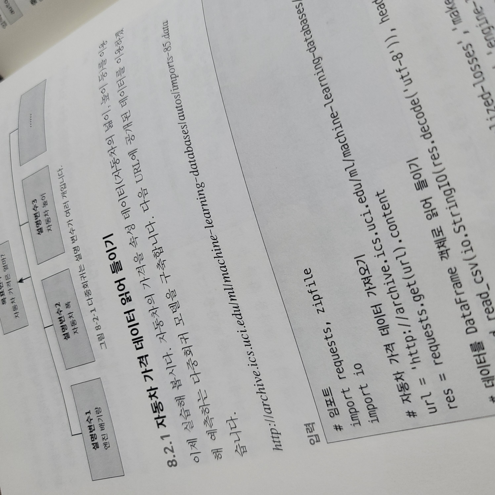
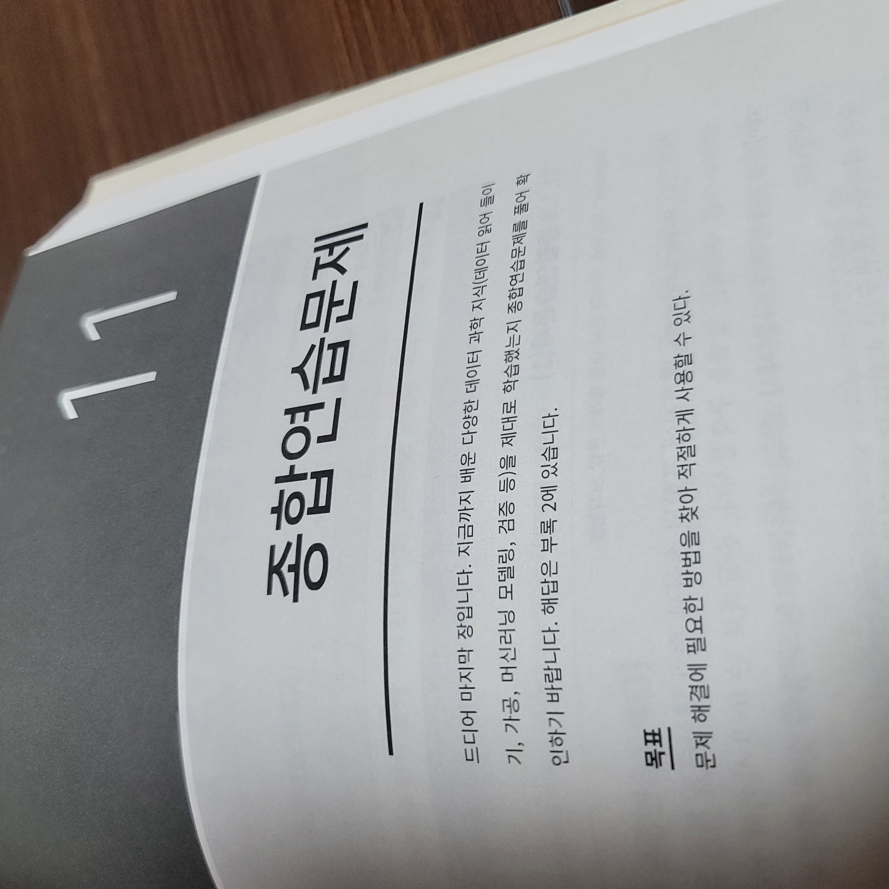
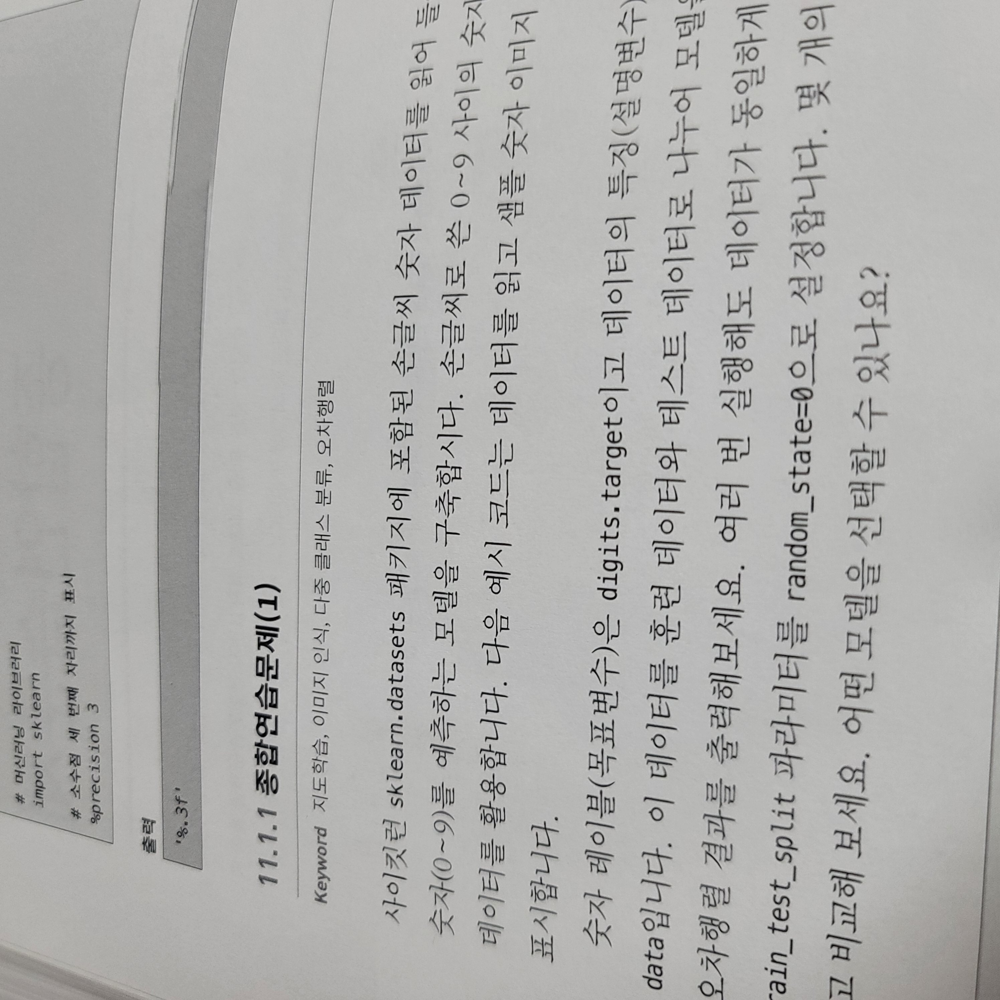

이번 포스팅에서는 **"데이터 과학 트레이닝 북" 책 리뷰**를 해보도록 하겠습니다.

*[미리 알려드립니다] 본 리뷰는 인사이트 출판사로부터 책을 제공 받아 진행하지만, 책 이외 어떠한 금전적인 지원을 받지 않았습니다.*

그럼, **솔직한 리뷰**를 시작합니다.

## [첫느낌] 솔직히 기대감 없이 받았는데, 매우 만족합니다.

사실, 저는 데이터분석, 머신러닝, 그리고 딥러닝 책 덕후 입니다. 시중에 나온 서적은 거의 다 사서 봅니다. (사실 전부 다 디테일까지 챙겨보는 것은 아니고, 일단 사놓고 필요할 때 꺼내어 보는 편입니다.)

그래서인지, **책의 목차만 봐도** 끌리는 책과 그렇지 않은 책이 딱 나옵니다. "데이터 과학 트레이닝 북" 책의 목차를 처음 봤을 때, 데이터 사이언스 기본 부터 머신러닝까지 아우르는 다소 폭 넓게 집필된 책이라는 것을 알 수 있었습니다. 

**numpy -> scipy -> pandas -> 시각화 -> 통계 -> 머신러닝 으로 이어지는 아주 정석적인 코스** 입니다.

하지만, 이 책에서 특히 좋았던 점은 실효성 없는 pandas, numpy 문법 내용은 확 줄이고 **통계 내용을 잘 다뤄준다**는 것입니다.

일반적인 데이터분석 서적은 pandas, numpy 문법을 매우 디테일하게 다룹니다. 물론, 좋습니다! 하지만, 항상 아쉬운 것은 이런 툴을 활용하는 방법도 좋지만 배경지식인 통계 내용을 자세히 다뤄주지 않아 독자들이 숨은 통계 원리에 대한 이해가 충분히 되지 않는 경우가 많습니다.

## 추천 대상

처음 데이터 분석을 **입문하시거나 초급 레벨인분들께 정말 강력하게 추천**하고 싶습니다. 읽는 **난이도도 매우 쉽습니다.**

왜냐하면, A부터 Z까지 꼼꼼히 바닥 다지면서 디테일하게 집필된 책이 아니라, **전반적인 지식을 두루두루 경험하면서 큰 그림을 보여주는 책**입니다.

내가 이미 데이터 사이언스나 머신러닝 경험이 어느 정도 있다면, 굳이 추천 드리고 싶지 않습니다. 

## 간결한 설명과 예제

설명이 늘어지지 않고 간결합니다. 예제도 제공되기 때문에 따라함에 어려움이 없습니다.

하지만, 아쉬운 점도 있습니다. 특정 알고리즘이나 동작원리 그리고 수식이 디테일까지 친절하게 설명이 되어 있지는 않습니다. 그도 그럴것이, 책이 꽤 방대한 범위를 다루고 있는데, 그렇게 디테일한 설명까지 모두 다루게 되면 아마 백과사전 분량이 나올 겁니다.

다시 한 번 말씀 드리지만, **입문자를 위한 데이터과학 서적이기 때문에, 너무 디테일하게 들어가지 않고 전반적인 이해를 도와주는데 주 목적을 가지고 있는 책**입니다.

디테일 까지 다루는 책을 원하시는 분들은 반드시 특정 라이브러리나 패키지에 포커스된 책을 추천 드립니다. 예전에도 다뤘지만, Pandas와 Numpy 전문 서적, 머신러닝 전문 서적, 딥러닝 전문 서적을 따로 사서 보시기 바랍니다.

## 연습문제와 해설

종합 연습 문제라는 챕터가 별도로 존재하고 끝 부분에서 책이 다뤘던 주제를 연습 문제로 연습해 볼 수 있게 제공합니다. 해답도 물론 제공됩니다.

국내 저자가 집필한 책에서는 잘 찾아보지 못했던 부분이었는데, 이 부분이 재밌었습니다.

자격증 관련 서적에서는 흔히 볼 수 있는 포맷인데, 데이터과학 전문 서적 중에서는 처음 본 것 같습니다.

문제가 주어지고, 뒷 부분에는 해설도 주어 집니다. 소스코드로도 제공됩니다.

## 아쉬운 점?

### 흑백

먼저 가장 아쉬웠던 점을 굳이 꼽으라면 *책이 흑백*입니다 ㅠ

매우 사소한 부분일 수도 있지만, 저는 컬러가 좋더라구요ㅎㅎ

### 내용의 깊이

사실 생각보다 디테일하고 꼼꼼하게 내용에 충실한 책이고 목차 구성도 너무 마음에 들어 나중에 이 책의 목차를 참고하여 강의를 구성하고 싶은 생각이 들 정도 였습니다. 전반적인 가닥은 매우 잘 잡아주지만, 아무래도 넓은 범위를 다루다 보니, 세부 hyper parameter 튜닝에 대한 부분과 머신러닝 알고리즘에 대한 설명이 간소하게 되어 있는 부분이 있었습니다.

그래서 입문자를 대상으로는 전반적인 내용을 이해함에 있어 매우 추천 드리고 싶은 책이지만, 중급 이상인 분들이 보시기에는 다소 쉬운 내용일 수 있습니다.

## 끝으로

책을 협찬 받아 리뷰를 작성하게 되었지만, 정말 솔직하게 매우 만족한 책입니다. 덕분에 앞으로 인사이트 출판사에서 출판하는 다른 IT 서적도 유심히 살펴볼 것 같습니다. 데이터 사이언스에 처음 입문하시려는 분들 혹은 관심이 생겨 전반적인 내용을 빠르게 익히고 싶으신 분들께 적극 추천 드립니다.

좋은 책 만들어 주셔서 감사합니다.

[YES24 구매 링크](http://www.yes24.com/Product/Goods/96090910)

