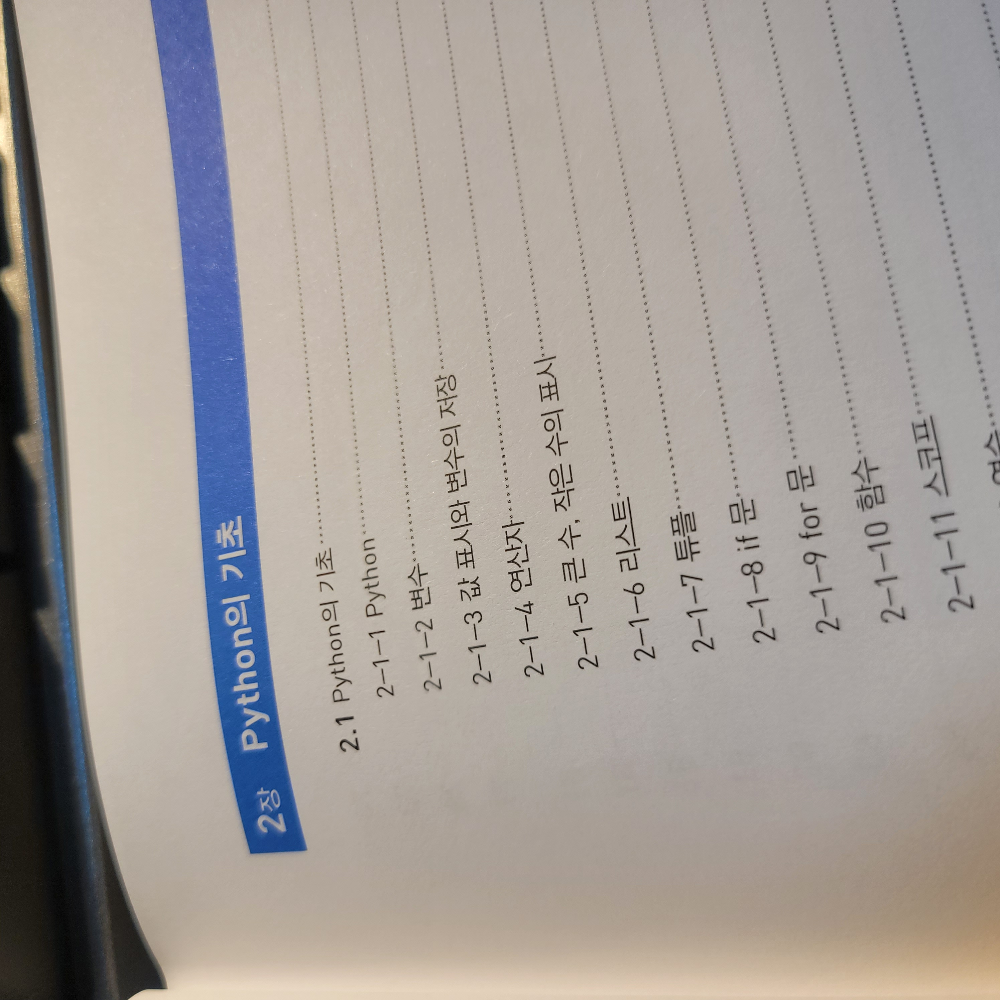
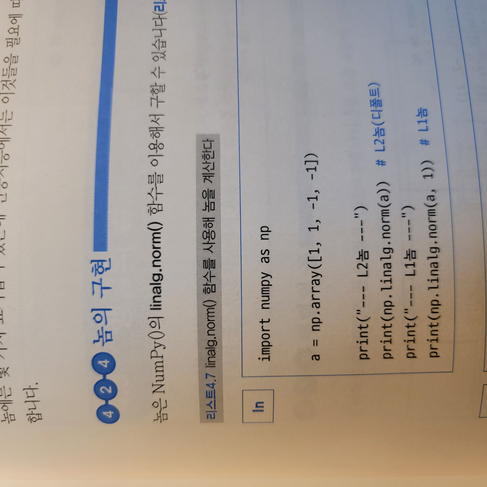
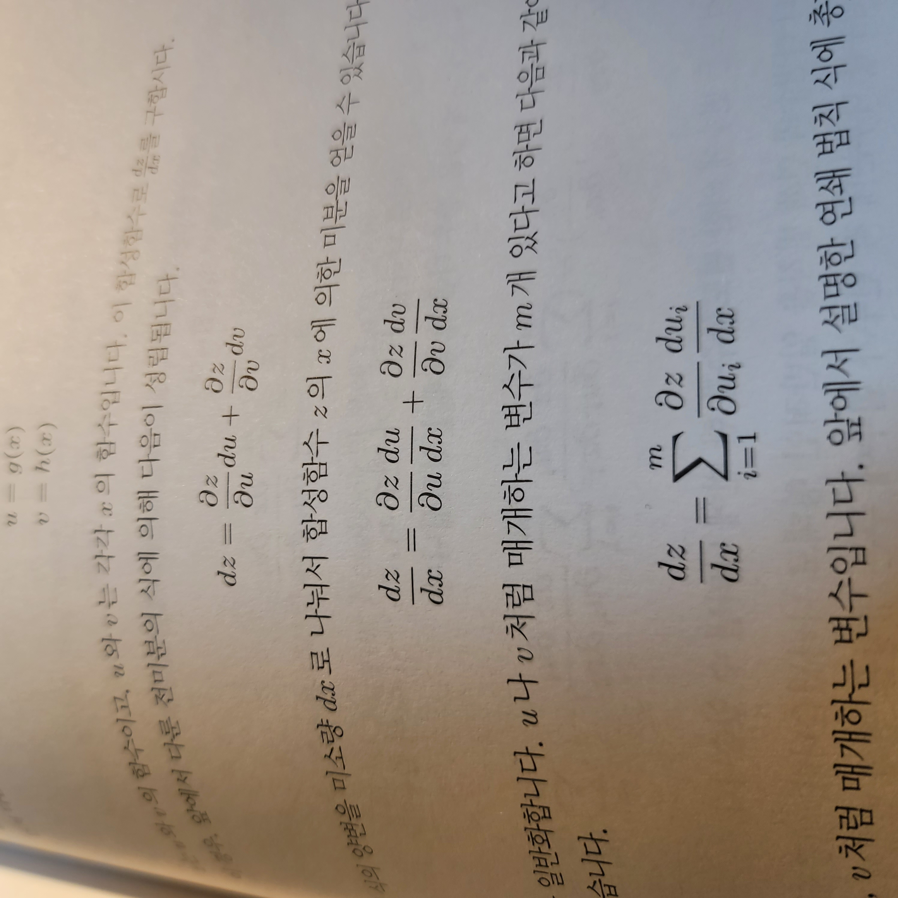
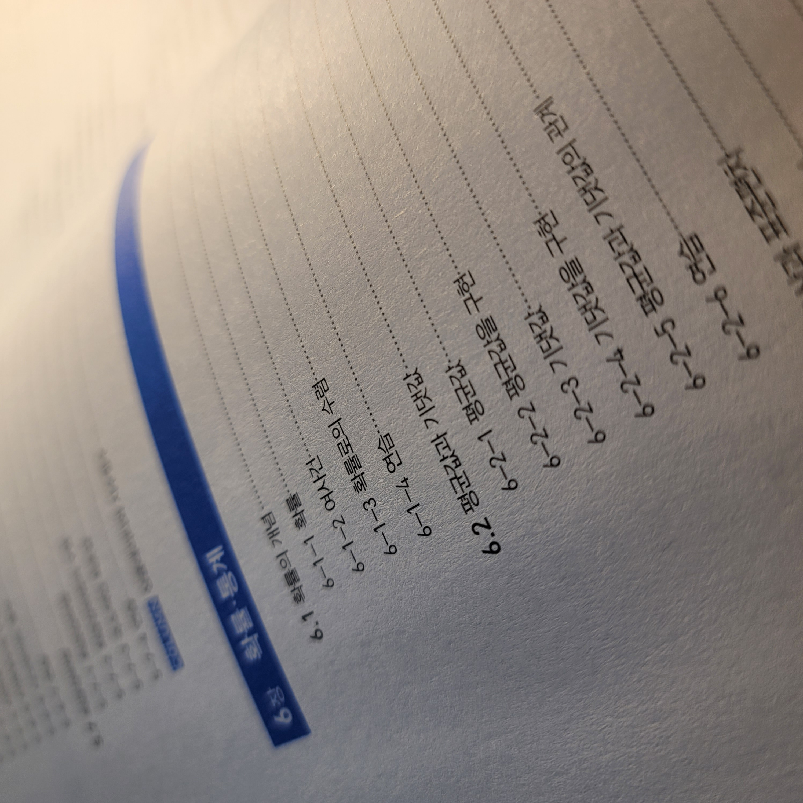
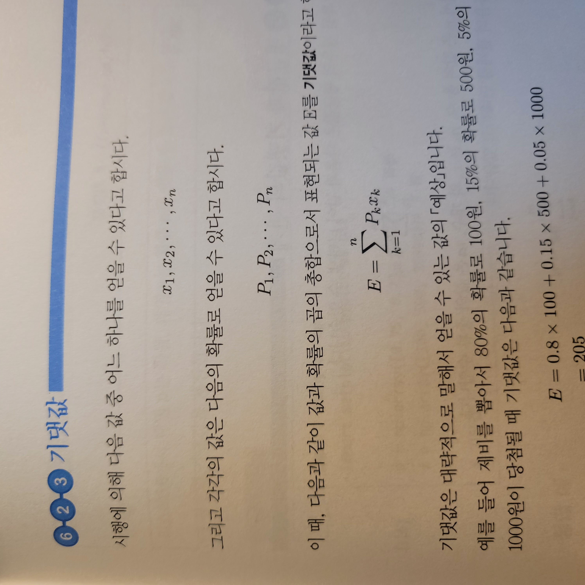
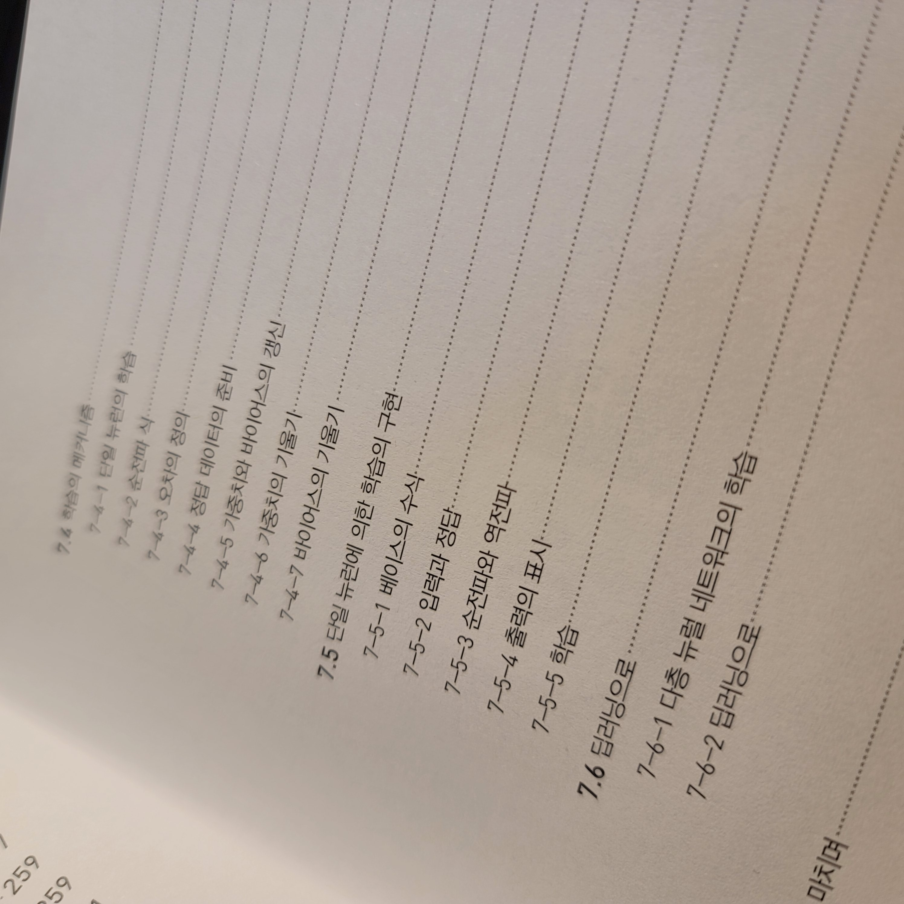
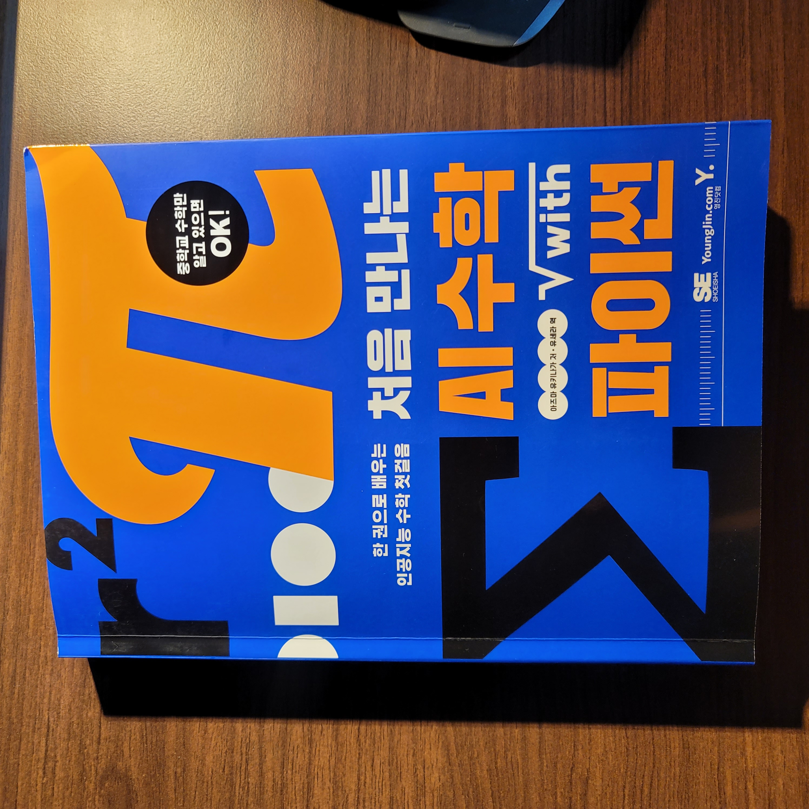

이번 포스팅에서는 **처음 만나는 AI수학 with 파이썬** 책 리뷰를 해보도록 하겠습니다.

*[미리 알려드립니다] 본 리뷰는 영진 출판사로부터 책을 제공 받아 진행하지만, 책 이외 어떠한 금전적인 지원을 받지 않았습니다.*

그럼, **솔직한 리뷰**를 시작합니다.

## 첫 느낌과 전체 구성

나의 책 리뷰는 항상 첫 느낌으로부터 시작합니다. 제가 말하는 첫느낌은 목차를 읽고난 첫 느낌입니다. 

목차를 보고난 첫 느낌은 확실히 쉬운 구성으로 AI를 위한 수학의 기초적인 내용을 정리해 주는 책이라는 것을 알 수 있었습니다. 바로 책의 제목처럼 말이죠.

최근 비전공자의 머신러닝 딥러닝의 영역으로 많이 진출하고 있습니다. 하지만, 정작 코딩이 아닌 **가장 큰 문턱은 바로 수학/통계**입니다. 그러한 분들이 여기 기술된 수학, 통계 개념은 반드시 알고 넘어가야하는데 그러한 내용들만 압축하여 추려놓은 책이라는 느낌을 받았습니다.

그렇다고 해서 수학적인 내용만 다루는 것은 아니고 **파이썬(Python)과 넘파이(Numpy)를 모두 다루기 때문에 직접 코드 셀을 실행**하면서 볼 수 있도록 파이썬과 넘파이가 앞 쪽 목차에 자리 잡고 있습니다.

**수학, 선형대수, 미분, 확률과 통계, 기계학습의 응용**까지 다루는데 "이건 절대 모르면 안되는 내용"을 다루고 있습니다.

그러니깐 앞으로 **"수학은 어디까지 배워야 하나요?"** 라는 질문을 받으면 **"여기 기술된 내용은 모두 알아야 합니다!"** 라고 대답할 수 있을 정도로 꼭 필요한 내용은 다루고 있습니다.

## 초보자! 비전공자! 수포자!

내가 위의 키워드 중 하나라도 해당된다면 정말 꼭 이 책을 읽어보라고 하고 싶습니다.

사실 이렇게 적으면 광고글 같아서 정말 싫은데, 그러면서도 반드시 알아야하는 내용을 담았기 때문입니다. 

예를 들면, Norm은 머신러닝, 딥러닝에서 매우 지극히 평범한 개념이면서도 비전공자에게 친절히 "이것은 ~ 무엇입니다" 라고 알려주지 않습니다. 모든 논문과 논문 리뷰, 유튜브 강의 영상을 보더라도 이러한 term 들은 굉장히 자주 쓰이는데 **이런 개념에 대한 이해 없이 다음 단계로 넘어가기 어렵습니다.**

책 구매를 원하지 않더라도 목차는 볼 수 있으니, 꼭 목차에 있는 모든 term들은 이해하고 학습하셨으면 좋겠습니다.

## 이 책의 장점

이 책의 장점은 너무나도 명확합니다. 그리고 대상도 명확합니다. 수학이나 통계 전공자를 위한 책은 아닙니다. 하지만, 수학보다 먼저 데이터분석, 머신러닝, 딥러닝을 접하신 분들이라면 이 책을 꼭 읽어 보고 넘어가셨으면 좋겠습니다. 그리고 이전에도 언급했지만 목차에 나열된 모든 term 들은 숙지 하고 넘어가야 합니다. 매우 **기본**적인 내용을 다루기 때문입니다.

미분, 편미분, 합성함수의 미분도 강의나 유튜브 영상에서 많이 다뤘습니다. 그만큼 **중요한 개념**이기 때문입니다.

이 책에서는 다소 어렵고 생소한 미분의 개념을 최대한 쉬운 용어로 풀어 냅니다. 

그럼에도 불구하고, **오랜만에 수학을 접하는 이들에게는 어렵게 느껴질 수 있습니다**.

하지만, 이보다 더 쉽게 설명하는 책은 없다고 생각하고 이해가 부족한 부분은 관련 주제만 따로 검색하면서 꼭 지식을 채워 나가셨으면 합니다.

선형대수 뿐만 아니라 통계도 다룹니다.

쉬운 예시로 설명하여 이해하기에 큰 어려움은 없습니다.

**통계 파트에서는 평균, 기대값과 같은 기본 개념부터 정규분포, 공분산, 상관계수, 베이스 정리까지 기본 통계**를 쭉 다룹니다.

여러번 언급하였지만, 여기 기술된 내용들은 정말 꼭 알고 넘어가야하는 기초/기본 지식이니, 반드시 숙지하고 넘어가셔야 합니다.

## 아쉬운 점

입문자를 위한 수학 서적으로는 정말 추천하지만, 아쉬운 점이 없는 것은 아닙니다. 모든 책이 완벽할 수 는 없다고 생각하고요.

사실 제일 아쉬웠던 점은 용어(term) 들이 **모두 한글화 되어 있고 영문 표기가 없는 경우**가 있습니다. 예를 들면 정보량에서 엔트로피 지수 관련 내용이 모두 한글화되어 좋아보이긴 하지만, 앞으로 딥러닝 논문에서는 모두 term이 영어로 되어 있습니다. 한글과 영어 사이에 용어 matching이 안되는 현상을 겪을 수도 있겠다라는 생각을 했습니다. 물론 기본 내용이라 영문 term이 필요 없을 수 있겠지만, 그래도 AI를 위한 수학 서적이라는 측면에서 조금은 아쉬운 부분이었습니다.

두 번째로는 AI를 위한 수학이지만, 맨 끝 파트인 **"수학을 기계 학습에 응용" 부분의 내용이 간단하게만 설명**되어 아쉬웠습니다. 기본 내용은 앞선 장에서 대부분 다루지만 머신러닝의 대표적인 알고리즘을 좀 더 깊게 다루거나 아니면 CNN, RNN 내용까지 좀 더 심도있게 다루어 주었으면 어땠을까? 하는 아쉬움이 남았습니다.

## 끝으로

솔직한 리뷰를 할 수 있도록 책을 제공해 주신 영진 출판사에게 감사 인사 드립니다.

분명, **비전공자 입문자들에게는 희망이 되는 책**입니다. 저도 이 서적에 대한 내용을 바탕으로 강의를 만들고 싶을만큼 기본에 충실한 책입니다. 앞으로 머신러닝, 딥러닝을 위한 수학의 지식 범위를 물어보는 이들에게 이책으로 쉽게 답변할 수 있을 것 같습니다.

좋은 책 만들어 주셔서 감사합니다.

[YES24 구매 링크](http://www.yes24.com/Product/Goods/96805069?OzSrank=1)

