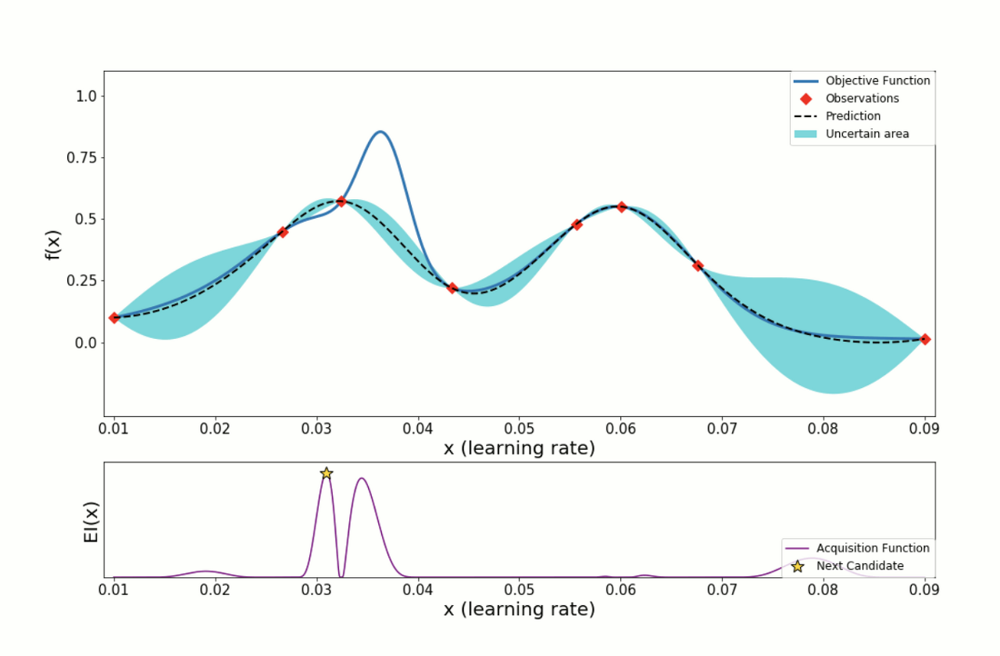

Baysian Optimization 기반한 하이퍼파라미터 튜닝 라이브러리인 **HyperOpt** 에 대하여 다뤄보도록 하겠습니다.


이번 포스팅에서는 베이지안 최적화에 기반한 하이퍼 파라미터 튜닝 라이브러리인 **HyperOpt** 에 대하여 다뤄보도록 하겠습니다.

모델 튜닝은 상당한 인내력과 시간이 소비됩니다. 그렇기 때문에 모델의 하이퍼 파라미터 튜닝에 대한 연구도 활발히 진행되고 있습니다. Scikit-Learn 라이브러리에서도 하이퍼 파라미터 튜닝을 도와 주는 모듈이 존재하는데 랜덤하게 선택된 하이퍼 파라미터 최적화 기법인 **RandomizedSearchCV**, 완전 탐색에 기반한 **GridSearchCV** 등이 있습니다. 

- **RandomizedSearchCV**는 정해진 횟수(iteration) 안에서 정의된 Hyper Parameter의 후보군들로부터의 조합을 랜덤하게 샘플링하여 최소의 오차를 갖는 모델의 하이퍼 파라미터를 찾아 줍니다. 후보군을 신중히 결정해야하며, 랜덤한 조합들 중 최적의 하이퍼 파라미터를 찾는 다는 보장은 없습니다. 횟수를 늘려주면 그만큼 시간도 비례하게 증가한다는 단점이 있습니다.
- **GridSearchCV**는 모델의 하이퍼 파라미터 후보군 들을 완전 탐색하여 하이퍼 파라미터를 찾아냅니다. 후보군의 개수가 많으면 많을수록 기하급수적으로 찾는 시간은 오래 걸리며 후보군들을 잘 설정해줘야 합니다. 

위의 두가지 방식은 scikit-learn에서 제공하고 있기 때문에 널리 사용되고 있지만 오늘 소개해드릴 HyperOpt 는 많이 알려져 있지 않아 사용법 튜토리얼을 진행하고자 합니다.


## HyperOpt란

HyperOpt는 베이지안 최적화의 접근 방식을 취합니다. 베이시안 최적화는 objective function(목적 함수)를 최대/최소로 하는 최적해를 찾는 기법입니다. 목적함수와 하이퍼파라미터의 Pair를 대상으로 Surrogate Model을 만들어 평가하면서 순차적으로 업데이트 하면서 최적의 조합을 찾아 냅니다.

여기서 Acquisition function의 개념이 추가로 나오는데 Surrogate Model은 목적 함수에 대한 확률적인 추정을 하며, Acquisition function은 Surrogate Model이 추정한 확률적 추정 결과를 바탕으로 다음 후보를 선정하는 함수입니다.

[이미지 출처: [ML] 베이지안 최적화 (Bayesian Optimization)]

*더욱 자세한 베이지안 최적화에 대한 설명은 [HyperOpt : 베이지안 최적화를 기반으로 한 하이퍼 파라미터 튜닝](https://ichi.pro/ko/hyperopt-beijian-choejeoghwaleul-giban-eulo-han-haipeo-palamiteo-tyuning-140338828128041) 을 참고해 보시기 바랍니다.*


## HyperOpt 설치

그럼 HyperOpt를 설치해 보도록 하겠습니다.

PyPI 패키지 설치를 제공합니다. 다음의 명령어로 쉽게 설치할 수 있습니다.

```bash
pip install hyperopt
```


## 실습을 위한 샘플 데이터셋 (Boston 주택 가격 데이터) 로드

scikit-learn의 보스톤 주택 가격 데이터를 로드하여 샘플 데이터셋으로 활용합니다.

```python
from sklearn.datasets import load_boston
from sklearn.model_selection import train_test_split

# load dataset
data = load_boston()

# train, test split
x_train, x_test, y_train, y_test = train_test_split(data['data'], data['target'], random_state=SEED)

print(x_train.shape, y_train.shape)
# 출력
# (379, 13) (379,)
```


## 평가함수 정의 (Root Mean Squared Error)

모델의 평가 함수를 정의합니다. 

Regression 예측을 진행할 예정이므로, RMSE 평가지표를 함수로 만들어 정의합니다.

```python
from sklearn.metrics import mean_squared_error

def RMSE(y_true, y_pred):
    return np.sqrt(mean_squared_error(y_true, y_pred))
```


## HyperOpt를 활용한 XGBoost 튜닝 예제

space의 변수에는 dictionary 를 생성후 하이퍼 파라미터의 이름을 키 값으로 가지고 value에는 하이퍼 파라미터의 범위를 지정해 줄 수 있습니다.

- **hp.choice(하이퍼파라미터 이름, 후보군 리스트)**: 후보군 리스트 중에서 하나를 선택하여 대입하면서 최적의 하이퍼 파라미터를 찾습니다.
- **hp.quniform(하이퍼 파라미터 이름, start, end, step)**: start, end까지 step 간격으로 생성된 후보군 중에서 최적의 하이퍼 파라미터를 찾습니다.
- **hp.uniform(하이퍼 파라미터 이름, start, end)**: start, end 사이의 임의의 값 중에서 최적의 하이퍼 파라미터를 찾습니다.

더 자세한 정보는 [공식 도큐먼트 - wiki](https://github.com/hyperopt/hyperopt/wiki/FMin) 에서 확인할 수 있습니다.

```python
import hyperopt
from hyperopt import fmin, tpe, hp, STATUS_OK, Trials
from sklearn.metrics import mean_squared_error

# regularization candiate 정의
reg_candidate = [1e-5, 1e-4, 1e-3, 1e-2, 0.1, 1, 5, 10, 100]

# space 정의, Hyperparameter의 이름을 key 값으로 입력
space={'max_depth': hp.quniform("max_depth", 5, 15, 1),
       'learning_rate': hp.quniform ('learning_rate', 0.01, 0.05, 0.005),
       'reg_alpha' : hp.choice('reg_alpha', reg_candidate),
       'reg_lambda' : hp.choice('reg_lambda', reg_candidate),
       'subsample': hp.quniform('subsample', 0.6, 1, 0.05),
       'colsample_bytree' : hp.quniform('colsample_bytree', 0.6, 1, 0.05),
       'min_child_weight' : hp.quniform('min_child_weight', 1, 10, 1),
       'n_estimators': hp.quniform('n_estimators', 200, 1500, 100)
      }

# 목적 함수 정의
# n_estimators, max_depth와 같은 반드시 int 타입을 가져야 하는 hyperparamter는 int로 타입 캐스팅 합니다.
def hyperparameter_tuning(space):
    model=XGBRegressor(n_estimators =int(space['n_estimators']), 
                       max_depth = int(space['max_depth']), 
                       learning_rate = space['learning_rate'],
                       reg_alpha = space['reg_alpha'],
                       reg_lambda = space['reg_lambda'],
                       subsample = space['subsample'],
                       colsample_bytree = space['colsample_bytree'], 
                       min_child_weight = int(space['min_child_weight']),
                       random_state=SEED, 
                      )
    
    evaluation = [(x_train, y_train), (x_test, y_test)]
    
    model.fit(x_train, y_train,
              eval_set=evaluation, 
              eval_metric="rmse",
              early_stopping_rounds=20,
              verbose=0)

    pred = model.predict(x_test)
    rmse= RMSE(y_test, pred)    
    # 평가 방식 선정
    return {'loss':rmse, 'status': STATUS_OK, 'model': model}
```


목적 함수 정의가 완료 되었다면, fmin 모듈로 최적화를 지정합니다.

fmin 에는 다양한 옵션 값들을 지정할 수 있습니다. 지정해주는 알고리즘과 최대 반복 횟수등을 변경해 보면서 성능이 달라지는지 모니터링 합니다.


```python
# Trials 객체 선언합니다.
trials = Trials()
# best에 최적의 하이퍼 파라미터를 return 받습니다.
best = fmin(fn=hyperparameter_tuning,
            space=space,
            algo=tpe.suggest,
            max_evals=50, # 최대 반복 횟수를 지정합니다.
            trials=trials)

# 최적화된 결과를 int로 변환해야하는 파라미터는 타입 변환을 수행합니다.
best['max_depth'] = int(best['max_depth'])
best['min_child_weight'] = int(best['min_child_weight'])
best['n_estimators'] = int(best['n_estimators'])
best['reg_alpha'] = reg_candidate[int(best['reg_alpha'])]
best['reg_lambda'] = reg_candidate[int(best['reg_lambda'])]
best['random_state'] = SEED
print (best)
# {'colsample_bytree': 0.8, 'learning_rate': 0.02, 'max_depth': 10, 'min_child_weight': 2, 'n_estimators': 700, 'reg_alpha': 1, 'reg_lambda': 0.001, 'subsample': 0.65, 'random_state': 30}
```


best 변수에 담긴 튜닝된 하이퍼 파라미터를 XGBoost 알고리즘에 적용하여 예측합니다.

```python
xgb = XGBRegressor(**best)
xgb.fit(x_train, y_train)
pred = xgb.predict(x_test)
print(RMSE(y_test, pred))
# 2.2171511696118538
```


#### Reference

- [HyperOpt Documentation](http://hyperopt.github.io/hyperopt/)
- [Hyperopt: Distributed Hyperparameter Optimization](https://github.com/hyperopt/hyperopt)
- [HyperOpt : 베이지안 최적화를 기반으로 한 하이퍼 파라미터 튜닝](https://ichi.pro/ko/hyperopt-beijian-choejeoghwaleul-giban-eulo-han-haipeo-palamiteo-tyuning-140338828128041)
- [[ML] 베이지안 최적화 (Bayesian Optimization)](https://wooono.tistory.com/102)


