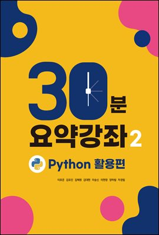
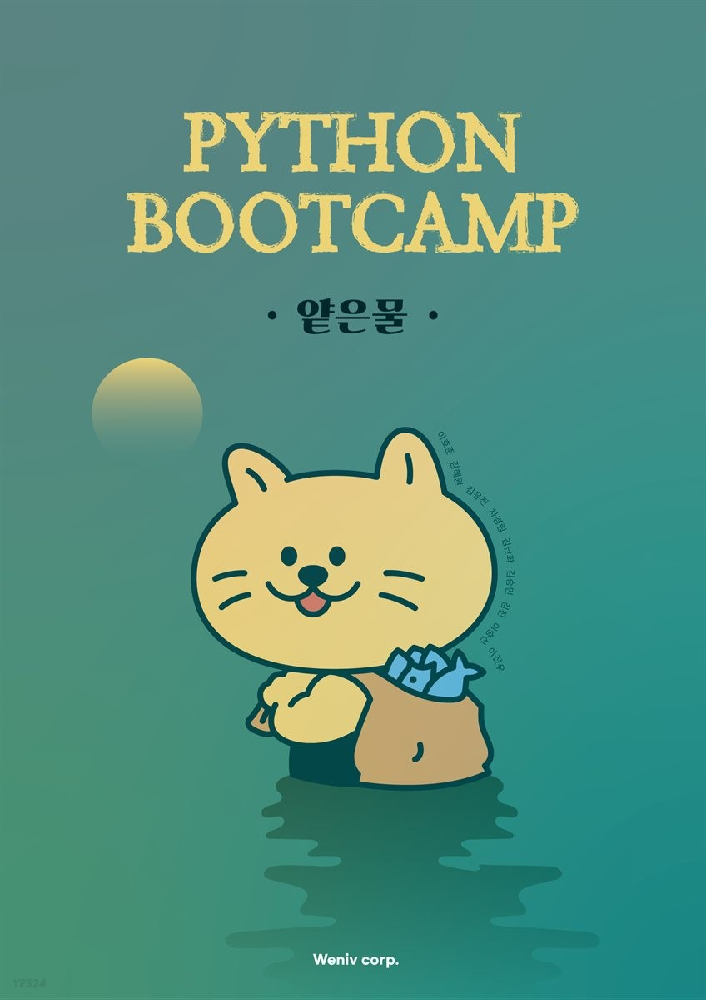
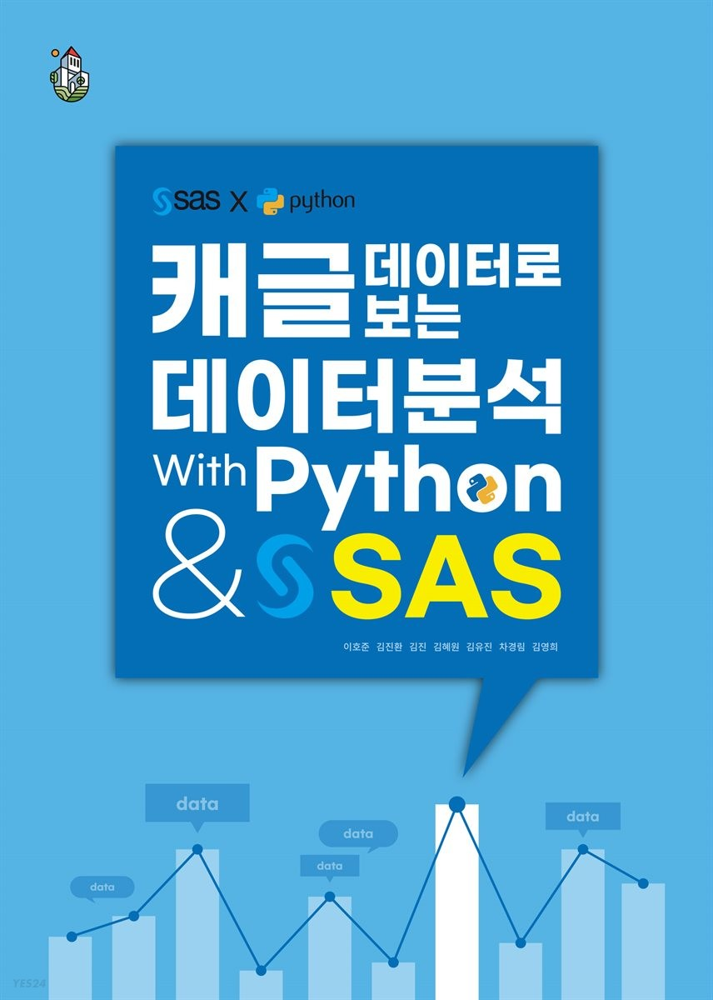
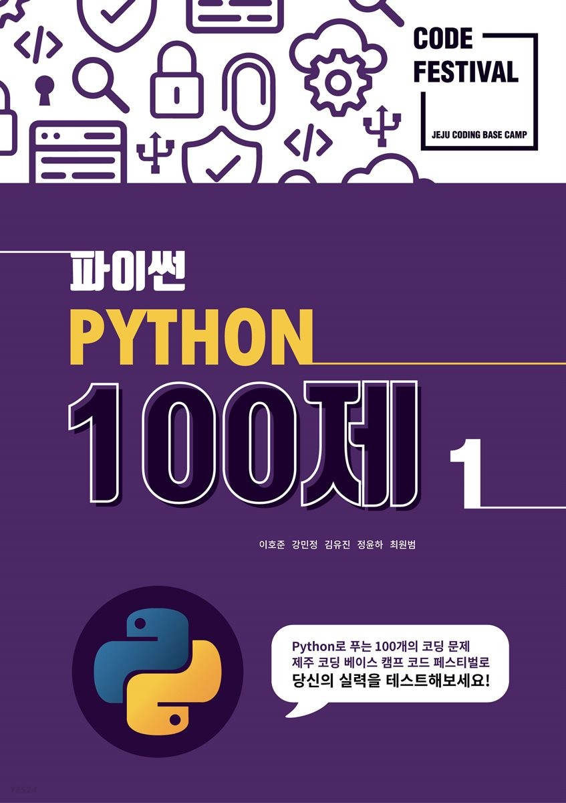
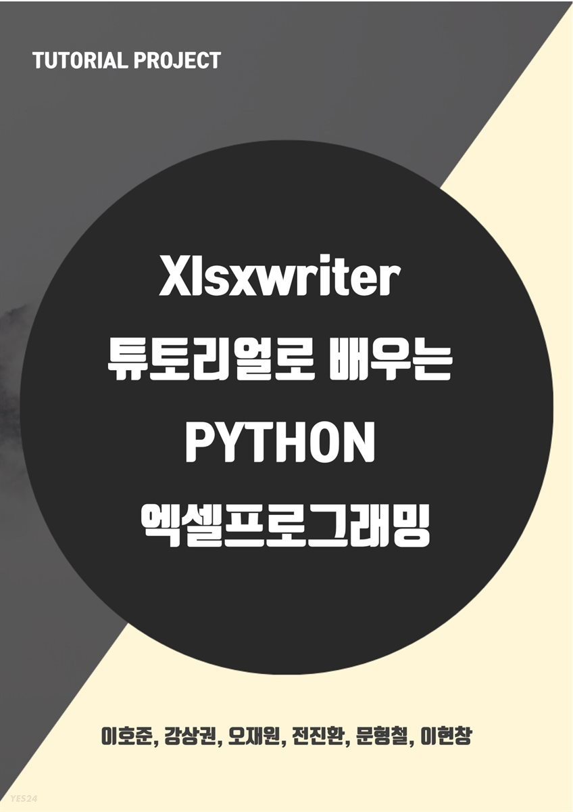
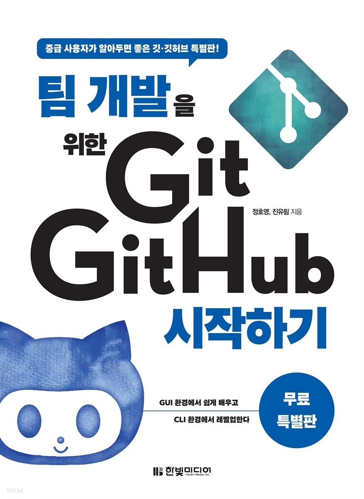
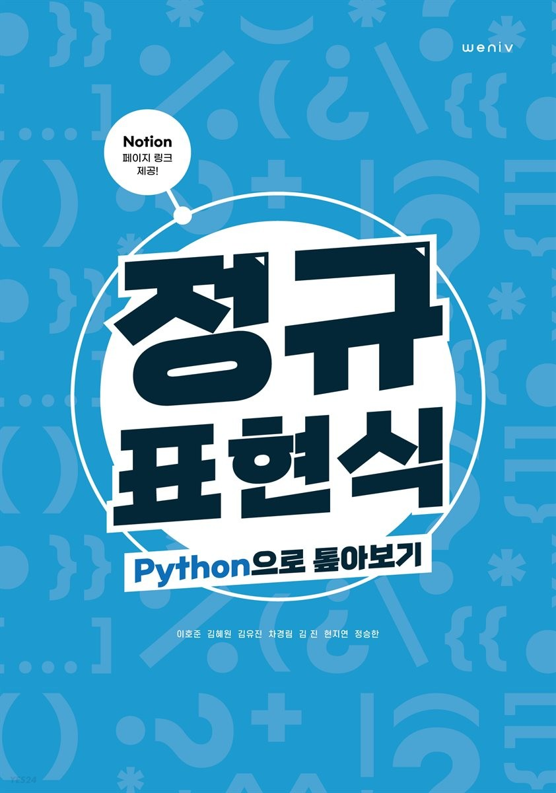
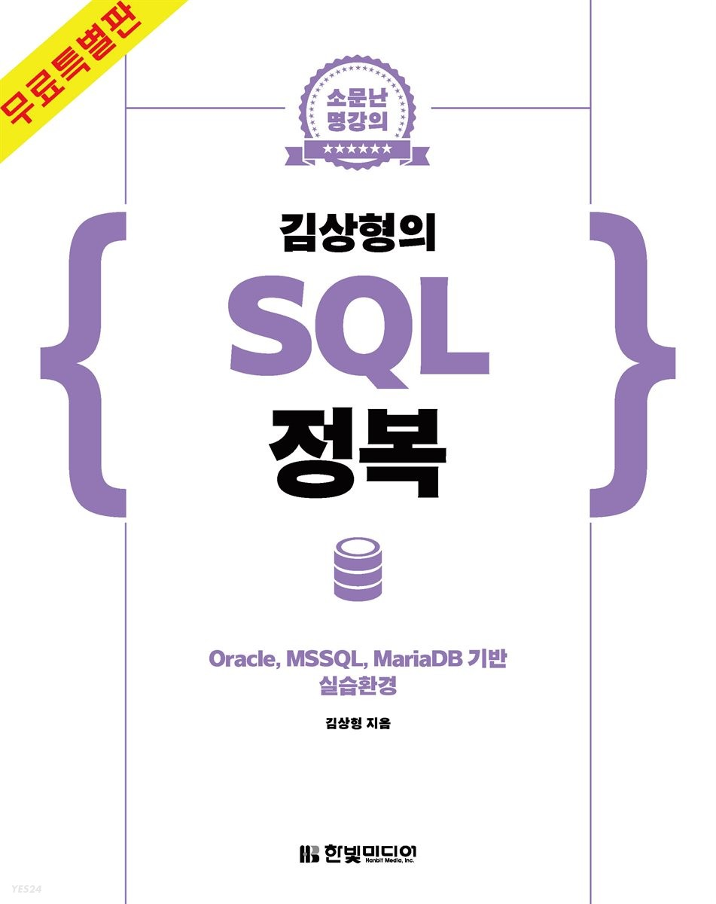

이번 포스팅에서는 yes24.com 에서 **2021년 6월 9일 기준** **무료로 제공**되는 e-book 중 Python, 데이터분석, SQL, 정규식 표현 등에 도움이 되는 책과 링크들을 정리하여 공유 드려 보고자 합니다. 본 포스팅은 광고글은 아니며, 언제까지 무료로 제공될지는 모릅니다. 언제든 무료 e-book은 예고 없이 종료될 수 있습니다.

아래 소개해 드린 서적들은 종이책이 아닌 e-book에 한하여 무료입니다. 종이책은 유료입니다.

먼저, 이렇게 무료로 공개(혹은 한시적 EVENT) 해주신 저자님들과 유통사에게 **감사하다는 말씀을 미리 전해 드립니다.**

## 1. Python 데이터분석 활용편 - Python, Numpy, Pandas, Visualization, Crawling 30분 요약강좌!

[30분 요약 강좌 시즌2 : Python 데이터분석 활용편 - Python, Numpy, Pandas, Visualization, Crawling 30분 요약강좌!](http://www.yes24.com/Product/Goods/90178161?OzSrank=9)

## 2. Python Bootcamp 얕은물

[Python Bootcamp 얕은물](http://www.yes24.com/Product/Goods/91230570?OzSrank=8)

## 3. 캐글 데이터로 보는 데이터분석 With Python & SAS

[캐글 데이터로 보는 데이터분석 With Python & SAS](http://www.yes24.com/Product/Goods/95918418?OzSrank=7)

## 4. 제주코딩베이스캠프 Code Festival , Python 100제 1부 & 2부

- [제주코딩베이스캠프 Code Festival , Python 100제 1부](http://www.yes24.com/Product/Goods/79404408?OzSrank=3)

- [제주코딩베이스캠프 Code Festival , Python 100제 2부](http://www.yes24.com/Product/Goods/83494637?OzSrank=2)

## 5. xlsxwriter 튜토리얼로 배우는 Python 엑셀 프로그래밍 

[xlsxwriter 튜토리얼로 배우는 Python 엑셀 프로그래밍 ](http://www.yes24.com/Product/Goods/70826216?OzSrank=1)

## 6. 팀 개발을 위한 Git, GitHub 시작하기 

[팀 개발을 위한 Git, GitHub 시작하기 ](http://www.yes24.com/Product/Goods/86031178)

## 7. 정규표현식 (Python으로 톺아보기)

[정규표현식 (Python으로 톺아보기)](http://www.yes24.com/Product/Goods/98830816?OzSrank=1)

## 8. 김상형의 SQL 정복

[김상형의 SQL 정복](http://www.yes24.com/Product/Goods/101637633?OzSrank=3)

## 감사합니다.

끝으로, **다시 한 번 이렇게 무료로 제공해 주신 저자님들과 유통사에게 감사**하다는 말씀 드립니다!

(공식적인 행사는 아닌 것 같습니다. 언제든 예고 없이 종료 될 수 있습니다.)