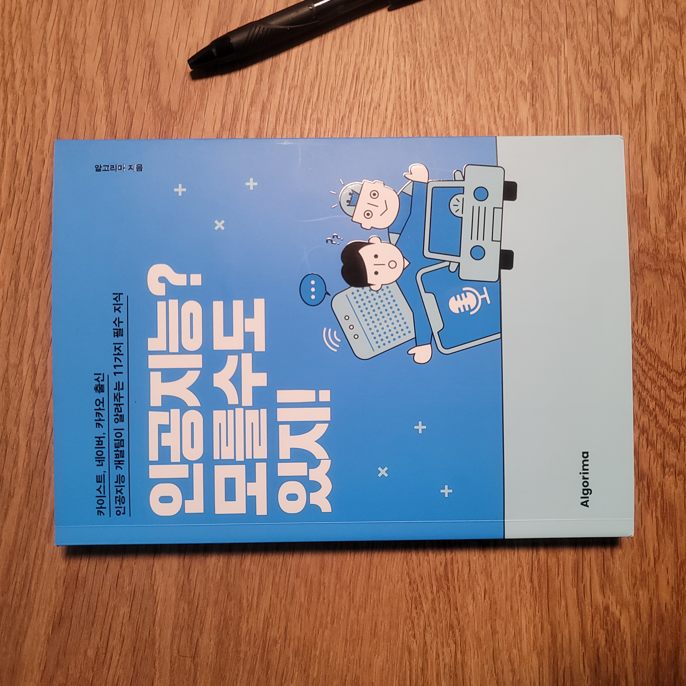
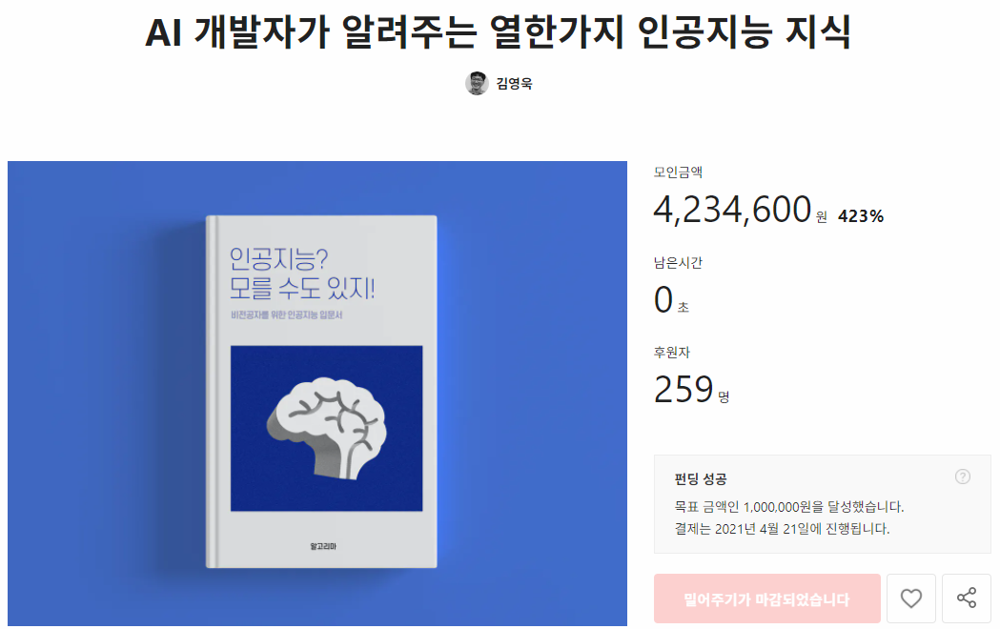
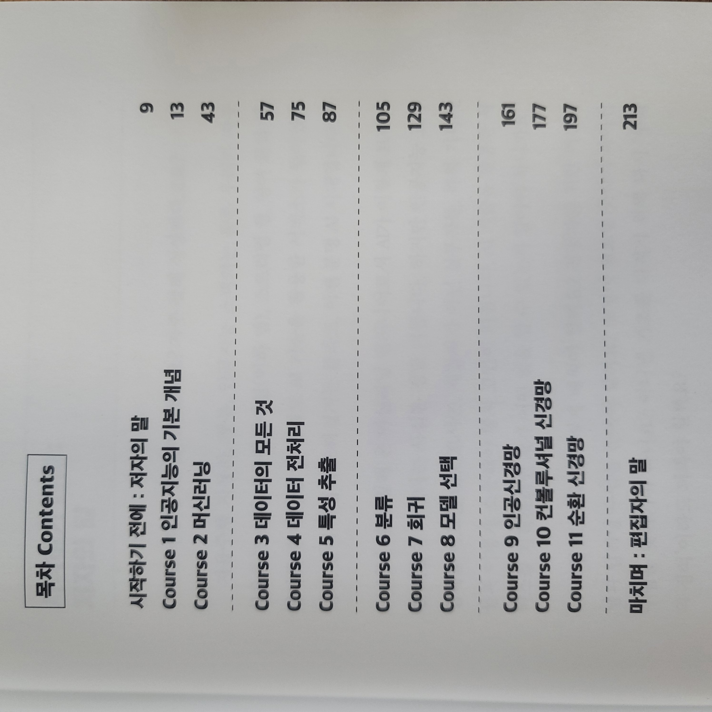
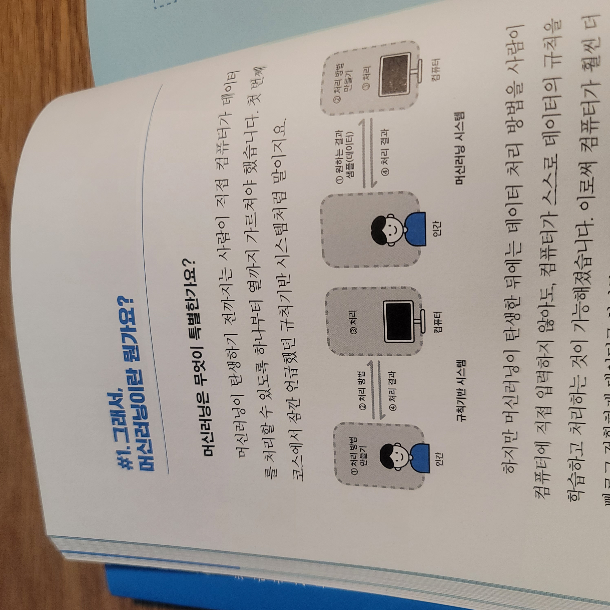
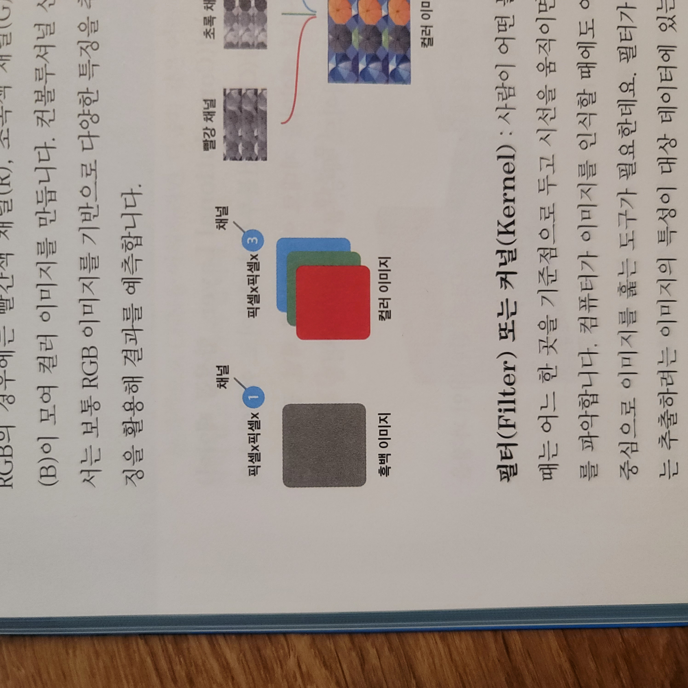
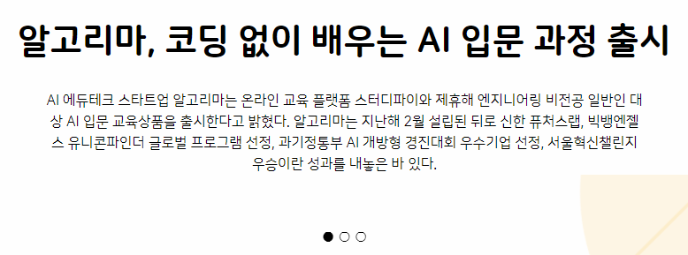
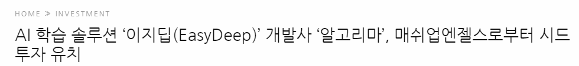

이번 포스팅에서는 Algorima에서 집필한 **인공지능? 모를수도 있지!** 책 리뷰를 해보도록 하겠습니다.

*[미리 알려드립니다] 본 리뷰는 Algorima로부터 책을 제공 받아 진행하지만, 책 이외 어떠한 금전적인 지원을 받지 않았습니다.*

그럼, **솔직한 리뷰**를 시작합니다.

알고리마(Algorima)에서 집필한 "인공지능? 모를수도 있지!" 서적은 **텀블벅**에서도 펀딩을 진행한 바 있으며, **423% 를 달성**하며 성공적으로 펀딩 완료한 바 있습니다. 

먼저, 이 책의 제목만 보더라도 딱딱한 입문서라기 보다는 **말랑말랑한 어조와 함께 쉽게 개념을 풀이해서 지식을 전달해 주는 책**이라는 느낌이 듭니다. 

## 코드 No! 이해하기 쉬운 설명 Yes!

이 책은 코드를 통하여 인공지능 기술을 배워나가는 **기술 서적이 아닙니다**. 입문자가 코드를 통해 AI 관련 지식의 습득을 원하시는 분들은 전문 기술서적을 보시는 것을 추천 드립니다. 이 책이 지향하는 독자층은 인공지능이나 코딩 혹은 기술에 대한 이해가 전혀 없는 분들을 대상으로 이해를 돕기 위하여 집필된 책입니다.

**주요 독자층**

- 인공지능에 대한 지식이 없지만 어떠한 원리로 동작하는지 궁금한 분
- 코드 경험이 전혀 없으신 분
- 인공지능을 앞으로 학습하고 싶으며, 전반적인 이해를 원하시는 분

## 인공지능의 핵심 주제 11가지를 다룹니다

이 책은 인공지능의 **핵심 주제 11가지**를 선정하여 다룹니다. Course 1 & 2는 인공지능 그리고 머신러닝의 기본 개념에 대하여 다룹니다. 입문자의 눈높이에서 적절한 예시와 더불어 **쉽게 설명**합니다. 

> 머신러닝에 대한 설명 예시

이 책의 가장 큰 장점은 적절한 **표와 그림, 차트를 활용하여 어려운 인공지능이라는 주제에 대한 설명에 이해를 돕는다는 점** 입니다. 다만, 전반적인 개념을 요약하여 설명하기 때문에 깊이가 얕을 수 있습니다. 어찌보면 전문 기술서적이 아니라는 점에서 당연합니다.

> 컨볼루셔널 신경망: Channel 설명 예시

그럼에도 불구하고 11가지의 주제 안에서 꼭 다뤄야 하는 핵심 키워드와 개념은 잘 다뤄주고 있습니다. 한 가지 조금 아쉬운 점은 **목차 구성에서 Course 9, 10, 11은 딥러닝 부분으로 구성되어 있는데 개념이 어렵고 입문자에게는 다소 난이도가 어려울 수 있다**는 생각이 들었습니다. 

역전파(backpropagation)의 개념과 컨볼루셔널 신경망의 커널과 합성곱 연산, 순환 신경명의 구조등은 머신러닝이나 데이터 분석을 꽤 오래동안 공부하신 분들도 **이해하기 어려워하는 부분**입니다. 물론, 인공지능이라는 주제에서 딥러닝 부분이 빠지게 되면 아쉽다고 느껴질 수 있겠지만, 차라리 딥러닝을 제외한 머신러닝의 전반적인 개념까지 다뤄주고, 실제 머신러닝이 적용한 실사례들을 더 보여주면 어땠을까? 라는 생각을 해봤습니다.

## 반드시 알아야 하는 핵심 개념을 쉽게

**과소적합, 과대적합, 토큰화, 원핫인코딩, 선형회귀, 결정트리, 컨볼루션 연산** 등등 방금 나열한 이 키워드는 인공지능에서는 반드시 알고 있어야 하는 개념이지만 생각보다 개념에 대하여 헷갈리거나 잘 모르는 경우가 많습니다. 이러한 개념들을 그 어떤 책보다 쉽고 간결하게 설명합니다.  복잡한 수식이나 실제 코드 없이 예시를 활용하여 설명하기 때문에 기본 개념을 이해하기에 매우 좋습니다.

그럼에도 불구하고 여전히 아쉬운 점은 실습 예제나 코드/ 수식을 포함한 설명은 생략되었기 때문에 더 깊은 이해를 위해서는 두꺼운 전문 서적을 참고해야 합니다.

그래도 코드나 수식 없이 인공지능의 전반적인 이해를 도와주는 서적은 없었기 때문에 이 책의 가장 훌륭한 포인트라고 말할 수 있으며, 마치 지하철 출근길에서 가볍게 읽을 수 있는 좋은 입문서 입니다.

저자인 알고리마 팀이 지향하는 바는 코딩 없이 인공지능을 대중화 하는데에 있습니다.

> AI 학습 솔루션(EasyDeep)으로 투자 유치에 성공했다

이 책을 만든 이유도 알고리마 팀이 지향하는 **인공지능의 대중화**와 같은 결을 가진다고 볼 수 있습니다. 그만큼 쉽게 설명하고 모두가 이해할 수 있는 언어로 집필되었다는 점이 가장 큰 장점이었습니다. 

**"어려운 내용을 쉽게 설명하는 것"**

어쩌면 가장 어려운 일입니다. 

이렇게 어려운일을 성공적으로 해낸 첫 결실에 응원을 보냅니다. 

그리고 이 책을 통해 인공지능의 원리 그리고 전반적인 내용에 대한 이해를 원하는 비전공자 혹은 입문자, 코딩 무경험자는 이 책을 읽으시면 큰 그림을 그리는데 도움이 될 것  입니다.

앞서 언급하였지만, 이미 머신러닝에 대한 전반적인 개념이 있으신 분이나 코딩에 거부감이 없으신 분들에게는 [핸즈온 머신러닝](http://www.yes24.com/Product/Goods/89959711?OzSrank=1)이나 [선형대수와 통계학으로 배우는 머신러닝 with 파이썬](http://www.yes24.com/Product/Goods/97032765?OzSrank=1), [케라스 창시자에게 배우는 딥러닝](http://www.yes24.com/Product/Goods/65050162?OzSrank=4) 과 같은 전문 서적을 보시는 것을 추천 드립니다.

## 끝으로

앞으로 이러한 시리즈가 더 출간되었으면 좋겠다는 마음이 제일 먼저 들었습니다.

CNN, RNN, GAN, YOLO, Transformer와 같은 분야는 많은 분들이 어려워 하는 분야 이기도 합니다. 어려운 분야지만 그럼에도 불구하고 많은 분들이 관심을 가지는 분야입니다. 유튜브와 같은 플랫폼에서 입문 지식을 다뤄주는 영상 콘텐츠들은 넘쳐 나지만 좀 더 전문 영역분야에 대하여 알기 쉽게 다뤄주는 채널 자체가 많지 않은 것 같습니다.

지금처럼 굳이 코드 설명 없이 좀 더 전문영역에 대한 전반적인 이해를 도울 수 있는 내용을 더 깊게 다뤄주는 후속작이 나오기를 기대해 봅니다.

**좋은 책 만들어 주셔서 감사합니다.**

- 구매 링크: [인공지능? 모를 수도 있지!](http://www.yes24.com/Product/Goods/102268634?OzSrank=1)

*본 리뷰는 Algorima로부터 책을 제공 받아 진행하지만, 책 이외 어떠한 금전적인 지원을 받지 않았습니다.*

