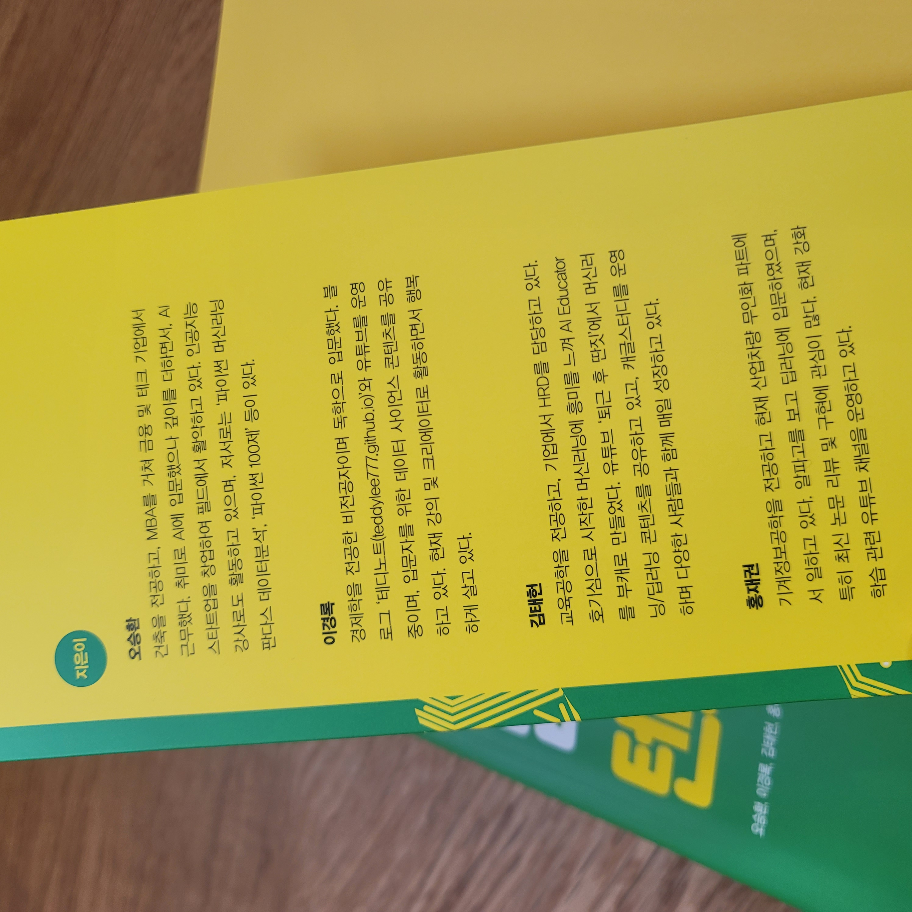
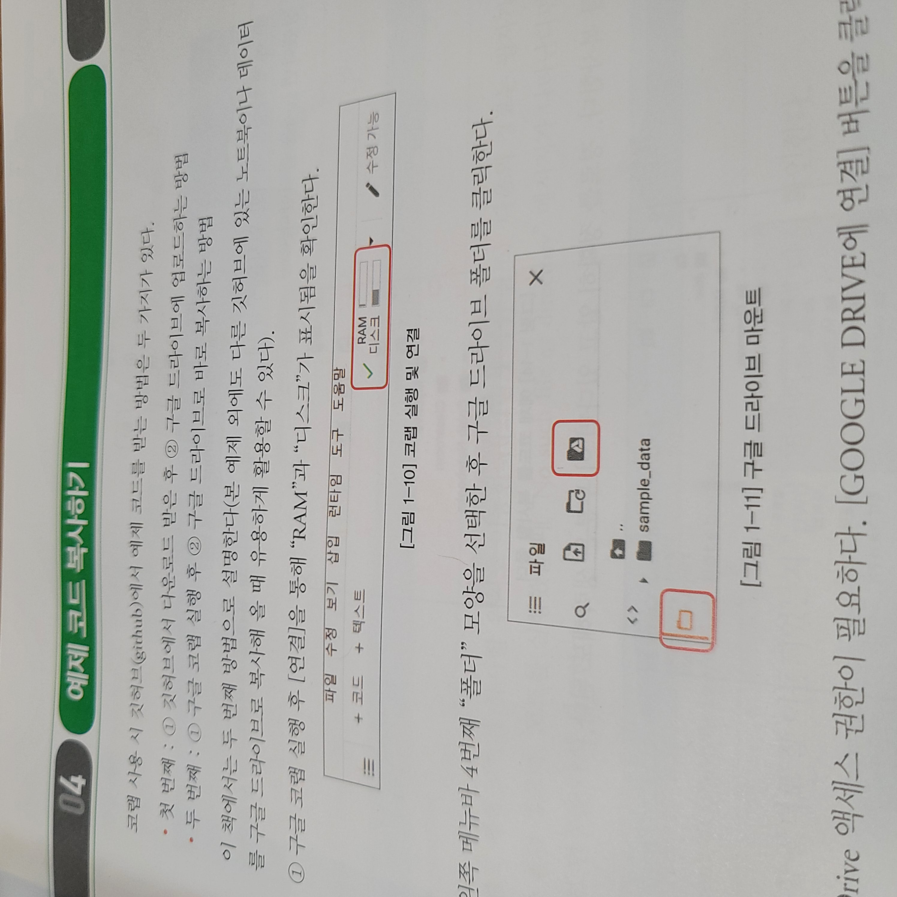
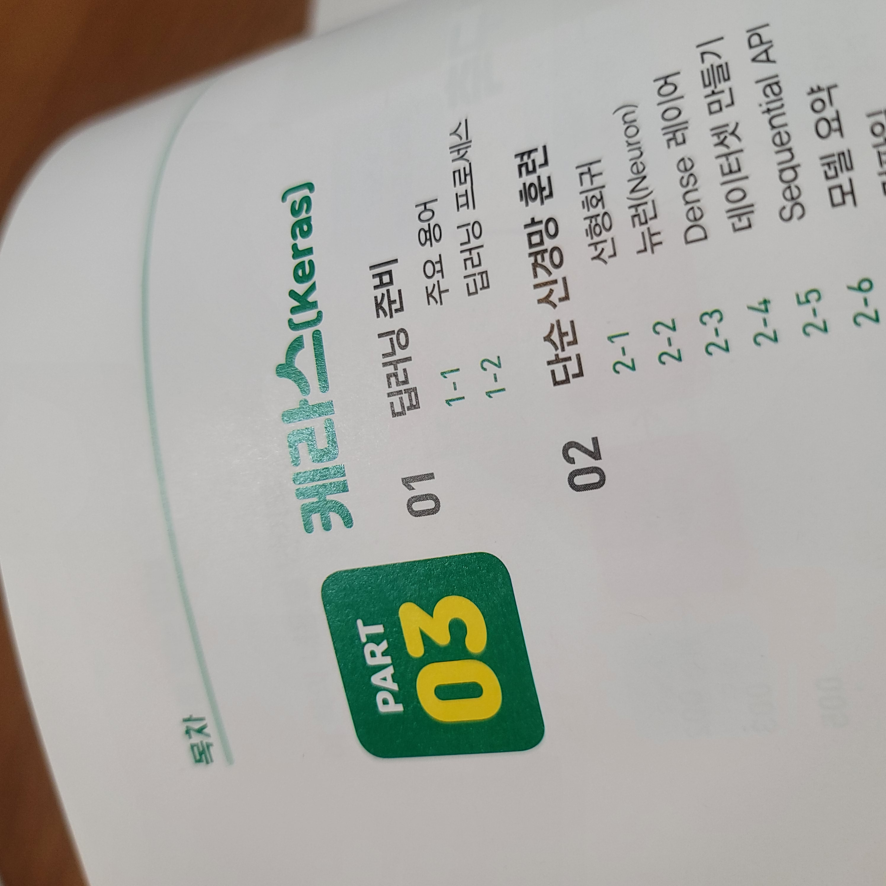
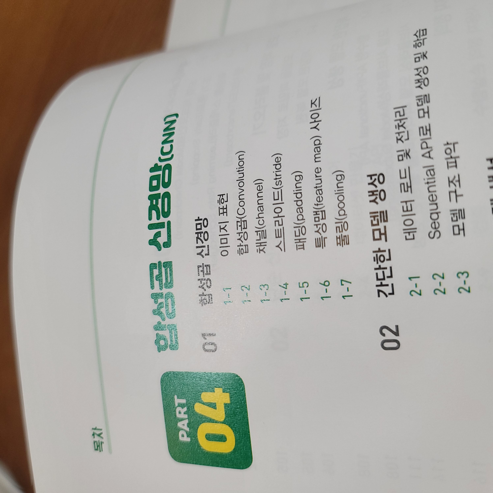
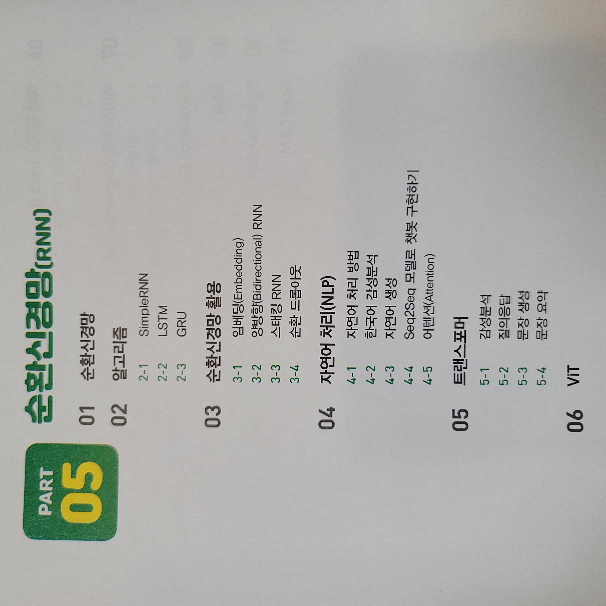
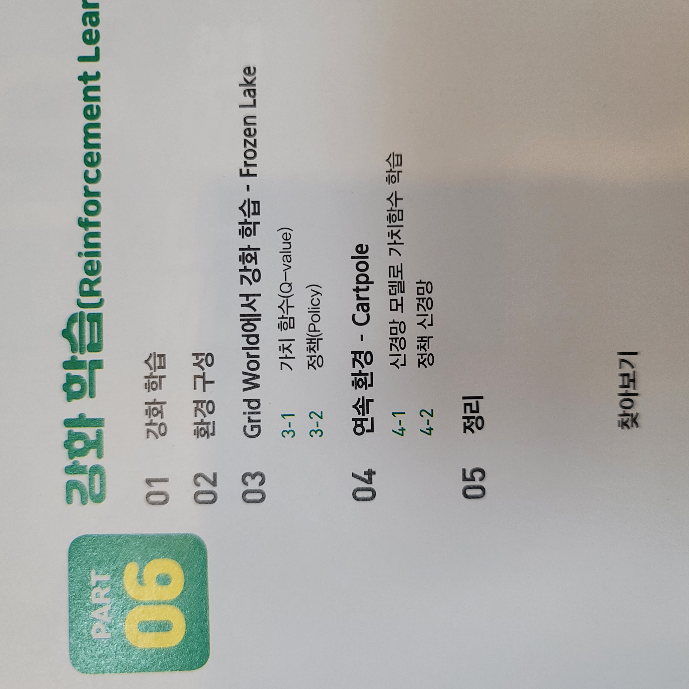
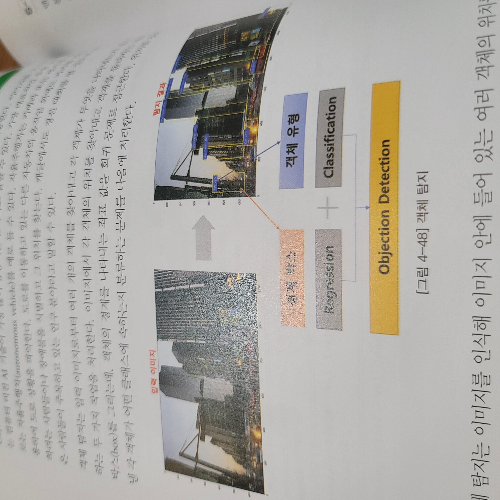
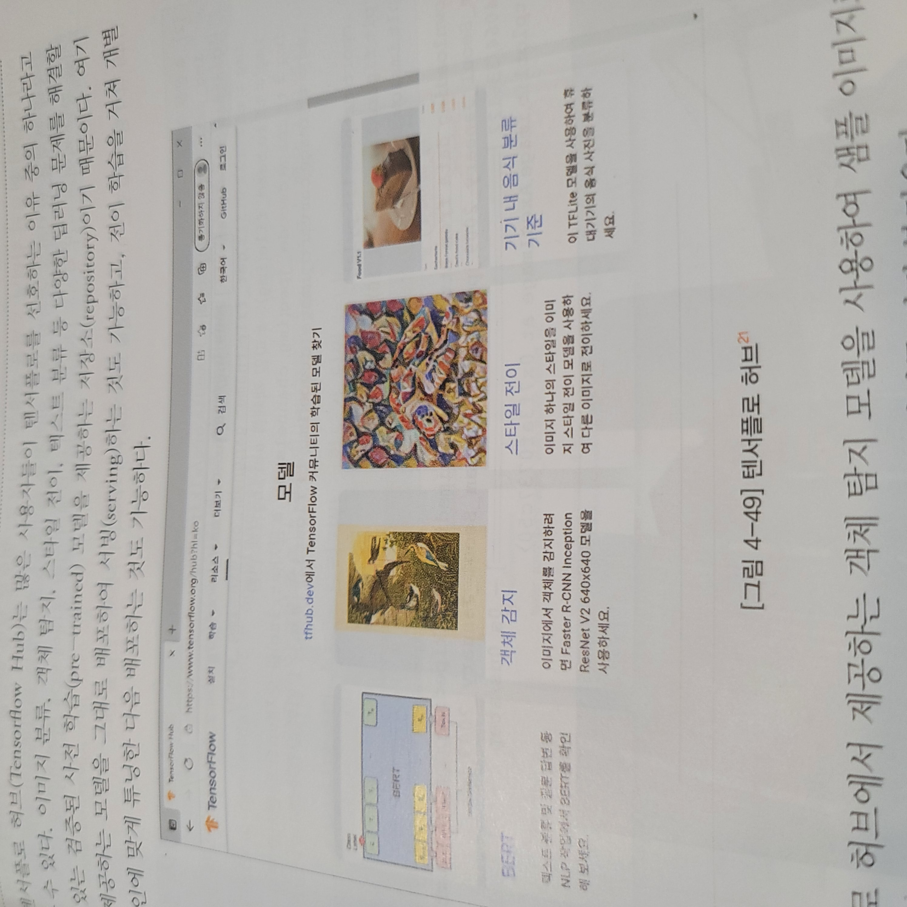
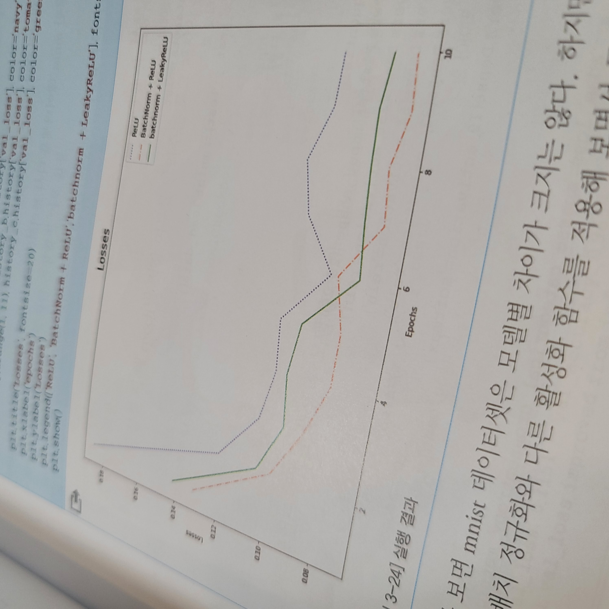
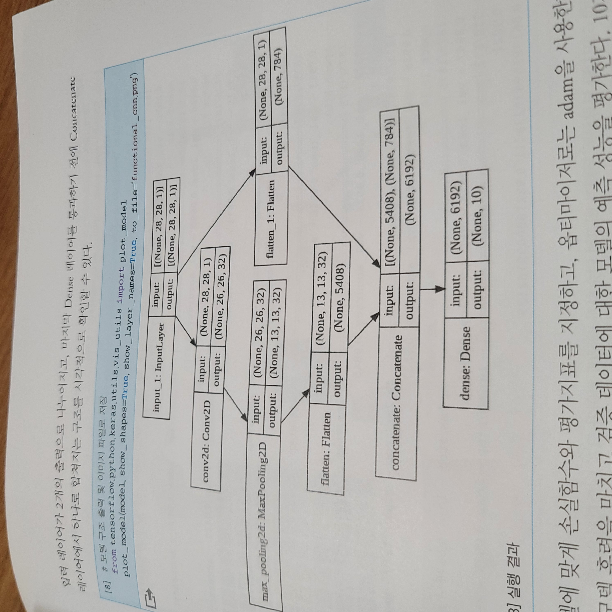

지난 6개월간 동료 3명과 집필한 **"파이썬 딥러닝 텐서플로"** 책이 드디어 온라인/오프라인 출간 되었습니다!!!

인생 버킷리스트 중 하나인 책 집필을 많은 분들께서 관심있지만 어렵다고 느끼시는 주제인 딥러닝이라는 주제로 출간되었다는 점에서 너무나 뿌듯합니다^^ 

![[표지]_파이썬 딥러닝 텐서플로_입체](../images/2021-07-16/[표지]_파이썬 딥러닝 텐서플로_입체.jpg)

**책 보러가기(온라인)**

* [교보문고](https://bit.ly/tf-book-1)
* [YES24](https://bit.ly/tf-book-2)

## 저자 & 독자

이번에 출간된 "파이썬 딥러닝 텐서플로" 책은 딥러닝 **입문자 ~ 중급자를 대상**으로 집필한 책입니다. 따라서 쉬운 용어와 설명으로 되어 있는 책이고 그림과 예시에 꼼꼼한 설명을 **최대한 친절하게** 담아냈습니다. 

이 책을 집필한 저자 4명도 불과 몇 년전만 하더라도 *딥러닝 입문자* 였습니다. 그렇기 때문에 <u>**누구보다 입문자들이 처음 "딥러닝" 이라는 주제를 맞닿뜨렸을 때 느낀 어려운 점**</u>들을 잘 알고 있습니다. 

해외 원서를 번역한 책의 경우 간혹 예제에서 중간 단계를 건너뛰어 설명하는 부분이 있기도 한데요. 중간 단계가 생략되는 부분이 없이 책의 예제를 따라만 하더라도 결과가 잘 출력될 수 있도록 집필 하였습니다.

책에 설명된 내용을 온전히 이해하기 위해서는 다음의 **사전 지식**이 요구 됩니다.

**독자의 사전 지식**

- **파이썬(Python)** 언어에 대한 기본 이해
- **구글 코랩(Google Colab)**

구글 코랩은 책에서 내용을 다루기 때문에 굳이 모르셔도 상관없습니다. 

## 예제코드

예제 코드는 다음의 링크에서 받아보실 수 있습니다. 책을 구매하지 않으셔도 **Github에 공개되어 있는 예제코드를 실행**해보실 수 있습니다. 소스코드는 **구글 코랩으로 바로 실행** 하실 수 있습니다.

패키지가 업그레이드 되거나 수정사항이 있을 시 지속적인 업데이트를 할 예정입니다. 혹시 소스코드에 오류가 있다면, Github의 Issue에 문의를 남겨 주세요~!

- [깃헙 소스코드](https://github.com/lovedlim/tensorflow)

## 목차 구성

이 책은 기본 **텐서(Tensor)**의 내용부터 **강화학습**까지 전반 적인 내용을 모두 다룹니다. 만약 이 중에서 모든 주제에 대하여 두루두루 관심이 있지는 않고 하나의 주제를 깊게 파고들고 싶으신 분들은 이 책이 맞는 선택지가 아닐 수 있습니다. 

이 책은 딥러닝에서 **가장 HOT 하게 다뤄지는 주제들에 대한 전반적인 이해**와 예제를 통한 실습에 초점을 두었습니다. 제가 추천드리고 싶은 방법은 먼저 이 책에 제시된 주제들을 전반적으로 살펴보고 관심이 가는 주제에 대하여 해당 주제만을 다루는 전문 서적을 살펴보시거나 논문을 깊게 파고드시는 것을 추천 드립니다. 물론 좋은 유튜브 콘텐츠들도 많습니다!

> 케라스 (Keras) 활용

케라스(Keras)를 활용한 전반적인 내용을 모두 담았습니다. 자주 사용되는 레이어(Layer)에 대한 설명은 물론이고 3가지 모델링 방법(Sequential, Functional, Subclassing) 으로 복잡한 모델 구축 방법도 다루고 있습니다. 뿐만 아니라 **규제, 드롭아웃, 배치 정규화** 그리고 ReLU 외의 다양한 활성화 함수까지 포괄적으로 다루고 있습니다.

특히 케라스의 후반부 내용에는 자주 사용되는 **콜백(Callback)함수와 tf.dataDataset 클래스**를 활용한 데이터셋 구축 방법을 담았습니다. 그리고, 코랩에서 **텐서보드(TensorBoard)를 활용한 실시간 시각화**에 대한 내용도 있으니 참고하시면 도움이 되실 것 같습니다.

> 합성곱 신경망(CNN) - 위성이미지 분류, 개/고양이 분류 예제

합성곱 신경망에서는 기본 이미지 분류 예제는 물론이고, 데이터 증강(Augmentation)과 이미 학습된 사전 모델을 활용하는 전이학습(Transfer Learning)에 대한 내용을 다룹니다. 그리고, 많은 분들께서 용청해 주신 객체 탐지(Object Detection), YOLO, 이미지 분할(Image Segmentation)에 대한 내용도 담고 있습니다. 

또한, 요즘 Image 하면 빼 놓을 수 없는 GAN, Style Transfer, Grad CAM 까지 쉬운 예제와 함께 다루고 있습니다.

무엇보다 책을 4권이나 집필하신 **<u>오승환</u>**님께서 한땀한땀 완성하셨기 때문에 믿고 보는 파트입니다!

> 순환신경망(RNN) - 자연어 처리, Seq2Seq, 트랜스포머, VIT

RNN은 역시 **자연어 처리**죠!

RNN의 구조를 처음 이해할 때 정말 힘들었던 기억을 되살려, **<u>설명 장인</u>** **<u>김태헌</u>**께서 최대한 친절하고 쉬운 용어, 그림을 총동원하여 담아냈습니다. 뿐만아니라, **Seq2Seq/ 트랜스포머(Transformer)**의 내용도 다루고 있습니다. 평소 Seq2Seq와 트랜스포머에 대한 내용을 이해하려고 하다가 포기하신 분이 계시다면, 이 부분의 내용만 보시더라도 이해가 훨씬 수월하게 되어 있다는 것을 느끼실껍니다.

> 강화학습 - 게임

**강화 학습**이 이렇게 재밌는 주제 였구나! 를 깨닫게 해주셨던 **<u>강화학습 덕후</u>** **홍재권**님께서 강화학습 파트를 담당해 주셨습니다. 

강화 학습은 게임을 가지고 실습이 구성되어 있기 때문에 재밌게 실습을 진행할 수 있습니다. 강화 학습이라는 다소 생소한 주제일 수 있겠지만, 게임을 통해 강화학습에 대한 전반적인 이해를 가져 가신다면 이를 활용하여 접목할 수 있는 분야 그리고 아이디어가 더 많이 떠오르실 껍니다. **현재 금융분야에서도 바로 이 강화학습을 통해 금융 포트폴리오를 구성하고 AI가 트레이딩을 하는 알고리즘 및 논문이 활발하게 공개**되고 있습니다. 그만큼 앞으로 더욱 **주목받을 수 있는 분야**이니 관심있게 보시면 분명 도움이 되실껍니다!

## 그림과 예시를 통한 친절한 설명!

이 전에도 이미 여러 번 강조드렸지만, 건너뛰는 코드 없이 모든 과정을 순차적인 흐름에 맞게 구성하였습니다. 그리고 중간중간 어려운 개념들은 디자이너 장인께서 한땀한땀 완성해 주신 그림들로 이해를 돕기위해 노력하였습니다.

> Object Detection

> 텐서플로 허브

> 그래프 활용

> 강화학습 - 에이전트

> 복잡한 모델 구현

## 끝으로

지난 6개월동안 4명이 머리를 맞대고 많은 고민을 하면서 집필하였습니다. 물론 완벽한 책은 아니고 개선되어야 할 부분도 있을껍니다. 오탈자도 있을 수 있으니 너그러이 이해해 주세요^^ 

그래도 최선을 다해서 가장 친절한 책이 될 수 있도록 집필하였습니다. 중간에 여러 번 갈아 엎기도 하였습니다 ㅎ

책에 대한 피드백이 있으시다면 활발하게 공유해 주시기 바랍니다. 어떠한 의견도 좋습니다!

책 구매링크를 남기고 이만 줄이겠습니다. 감사합니다.

**책 보러가기(온라인)**

* [교보문고](https://bit.ly/tf-book-1)
* [YES24](https://bit.ly/tf-book-2)

