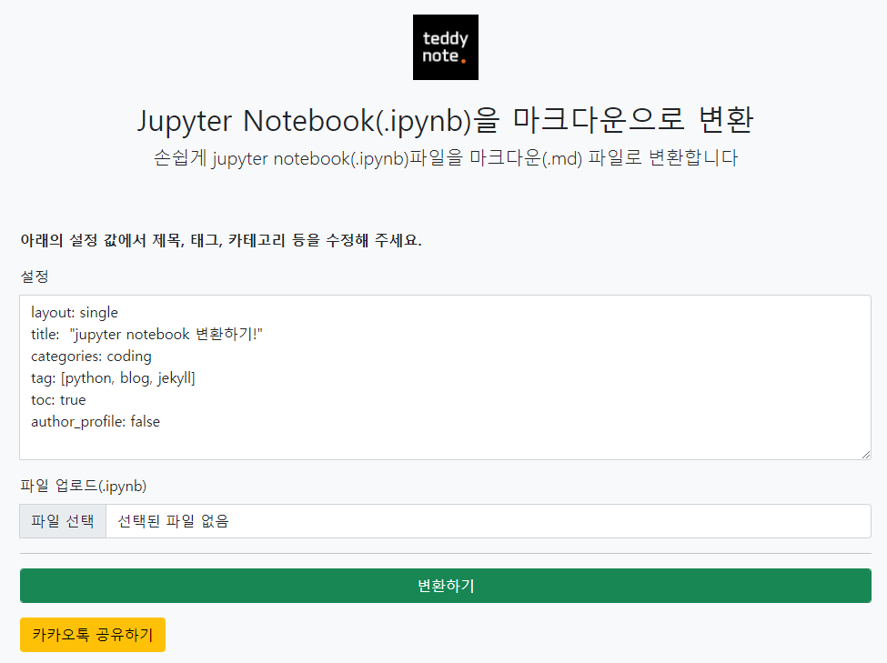

많은 분들께서 Jekyll 블로그 (혹은 GitHub Pages 블로그)에 포스팅 할 때 **Jupyter Notebook을 바로 변환해서 마크다운 형식으로 바로 업로드** 하고 싶어할껍니다. 왜냐면, Jupyter Notebook으로 작성된 코드와 주석, 텍스트, 그리고 이미지등을 다시 블로그 형식에 재작성하는 것은 어찌보면 **반복 작업**이기 때문에 **시간적이나 노동적인 측면에서 효율적이지 않습니다**.

따라서, 깃헙 페이지에서 블로그를 운영하시고 계시면서 Jupyter Notebook을 적극적으로 활용하여 파이썬, 데이터분석, 머신러닝, 딥러닝을 하시는 분들을 위해 Jupyter Notebook을 마크다운(.md)으로 변환해주는 변환기를 만들어 왔습니다.

## 변환기 사이트

[사이트 바로가기](http://teddynote.herokuapp.com/convert)

사이트는 1 page 형식의 매우 심플한 사이트고 기능 또한 단순합니다.

1. 먼저, Jekyll 블로그에 업데이트하기 위한 **설정 값을 입력**합니다.
2. 그리고 .ipynb 파일의 **Jupyter Notebook을 업로드** 하고
3. 변환하기 버튼을 누르면 **마크다운(.md) 파일을 다운로드** 받으실 수 있습니다.

다운로드 받은 .md 파일을 `_posts` 폴더에 넣고 커밋(commit) 해주시면 깔끔하게 이미지 코드 들이 업데이트 됩니다.

그리 오래 걸리지 않으니 한 번쯤 테스트해 보세요~

관련하여 추가 기능 혹은 개선 아이디어가 있으신 분들은 언제든 제안 주세요.

감사합니다!

#jekyll #jupyter_notebook #markdown #github_pages

