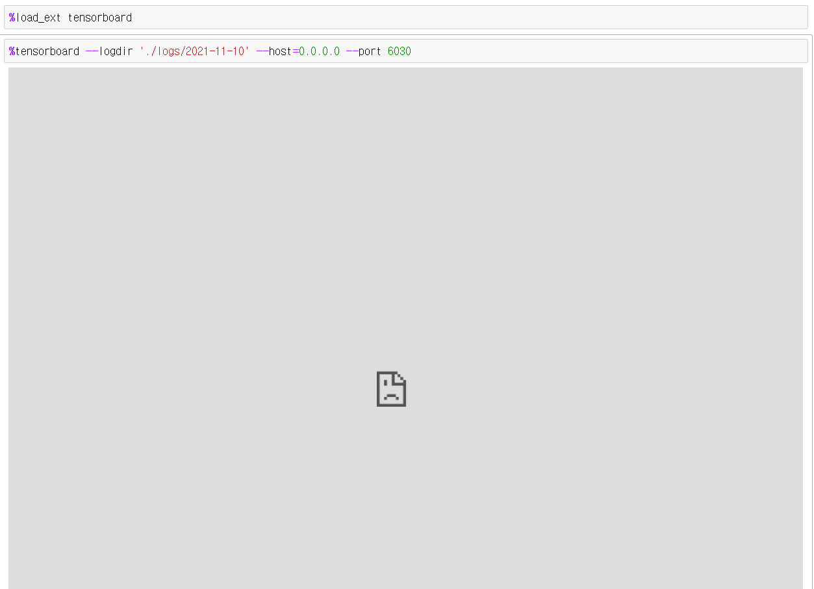
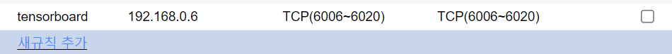
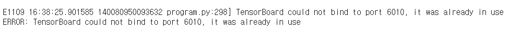
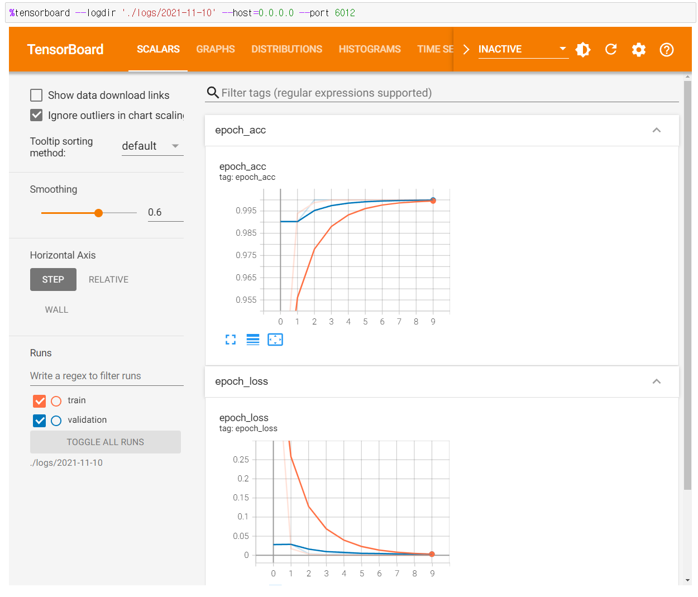

tensorboard는 딥러닝 프레임워크에서 모델이 학습되는 과정을 **실시간으로 모니터링** 할 수 있는 강력한 툴입니다.

pytorch와 tensorboard **모두 사용**할 수 있습니다.

이전 포스팅 [**TensorBoard 활용법 및 colab에서 로드하기**](https://teddylee777.github.io/tensorflow/tensorboard)에서 **Google Colab** 에서 텐서보드를 로드하고 사용하는 방법에 대해서 다뤘는데요,

제가 운영하는 원격 Jupyter Notebook 서버에서 **텐서보드(tensorboard)가 정상 출력 되지 않는 현상**이 있습니다.

이를 해결한 방법에 대해서 공유 드리겠습니다.


> 원격 Jupyter Notebook 서버에서 TensorBoard 로드시 연결을 거부했다(Access Denied)는 에러 출력




## 현재 상황

1. Jupyter Notebook은 원격 서버에서 **8888번 포트**를 포트 포워딩하여 구동하고 있음
2. Jupyter Notebook은 도커에서 환경에서 구동하였음
3. 즉, 원격 서버 -> 도커 컨테이너 -> Jupyter Notebook 으로 전달 & 전달 되고 있는 상황


## 해결 방법

1. 원격 서버 (Ubuntu 18.04) 에서 포트 개방 합니다.

   포트 개방시 6006번 포트 부터 넉넉하게 6020번 포트까지 시원하게 개방해 줍니다.

   ```bash
   sudo ufw allow 6006:6020/tcp
   ```

2. 도커(Docker)를 통해 Jupyter Notebook 서버를 구동 중이라면, Docker 에서 외부 -> 내부 컨테이너 포워딩을 설정합니다.

   도커의 이름은 다르겠지만, `-p` 옵션에 **6006번 포트부터 6020번 포트까지 포워딩 연결**을 해줍니다.

   ```bash
   docker run --runtime=nvidia --rm -itd -p 8888:8888 -p 6006-6020:6006-6020 -v (로컬 볼륨):(도커컨테이너 안에 연결할 볼륨) teddylee777/dl-ko:latest jupyter notebook
   ```

3. 저는 iptime 공유기에서 DDNS 네임서버를 사용하는데, 그렇기 때문에 iptime에서 포트포워딩을 설정해 주었습니다.

   **iptime 관리자에 접속 후 - 고급설정 - NAT/라우터 관리 - 포트포워드 설정** 에서 다음과 같이 설정해 주었습니다.

   192.168.X.X는 원격 서버의 로컬 아이피 주소를 넣어 주시면 됩니다.

   

4. 이러면 셋팅은 거의 끝났습니다. 마지막으로 Jupyter Notebook 안에서 테스트를 진행합니다.


## Jupyter Notebook 안에서 tensorboard 로드

1. `%load_ext tensorboard` 명령어를 입력하여 tensorboard extension을 로드합니다.

2. `%tensorboard --logdir '텐서보드 로그 폴더 경로' --host=0.0.0.0 --port 연결포트`

   여기서 텐서보드를 기록한 폴더 경로를 설정하고 `--port`에 연결하고 싶은 포트를 지정합니다. 

   보통 6010번 포트 부터 지정하면 문제 없이 동작합니다.

   예시)

   `%tensorboard --logdir './logs/2021-11-10' --host=0.0.0.0 --port 6010`


만약 다음과 같은 에러 메시지가 출력된다면 포트가 이미 사용 중이므로 다른 포트로 바꿔 줍니다.




`6012`번 포트로 지정해 봅니다.



짜잔!

드디어 원격 서버(Remote Server)에 위치한 Jupyter Notebook 위에 텐서보드가 출력이 되었습니다.

이로서 **실시간으로 모델의 학습 결과를 모니터링** 할 수 있게 되었습니다.


