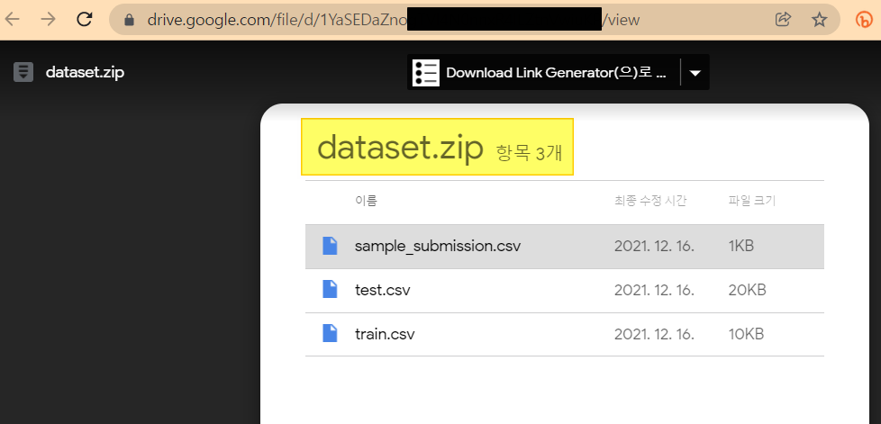
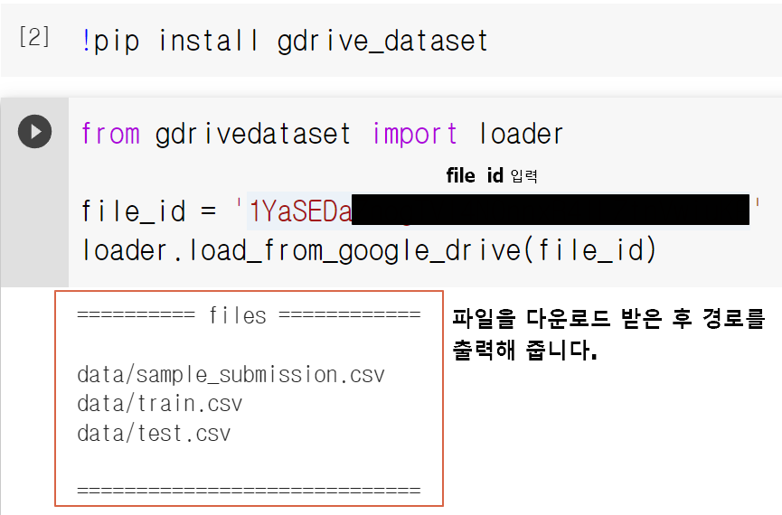
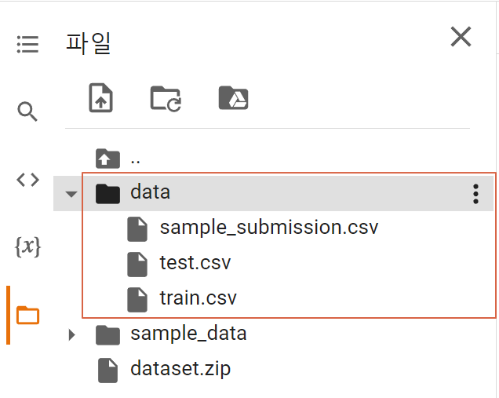

데이콘(dacon.io) 경진대회 데이터셋은 아래 이미지와 같이 대부분 **구글 드라이브 download** 링크로 제공합니다.





Google Colab을 활용하시는 분들은 데이터셋 업로드 하실 때 번거로움을 느끼는 분도 있을껍니다.

(대부분 dataset.zip 파일을 다운로드 받은 후 Google Colab에 재 업로드하여 압축을 해제해야하는 작업을 수행해야합니다. 혹은 Google Drive 로부터 마운트를 할 수 도 있습니다)


그래서 간단한 google drive 링크로 데이터셋을 직접 다운로드 받는 **간단한 라이브러리 형태**로 만들었습니다.
**코드 몇 줄**이면 쉽게 다운받을 수 있습니다.


## STEP 1. 데이터셋 링크에서 `file_id` 추출하기

예를 들어: `https://drive.google.com/file/d/abcdefgABCDEFG1234567/view` 가 데이터셋 URL(혹은 구글 드라이브 URL)이라면

**abcdefgABCDEFG1234567** 이 위치가 **file_id** 입니다.


## STEP 2. gdrive_dataset 설치

Google Colab에서 다음의 명령어로 라이브러리를 설치합니다.

```python
# 라이브러리 설치
!pip install gdrive_dataset
```


## STEP 3. 파일 다운로드

```python
from gdrivedataset import loader

file_id = # 이곳에 file_id 를 입력
loader.load_from_google_drive(file_id)
```


> Google Colab에서 실행한 예시




> Google Colab의 data 폴더 하위에 데이터셋이 다운로드 받아졌습니다.




감사합니다.


### 참고 (References)

- [python 3.x 한글 압축 파일 풀기](https://gldmg.tistory.com/141)

