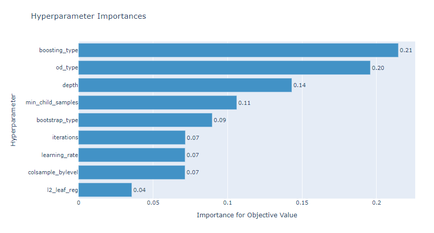
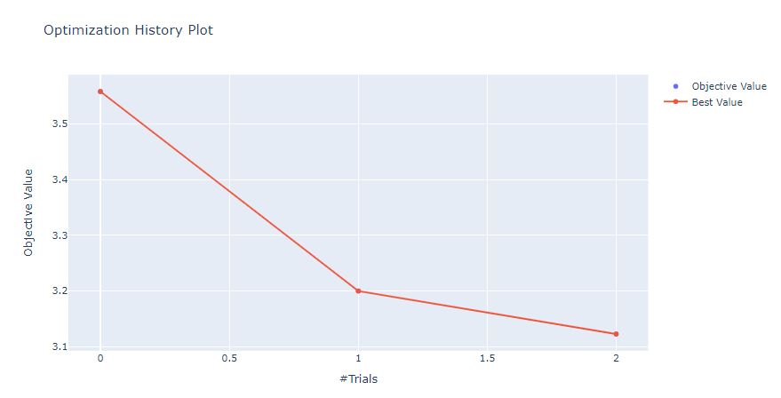
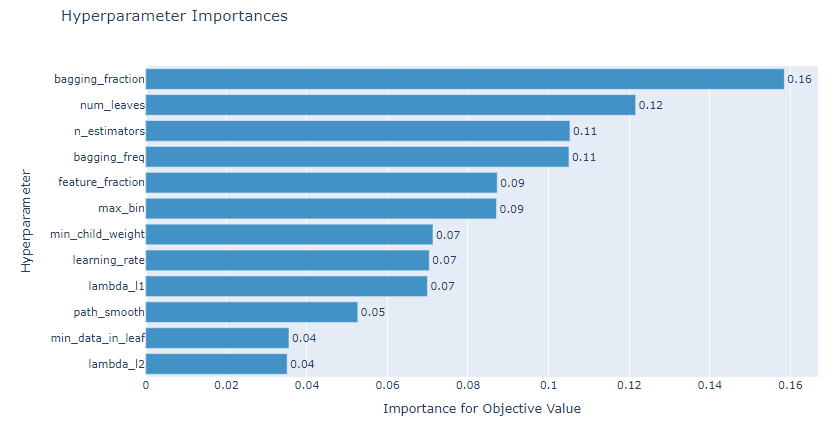
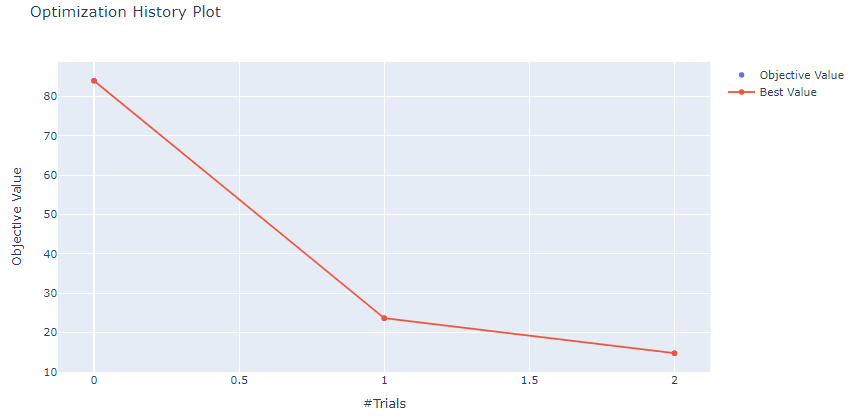

경진대회에서 모델의 Hyperparameter 튜닝에 드는 노력과 시간을 절약하기 위하여 xgboost, lightgbm, catboost 3개의 라이브러리에 대하여 optuna 튜닝을 적용하여 예측 값을 산출해 내는 로직을 라이브러리 형태로 패키징 했습니다.


## 경진대회 BASELINE을 잡기 위한 optuna + [xgboost, lightgbm, catboost]


지원하는 예측 종류는

- 회귀(regression)
- 이진분류(binary classification)
- 다중분류(multi-class classification)


입니다.


앞으로 라이브러리 개선작업을 통해 더 빠르게 최적화할 수 있도록 개선해 나갈 계획입니다.


[Google Colab 예제]https://colab.research.google.com/drive/1vKBrzrztNmzM_DXh5Ye3WKwL0AGGQFmC?usp=sharing


<head>
  <style>
    table.dataframe {
      white-space: normal;
      width: 100%;
      height: 240px;
      display: block;
      overflow: auto;
      font-family: Arial, sans-serif;
      font-size: 0.9rem;
      line-height: 20px;
      text-align: center;
      border: 0px !important;
    }

    table.dataframe th {
      text-align: center;
      font-weight: bold;
      padding: 8px;
    }
    
    table.dataframe td {
      text-align: center;
      padding: 8px;
    }
    
    table.dataframe tr:hover {
      background: #b8d1f3; 
    }
    
    .output_prompt {
      overflow: auto;
      font-size: 0.9rem;
      line-height: 1.45;
      border-radius: 0.3rem;
      -webkit-overflow-scrolling: touch;
      padding: 0.8rem;
      margin-top: 0;
      margin-bottom: 15px;
      font: 1rem Consolas, "Liberation Mono", Menlo, Courier, monospace;
      color: $code-text-color;
      border: solid 1px $border-color;
      border-radius: 0.3rem;
      word-break: normal;
      white-space: pre;
    }

  .dataframe tbody tr th:only-of-type {
      vertical-align: middle;
  }

  .dataframe tbody tr th {
      vertical-align: top;
  }

  .dataframe thead th {
      text-align: center !important;
      padding: 8px;
  }

  .page__content p {
      margin: 0 0 0px !important;
  }

  .page__content p > strong {
    font-size: 0.8rem !important;
  }

  </style>
</head>


## 설치


```python
!pip install -U teddynote
```


```python
# 모듈 import 
from teddynote import models
```

## 샘플 데이터셋 로드


```python
import pandas as pd
import numpy as np
import matplotlib.pyplot as plt
import seaborn as sns
import warnings

from sklearn.datasets import load_iris, load_boston, load_breast_cancer
from sklearn.model_selection import train_test_split
from sklearn.metrics import mean_squared_error

import lightgbm as lgb
import xgboost as xgb
import catboost as cb

from lightgbm import LGBMRegressor, LGBMClassifier
from xgboost import XGBRegressor, XGBClassifier
from catboost import CatBoostRegressor, CatBoostClassifier

warnings.filterwarnings('ignore')

SEED = 2021
```


```python
# Binary Class Datasets
cancer = load_breast_cancer()
cancer_df = pd.DataFrame(cancer['data'], columns=cancer['feature_names'])
cancer_df['target'] = cancer['target']
cancer_df.head()
```

<div>
<style scoped>
    .dataframe tbody tr th:only-of-type {
        vertical-align: middle;
    }

    .dataframe tbody tr th {
        vertical-align: top;
    }
    
    .dataframe thead th {
        text-align: right;
    }
</style>
<table border="1" class="dataframe">
  <thead>
    <tr style="text-align: right;">
      <th></th>
      <th>mean radius</th>
      <th>mean texture</th>
      <th>mean perimeter</th>
      <th>mean area</th>
      <th>mean smoothness</th>
      <th>mean compactness</th>
      <th>mean concavity</th>
      <th>mean concave points</th>
      <th>mean symmetry</th>
      <th>mean fractal dimension</th>
      <th>...</th>
      <th>worst texture</th>
      <th>worst perimeter</th>
      <th>worst area</th>
      <th>worst smoothness</th>
      <th>worst compactness</th>
      <th>worst concavity</th>
      <th>worst concave points</th>
      <th>worst symmetry</th>
      <th>worst fractal dimension</th>
      <th>target</th>
    </tr>
  </thead>
  <tbody>
    <tr>
      <th>0</th>
      <td>17.99</td>
      <td>10.38</td>
      <td>122.80</td>
      <td>1001.0</td>
      <td>0.11840</td>
      <td>0.27760</td>
      <td>0.3001</td>
      <td>0.14710</td>
      <td>0.2419</td>
      <td>0.07871</td>
      <td>...</td>
      <td>17.33</td>
      <td>184.60</td>
      <td>2019.0</td>
      <td>0.1622</td>
      <td>0.6656</td>
      <td>0.7119</td>
      <td>0.2654</td>
      <td>0.4601</td>
      <td>0.11890</td>
      <td>0</td>
    </tr>
    <tr>
      <th>1</th>
      <td>20.57</td>
      <td>17.77</td>
      <td>132.90</td>
      <td>1326.0</td>
      <td>0.08474</td>
      <td>0.07864</td>
      <td>0.0869</td>
      <td>0.07017</td>
      <td>0.1812</td>
      <td>0.05667</td>
      <td>...</td>
      <td>23.41</td>
      <td>158.80</td>
      <td>1956.0</td>
      <td>0.1238</td>
      <td>0.1866</td>
      <td>0.2416</td>
      <td>0.1860</td>
      <td>0.2750</td>
      <td>0.08902</td>
      <td>0</td>
    </tr>
    <tr>
      <th>2</th>
      <td>19.69</td>
      <td>21.25</td>
      <td>130.00</td>
      <td>1203.0</td>
      <td>0.10960</td>
      <td>0.15990</td>
      <td>0.1974</td>
      <td>0.12790</td>
      <td>0.2069</td>
      <td>0.05999</td>
      <td>...</td>
      <td>25.53</td>
      <td>152.50</td>
      <td>1709.0</td>
      <td>0.1444</td>
      <td>0.4245</td>
      <td>0.4504</td>
      <td>0.2430</td>
      <td>0.3613</td>
      <td>0.08758</td>
      <td>0</td>
    </tr>
    <tr>
      <th>3</th>
      <td>11.42</td>
      <td>20.38</td>
      <td>77.58</td>
      <td>386.1</td>
      <td>0.14250</td>
      <td>0.28390</td>
      <td>0.2414</td>
      <td>0.10520</td>
      <td>0.2597</td>
      <td>0.09744</td>
      <td>...</td>
      <td>26.50</td>
      <td>98.87</td>
      <td>567.7</td>
      <td>0.2098</td>
      <td>0.8663</td>
      <td>0.6869</td>
      <td>0.2575</td>
      <td>0.6638</td>
      <td>0.17300</td>
      <td>0</td>
    </tr>
    <tr>
      <th>4</th>
      <td>20.29</td>
      <td>14.34</td>
      <td>135.10</td>
      <td>1297.0</td>
      <td>0.10030</td>
      <td>0.13280</td>
      <td>0.1980</td>
      <td>0.10430</td>
      <td>0.1809</td>
      <td>0.05883</td>
      <td>...</td>
      <td>16.67</td>
      <td>152.20</td>
      <td>1575.0</td>
      <td>0.1374</td>
      <td>0.2050</td>
      <td>0.4000</td>
      <td>0.1625</td>
      <td>0.2364</td>
      <td>0.07678</td>
      <td>0</td>
    </tr>
  </tbody>
</table>
<p>5 rows × 31 columns</p>
</div>


```python
# Multi Class Datasets
iris = load_iris()
iris_df = pd.DataFrame(iris['data'], columns=iris['feature_names'])
iris_df['target'] = iris['target']
iris_df.head()
```

<div>
<style scoped>
    .dataframe tbody tr th:only-of-type {
        vertical-align: middle;
    }

    .dataframe tbody tr th {
        vertical-align: top;
    }
    
    .dataframe thead th {
        text-align: right;
    }
</style>
<table border="1" class="dataframe">
  <thead>
    <tr style="text-align: right;">
      <th></th>
      <th>sepal length (cm)</th>
      <th>sepal width (cm)</th>
      <th>petal length (cm)</th>
      <th>petal width (cm)</th>
      <th>target</th>
    </tr>
  </thead>
  <tbody>
    <tr>
      <th>0</th>
      <td>5.1</td>
      <td>3.5</td>
      <td>1.4</td>
      <td>0.2</td>
      <td>0</td>
    </tr>
    <tr>
      <th>1</th>
      <td>4.9</td>
      <td>3.0</td>
      <td>1.4</td>
      <td>0.2</td>
      <td>0</td>
    </tr>
    <tr>
      <th>2</th>
      <td>4.7</td>
      <td>3.2</td>
      <td>1.3</td>
      <td>0.2</td>
      <td>0</td>
    </tr>
    <tr>
      <th>3</th>
      <td>4.6</td>
      <td>3.1</td>
      <td>1.5</td>
      <td>0.2</td>
      <td>0</td>
    </tr>
    <tr>
      <th>4</th>
      <td>5.0</td>
      <td>3.6</td>
      <td>1.4</td>
      <td>0.2</td>
      <td>0</td>
    </tr>
  </tbody>
</table>
</div>


```python
# Regression Datasets
boston = load_boston()
boston_df = pd.DataFrame(boston['data'], columns=boston['feature_names'])
boston_df['target'] = boston['target']
boston_df.head()
```

<div>
<style scoped>
    .dataframe tbody tr th:only-of-type {
        vertical-align: middle;
    }

    .dataframe tbody tr th {
        vertical-align: top;
    }
    
    .dataframe thead th {
        text-align: right;
    }
</style>
<table border="1" class="dataframe">
  <thead>
    <tr style="text-align: right;">
      <th></th>
      <th>CRIM</th>
      <th>ZN</th>
      <th>INDUS</th>
      <th>CHAS</th>
      <th>NOX</th>
      <th>RM</th>
      <th>AGE</th>
      <th>DIS</th>
      <th>RAD</th>
      <th>TAX</th>
      <th>PTRATIO</th>
      <th>B</th>
      <th>LSTAT</th>
      <th>target</th>
    </tr>
  </thead>
  <tbody>
    <tr>
      <th>0</th>
      <td>0.00632</td>
      <td>18.0</td>
      <td>2.31</td>
      <td>0.0</td>
      <td>0.538</td>
      <td>6.575</td>
      <td>65.2</td>
      <td>4.0900</td>
      <td>1.0</td>
      <td>296.0</td>
      <td>15.3</td>
      <td>396.90</td>
      <td>4.98</td>
      <td>24.0</td>
    </tr>
    <tr>
      <th>1</th>
      <td>0.02731</td>
      <td>0.0</td>
      <td>7.07</td>
      <td>0.0</td>
      <td>0.469</td>
      <td>6.421</td>
      <td>78.9</td>
      <td>4.9671</td>
      <td>2.0</td>
      <td>242.0</td>
      <td>17.8</td>
      <td>396.90</td>
      <td>9.14</td>
      <td>21.6</td>
    </tr>
    <tr>
      <th>2</th>
      <td>0.02729</td>
      <td>0.0</td>
      <td>7.07</td>
      <td>0.0</td>
      <td>0.469</td>
      <td>7.185</td>
      <td>61.1</td>
      <td>4.9671</td>
      <td>2.0</td>
      <td>242.0</td>
      <td>17.8</td>
      <td>392.83</td>
      <td>4.03</td>
      <td>34.7</td>
    </tr>
    <tr>
      <th>3</th>
      <td>0.03237</td>
      <td>0.0</td>
      <td>2.18</td>
      <td>0.0</td>
      <td>0.458</td>
      <td>6.998</td>
      <td>45.8</td>
      <td>6.0622</td>
      <td>3.0</td>
      <td>222.0</td>
      <td>18.7</td>
      <td>394.63</td>
      <td>2.94</td>
      <td>33.4</td>
    </tr>
    <tr>
      <th>4</th>
      <td>0.06905</td>
      <td>0.0</td>
      <td>2.18</td>
      <td>0.0</td>
      <td>0.458</td>
      <td>7.147</td>
      <td>54.2</td>
      <td>6.0622</td>
      <td>3.0</td>
      <td>222.0</td>
      <td>18.7</td>
      <td>396.90</td>
      <td>5.33</td>
      <td>36.2</td>
    </tr>
  </tbody>
</table>
</div>


## 간단 사용법


### optimize()


```

optimize(
    x,
    y,
    test_data=None,
    cat_features=None,
    eval_metric='f1',
    cv=5,
    seed=None,
    n_rounds=3000,
    n_trials=100,
)

```


**입력 매개변수**

- `x`: Feature 데이터

- `y`: Target 데이터

- `test_data`: 예측 데이터 (test 데이터의 feature 데이터)

- `cat_features`: 카테고리형 컬럼

- `eval_metric`: 최적화할 메트릭 ('f1', 'accuracy', 'recall', 'precision', 'mse', 'rmse', 'rmsle')

- `cv`: cross validation fold 개수

- `seed`: 시드

- `n_rounds`: 학습시 최대 iteration 횟수

- `n_trials`: optuna 하이퍼파라미터 튜닝 시도 횟수


**return**

- `params`: best 하이퍼파라미터

- `preds`: `test_data` 매개변수에 데이터를 지정한 경우 이에 대한 예측 값

  


### 결과값 자동저장 기능


optimizer() 로 튜닝 + 예측한 결과는 `numpy array` 형식으로 자동 저장합니다.


- 저장 경로: `models` 폴더


## CatBoost + Optuna


### 이진분류(binary classification)


```python
catboostoptuna = models.CatBoostClassifierOptuna(use_gpu=False)

params, preds = catboostoptuna.optimize(iris_df.drop('target', 1), 
                                        iris_df['target'], 
                                        test_data=iris_df.drop('target', 1),
                                        seed=321,
                                        eval_metric='recall', n_trials=3)

(np.squeeze(preds) == iris_df['target']).mean()
```

### 다중분류(multi-class classification)


```python
catboostoptuna = models.CatBoostClassifierOptuna()

params, preds = catboostoptuna.optimize(cancer_df.drop('target', 1), 
                                        cancer_df['target'], 
                                        test_data=cancer_df.drop('target', 1),
                                        seed=321,
                                        eval_metric='recall', n_trials=3)

(np.squeeze(preds) == cancer_df['target']).mean()
```

### 회귀(regression)


```python
for col in ['CHAS', 'RAD', 'ZN']:
    boston_df[col] = boston_df[col].astype('int')
    
catboostoptuna_reg = models.CatBoostRegressorOptuna(use_gpu=False)
        
params, preds = catboostoptuna_reg.optimize(boston_df.drop('target', 1), 
                                            boston_df['target'], 
                                            test_data=boston_df.drop('target', 1),
                                            # int, str 타입 이어야 한다. float는 허용하지 않음
                                            cat_features=['CHAS', 'RAD', 'ZN'],
                                            eval_metric='rmse', n_trials=3)

mean_squared_error(boston_df['target'], preds)
```


### 저장한 파일로부터 예측 값 (prediction) 불러오기

```python
# 넘파이 array로 저장된 예측 결과를 로드할 수 있습니다.
models.load_prediction_from_file('models/CatBoostRegressor-0.87226.npy')
```

<pre>
array([28.76168717, 21.97469764, 33.91423778, 36.25317587, 34.89063327,
       30.36592103, 21.62216055, 21.67925239, 16.13744104, 18.55325167,
       19.19114681, 20.39200754, 20.4851822 , 20.18992755, 19.53332984,
       19.95333642, 21.90489984, 17.43089179, 19.28067897, 18.75662987,
       13.27196673, 17.43784243, 16.54706384, 14.6641719 , 15.98753177,
       14.55392224, 16.07654144, 15.15717605, 18.46626451, 19.14277466,
       13.42305337, 16.08031477, 13.88189742, 15.42776871, 13.93921857,
       21.76392661, 20.96989226, 22.05468906, 23.01954988, 30.38238318,
       35.86242058, 27.86047868, 24.46726054, 24.81965244, 21.93943212,
       20.97466042, 19.40221015, 17.69406529, 14.9838815 , 18.13447461,
       20.67717755, 22.8037252 , 27.00797342, 22.50247985, 18.38411847,
       34.59829013, 25.66841753, 34.24698692, 23.25394891, 20.56548366,
       18.08249006, 15.98063826, 23.92861079, 24.18700647, 31.40892682,
       25.84846134, 19.79075001, 20.42532382, 18.62746158, 20.80022091,
       23.33964199, 21.12974915, 22.61460761, 23.59166397, 23.77889816,
       22.56759439, 20.36601319, 21.90976033, 20.22201645, 20.79508199,
       26.11453205, 23.92772329, 24.00113404, 22.73930675, 23.72290053,
       26.13084916, 21.3290855 , 24.25999642, 28.84149579, 30.07779444,
       25.15881721, 25.06305693, 23.06077441, 24.28432971, 20.45356778,
       27.53869606, 25.76019718, 39.81858701, 41.84946703, 34.55262548,
       24.02980442, 25.65445863, 20.71075989, 20.2305375 , 19.82863103,
       16.79407357, 17.75558312, 18.35677353, 19.65660082, 18.0508654 ,
       21.5689087 , 23.06746945, 18.09671889, 18.42912872, 21.51601955,
       17.52104662, 21.19149237, 21.53741825, 18.60982263, 19.8353869 ,
       21.78394929, 20.82479114, 19.52986522, 16.34316023, 19.12320234,
       20.51817182, 15.84022485, 14.82196509, 17.39604813, 15.71638676,
       19.23800906, 19.38498764, 20.40981153, 17.61717099, 15.42971604,
       17.70507511, 16.60916137, 18.13055393, 12.97506937, 16.57567281,
       15.20248486, 14.23643501, 13.36728264, 14.72898506, 13.55049322,
       14.9755267 , 16.03064387, 14.98655171, 15.15773699, 15.42038297,
       19.80594139, 18.72855912, 16.47855863, 16.13431554, 17.39118588,
       18.95159967, 16.80484215, 36.44802584, 27.31847993, 24.42104749,
       33.32831742, 48.17558575, 48.10500758, 50.10220898, 21.6445183 ,
       24.25216144, 46.87931622, 22.3243491 , 23.54260782, 23.23930775,
       20.11795752, 20.55089244, 21.96288645, 25.19124179, 23.64260695,
       28.62909465, 24.51323548, 24.80628451, 30.42589992, 37.3450949 ,
       38.4181347 , 30.23559046, 38.05903337, 31.71650322, 26.26537372,
       28.50830185, 45.52756479, 30.25326372, 30.14612204, 32.84831893,
       29.96189048, 29.83769357, 35.86649294, 31.06581569, 29.52652706,
       47.51160949, 36.3245743 , 29.81679975, 33.0799321 , 32.54773576,
       34.19546892, 25.76115073, 41.09042432, 48.59485047, 48.31403964,
       21.86601009, 22.41873571, 19.98276713, 23.41414041, 18.99296122,
       20.94222734, 19.85599395, 22.46012421, 23.23118424, 22.33826844,
       24.35427176, 22.84754784, 26.78443297, 22.02070077, 25.00887251,
       29.11967995, 21.35142102, 28.4845406 , 28.13266249, 43.55809324,
       43.92528527, 41.41070297, 33.03739803, 43.98911308, 34.88425066,
       23.95836477, 35.73025736, 43.16032433, 43.04690079, 27.64386148,
       24.70308422, 25.4884944 , 37.47134395, 24.75982658, 24.46682263,
       24.01787678, 20.55522458, 21.81256414, 25.1210334 , 18.84767363,
       18.65530061, 23.31803976, 20.90605542, 23.2340228 , 25.26291264,
       24.24455301, 29.6144702 , 31.89752872, 40.56324634, 23.53199626,
       19.96194628, 40.74456114, 48.1240842 , 36.47112068, 31.95761281,
       35.22692603, 41.08284384, 43.59715004, 32.69785587, 38.395269  ,
       29.9962736 , 31.91708957, 40.03140873, 46.20098888, 21.80400282,
       20.18597404, 25.8267357 , 25.12578985, 35.62999617, 33.24609222,
       32.1246326 , 32.1276531 , 33.20775978, 26.22963653, 35.73998533,
       44.73786966, 36.20293923, 46.15322327, 50.76547855, 31.24164863,
       24.72412287, 20.28457479, 22.92577672, 22.80344633, 23.12369478,
       31.17422305, 35.1362746 , 26.74748661, 23.54393337, 22.04051644,
       26.52810061, 25.09489421, 19.48346588, 26.88560752, 32.68850504,
       27.88899813, 23.20912832, 24.87111363, 32.28653345, 33.91915569,
       28.80376445, 35.01262449, 29.21634021, 25.79724389, 22.05887928,
       21.3824104 , 23.18025825, 20.00625817, 23.00639761, 22.75589549,
       17.94145995, 18.06389734, 18.02561674, 22.79710775, 20.21203719,
       23.45896878, 23.04214565, 22.94954438, 18.56859949, 24.6756368 ,
       25.56719479, 24.084167  , 20.2480269 , 20.91046936, 24.25174757,
       21.23424581, 16.49834945, 19.66746909, 21.4557298 , 21.65723782,
       20.06222367, 19.22627356, 18.87736706, 20.04211261, 19.71010834,
       19.77379091, 32.5851722 , 24.65104583, 24.97530297, 30.10281989,
       19.2971915 , 17.20332405, 23.85532316, 25.69790452, 26.13244964,
       23.82816976, 24.07280403, 22.60158478, 31.12142614, 21.94114302,
       23.35171169, 18.76796541, 18.91663659, 23.34380777, 20.45138255,
       22.45630745, 17.74251749, 21.83864988, 18.43330579, 23.54134213,
       26.68331628, 19.25077592, 22.754818  , 38.81018216, 49.26446287,
       50.79271301, 39.70994055, 47.02221074, 12.5120863 , 13.44238312,
       16.03211618, 14.14478663, 12.77288871, 11.2105293 , 12.32364567,
       12.25072646, 10.34790415, 10.53523456, 10.7030971 , 11.42738056,
        8.88825104,  9.34983733,  9.12203832, 11.97584357, 11.17106292,
       14.56801675, 16.83874389, 10.02438036, 13.9523593 , 13.26336838,
       13.90404049, 12.99194972, 11.10259056,  7.3404075 ,  9.94517994,
        7.68810727, 10.44760646, 12.67179266, 10.04602704,  9.2217173 ,
        9.49584146, 18.29746443, 26.3683067 , 16.04251865, 20.71751946,
       27.65855805, 16.86487185, 14.54875179, 15.70205646,  8.96022422,
        9.18930385, 10.93764513,  9.52636606,  9.02340857,  9.99152837,
       15.03190469, 14.90398513, 17.58508063, 13.3390705 , 13.65630505,
        9.17099086, 13.15485696, 11.95532373, 11.0969807 , 10.75318325,
       15.2116026 , 15.75387832, 18.8499195 , 14.90319747, 13.90606762,
       11.24903563, 12.25064494, 10.36012359,  9.54165187, 11.81341828,
       10.84391803, 13.36466617, 15.57695542, 14.26152587, 10.23491255,
       10.70045996, 14.70878743, 14.79437752, 14.33805741, 13.99509979,
       13.91139729, 15.20039866, 16.1576856 , 18.10186486, 13.92352322,
       14.85029811, 14.2714253 , 15.14535685, 16.80094021, 18.69923671,
       16.33460786, 17.54055978, 19.44845554, 20.11537833, 21.70623678,
       19.35919475, 16.46347524, 15.96509858, 17.28791419, 19.37198404,
       20.14604739, 20.67226853, 21.52497603, 22.75428627, 16.2353488 ,
       15.04075596, 17.64296268, 13.079737  , 16.40755067, 20.24207015,
       22.28444162, 23.89979801, 25.88883777, 21.55801563, 20.88892453,
       22.86809854, 20.05936591, 21.45465288, 15.16904835,  9.95506956,
       10.62074076, 14.6694633 , 19.00900648, 21.3145516 , 22.52886541,
       21.62849666, 18.76080567, 21.24361604, 21.34419004, 18.83961699,
       20.54947447, 21.35132386, 17.93859277, 23.9005454 , 22.68316054,
       17.21506894])
</pre>


### 하이퍼파라미터 튜닝 시각화

```python
# 튜닝 결과 시각화
catboostoptuna_reg.visualize()
```






## XGBoost


### 이진분류(binary classification)


```python
xgboptuna = models.XGBClassifierOptuna(use_gpu=False)
        
params, preds = xgboptuna.optimize(iris_df.drop('target', 1), 
                                   iris_df['target'], 
                                   test_data=iris_df.drop('target', 1),
                                   seed=321,
                                   eval_metric='recall', n_trials=3)

(preds == iris_df['target']).mean()
```

### 다중분류(multi-class classification)


```python
xgboptuna_binary = models.XGBClassifierOptuna(use_gpu=False)
        
params, preds = xgboptuna_binary.optimize(cancer_df.drop('target', 1), 
                                          cancer_df['target'], 
                                          test_data=cancer_df.drop('target', 1), 
                                          eval_metric='accuracy', n_trials=3)

(preds == cancer_df['target']).mean()
```

### 회귀(regression)


```python
xgboptuna_reg = models.XGBRegressorOptuna()
        
params, preds = xgboptuna_reg.optimize(boston_df.drop('target', 1), 
                                       boston_df['target'], 
                                       test_data=boston_df.drop('target', 1), 
                                       eval_metric='mse', n_trials=3)

mean_squared_error(boston_df['target'], preds)
```

## LGBM


### 이진분류(binary classification)


```python
lgbmoptuna_binary = models.LGBMClassifierOptuna()
        
params, preds = lgbmoptuna_binary.optimize(cancer_df.drop('target', 1), 
                                           cancer_df['target'], 
                                           test_data=cancer_df.drop('target', 1),
                                           eval_metric='accuracy', n_trials=3)

(preds == cancer_df['target']).mean()
```

### 다중분류(multi-class classification)


```python
lgbmoptuna = models.LGBMClassifierOptuna()
        
params, preds = lgbmoptuna.optimize(iris_df.drop('target', 1), 
                    iris_df['target'], 
                    seed=321,
                    eval_metric='recall', n_trials=3)


(preds == iris_df['target']).mean()
```

### 회귀(regression)


```python
lgbmoptuna_reg = models.LGBMRegressorOptuna()
        
params, preds = lgbmoptuna_reg.optimize(boston_df.drop('target', 1), 
                                        boston_df['target'], 
                                        test_data=boston_df.drop('target', 1), 
                                        eval_metric='mse', n_trials=3)

mean_squared_error(boston_df['target'], preds)
```

## 하이퍼파라미터 범위 수정 (custom)


```python
lgbmoptuna = models.LGBMRegressorOptuna()

# 기본 값으로 설정된 하이퍼파라미터 출력
lgbmoptuna.print_params()
```

<pre>
name: verbose, fixed_value: -1, type: fixed
name: lambda_l1, low: 1e-08, high: 5, type: loguniform
name: lambda_l2, low: 1e-08, high: 5, type: loguniform
name: path_smooth, low: 1e-08, high: 0.001, type: loguniform
name: learning_rate, low: 1e-05, high: 0.1, type: loguniform
name: feature_fraction, low: 0.5, high: 0.9, type: uniform
name: bagging_fraction, low: 0.5, high: 0.9, type: uniform
name: num_leaves, low: 15, high: 90, type: int
name: min_data_in_leaf, low: 10, high: 100, type: int
name: max_bin, low: 100, high: 255, type: int
name: n_estimators, low: 100, high: 3000, type: int
name: bagging_freq, low: 0, high: 15, type: int
name: min_child_weight, low: 1, high: 20, type: int
</pre>
**`param_type`에 관하여**


`param_type`은 `int`, `uniform`, `loguniform`, `categorical`, `fixed` 가 있습니다.


- `int`, `uniform`, `loguniform`은 optuna의 search range 정의하는 파라미터와 같습니다.


```

예시)

- int 범위(int)

lgbmoptuna.set_param(models.OptunaParam('num_leaves', low=10, high=25, param_type='int'))


- 카테고리(categorical)

cboptuna.set_param(models.OptunaParam('bootstrap_type', categorical_value=['Bayesian', 'Bernoulli', 'MVS'], param_type='categorical'))


- 고정된 값(fixed)

cboptuna.set_param(models.OptunaParam('one_hot_max_size', fixed_value=1024, param_type='fixed'))

```


```python
# 하이퍼파라미터 범위 정의
lgbmoptuna.set_param(models.OptunaParam('num_leaves', low=10, high=25, param_type='int'))
lgbmoptuna.set_param(models.OptunaParam('n_estimators', low=0, high=500, param_type='int'))
# 출력
lgbmoptuna.print_params()
```

<pre>
name: verbose, fixed_value: -1, type: fixed
name: lambda_l1, low: 1e-08, high: 5, type: loguniform
name: lambda_l2, low: 1e-08, high: 5, type: loguniform
name: path_smooth, low: 1e-08, high: 0.001, type: loguniform
name: learning_rate, low: 1e-05, high: 0.1, type: loguniform
name: feature_fraction, low: 0.5, high: 0.9, type: uniform
name: bagging_fraction, low: 0.5, high: 0.9, type: uniform
name: num_leaves, low: 10, high: 25, type: int
name: min_data_in_leaf, low: 10, high: 100, type: int
name: max_bin, low: 100, high: 255, type: int
name: n_estimators, low: 0, high: 500, type: int
name: bagging_freq, low: 0, high: 15, type: int
name: min_child_weight, low: 1, high: 20, type: int
</pre>

```python
# 달라진 결과값 확인
params, preds = lgbmoptuna.optimize(boston_df.drop('target', 1), 
                                    boston_df['target'], 
                                    test_data=boston_df.drop('target', 1), 
                                    eval_metric='mse', n_trials=3)
```

trial에 대한 결과를 출력합니다.


```python
# trial에 대한 결과 출력
lgbmoptuna.study.trials_dataframe()
```

<div>
<style scoped>
    .dataframe tbody tr th:only-of-type {
        vertical-align: middle;
    }

    .dataframe tbody tr th {
        vertical-align: top;
    }
    
    .dataframe thead th {
        text-align: right;
    }
</style>
<table border="1" class="dataframe">
  <thead>
    <tr style="text-align: right;">
      <th></th>
      <th>number</th>
      <th>value</th>
      <th>datetime_start</th>
      <th>datetime_complete</th>
      <th>duration</th>
      <th>params_bagging_fraction</th>
      <th>params_bagging_freq</th>
      <th>params_feature_fraction</th>
      <th>params_lambda_l1</th>
      <th>params_lambda_l2</th>
      <th>params_learning_rate</th>
      <th>params_max_bin</th>
      <th>params_min_child_weight</th>
      <th>params_min_data_in_leaf</th>
      <th>params_n_estimators</th>
      <th>params_num_leaves</th>
      <th>params_path_smooth</th>
      <th>state</th>
    </tr>
  </thead>
  <tbody>
    <tr>
      <th>0</th>
      <td>0</td>
      <td>83.529143</td>
      <td>2021-12-31 07:26:21.337195</td>
      <td>2021-12-31 07:26:24.492885</td>
      <td>0 days 00:00:03.155690</td>
      <td>0.508583</td>
      <td>9</td>
      <td>0.650294</td>
      <td>6.415572e-07</td>
      <td>4.982401e-02</td>
      <td>0.000030</td>
      <td>205</td>
      <td>6</td>
      <td>22</td>
      <td>363</td>
      <td>14</td>
      <td>4.464380e-08</td>
      <td>COMPLETE</td>
    </tr>
    <tr>
      <th>1</th>
      <td>1</td>
      <td>82.696414</td>
      <td>2021-12-31 07:26:24.494212</td>
      <td>2021-12-31 07:26:26.673476</td>
      <td>0 days 00:00:02.179264</td>
      <td>0.712115</td>
      <td>12</td>
      <td>0.703372</td>
      <td>4.705313e-08</td>
      <td>6.194418e-08</td>
      <td>0.000061</td>
      <td>254</td>
      <td>17</td>
      <td>39</td>
      <td>323</td>
      <td>22</td>
      <td>2.821343e-08</td>
      <td>COMPLETE</td>
    </tr>
    <tr>
      <th>2</th>
      <td>2</td>
      <td>20.680800</td>
      <td>2021-12-31 07:26:26.674743</td>
      <td>2021-12-31 07:26:28.133769</td>
      <td>0 days 00:00:01.459026</td>
      <td>0.857708</td>
      <td>11</td>
      <td>0.580214</td>
      <td>1.124464e-02</td>
      <td>5.298364e-06</td>
      <td>0.091827</td>
      <td>230</td>
      <td>20</td>
      <td>76</td>
      <td>485</td>
      <td>20</td>
      <td>2.478903e-05</td>
      <td>COMPLETE</td>
    </tr>
  </tbody>
</table>
</div>


하이퍼파라미터 튜닝 결과 시각화

```python
lgbmoptuna.visualize()
```






Best 하이퍼파라미터 출력

```python
lgbmoptuna.get_best_params()
```

<pre>
{'lambda_l1': 0.011244644026182967,
 'lambda_l2': 5.298363992080463e-06,
 'path_smooth': 2.4789027860002685e-05,
 'learning_rate': 0.09182657994717408,
 'feature_fraction': 0.5802144206891808,
 'bagging_fraction': 0.8577082120277062,
 'num_leaves': 20,
 'min_data_in_leaf': 76,
 'max_bin': 230,
 'n_estimators': 485,
 'bagging_freq': 11,
 'min_child_weight': 20}
</pre>