실리콘(M1, M2) 맥(Mac) 사용하는 유저가 최근 1~2년 안에 급격하게 늘어나면서, m1, m2 칩셋을 사용하는 맥 사용자를 위한 가상 환경 설치와 TensorFlow 설치에 대한 문의가 많았습니다. 아쉽게도 그동안 제가 실리콘 맥이 없어 직접 테스트를 해볼 수 없었기 때문에 정확한 피드백을 드리기 어려웠는데요. 이번에 M2 칩셋을 탑재한 맥북에어를 구매하게 되어 실리콘 맥북에 가상환경 설치 및 TensorFlow 설치하는 과정을 직접 실행해보고 공유 드릴 수 있게 되었습니다. 아래 순서대로 진행하시면 됩니다 :)


## STEP 1) Xcode 개발자 도구 설치

먼저 spotlight 를 열어 **"터미널"** 혹은 **"terminal"**을 입력하여 터미널 창을 열어줍니다.

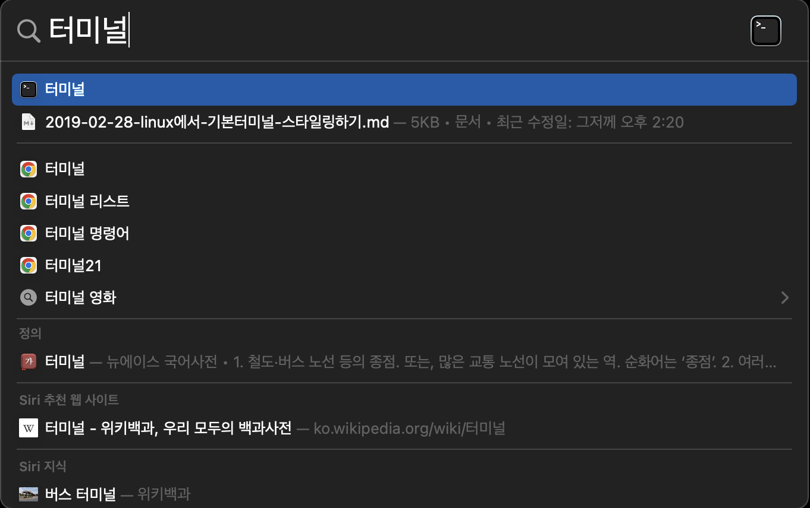


그리고 터미널 창에 다음의 명령어를 터미널 창에 입력하여 xcode 개발자 도구를 설치 합니다.

```bash
xcode-select --install
```

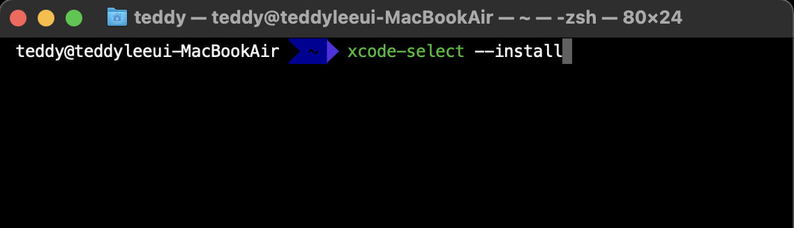


## STEP 2) miniconda 최신버전 다운로드

아래 다운로드 링크를 클릭하여 **최신 버번의 miniconda를 다운로드** 받습니다.

[miniconda 다운로드 (링크)](https://repo.anaconda.com/miniconda/Miniconda3-latest-MacOSX-arm64.sh)

다운로드는 "다운로드" 혹은 "Downloads" 폴더에 다운로드 받도록 하겠습니다.

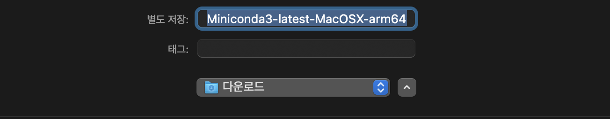


## STEP 3) miniconda 설치

열어 놓은 터미널 창에 `cd Downloads`  명령어를 입력하여 다운로드 폴더로 이동합니다.

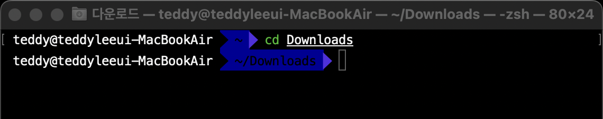

이동한 다운로드 폴더 내에서 다음의 명령어를 입력하여 설치를 진행합니다.

```
bash ./Miniconda3-latest-MacOSX-arm64.sh -b -p $HOME/miniconda
```

설치가 정상적으로 완료가 되었다면 아래의 명령어를 실행하여 다음과 같이 출력되는지 확인 합니다.

```bash
source ~/miniconda/bin/activate
```

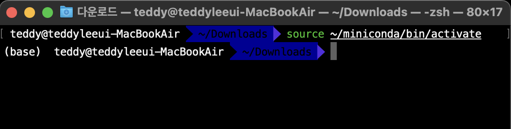

왼쪽에 **(base)  라고 표기된다면 성공**입니다.

## STEP 4) miniconda의 PATH 추가

`source ~/miniconda/bin/activate` 라는 명령어로 매번 실행할 수 있지만, 해당 경로를 $PATH 에 추가하면 매번 전체 경로를 입력해야 하는 번거로움을 줄일 수 있습니다. 

다음의 명령어를 터미널 창에 입력하여 `.zshrc` 파일을 열어줍니다.

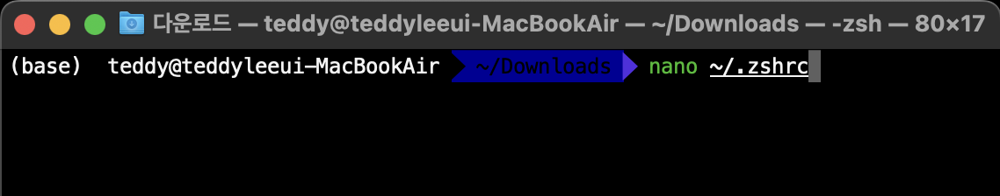

아래와 같이 `.zshrc` 파일이 열립니다.

<**설정 파일 안은 제가 캡처한 화면과 다르게 나타탈 수 있으나, 크게 신경 안쓰셔도 됩니다.**>

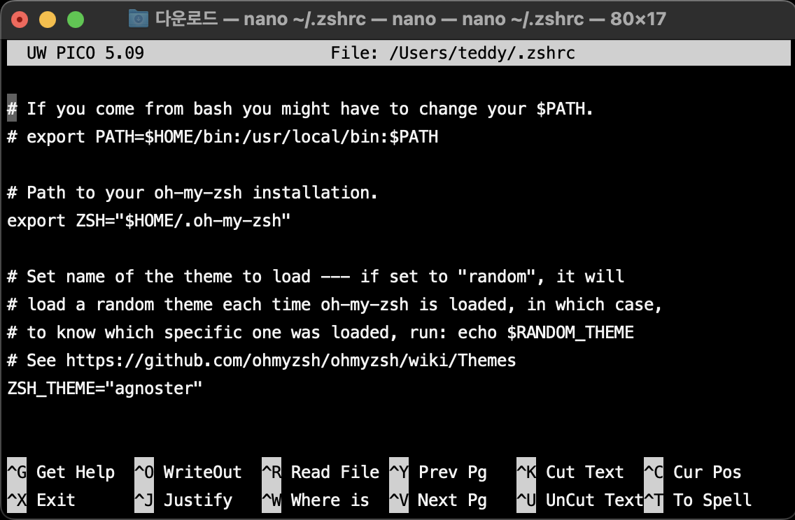


방향키 아래 ⇩ 버튼을 눌러서 제일 하단으로 이동합니다.

그리고 다음을 붙혀넣기 합니다.

```bash
export PATH="$HOME/miniconda/bin:$PATH"
```

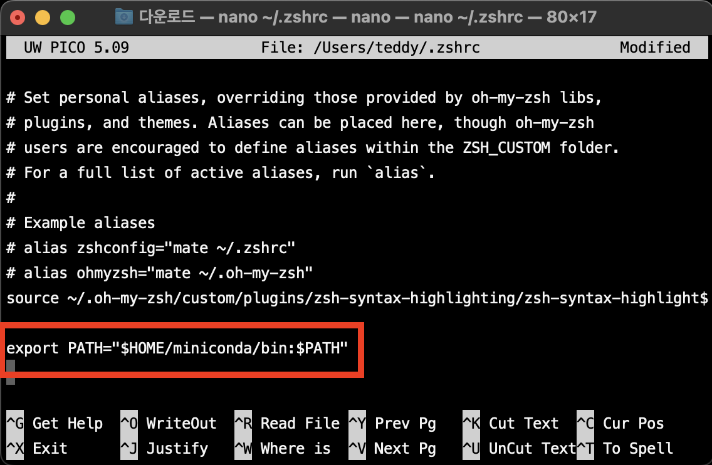

입력을 마쳤으면, `control + X` 를 누르고 `Y`를 눌러 저장하고 빠져 나옵니다.

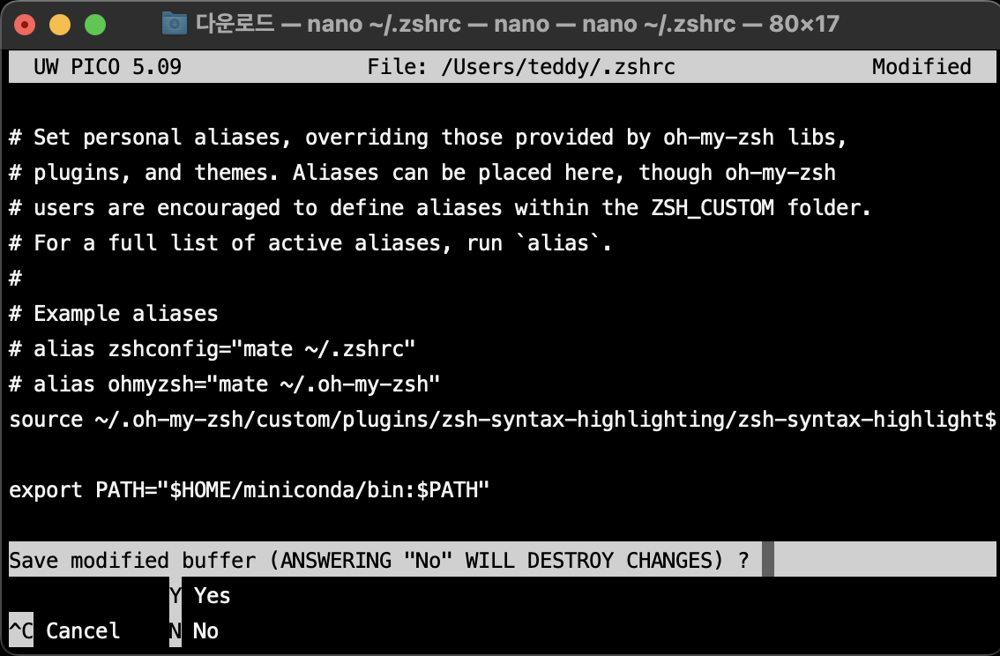

다시 터미널 창에 다음의 명령어를 입력하여 변경사항을 적용합니다.

```bash
source ~/.zshrc
```

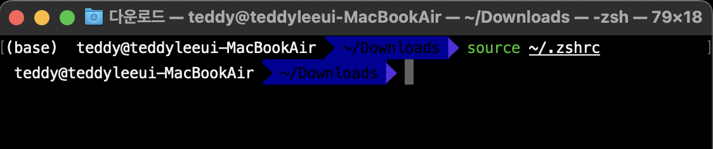

`conda` 라는 명령어 입력시 아래와 같이 출력되면 성공입니다!

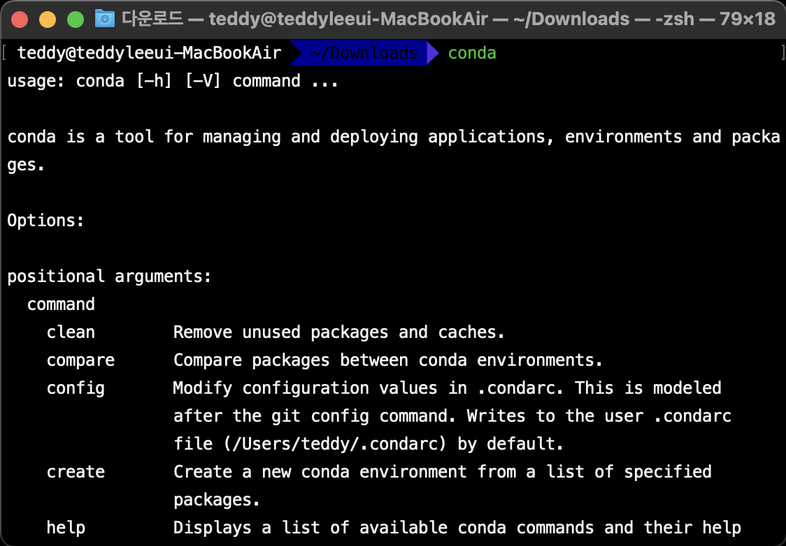


## STEP 5) 가상환경 설치 및 tensorflow 설치

터미널에 다음의 명령어를 입력하여 가상환경을 설치 합니다.

가상환경의 이름은 자유롭게 설정할 수 있습니다. 저는 **tf-cert** 라는 이름으로 설치해 보도록 하겠습니다.

```bash
conda create -n tf-cert python=3.8
```


다음의 명령어로 가상환경을 활성화 합니다.

```bash
source activate tf-cert
```

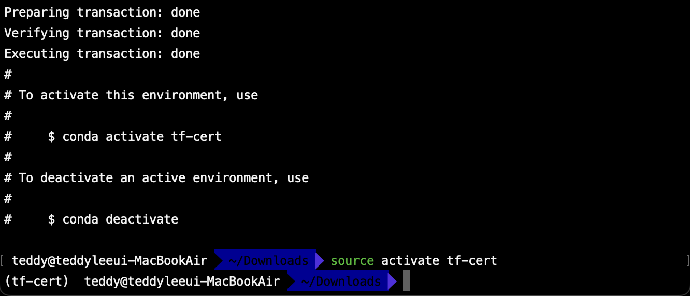

가상환경이 활성화 되면 왼쪽 () 괄호 안에 가상환경의 이름이 표시 됩니다.

따라서, 현재 설정이 되어 있는 가상환경의 이름이 출력되는 것을 확인할 수 있습니다.

마지막으로 다음을 차례대로 실행하여 설치를 진행합니다.

> 가상환경에 tensorflow 설치 코드 (2.9.0 버전 설치)

```bash
conda install -c apple tensorflow-deps
pip install tensorflow-macos==2.9.0
pip install tensorflow-metal==0.5.0
```


(참고)

저는 macOS 12.1 이상의 버전이 설치되어 있어 가장 최신 버전을 설치하였습니다.

하지만, macOS 12.0 버전을 사용하시는 분들은 이전 버전을 설치해 주셔야 합니다. 

지원하는 형식은 아래 표를 참고해 주세요.


만약 이전 버전인 v2.8을 설치하고자 한다면 다음과 같이 명령어를 변경할 수 있습니다.

```bash
conda install -c apple tensorflow-deps
pip install tensorflow-macos==2.8.0
pip install tensorflow-metal==0.4.0
```


끝으로, 위에 모든 과정이 정상적인 설치가 완료되었는지 확인해 보도록 하겠습니다.

`python`이라고 명령어에 입력합니다.

다음과 같이 화면에 진입하게 되는데, 

```python
import tensorflow as tf
```

명령어를 실행하여 오류 없이 import 해오면 성공입니다.

아래 코드로 설치된 TensorFlow의 버전을 확인할 수 있습니다.

```python
tf.__version__
```

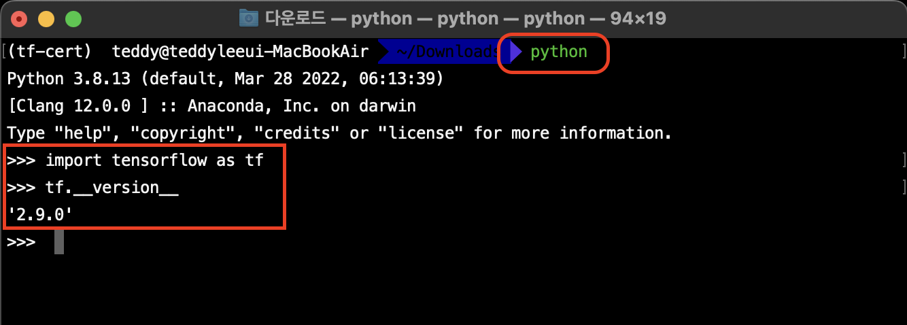

